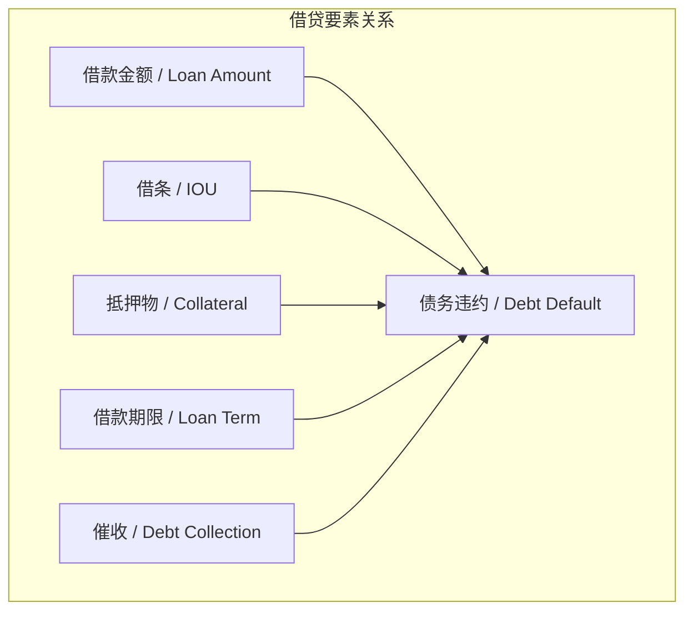
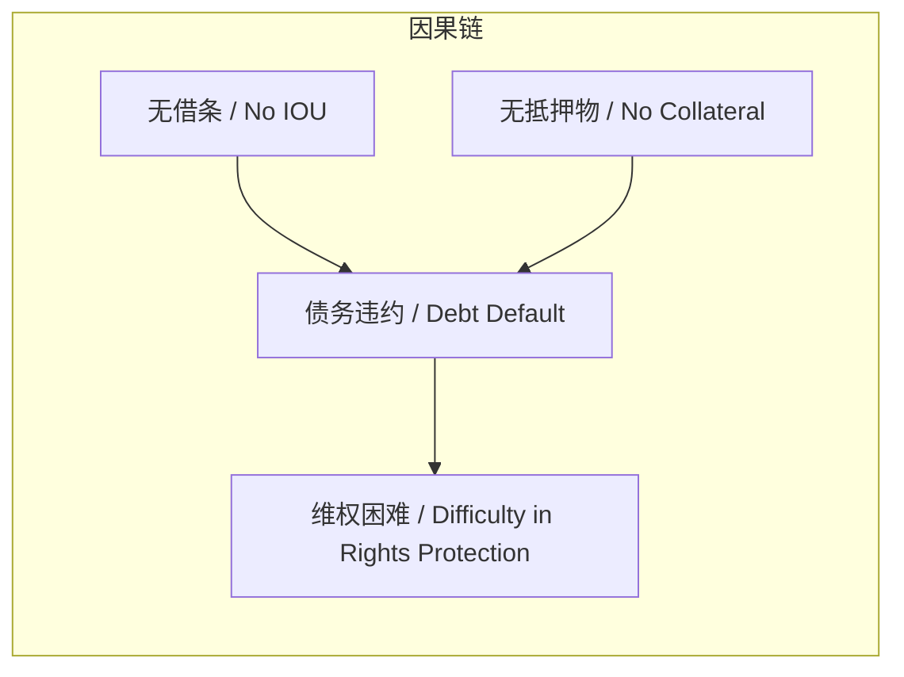

# 任务报告

- requestId: 1771635545693-k1i2w5
- 生成时间(UTC): 2026-02-21T00:59:58.248Z

## 文本总结

# 个人借贷无凭证风险警示

## 整体结构化文档表达
### 文档卡片
- 主题：个人借贷风险管理 / Personal Lending Risk Management
- 一句话摘要：叙述者因无借条和抵押物导致借款五年未收回，强调借贷凭证的重要性。
- 目标读者：普通公众，尤其是有借贷行为或意向的个人。
- 核心结论：
  1. 无书面凭证的借贷风险极高。
  2. 口头承诺在债务纠纷中无效。
  3. 缺乏法律意识会导致经济损失。

### 内容结构树
1. 背景与问题定义：个人借贷纠纷，借款5年未收回，无任何凭证。
2. 核心观点与关键证据：观点为借贷必须要有凭证；证据包括无借条、无抵押物、催债被债务人以“割肾”等言语拒绝。
3. 方法/机制/路径：法律追讨需书面证据；无证据则只能依赖口头承诺，难以维权。
4. 风险与边界条件：风险为债务永久损失；边界条件为债务人无偿还意愿或能力。
5. 结论与行动建议：结论是无凭证借贷应避免；建议是 always 签订书面借条并要求抵押。

### 结构化元数据（JSON）
```json
{
  "title": "个人借贷无凭证风险警示",
  "topic_zh": "个人借贷风险管理",
  "topic_en": "Personal Lending Risk Management",
  "audience": "普通公众，尤其是有借贷行为或意向的个人",
  "claims": ["无书面凭证的借贷风险极高", "口头承诺在债务纠纷中无效", "缺乏法律意识会导致经济损失"],
  "evidence": ["借出5位数资金", "借款期限超过5年", "至今未收回", "无借条", "无抵押物", "债务人曾说'割个肾还'", "债务人曾说'不会不还，有钱就还'"],
  "risks": ["债务无法追回", "债权人心理压力", "经济损失"],
  "actions": ["借贷时必须签订书面借条", "要求提供抵押物", "增强法律意识避免无凭证借贷"]
}
```

## 处理流程
1. 输入识别：用户输入为第一人称叙述的个人借贷纠纷经历。
2. 信息抽取：实体包括“我”（债权人）和“对方”（债务人）；概念包括借款金额、期限、借条、抵押物、催收、债务违约；问题为债务追讨困难；事实包括无凭证、长期未还、催债被拒；观点包括自我批评和教训总结。
3. 结构化归纳：将借贷分为有凭证与无凭证两类；本文属无凭证借贷，风险因素为凭证缺失和抵押缺失。
4. 关系建模：建立“无借条”与“维权困难”的因果关系；建立“无抵押物”与“债务违约风险增加”的正相关；建立“法律意识薄弱”与“无凭证借贷”的关联。
5. 可视化表达：使用Mermaid绘制概念关系图和因果链图。

## 概念清单（中英文）
- 借款金额 / Loan Amount
- 借款期限 / Loan Term
- 债务违约 / Debt Default
- 催收 / Debt Collection
- 抵押物 / Collateral
- 借条 / IOU
- 还款日期 / Repayment Date
- 法律意识 / Legal Awareness
- 血泪教训 / Hard Lesson
- 口头承诺 / Oral Promise

## 概念定义（中英文）
- 借款金额：借出的资金数额，本文中为5位数。
- 借款期限：借款持续时间，本文中为5年多。
- 债务违约：债务人未按约定偿还债务，本文中为至今未收回。
- 催收：债权人要求债务人还款的行为。
- 抵押物：作为债务担保的资产，本文中未收取。
- 借条：证明借贷关系的书面凭证，本文中未书写。
- 还款日期：约定的债务偿还时间，本文中已到但未还。
- 法律意识：对法律权利和义务的认知程度，本文中薄弱。
- 血泪教训：从痛苦经历中获得的深刻教训。
- 口头承诺：以口头形式作出的保证，本文中债务人曾作出但未履行。

## 概念关联与逻辑关系（中英文）
1. 无借条 / No IOU 与 无抵押物 / No Collateral 共同导致 债务违约风险增加 / Increased Risk of Debt Default。
2. 催收行为 / Collection Action 与 对方口头承诺 / Oral Promise 冲突 导致 债权人心理压力 / Creditor's Psychological Stress。
3. 法律意识薄弱 / Weak Legal Awareness 与 无凭证借贷 / Lending Without Documentation 共同导致 维权困难 / Difficulty in Rights Protection。

## COT逻辑梳理（定义/分类/比较/因果/科学方法论）
Step 1: 定义借贷关系基本要素：包括借款金额、借款期限、借条、抵押物、还款日期。
Step 2: 分类借贷风险：基于凭证存在与否，分为低风险（有书面凭证和抵押）和高风险（无凭证无抵押）。
Step 3: 比较：有凭证借贷可通过法律诉讼追讨；无凭证借贷仅依赖口头承诺，在法律上证据不足，追讨成功率极低。
Step 4: 因果分析：无借条和无抵押物 → 债务违约后缺乏法律证据 → 无法通过法律途径追索 → 导致债务永久损失和债权人心理压力。
Step 5: 科学方法论：基于证据的维权是有效途径；因此，借贷中应 always 获取书面借条和抵押物，以降低风险；增强法律意识是预防措施。

## 事实与看法（病毒）
### 事实
- 借出5位数资金。
- 借款期限超过5年。
- 至今未收回借款。
- 没有收取抵押物。
- 没有书写借条。
- 还款日期已到但未还款。
- 债务人曾说“割个肾还”。
- 债务人曾说“不会不还，有钱就还”。
### 看法
- “催还钱搞得跟我欠钱似的”：表达催债过程中的屈辱感和角色颠倒。
- “我SB了”：自我批评法律意识淡薄和决策失误。
- “血泪教训”：强调经历的痛苦和教训的深刻性。
- “再也不借钱出去了”：未来行为决定，避免类似风险。
- “我也不向别人借钱”：延伸至双向借贷 avoidance，基于信任危机。

## FAQ（原文问题整理）
未发现明确提问。

## Visualization
### Mermaid 图 1（概念结构图）

### Mermaid 图 2（逻辑/因果图）


## 文章中的类比
未发现明确类比。

## 10个金句
1. 我借出去5位数 5年多了 至今未收回
2. 催还钱搞得跟我欠钱似的
3. 催急了人家说割个肾还
4. 说好的还款日期到了 没得还
5. 说不会不还 有钱就还
6. 哎 我没收抵押物甚至连借条都没有写
7. 我SB了
8. 血泪教训
9. 再也不借钱出去了
10. 我也不向别人借钱
