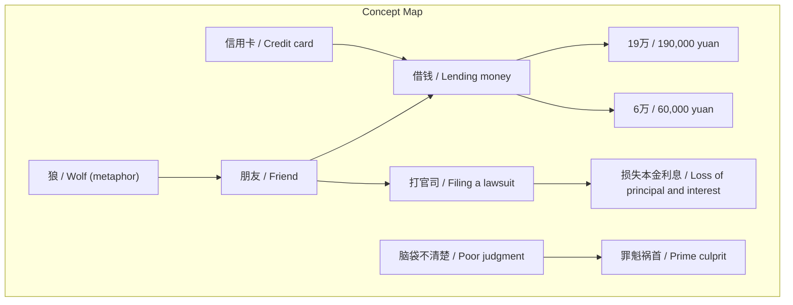
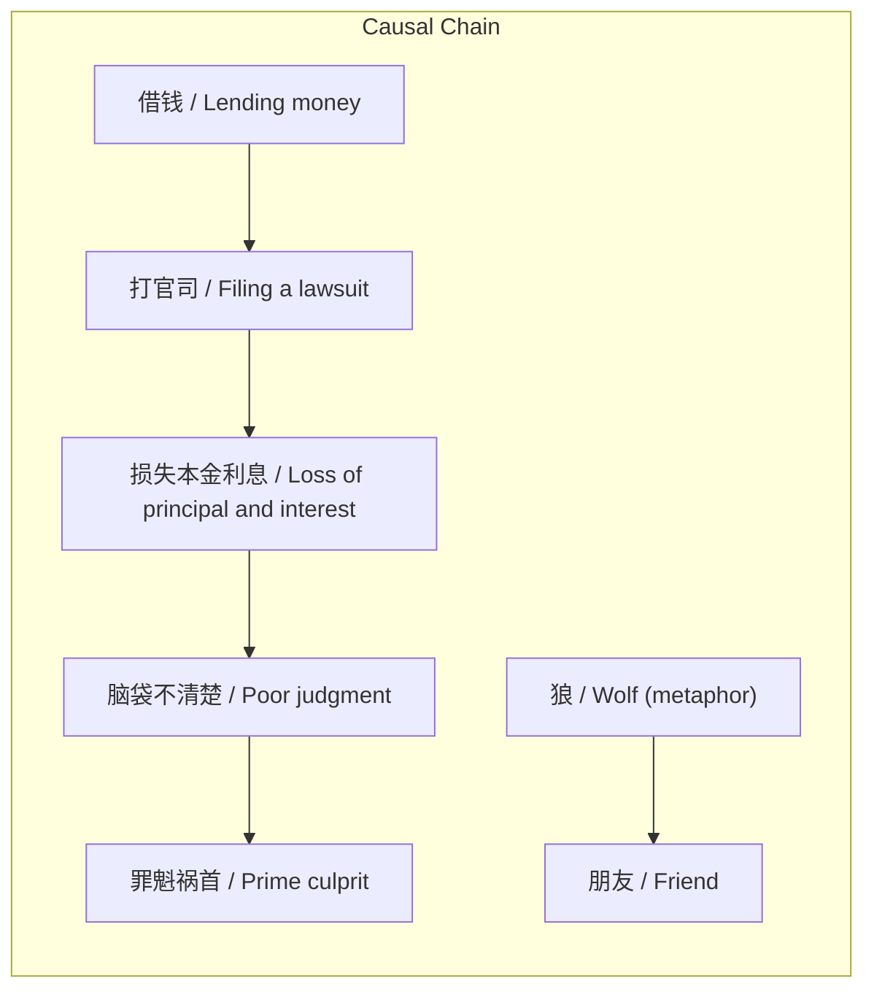

# 任务报告

- requestId: 1771635876759-lca7y9
- 生成时间(UTC): 2026-02-21T01:06:13.032Z

## 文本总结

# 个人借贷失败反思：盲目借钱致损失

## 整体结构化文档表达
### 文档卡片
- 主题（中文/English）：个人借贷决策失误 / Personal Lending Decision Error
- 一句话摘要：作者在2017-2018年借给朋友19万元，部分还款后对方无力偿还，打官司后仍损失五六万元，并反思自身决策错误是主因。
- 目标读者：未提及
- 核心结论（3条）：
  1. 盲目持续借贷给朋友导致重大财务损失。
  2. 法律途径无法完全挽回借贷损失。
  3. 自我归因认为自身判断失误是根本原因。

### 内容结构树
1. 背景与问题定义：2017-2018年，作者借给朋友19万元，朋友还款6万元后无力偿还剩余债务。
2. 核心观点与关键证据：观点包括“自己脑袋不清楚”“狼是自己喂大的”“自己是罪魁祸首”；证据有借出全部资金、刷信用卡、打官司后仍有损失。
3. 方法/机制/路径：通过借贷、催收、法律诉讼尝试解决债务问题。
4. 风险与边界条件：未提及明确风险与边界条件，但从经历可推断朋友信用风险和无担保借贷风险。
5. 结论与行动建议：结论是不该持续借贷；未提及明确未来行动建议。

### 结构化元数据（JSON）
```json
{
  "title": "个人借贷失败反思：盲目借钱致损失",
  "topic_zh": "个人借贷决策失误",
  "topic_en": "Personal Lending Decision Error",
  "audience": "未提及",
  "claims": ["盲目持续借贷导致重大财务损失", "法律途径无法完全挽回借贷损失", "自我归因认为自身判断失误是根本原因"],
  "evidence": ["借给朋友19万", "要回6万后对方没钱还", "打官司损失本金利息五六万", "刷信用卡借给对方"],
  "risks": ["未提及"],
  "actions": ["未提及"]
}
```

## 处理流程
1. 输入识别：识别出用户提供的个人借贷经历叙述文本。
2. 信息抽取：抽取了实体（朋友、金额）、概念（借钱、打官司）、事实（借款金额、还款情况、损失）、观点（自我批评）。
3. 结构化归纳：将叙事按背景、观点、方法、风险、结论组织。
4. 关系建模：建立了借贷行为、债务、违约、诉讼、损失之间的因果链。
5. 可视化表达：生成了概念结构图和逻辑因果图。

## 概念清单（中英文）
- 朋友 / Friend
- 借钱 / Lending money
- 19万 / 190,000 yuan
- 6万 / 60,000 yuan
- 打官司 / Filing a lawsuit
- 损失本金利息 / Loss of principal and interest
- 信用卡 / Credit card
- 脑袋不清楚 / Poor judgment
- 狼 / Wolf (metaphor)
- 罪魁祸首 / Prime culprit

## 概念定义（中英文）
- 朋友：在文中指向作者提供借贷的个人关系。/ Friend: A personal relationship through which the author provided lending.
- 借钱：在文中指向朋友转移资金并期望归还的行为。/ Lending money: The act of transferring funds to a friend with the expectation of repayment.
- 19万：文中借给朋友的具体金额，十九万元人民币。/ 190,000 yuan: The specific amount lent to the friend, 190,000 RMB.
- 6万：朋友部分还款的具体金额，六万元人民币。/ 60,000 yuan: The specific amount repaid by the friend, 60,000 RMB.
- 打官司：文中指通过法律诉讼追讨债务的行为。/ Filing a lawsuit: The act of pursuing debt repayment through legal litigation.
- 损失本金利息：文中指最终未能收回的本金和利息总和，约五六万元。/ Loss of principal and interest: The total principal and interest not recovered, approximately 50,000-60,000 RMB.
- 信用卡：文中指作者用于借钱给朋友的支付工具。/ Credit card: The payment tool used by the author to lend money to the friend.
- 脑袋不清楚：文中指作者在借贷决策时判断力不足的状态。/ Poor judgment: The state of inadequate decision-making by the author in the lending process.
- 狼：文中比喻朋友像狼一样贪婪或不可信。/ Wolf: A metaphor for the friend being greedy or untrustworthy.
- 罪魁祸首：文中指作者认为自己是造成损失的主要责任人。/ Prime culprit: The author's self-attribution as the primary cause of the loss.

## 概念关联与逻辑关系（中英文）
- 借钱 / Lending money 与 部分还款（6万）/ Partial repayment (60,000 yuan) 共同影响 损失本金利息 / Loss of principal and interest：当部分还款不足以覆盖总借款时，产生未偿债务，进而通过诉讼仍导致净损失。形式化：净损失 ≈ 总借款 - 部分还款 - 诉讼回收额，其中总借款=19万，部分还款=6万，诉讼回收额>0但<13万，净损失≈5-6万。
- 打官司 / Filing a lawsuit 与 损失本金利息 / Loss of principal and interest 关联：诉讼旨在减少损失，但文中显示仍有净损失。形式化：诉讼回收额 < 未偿债务 → 净损失 > 0。
- 脑袋不清楚 / Poor judgment 与 罪魁祸首 / Prime culprit 关联：作者将财务损失归因于自身决策失误。形式化：作者认为 脑袋不清楚 是 罪魁祸首 的原因。

## COT逻辑梳理（定义/分类/比较/因果/科学方法论）
Step 1: 定义核心概念。借贷行为指向朋友转移资金的行为；债务是借贷产生的偿还义务；违约是未能履行偿还义务。
Step 2: 分类。朋友间借贷可分类为有担保与无担保；本文属于无担保朋友借贷。
Step 3: 比较。比较有担保借贷（如抵押）与无担保借贷的风险；无担保借贷风险更高，依赖信用。
Step 4: 因果分析。原因：作者持续借贷给朋友 despite 可能风险；结果：朋友部分还款后违约，导致诉讼和损失。根本原因：作者决策失误（脑袋不清楚）。
Step 5: 科学方法论。评估借贷风险时应考虑：借款人信用历史、还款能力、借贷金额与收入比例、是否有担保。本文中作者未充分评估，仅基于友情借贷。

## 事实与看法（病毒）
### 事实
- 2017、2018年借给朋友19万元。
- 要回6万元后对方没钱还剩余债务。
- 剩余债务通过打官司追回部分，但仍有损失。
- 损失本金利息约五六万元。
- 作者曾刷信用卡借钱给朋友。
### 看法
- 事后发现都是自己脑袋不清楚傻。
- 狼都是自己喂大的。
- 我自己才是罪魁祸首。
- 就不该一直借钱给对方。

## FAQ（原文问题整理）
- 未发现明确提问。原文为叙述性文本，无直接问题。

## Visualization
### Mermaid 图 1（概念结构图）

### Mermaid 图 2（逻辑/因果图）


## 文章中的类比
- “狼都是自己喂大的”：将朋友比作狼，比喻自己培养出了问题关系。

## 10个金句
1. 2017、2018年我也借19万给朋友过。
2. 好不容易要回6万对方就没钱还了。
3. 剩下的钱打官司要回了。
4. 损失本金利息五六万。
5. 当时自己钱借完了还刷信用卡借给对方。
6. 事后发现都是自己脑袋不清楚傻。
7. 狼都是自己喂大的。
8. 我自己才是罪魁祸首。
9. 就不该一直借钱给对方。
10. 原文未提供
