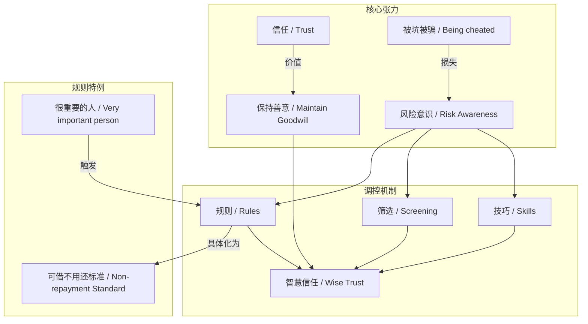
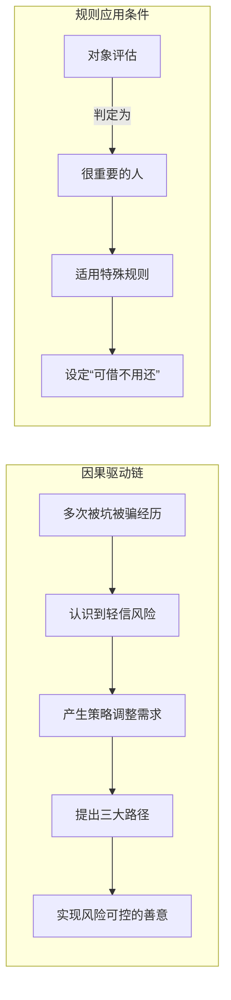

# 任务报告

- requestId: 1771635978813-3936ij
- 生成时间(UTC): 2026-02-21T01:06:50.104Z

## 文本总结

# 信任的韧性：在伤害后重建善意

## 整体结构化文档表达
### 文档卡片
- 主题（中文/English）：信任与风险管理 / Trust and Risk Management
- 一句话摘要：基于多次受骗经历，阐述信任的核心价值及通过技巧、筛选与规则进行风险调控的个人策略。
- 目标读者：在人际信任中受过挫折、寻求平衡善意与自我保护的一般公众。
- 核心结论（3条）：
    1.  人际信任具有根本重要性，不应因受骗而完全放弃。
    2.  释放善意需习得具体技巧并建立更严格的筛选机制。
    3.  对核心关系可设定“可借不用还”的特殊规则，以区分风险等级。

### 内容结构树
1.  **背景与问题定义**：个人曾轻信他人，多次遭受“被坑被骗”，导致大额资金（7位数）借出且难以收回，面临信任危机。
2.  **核心观点与关键证据**：观点是“人与人之间的信任还是很重要”。证据是个人惨痛经历（多次被骗、大额损失）并未使其彻底否定信任价值。
3.  **方法/机制/路径**：提出调整信任的三大路径：①学习释放善意的技巧；②进行更严格的筛选；③设定更具体、有约束的规则。并以对“很重要的人”设定“可借不用还”标准为例。
4.  **风险与边界条件**：未明确提及具体风险类型，但隐含策略调整旨在规避“再次被坑被骗”的风险。边界在于规则仅适用于“生命中对自己很重要的人”。
5.  **结论与行动建议**：结论是信任需以更智慧的方式维系。行动建议是主动学习技巧、严格筛选对象、为不同关系设定差异化的约束性规则。

### 结构化元数据（JSON）
```json
{
  "title": "信任的韧性：在伤害后重建善意",
  "topic_zh": "信任与风险管理",
  "topic_en": "Trust and Risk Management",
  "audience": "在人际信任中受过挫折、寻求平衡善意与自我保护的一般公众",
  "claims": [
    "人际信任具有根本重要性，不应因受骗而完全放弃",
    "释放善意需习得具体技巧并建立更严格的筛选机制",
    "对核心关系可设定“可借不用还”的特殊规则，以区分风险等级"
  ],
  "evidence": [
    "经历多次被坑被骗",
    "借出7位数资金且估计难以收回"
  ],
  "risks": [
    "未明确提及具体风险，但隐含再次受骗的经济与情感风险"
  ],
  "actions": [
    "学习释放善意的技巧",
    "进行更严格的筛选",
    "设定更具体的、有约束的规则"
  ]
}
```

## 处理流程
1.  **输入识别**：识别用户输入为一段第一人称叙事与反思性观点文本，核心议题为“信任”。
2.  **信息抽取**：抽取实体（“我”、“很重要的人”）、关键概念（信任、被坑被骗、技巧、筛选、规则）、事实（借出7位数未回、多次受骗）、观点（信任重要、需调整策略）。
3.  **结构化归纳**：将内容归纳为“背景-观点-方法-风险-结论”的逻辑链。对“规则”进行具体化定义（针对重要人的无偿还借款标准）。
4.  **关系建模**：建立“负面经历”导致“策略调整”，以及“技巧/筛选/规则”共同服务于“智慧信任”的关系。
5.  **可视化表达**：使用Mermaid图展示概念间的支撑与因果逻辑。

## 概念清单（中英文）
-  信任 / Trust
-  被坑被骗 / Being cheated and deceived
-  借出去7位数 / Lending a seven-figure sum
-  善意 / Goodwill
-  技巧 / Skills
-  筛选 / Screening
-  规则 / Rules
-  很重要的人 / Very important person
-  可以借了不用还的标准 / Standard for lendable non-repayment

## 概念定义（中英文）
-  **信任 / Trust**：基于对他人的正面预期，愿意承担其可能不履行承诺风险的心理状态与行为倾向。
-  **被坑被骗 / Being cheated and deceived**：因轻信他人而遭受利益（如金钱）或情感损失的具体负面经历。
-  **借出去7位数 / Lending a seven-figure sum**：指借出金额达到百万级别（具体货币未指明）且目前处于难以收回的状态，是信任受损的量化体现。
-  **善意 / Goodwill**：主动向他人表达友好、提供帮助的积极意愿与行为。
-  **技巧 / Skills**：在人际互动中，为有效释放善意同时规避风险而需要习得的可操作方法。
-  **筛选 / Screening**：在决定是否信任或帮助他人前，进行评估与选择的严格过程。
-  **规则 / Rules**：为管理信任风险而自我设定的、具体且具约束力的行为准则。
-  **很重要的人 / Very important person**：在个体生命关系中具有极高情感或实际价值，其特殊性可覆盖一般风险规则的对象。
-  **可以借了不用还的标准 / Standard for lendable non-repayment**：针对“很重要的人”所设定的、允许借款且不预期偿还的特定条件或额度，是一种差异化的风险容忍规则。

## 概念关联与逻辑关系（中英文）
1.  **被坑被骗 / Being cheated and deceived** 的经历直接导致对 **筛选 / Screening** 机制 **严格度** 的需求增加。
    *   形式化：`严重损失经历 → 筛选严格度 ↑`
2.  **信任 / Trust** 的 **核心价值** 与 **被坑被骗 / Being cheated and deceived** 的 **负面体验** 构成根本张力，需通过 **技巧 / Skills**、**筛选 / Screening** 与 **规则 / Rules** 进行调和。
    *   形式化：`信任价值 > 风险损失` 时，`策略 = f(技巧, 筛选, 规则)`
3.  **很重要的人 / Very important person** 这一 **关系等级** 决定了 **可以借了不用还的标准 / Standard for lendable non-repayment** 这一 **特殊规则 / Rules** 的适用性。
    *   形式化：`IF 对象 = “很重要的人” THEN 适用规则 = “可借不用还”`

## COT逻辑梳理（定义/分类/比较/因果/科学方法论）
-   **Step 1 (定义)**：界定核心概念“信任”为一种包含风险承担的心理行为，并定义其反面“被坑被骗”为信任失败导致的损失事件。
-   **Step 2 (分类)**：将信任对象按关系亲疏/重要性分类（如“很重要的人”与“一般人”），并对应分类管理策略（特殊规则 vs. 严格筛选）。
-   **Step 3 (比较)**：比较“过去（轻信、无筛选）”与“现在（需技巧、筛选、规则）”两种信任策略的预期结果，后者旨在降低损失概率同时保留善意可能性。
-   **Step 4 (因果)**：分析因果链：`多次被坑被骗（因）` → `认识到纯粹轻信的风险（认知）` → `产生调整策略的需求（动机）` → `提出并应用技巧、筛选、规则（果）`。
-   **Step 5 (科学方法论)**：提出一种基于“风险分级-规则匹配”的实践方法论：①评估关系等级（分类）；②为不同等级设定差异化的风险容忍度与约束规则（设定规则）；③在执行中运用技巧进行动态筛选（应用技巧）。这是一种准实验性的个人风险管理框架。

## 事实与看法（病毒）
### 事实
-  个人过去特别容易信任人，想着能帮就帮。
-  经历了多次被坑被骗。
-  已借出7位数（金额）且估计以后也很难拿回来。
-  对“很重要的人”设定了“可以借了不用还”的具体标准。

### 看法
-  人与人之间的信任还是很重要。
-  不能因为被坑被骗就彻底封闭自己对世界的善意。
-  需要学习释放善意的技巧。
-  需要进行更严格的筛选。
-  需要设定一些更具体的、有一定约束的规则。

## FAQ（原文问题整理）
-  原文未直接提出明确问题，但隐含核心疑问：“如何在经历信任失败后，依然能健康地信任他人？”
    -   **简要回答**：通过承认信任的长期价值，主动学习释放善意的技巧，建立更严格的筛选机制，并为不同重要性的关系设定差异化的、有约束的具体规则（如对核心关系设定无偿还借款标准），在风险可控的前提下保留善意。

## Visualization
### Mermaid 图 1（概念结构图）

### Mermaid 图 2（逻辑/因果图）


## 文章中的类比
-  未发现明确类比。

## 10个金句
1.  以前特别容易信任人 想着能帮就帮。
2.  经历了很多次的被坑被骗。
3.  现在也借出去7位数拿不回来 估计以后也很难拿回来。
4.  但我觉得人与人之间的信任还是很重要。
5.  不能因为被坑被骗就彻底封闭自己对世界的善意。
6.  只不过需要学习释放善意的技巧。
7.  进行更严格的筛选。
8.  以及设定一些更具体的、有一定约束的规则。
9.  有些人在生命中是对自己很重要的人。
10. 对于很重要的人 我会设定了一个可以借了不用还的标准。
（注：原文共提供9个独立语义单元，第10条为“原文未提供”。）
