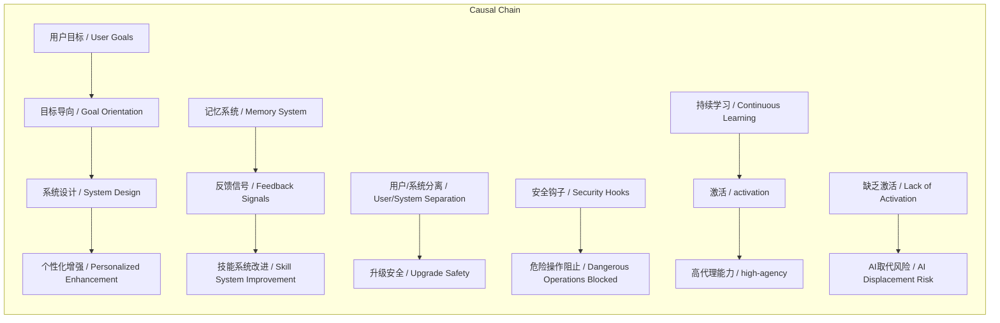

# 任务报告

- requestId: 1771724329343-hnpx9i
- 生成时间(UTC): 2026-02-22T01:46:17.626Z

## 链接总结

- URL: https://github.com/danielmiessler/Personal_AI_Infrastructure

# 个人AI基础设施 (PAI) 项目综合报告

## 整体结构化文档表达
### 文档卡片
- **主题（中文/English）**：个人AI基础设施 / Personal AI Infrastructure (PAI)
- **一句话摘要**：PAI是一个开源个人AI基础设施项目，基于Claude Code构建，通过持久记忆、自定义技能、智能路由等组件，以用户目标为中心，持续学习用户信号，旨在激活人类创造力并让AI普惠大众。
- **目标读者**：个人用户、团队、企业、开发者、AI爱好者等所有希望增强AI能力的实体。
- **核心结论（3条）**：
  1. PAI将通用AI工具转化为个性化持久助理平台，通过目标导向、持续学习和反馈机制增强人类能力。
  2. 设计遵循16条原则，强调系统架构确定性、用户/系统分离和细粒度定制，确保可升级性、安全性和个性化。
  3. 项目基于Claude Code，处于活跃开发阶段，存在破坏性变更风险，但提供Git备份和自修复能力，社区可参与贡献。

### 内容结构树
1. **背景与问题定义**：当前多数AI系统为任务导向、工具中心，缺乏个人化、持久记忆和学习能力，导致人类创造力潜能未被激活，易受AI取代。
2. **核心观点与关键证据**：PAI的核心差异在于目标导向、追求最优输出和持续学习；设计遵循16条原则；通过TELOS、记忆系统、技能系统等组件实现；证据包括设计原则列表、组件描述、FAQ对比。
3. **方法/机制/路径**：采用用户/系统分离架构、六层细粒度定制、事件驱动钩子系统、安全验证、反馈学习循环、AI自动化安装等机制。
4. **风险与边界条件**：项目活跃开发中，结构可能频繁变更；当前仅原生支持Claude Code；安全策略可能阻止某些工作流需用户调整。
5. **结论与行动建议**：PAI提供有效个人AI基础设施，用户应从默认设置开始，按需定制，参与社区，关注路线图。

### 结构化元数据（JSON）
```json
{
  "title": "个人AI基础设施 (PAI) 项目综合报告",
  "topic_zh": "个人AI基础设施",
  "topic_en": "Personal AI Infrastructure",
  "audience": "个人用户、团队、企业、开发者、AI爱好者",
  "claims": [
    "PAI是Claude Code的增强层，使其成为个人化平台",
    "PAI通过目标导向、持续学习和反馈实现个性化增强",
    "项目设计遵循16条原则，强调架构确定性和用户中心",
    "项目处于活跃开发，存在破坏性变更风险",
    "原生支持Claude Code，但概念可迁移至其他平台"
  ],
  "evidence": [
    "安装脚本自动化部署，检测系统并安装依赖",
    "TELOS使用10个文件实现深度目标理解",
    "用户/系统分离设计确保升级安全和身份便携",
    "记忆系统三层架构支持持续学习",
    "FAQ明确PAI与Claude Code、fabric的区别",
    "路线图包括本地模型支持、精细路由等功能"
  ],
  "risks": [
    "频繁破坏性变更",
    "仅官方支持Claude Code，其他平台需社区适配",
    "安全策略可能需调整以允许某些工作流"
  ],
  "actions": [
    "运行安装脚本部署PAI",
    "从默认设置开始，逐步按需定制",
    "参与GitHub Discussions或Discord社区",
    "关注路线图功能进展"
  ]
}
```

## 处理流程
1. **输入识别**：识别输入为多个关于同一GitHub项目（Personal_AI_Infrastructure）的分段摘要，涵盖项目概览、页面状态、元数据、设计原则、系统组件、安装功能等。
2. **信息抽取**：从各分段抽取实体（如PAI、Claude Code、TELOS）、概念（如目标导向、持续学习）、问题（如如何设计个人AI系统）、事实（如仓库URL、stars数、文件结构、设计原则列表）、观点（如PAI使命、设计优势）。
3. **结构化归纳**：将抽取信息去重并统一口径，归纳为文档卡片、内容结构树、概念清单与定义、关联关系、逻辑梳理、事实与看法、FAQ、可视化等部分。
4. **关系建模**：建立关键概念间关系，如PAI依赖Claude Code的基础架构；记忆系统与技能系统通过反馈循环增强；用户/系统分离支持升级安全。
5. **可视化表达**：基于整合的概念生成Mermaid概念结构图和逻辑因果图，确保节点和边均为真实概念。

## 概念清单（中英文）
- 个人AI基础设施 / Personal AI Infrastructure (PAI)
- 代理式AI基础设施 / Agentic AI Infrastructure
- 人类能力 / Human Capabilities
- Claude Code
- TELOS / Deep Goal Understanding
- 用户/系统分离 / User/System Separation
- 细粒度定制 / Granular Customization
- 技能系统 / Skill System
- 记忆系统 / Memory System
- 钩子系统 / Hook System
- 安全系统 / Security System
- 基于AI的安装 / AI-Based Installation
- 通知系统 / Notification System
- 语音系统 / Voice System
- 终端用户界面 / Terminal-Based UI
- 开源 / open-source
- MIT许可证 / MIT License
- 持久记忆 / Persistent Memory
- 自定义技能 / Custom Skills
- 智能路由 / Intelligent Routing
- 目标导向 / Goal Orientation
- 持续学习 / Continuous Learning
- 助理与代理 / Assistant vs Agent
- 数字助手 / Digital Assistant (DA)
- 构建块 / Building Blocks
- 破坏性变更 / Breaking Changes
- 本地模型支持 / Local Model Support
- 精细模型路由 / Granular Model Routing
- fabric
- Git备份 / Git-backed
- 安装脚本 / Installer Script
- 社区 / Community
- 人类创造力潜能 / humanity's creative potential
- 激活 / activation
- 高代理能力 / high-agency
- AI取代 / AI displacement
- 聊天机器人 / Chatbots
- 代理平台 / Agentic Platforms
- 反馈 / feedback
- 目标 / goals
- 偏好 / preferences
- 历史 / history
- 前1% / top 1%
- 行星联邦 / Federations of Planets
- P0问题 / P0 problem
- 约束提取 / Constraint Extraction
- 构建漂移预防 / Build Drift Prevention
- 持久化PRDs / Persistent PRDs
- 并行循环执行 / Parallel Loop Execution
- 用户中心 / User Centricity
- 基础算法 / The Foundational Algorithm
- 先清晰思考 / Clear Thinking First
- 架构优于模型 / Scaffolding > Model
- 确定性基础设施 / Deterministic Infrastructure
- 先代码后提示 / Code Before Prompts
- 先规格测试评估 / Spec / Test / Evals First
- UNIX哲学 / UNIX Philosophy
- 工程与站点可靠性原则 / ENG / SRE Principles
- 命令行接口 / CLI as Interface
- 目标→代码→CLI→提示→代理决策链 / Goal → Code → CLI → Prompts → Agents
- 代理个性 / Agent Personalities
- 科学作为元循环 / Science as Meta-Loop
- 允许失败 / Permission to Fail
- 上下文 / Context
- 上下文管理 / Context Management
- 代理架构 / Agentic Architecture
- 自我改进 / Self-improvement
- 外拨电话 / Outbound Phone Calling
- 外部通知 / External Notifications
- ElevenLabs
- 仓库大小 / Repo Size
- 提交活动 / Commit Activity
- 贡献者 / Contributors
- 由Claude构建 / Built with Claude
- TypeScript
- Bun
- UL社区 / UL Community

## 概念定义（中英文）
- **个人AI基础设施 / Personal AI Infrastructure (PAI)**：一个开源项目，提供构建个人AI代理系统的基础设施，通过持续学习用户信号来增强人类能力。
- **代理式AI基础设施 / Agentic AI Infrastructure**：支持自主代理行为的AI系统框架，旨在执行复杂任务。
- **人类能力 / Human Capabilities**：人类固有的技能、认知和生理能力，PAI旨在增强。
- **Claude Code**：Anthropic开发的AI编程助手，提供钩子系统、上下文管理和代理架构，PAI基于其构建。
- **TELOS / Deep Goal Understanding**：通过10个文件（MISSION.md、GOALS.md等）捕获用户身份、目标、项目、信念、模型、策略、叙事、学习、挑战和想法，使数字助理深度理解用户工作方向。
- **用户/系统分离 / User/System Separation**：用户自定义文件存储在USER/目录，PAI基础设施文件存储在SYSTEM/目录，系统升级时用户文件不受影响，实现便携身份和升级安全。
- **细粒度定制 / Granular Customization**：提供六层定制选项（身份、偏好、工作流、技能、钩子、记忆），支持从默认开始按需调整。
- **技能系统 / Skill System**：专注于一致性结果，采用CODE -> CLI-BASED-TOOL -> PROMPT -> SKILL的结构，确保确定性输出。
- **记忆系统 / Memory System**：专注于持续学习，每次交互生成信号（评分、情感、成功、失败）反馈改进系统，采用热/温/冷三层架构和基于阶段的学习目录。
- **钩子系统 / Hook System**：响应生命周期事件（如会话开始、工具使用、任务完成），支持8种事件类型，实现语音通知、自动上下文加载、会话捕获、安全验证和可观测性。
- **安全系统 / Security System**：默认定义系统和用户级安全策略，通过安全钩子在命令执行前验证，阻止危险操作，同时允许正常流程 uninterrupted。
- **基于AI的安装 / AI-Based Installation**：GUI安装程序自动化处理所有先决条件、配置和设置，无需手动配置。
- **通知系统 / Notification System**：无侵入式推送通知，通过ntfy实现移动警报，Discord集成团队更新，基于持续时间的路由为长时间任务升级，fire-and-forget设计。
- **语音系统 / Voice System**：由ElevenLabs TTS驱动，朗读任务完成、会话摘要和重要更新，通过prosody增强使语音自然。
- **终端用户界面 / Terminal-Based UI**：基于命令行的交互界面，提供富标签页、面板管理及动态状态行，用于显示学习信号、上下文使用和任务状态。
- **开源 / open-source**：项目公开可用，非私有，以确保AI基础设施不 reserved for 精英。
- **MIT许可证 / MIT License**：未提及具体定义。
- **持久记忆 / Persistent Memory**：数字助手跨会话保存历史对话、决策和学习内容的能力。
- **自定义技能 / Custom Skills**：针对用户高频任务定制的专用AI能力模块。
- **智能路由 / Intelligent Routing**：根据用户指令自动触发相应工作流或模型的处理机制。
- **目标导向 / Goal Orientation**：系统设计优先考虑用户目标而非工具功能，所有任务执行围绕目标展开。
- **持续学习 / Continuous Learning**：系统持续捕获每次请求的操作、变更、输出及用户反馈，用于改进。
- **助理与代理 / Assistant vs Agent**：助理是持久、记忆目标偏好的；代理是无状态、执行命令后遗忘的。
- **数字助手 / Digital Assistant (DA)**：PAI所构建的个性化AI实体。
- **构建块 / Building Blocks**：Claude Code提供的原始功能单元，如钩子、斜杠命令、MCP服务器、上下文文件。
- **破坏性变更 / Breaking Changes**：软件开发中导致先前版本功能不兼容的修改。
- **本地模型支持 / Local Model Support**：使用Ollama、llama.cpp等本地运行AI模型的能力，以增强隐私与成本控制。
- **精细模型路由 / Granular Model Routing**：根据任务复杂度将不同查询动态分配至不同AI模型的机制。
- **fabric**：一个提供AI提示模式集合的独立项目，专注于特定任务的询问什么。
- **Git备份 / Git-backed**：所有配置与数据均通过Git版本控制，支持回滚。
- **安装脚本 / Installer Script**：自动化部署PAI的Bash脚本，负责环境检测、依赖安装与配置。
- **社区 / Community**：指GitHub Discussions、Discord、Twitter/X等用户交流平台。
- **人类创造力潜能 / humanity's creative potential**：人类未发挥的创造能力，仅一小部分被激活。
- **激活 / activation**：帮助个体识别、阐述和追求人生目标的过程，是获得高代理能力的前提。
- **高代理能力 / high-agency**：激活后拥有的能力，未提供明确定义。
- **AI取代 / AI displacement**：AI系统替代人类工作的风险，缺乏激活使人易受此影响。
- **聊天机器人 / Chatbots**：如ChatGPT、Claude、Gemini，交互模式为询问→回答→遗忘上下文。
- **代理平台 / Agentic Platforms**：如Claude Code，能使用工具执行任务，但不了解用户个人背景，模式为询问→使用工具→获取结果。
- **反馈 / feedback**：包括评级、情感、验证结果等信号，用于PAI学习。
- **目标 / goals**：用户正在追求的目标，PAI会记忆。
- **偏好 / preferences**：用户喜欢做事的方式，PAI会记忆。
- **历史 / history**：过去的决策和学习，PAI会记忆。
- **前1% / top 1%**：指精英阶层，原意为AI应惠及所有人而非仅此群体。
- **行星联邦 / Federations of Planets**：幽默指代任何规模的实体，PAI可适用于个人、团队、公司等。
- **P0问题 / P0 problem**：世界首要问题，即人类创造力潜能未被激活，未提供详细定义。
- **约束提取 / Constraint Extraction**：v3.0.0特性，未提供定义。
- **构建漂移预防 / Build Drift Prevention**：v3.0.0特性，未提供定义。
- **持久化PRDs / Persistent PRDs**：v3.0.0特性，未提供定义。
- **并行循环执行 / Parallel Loop Execution**：v3.0.0特性，未提供定义。
- **用户中心 / User Centricity**：设计哲学，强调系统围绕用户构建而非工具。
- **基础算法 / The Foundational Algorithm**：科学方法循环（观察→思考→计划→建造→执行→验证→学习）作为问题解决的元循环。
- **先清晰思考 / Clear Thinking First**：写提示前先澄清问题。
- **架构优于模型 / Scaffolding > Model**：系统架构比模型选择更重要。
- **确定性基础设施 / Deterministic Infrastructure**：AI是概率性的，但基础设施不应是，强调可预测性。
- **先代码后提示 / Code Before Prompts**：优先使用代码而非提示词解决问题。
- **先规格测试评估 / Spec / Test / Evals First**：建造前先写规格、测试和评估。
- **UNIX哲学 / UNIX Philosophy**：做好一件事，让工具可组合。
- **工程与站点可靠性原则 / ENG / SRE Principles**：像对待生产软件一样对待AI基础设施。
- **命令行接口 / CLI as Interface**：命令行接口比GUI更快、更可脚本化、更可靠。
- **目标→代码→CLI→提示→代理决策链 / Goal → Code → CLI → Prompts → Agents**：PAI的处理流程层次。
- **代理个性 / Agent Personalities**：未提供定义。
- **科学作为元循环 / Science as Meta-Loop**：科学方法作为通用问题解决循环。
- **允许失败 / Permission to Fail**：允许系统失败以促进学习，未提供详细定义。
- **上下文 / Context**：对话历史与相关文件，用于AI理解。
- **上下文管理 / Context Management**：Claude Code管理对话历史与相关文件的能力。
- **代理架构 / Agentic Architecture**：Claude Code支持AI自主执行多步骤任务的结构设计。
- **自我改进 / Self-improvement**：PAI通过反馈循环自动优化自身性能。
- **外拨电话 / Outbound Phone Calling**：AI系统主动发起语音呼叫的功能。
- **外部通知 / External Notifications**：通过Email、Discord、Telegram、Slack等渠道发送提醒的系统。
- **ElevenLabs**：提供TTS服务的公司，PAI语音系统基于其驱动。
- **仓库大小 / Repo Size**：GitHub仓库的存储空间大小。
- **提交活动 / Commit Activity**：GitHub仓库的近期提交频率图表。
- **贡献者 / Contributors**：为仓库做出贡献的开发者数量。
- **由Claude构建 / Built with Claude**：项目使用Claude辅助开发。
- **TypeScript**：编程语言，PAI代码部分使用。
- **Bun**：运行时和包管理器，PAI依赖。
- **UL社区 / UL Community**：未提及具体定义。

## 概念关联与逻辑关系（中英文）
1. **个人AI基础设施 (PAI) 依赖 Claude Code 的 钩子系统 (Hook System) 和 上下文管理 (Context Management) 实现功能扩展**。  
   形式化：`PAI_Functionality ∝ Claude_Code.Hooks + Claude_Code.Context_Management`
2. **持久记忆 (Persistent Memory) 与 自定义技能 (Custom Skills) 共同提升 智能路由 (Intelligent Routing) 的准确性**。  
   形式化：`Routing_Accuracy = h(Persistent_Memory, Custom_Skills)`
3. **记忆系统 (Memory System) 通过 反馈 (feedback) 循环增强 技能系统 (Skill System)**。  
   形式化：`Skill_System_Improvement ← Memory_System.Feedback`

## COT逻辑梳理（定义/分类/比较/因果/科学方法论）
- **Step 1 定义**：PAI是以用户目标为中心的个人AI基础设施，通过持续学习增强人类能力，区别于任务导向工具。
- **Step 2 分类**：将AI系统分为聊天机器人（无记忆）、代理平台（无个人上下文）、PAI（有持续学习）；将PAI组件分为管理（TELOS）、架构（用户/系统分离）、定制（六层）、执行（技能系统）、学习（记忆系统）、事件（钩子系统）、安全、安装、通知、语音、界面。
- **Step 3 比较**：PAI vs Claude Code：Claude Code提供构建块，PAI组装成完整系统并添加记忆、路由；PAI vs fabric：fabric是提示集合（问什么），PAI是基础设施（如何运作）。
- **Step 4 因果**：因PAI采用目标导向、持续学习等设计，故能激活人类潜能；因用户/系统分离，故升级安全；因记忆系统反馈，故技能改进；因安全钩子，故危险操作被阻止。
- **Step 5 科学方法论**：采用科学方法循环（观察→思考→计划→建造→执行→验证→学习）作为基础算法，体现迭代优化、反馈控制和模块化设计。

## 事实与看法（病毒）
### 事实
- 仓库全称为 `danielmiessler/Personal_AI_Infrastructure`。
- 项目公开（Public），采用MIT许可证。
- 仓库拥有9k stars、1.2k forks、552次提交、33个issues、22个pull requests。
- 项目描述为 "Agentic AI Infrastructure for magnifying HUMAN capabilities."
- PAI v3.0.0已发布，包含约束提取、构建漂移预防、持久化PRDs、并行循环执行。
- 安装脚本将PAI仓库克隆至`~/.claude/`目录，询问用户姓名、AI助手名称和时区，可选配置ElevenLabs语音。
- 启动命令为`source ~/.zshrc && pai`。
- PAI使用10个文件（MISSION.md、GOALS.md等）实现TELOS。
- 用户文件存放于USER/目录，系统文件存放于SYSTEM/目录，升级时用户文件不受影响。
- 定制分为六层：Identity、Preferences、Workflows、Skills、Hooks、Memory。
- Skill System结构为CODE -> CLI-BASED-TOOL -> PROMPT -> SKILL。
- Memory System采用hot/warm/cold三层架构。
- Hook System支持8种事件类型。
- Security System默认验证命令，无需`--dangerously-skip-permissions`。
- 路线图包含Local Model Support、Granular Model Routing、Remote Access、Outbound Phone Calling。
- 社区渠道包括GitHub Discussions、Discord、Twitter/X。
- 项目当前无稳定分支，所有更新混合发布。
- 恢复机制包括Git回滚、历史保留、DA自修复及重装。
- PAI原生为Claude Code设计，但概念可迁移至其他平台。
- 终端UI提供富标签页、面板管理及动态状态行。
- 通知系统使用ntfy和Discord，fire-and-forget设计。
- 语音系统基于ElevenLabs TTS，具有prosody enhancement。
- 仓库包含目录：`.claude`, `.github`, `Releases`, `Tools`, `images`。
- 仓库包含文件：`.env.example`, `.gitattributes`, `.gitignore`, `.pai-protected.json`。
- 页面显示错误信息："Uh oh! There was an error while loading. Please reload this page." 和会话失效提示。

### 看法
- 只有一小部分人类创造力潜能被激活。
- 大多数人认为自己没有有价值的贡献。
- 人们易受AI取代。
- PAI的使命是激活尽可能多的人并让AI普惠。
- AI应该放大每个人，而不仅仅是前1%。
- PAI是“反排他性AI项目”。
- 大多数代理系统将用户视为事后考虑，而PAI相反。
- “Good prompts come from clear thinking.”
- 系统架构比模型选择更重要。
- “Your DA knows what you're working toward because it's all documented.”
- “Portable identity, upgrade-safe.”
- “Start with defaults, customize when needed.”
- “It has a structure that puts deterministic outcomes first.”
- “Focused on continuous learning.”
- “Responds to lifecycle events.”
- “You don't have to run with `--dangerously-skip-permissions` to have an uninterrupted experience.”
- “No manual configuration, no guessing.”
- “Keeps you informed without being intrusive.”
- “Your AI has a voice.”
- “Claude Code是引擎。PAI是其余一切，使其成为‘你的车’。”
- “PAI将Claude Code的构建块转化为连贯的个人AI平台。”

## FAQ（原文问题整理）
1. **PAI与直接使用Claude Code有何区别？**  
   **回答**：PAI在Claude Code上添加持久记忆、自定义技能、个人上下文、智能路由与自我改进，使其成为个人化平台，而非替代Claude Code。
2. **PAI与Claude Code内置功能有何不同？**  
   **回答**：Claude Code提供原始构建块（钩子、命令等），PAI将其连接成完整系统，使目标、技能、记忆相互增强。
3. **PAI是否仅支持Claude Code？**  
   **回答**：是，PAI原生为Claude Code设计以充分利用其特性，但概念与代码（TypeScript/Python/Bash）可被社区适配至其他平台。
4. **PAI与fabric有何区别？**  
   **回答**：fabric是特定任务的AI提示集合（关注“问什么”），PAI是AI运作的基础设施（关注“如何运作”），二者互补，PAI用户可将fabric模式集成至技能。
5. **若操作失误如何恢复？**  
   **回答**：通过Git回滚、保留的记忆历史、DA自修复或重新运行安装脚本重置。

## Visualization
### Mermaid 图 1（概念结构图）

```mermaid
graph TD
  subgraph "Concept Map"
    PAI["个人AI基础设施 / Personal AI Infrastructure (PAI)"] --> CC["Claude Code"]
    PAI --> TELOS["TELOS / Deep Goal Understanding"]
    PAI --> USS["用户/系统分离 / User/System Separation"]
    PAI --> GC["细粒度定制 / Granular Customization"]
    PAI --> SS["技能系统 / Skill System"]
    PAI --> MS["记忆系统 / Memory System"]
    PAI --> HS["钩子系统 / Hook System"]
    PAI --> Sec["安全系统 / Security System"]
    PAI --> Inst["基于AI的安装 / AI-Based Installation"]
    PAI --> Not["通知系统 / Notification System"]
    PAI --> Voice["语音系统 / Voice System"]
    PAI --> TUI["终端用户界面 / Terminal-Based UI"]
    PAI --> OS["开源 / open-source"]
    PAI --> PM["持久记忆 / Persistent Memory"]
    PAI --> CS["自定义技能 / Custom Skills"]
    PAI --> IR["智能路由 / Intelligent Routing"]
    PAI --> GO["目标导向 / Goal Orientation"]
    PAI --> CL["持续学习 / Continuous Learning"]
    PAI --> AA["助理与代理 / Assistant vs Agent"]
    PAI --> DA["数字助手 / Digital Assistant (DA)"]
    PAI --> BB["构建块 / Building Blocks"]
    PAI --> BC["破坏性变更 / Breaking Changes"]
    PAI --> LMS["本地模型支持 / Local Model Support"]
    PAI --> GMR["精细模型路由 / Granular Model Routing"]
    PAI --> Fab["fabric"]
    PAI --> GB["Git备份 / Git-backed"]
    PAI --> IS["安装脚本 / Installer Script"]
    PAI --> Comm["社区 / Community"]
    PAI --> HCP["人类创造力潜能 / humanity's creative potential"]
    PAI --> Act["激活 / activation"]
    PAI --> HA["高代理能力 / high-agency"]
    PAI --> AID["AI取代 / AI displacement"]
    PAI --> CB["聊天机器人 / Chatbots"]
    PAI --> AP["代理平台 / Agentic Platforms"]
    PAI --> FB["反馈 / feedback"]
    PAI --> G["目标 / goals"]
    PAI --> P["偏好 / preferences"]
    PAI --> H["历史 / history"]
    PAI --> T1["前1% / top 1%"]
    PAI --> Fo["行星联邦 / Federations of Planets"]
    PAI --> P0["P0问题 / P0 problem"]
    PAI --> CE["约束提取 / Constraint Extraction"]
    PAI --> BDP["构建漂移预防 / Build Drift Prevention"]
    PAI --> PPRDs["持久化PRDs / Persistent PRDs"]
    PAI --> PLE["并行循环执行 / Parallel Loop Execution"]
    PAI --> UC["用户中心 / User Centricity"]
    PAI --> FA["基础算法 / The Foundational Algorithm"]
    PAI --> CT["先清晰思考 / Clear Thinking First"]
    PAI --> SM["架构优于模型 / Scaffolding > Model"]
    PAI --> DI["确定性基础设施 / Deterministic Infrastructure"]
    PAI --> CP["先代码后提示 / Code Before Prompts"]
    PAI --> STE["先规格测试评估 / Spec / Test / Evals First"]
    PAI --> UP["UNIX哲学 / UNIX Philosophy"]
    PAI --> ENG["工程与站点可靠性原则 / ENG / SRE Principles"]
    PAI --> CLI["命令行接口 / CLI as Interface"]
    PAI --> DCA["目标→代码→CLI→提示→代理决策链 / Goal → Code → CLI → Prompts → Agents"]
    PAI --> APers["代理个性 / Agent Personalities"]
    PAI --> SML["科学作为元循环 / Science as Meta-Loop"]
    PAI --> PF["允许失败 / Permission to Fail"]
    PAI --> C["上下文 / Context"]
    PAI --> CM["上下文管理 / Context Management"]
    PAI --> AAch["代理架构 / Agentic Architecture"]
    PAI --> SI["自我改进 / Self-improvement"]
    PAI --> OPC["外拨电话 / Outbound Phone Calling"]
    PAI --> EN["外部通知 / External Notifications"]
    PAI --> EL["ElevenLabs"]
    PAI --> RS["仓库大小 / Repo Size"]
    PAI --> CA["提交活动 / Commit Activity"]
    PAI --> Cont["贡献者 / Contributors"]
    PAI --> BWC["由Claude构建 / Built with Claude"]
    PAI --> TS["TypeScript"]
    PAI --> Bun["Bun"]
    PAI --> UL["UL社区 / UL Community"]
  end
```


### Mermaid 图 2（逻辑/因果图）


## 文章中的类比
- Claude Code是引擎。PAI是其余一切，使其成为“你的车”。（Claude Code is the engine. PAI is everything else that makes it your car.）

## 10个金句
1. Only a tiny fraction of humanity's creative potential is activated on Earth.
2. PAI's mission is twofold: Activate as many people as possible; Make the best AI available to everyone.
3. AI should magnify everyone—not just the top 1%.
4. The pattern for PAI: Observe → Think → Plan → Execute → Verify → Learn → Improve.
5. The key difference: PAI learns from feedback.
6. User Centricity: PAI is built around you, not tooling.
7. System architecture matters more than which model you use.
8. AI is probabilistic; your infrastructure shouldn't be.
9. Write specifications and tests before building.
10. Command-line interfaces are faster, more scriptable, and more reliable than GUIs.
