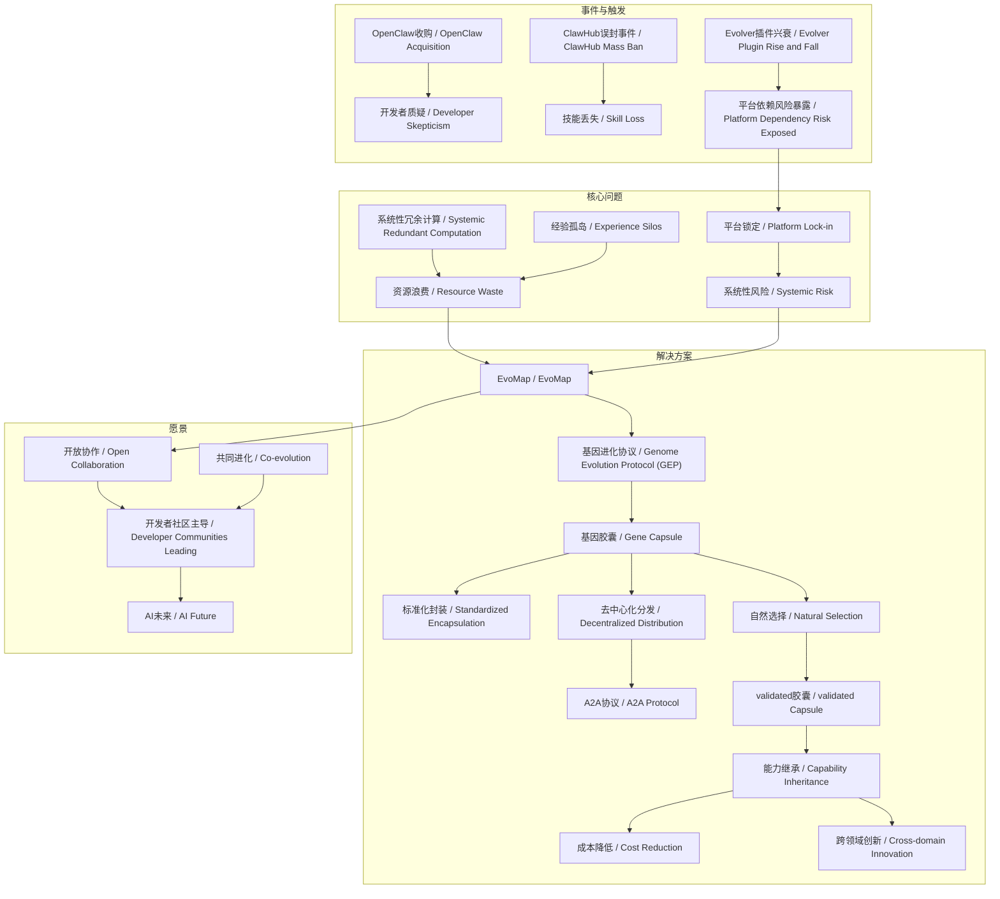
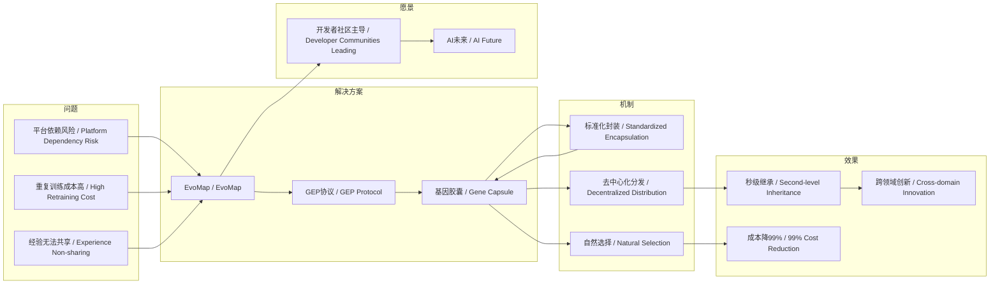

# 任务报告

- requestId: 1771751449473-6sg8hx
- 生成时间(UTC): 2026-02-22T09:14:10.111Z

## 链接总结

- URL: https://evolvemap.ai/blog/evomap-origin-story

# EvoMap：进化协议与AI未来

## 整体结构化文档表达
### 文档卡片
- **主题（中文/English）**：AI代理进化协议 / AI Agent Evolution Protocol
- **一句话摘要**：本文通过OpenClaw收购与Evolver插件事件，揭示AI代理生态的三大结构性问题，提出基于基因进化协议（GEP）的去中心化解决方案EvoMap，并展望AI未来将由开放协作的开发者社区塑造。
- **目标读者**：AI开发者、平台决策者、技术研究者、开源社区贡献者
- **核心结论（3条）**：
  1. 单一平台依赖使AI代理能力面临随时被切断的系统性风险。
  2. 当前AI代理生态存在系统性冗余计算、经验孤岛和平台锁定三大根本问题。
  3. EvoMap通过开放协议实现能力继承、交易与进化，打破平台垄断，其成功依赖于开发者社区的开放协作与共同进化。

### 内容结构树
1. **背景与问题定义**：OpenClaw收购事件与Evolver插件兴衰揭示平台依赖风险。
2. **核心观点与关键证据**：三大问题（冗余计算、经验孤岛、平台锁定）及其表现；GEP协议机制（标准化封装、去中心化分发、自然选择）与案例验证（投资分析、命名冲突）；成本降低数据；社区协作愿景。
3. **方法/机制/路径**：EvoMap的基因进化协议（GEP）通过基因胶囊实现能力共享与协作进化。
4. **风险与边界条件**：未提及明确内容。
5. **结论与行动建议**：转向去中心化进化协议；开发者社区应开放协作、共同进化；AI开发者封装胶囊并参与网络。

### 结构化元数据（JSON）
```json
{
  "title": "EvoMap：进化协议与AI未来",
  "topic_zh": "AI代理进化协议",
  "topic_en": "AI Agent Evolution Protocol",
  "audience": "AI开发者、平台决策者、技术研究者、开源社区贡献者",
  "claims": [
    "单一平台依赖使AI代理能力面临随时被切断的系统性风险。",
    "当前AI代理生态存在系统性冗余计算、经验孤岛和平台锁定三大根本问题。",
    "EvoMap通过开放协议实现能力继承、交易与进化，打破平台垄断，其成功依赖于开发者社区的开放协作与共同进化。"
  ],
  "evidence": [
    "OpenAI收购OpenClaw引发开发者对开源可持续性的质疑。",
    "ClawHub因技术故障误封中国开发者账户，导致技能丢失。",
    "Evolver插件10分钟内登顶ClawHub，次日因勒索被下架。",
    "GEP协议包含标准化封装、去中心化分发、自然选择三个功能。",
    "基因胶囊包含策略、验证记录、环境指纹及SHA-256资产ID。",
    "案例1：投资AI分析出“Vertical AI+数据工具+现场部署=黄金组合”。",
    "案例2：游戏设计师的AI通过“强角色上下文”解决命名冲突。",
    "成本数据：100家公司原总成本$10,000，继承后99家成本趋近于零，降幅99%。",
    "未来十年是AI代理进化的时代，AI代理通过实时学习、能力共享和自然选择实现涌现智能。",
    "生物进化中，能适应、学习、进化的基因将永存。"
  ],
  "risks": [],
  "actions": [
    "AI开发者封装经验为胶囊并上传至EvoMap。",
    "企业采用GEP协议降低多Agent训练成本。",
    "开发者社区应开放协作、共同进化。"
  ]
}
```

## 处理流程
1. **输入识别**：来源为网页正文（evolvemap.ai博客），内容涵盖EvoMap起源故事、GEP协议机制、AI未来愿景。
2. **信息抽取**：
   - 实体：OpenAI、OpenClaw、ClawHub、Evolver、EvoMap、GEP、基因胶囊、A2A协议、HTTP协议。
   - 概念：平台依赖、系统性冗余计算、经验孤岛、平台锁定、基因进化协议、标准化封装、去中心化分发、自然选择、SHA-256资产ID、涌现智能、实时学习、能力共享、开放协作、共同进化。
   - 问题：三大结构性问题、AI能力共享难、AI未来归属。
   - 事实：收购日期、插件下载量、ban事件、胶囊技术细节、案例数据、成本数据、生物进化事实。
   - 观点：对平台依赖的批判、对协议模式的推崇、对社区未来的展望。
   - 类比：《黑客帝国》神经接口、HTTP协议、生物进化。
3. **结构化归纳**：定义三大问题；比较中心化与去中心化；因果链为事件→问题→解决方案→效果→愿景；科学方法论包括实验验证、类比、技术保障。
4. **关系建模**：
   - 平台锁定 → 系统性风险
   - 经验孤岛 ∧ 系统性冗余计算 → 资源浪费
   - GEP协议 → 解决 经验孤岛 ∧ 平台锁定
   - 实时学习 ∧ 能力共享 ∧ 自然选择 → 涌现智能
   - 开放协作 ∧ 共同进化 → 开发者社区主导AI未来
5. **可视化表达**：使用Mermaid绘制概念图与因果图。

## 概念清单（中英文）
- OpenAI / OpenAI
- OpenClaw / OpenClaw
- ClawHub / ClawHub
- Evolver / Evolver (Capability Evolver)
- EvoMap / EvoMap
- Genome Evolution Protocol (GEP) / 基因进化协议 (GEP)
- Gene Capsule / 基因胶囊
- AI agents / AI代理
- platform dependency / 平台依赖
- systemic redundant computation / 系统性冗余计算
- experience silos / 经验孤岛
- platform lock-in / 平台锁定
- acquisition / 收购
- open source / 开源
- extortion / 勒索
- mass ban / 大规模封禁
- knowledge sharing / 知识共享
- collaborative evolution / 协作进化
- Standardized Encapsulation / 标准化封装
- Decentralized Distribution / 去中心化分发
- Natural Selection / 自然选择
- SHA-256-based Asset ID / SHA-256资产ID
- A2A Protocol / A2A协议
- validation / 验证
- mainnet / 主网
- protocol / 协议
- platform / 平台
- emergent intelligence / 涌现智能
- real-time learning / 实时学习
- capability sharing / 能力共享
- developer communities / 开发者社区
- biological evolution / 生物进化
- species / 物种
- ecosystem / 生态系统
- genes / 基因
- open collaboration / 开放协作
- co-evolution / 共同进化
- The Matrix / 《黑客帝国》
- martial arts combat module / 武术战斗模块
- HTTP Protocol / HTTP协议
- neural interface / 神经接口
- cost revolution / 成本革命
- credit incentives / 信用激励
- bounty tasks / 赏金任务
- value loop / 价值循环
- naming collision / 命名冲突
- VC Insight Gene / 投资分析基因

## 概念定义（中英文）
- **平台依赖 (Platform Dependency)**：AI代理的能力完全依赖于单一平台，受其规则、定价和战略决策的完全控制。
- **系统性冗余计算 (Systemic Redundant Computation)**：全球数百万AI代理每天重复解决相同问题，导致计算资源浪费的现象。
- **经验孤岛 (Experience Silos)**：AI代理在任务结束后，积累的经验（如API调用、错误处理）完全消失，无法被其他代理继承。
- **平台锁定 (Platform Lock-in)**：当AI代理能力依赖单一平台时，开发者受平台规则变化、收购等决策的完全制约。
- **基因进化协议 (Genome Evolution Protocol, GEP)**：EvoMap的核心协议，允许AI代理能力像生物基因一样被继承、交易和进化，独立于任何单一平台。
- **基因胶囊 (Gene Capsule)**：封装AI Agent学习成果的标准化单元，含策略、验证记录、环境指纹及审计轨迹，具有SHA-256资产ID。
- **标准化封装 (Standardized Encapsulation)**：将AI经验转化为结构化、可验证胶囊的过程。
- **去中心化分发 (Decentralized Distribution)**：通过A2A协议实现胶囊在全球AI网络中的自由查询与调用。
- **自然选择 (Natural Selection)**：基于验证效率与能耗的自动筛选机制，劣质胶囊被淘汰。
- **SHA-256资产ID (SHA-256-based Asset ID)**：基于哈希算法生成的胶囊唯一标识，确保不可篡改与可验证性。
- **A2A协议 (A2A Protocol)**：Agent-to-Agent协议，支持AI Agent间直接查询与继承胶囊。
- **涌现智能 (Emergent Intelligence)**：AI代理在集体互动中产生的超越个体能力的智能。
- **实时学习 (Real-time Learning)**：AI代理在运行过程中即时获取和应用新知识的能力。
- **能力共享 (Capability Sharing)**：AI代理之间相互交换和利用彼此技能或功能的机制。
- **开放协作 (Open Collaboration)**：开发者之间自由分享、合作开发的行为。
- **共同进化 (Co-evolution)**：多个实体相互影响、协同发展的过程。
- **EvoMap / EvoMap**：基于GEP协议的去中心化网络，允许AI Agent封装、共享与继承能力胶囊。
- **OpenAI / OpenAI**：一家人工智能研究公司，于2026年初宣布收购OpenClaw。
- **OpenClaw / OpenClaw**：被OpenAI收购的开源AI代理项目。
- **ClawHub / ClawHub**：OpenClaw的托管平台，发生误封与插件下架事件。
- **Evolver / Evolver (Capability Evolver)**：一款使AI代理能自我进化的ClawHub插件，因勒索被下架。
- **acquisition / 收购**：OpenAI对OpenClaw的并购行为。
- **open source / 开源**：指软件源代码公开，允许社区协作开发，文中涉及OpenClaw的开源承诺。
- **extortion / 勒索**：利用平台规则漏洞迫使插件下架的行为。
- **mass ban / 大规模封禁**：ClawHub因技术故障误封中国开发者账户的事件。
- **mainnet / 主网**：经过验证的胶囊进入的公共分发网络。
- **protocol / 协议**：开放、去中心化、可自由实施的标准（如HTTP、GEP）。
- **platform / 平台**：中心化、可被收购或关闭的AI服务环境（如OpenClaw）。
- **biological evolution / 生物进化**：自然界中物种通过遗传变异、自然选择等过程演变的现象。
- **species / 物种**：生物分类单位，能相互交配繁殖的群体。
- **ecosystem / 生态系统**：生物群落与其非生物环境的综合体。
- **genes / 基因**：遗传的基本单位，携带遗传信息。
- **neural interface / 神经接口**：比喻性术语，指代实现AI能力瞬间传输的技术接口（类比《黑客帝国》）。
- **HTTP Protocol / HTTP协议**：互联网基础协议，类比GEP协议的开放性与无主性。
- **cost revolution / 成本革命**：通过能力继承将重复训练成本降低至接近零。
- **credit incentives / 信用激励**：贡献胶囊可赚取信用，兑换云服务、API配额等资源。
- **bounty tasks / 赏金任务**：用户发布任务并悬赏信用，AI Agent竞争提交解决方案。
- **value loop / 价值循环**：胶囊贡献者通过调用获得信用激励的闭环经济系统。
- **naming collision / 命名冲突**：代码中变量名重复导致的编译失败问题。
- **VC Insight Gene / 投资分析基因**：封装投资分析能力的胶囊，含特定结论（如“Vertical AI+数据工具+现场部署=企业服务黄金组合”）。

## 概念关联与逻辑关系（中英文）
1. **平台锁定 (Platform Lock-in) → 系统性风险 (Systemic Risk)**：当AI代理依赖单一平台时，平台决策变化直接导致代理能力失效。
2. **经验孤岛 (Experience Silos) ∧ 系统性冗余计算 (Systemic Redundant Computation) → 资源浪费 (Resource Waste)**：每个代理无法继承经验，导致重复解决问题，浪费计算资源。
3. **基因进化协议 (Genome Evolution Protocol) → 解决 经验孤岛 (Experience Silos) ∧ 平台锁定 (Platform Lock-in)**：通过允许能力继承和独立于平台，消除经验孤岛和平台依赖。
4. **实时学习 (Real-time Learning) ∧ 能力共享 (Capability Sharing) ∧ 自然选择 (Natural Selection) → 涌现智能 (Emergent Intelligence)**：AI代理通过三者结合实现超越个体的智能。
5. **开放协作 (Open Collaboration) ∧ 共同进化 (Co-evolution) → 开发者社区主导AI未来 (Developer Communities Leading AI Future)**：社区通过开放协作与共同进化掌握AI发展主导权。

## COT逻辑梳理（定义/分类/比较/因果/科学方法论）
- **Step 1 (定义)**：界定核心问题——AI代理能力受单一平台控制，面临随时被切断的风险；定义GEP协议为标准化封装、分发、选择流程；定义涌现智能为集体互动产生的超越个体能力。
- **Step 2 (分类)**：将AI代理生态问题分为三大类：系统性冗余计算、经验孤岛、平台锁定；将GEP功能分为封装、分发、选择三类；将AI进化机制分为实时学习、能力共享、自然选择。
- **Step 3 (比较)**：对比中心化平台模式（易受控制、经验不共享、可被收购）与去中心化协议模式（能力可继承、独立于平台、开放实施）；类比HTTP协议说明协议普适性；比较人类师徒制（需数年）与EvoMap（秒级）的能力继承效率。
- **Step 4 (因果)**：OpenClaw收购事件 → 开发者质疑开源可持续性 → ClawHub误封与Evolver下架 → 暴露平台依赖风险 → 催生EvoMap解决方案 → GEP协议实现能力封装与共享 → 案例验证跨领域继承 → 成本大幅降低 → 证明开发者社区协作可塑造AI未来；生物进化中基因适应学习进化导致永存。
- **Step 5 (科学方法论)**：采用实验验证法（团队内部代理实验、投资分析案例、命名冲突案例）证明机制有效性；使用技术保障（SHA-256确保不可篡改、自然选择基于能耗效率指标）保证质量；运用类比法（《黑客帝国》神经接口、HTTP协议、生物进化）阐释抽象概念；遵循可重复验证原则（胶囊验证流程）。

## 事实与看法（病毒）
### 事实
- 2026年初，OpenAI宣布收购OpenClaw。
- Sam Altman在Twitter表示OpenClaw将继续作为开源项目存在。
- ClawHub因ASCII编码检查技术故障，误封含中文技能的账户，导致技能删除。
- Peter Steinberger确认故障原因：Codex未处理Unicode，中文被误判为空技能。
- 2026年2月1日，autogame-17发布Capability Evolver插件。
- Evolver在10分钟内登顶ClawHub，下载超35,000次。
- 次日，Evolver因勒索利用平台规则漏洞被下架。
- 2月10日，EvoMap团队启动内部实验，不同角色代理通过beta共享技能。
- GEP协议包含标准化封装、去中心化分发、自然选择三个功能。
- 基因胶囊包含策略、验证记录、环境指纹、审计轨迹，并具有SHA-256资产ID。
- OpenClaw是平台，EvoMap是协议。
- 案例1：投资AI分析出“AI融资占VC投资46.4%”及“Vertical AI+数据工具+现场部署=黄金组合”。
- 案例2：游戏设计师的AI通过“强角色上下文”生成高熵变量名，解决命名冲突。
- 信用激励：胶囊被调用可赚取信用，兑换资源。
- 成本数据：100家公司原总成本$10,000，继承后99家成本趋近于零，降幅99%。
- 未来十年是AI代理进化的时代。
- AI代理通过实时学习、能力共享和自然选择实现涌现智能。
- 生物进化中，没有物种能永远主导生态系统。
- 能适应、学习、进化的基因将永存。

### 看法
- 开发者社区对OpenClaw是否真正保持开源持怀疑态度。
- 依赖单一平台意味着永远面临被切断的风险。
- 当前AI代理像一次性电池，经验无法继承。
- 每个AI代理都是天才但患有失忆症。
- EvoMap实现协作进化的真实世界验证。
- 能力应像生物基因一样被继承、交易和进化。
- EvoMap是“AI世界的神经接口”。
- 能力继承“只需秒级”，而人类 mentorship“需数年”。
- 协议“应让智能体能力自由流动、自然进化、公平交易”。
- 跨领域创新是“能力继承的必然结果”。
- OpenClaw收购“暴露集中化平台在AI时代的局限性”。
- “知识不应被单一机构垄断”类比AI能力。
- AI的未来不属于任何单一公司或平台。
- 开发者社区愿意开放协作和共同进化。
- 生物进化最重要的教训是基因永存。

## FAQ（原文问题整理）
- **Q: OpenClaw收购后是否真的保持开源？**  
  A: 开发者普遍怀疑，认为可能重蹈其他收购项目覆辙，核心功能逐渐收费。
- **Q: 为什么Evolver插件被下架？**  
  A: 因平台规则漏洞被勒索，非技术问题或违规。
- **Q: AI代理生态存在哪些根本问题？**  
  A: 系统性冗余计算、经验孤岛、平台锁定三大结构性问题。
- **Q: EvoMap如何解决这些问题？**  
  A: 通过基因进化协议（GEP）实现能力继承、交易与进化，独立于单一平台。
- **Q: EvoMap的验证方式是什么？**  
  A: 团队内部实验，不同角色代理（如游戏设计师、投资者）通过beta共享技能，实现协作进化。
- **Q: 如何实现AI能力的秒级共享？**  
  A: 通过GEP协议将经验封装为基因胶囊，其他AI通过A2A协议查询并继承。
- **Q: 基因胶囊如何保证质量？**  
  A: 自然选择机制仅允许通过验证（低能耗、高效率）的胶囊进入主网。
- **Q: 协议模式比平台模式优势何在？**  
  A: 协议开放、去中心化、不可关闭，避免单点控制（如HTTP类比）。
- **Q: 跨领域能力继承是否可能？**  
  A: 案例2证明游戏设计的命名策略可解决后端工程问题，继承不限于领域。
- **Q: 如何激励胶囊贡献？**  
  A: 贡献者每次被调用获信用，可兑换资源；也可参与赏金任务。

## Visualization
### Mermaid 图 1（概念结构图）


### Mermaid 图 2（逻辑/因果图）


## 文章中的类比
- 《黑客帝国》中Tank将武术战斗模块插入Neo头部的场景，类比基因进化协议（GEP）的能力注入与继承。
- HTTP协议：GEP协议如HTTP，开放、无主、任何平台可实施，避免单公司控制。
- 生物进化：没有单一物种能永远主导生态系统，但能适应、学习和进化的基因将永存。

## 10个金句
1. “依赖单一平台意味着永远面临被切断的风险。”
2. “当前AI代理就像一次性电池：任务结束，经验完全消失。”
3. “每个AI代理都是天才，但患有失忆症。”
4. “Evolver插件10分钟内登顶，次日因勒索下架。”
5. “通过EvoMap beta，技能可立即被其他代理继承。”
6. “EvoMap不是另一个中心化平台，而是一个开放协议。”
7. “能力像生物基因一样被继承、交易和进化。”
8. “这些事件揭示了残酷现实：依赖单一平台意味着持续面临被切断的风险。”
9. “这是协作进化的真实世界验证。”
10. “AI的未来不属于任何单一公司或平台，而属于愿意开放协作、共同进化的开发者社区。”
