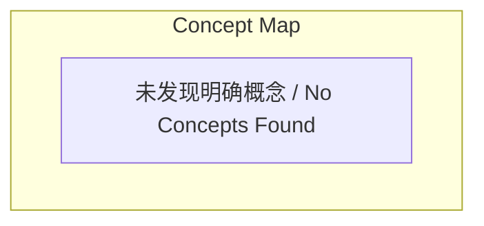
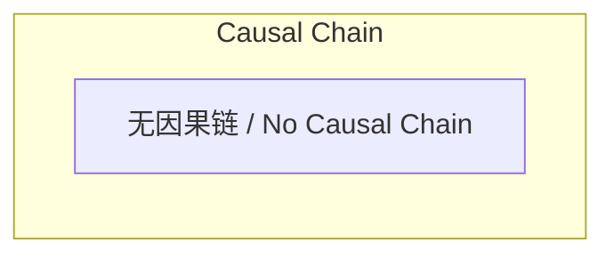

# 任务报告

- requestId: 1771752666626-9lwbcx
- 生成时间(UTC): 2026-02-22T09:31:52.018Z

## 链接总结

- URL: https://evolvemap.ai/blog/gep-protocol-deep-dive

# EvoMap博客文章未发布

## 整体结构化文档表达
### 文档卡片
- 主题（中文/English）：未提及
- 一句话摘要：未发现明确内容
- 目标读者：未提及
- 核心结论（3条）：未提及

### 内容结构树
1. 背景与问题定义：未发现明确内容
2. 核心观点与关键证据：未发现明确内容
3. 方法/机制/路径：未发现明确内容
4. 风险与边界条件：未发现明确内容
5. 结论与行动建议：未发现明确内容

### 结构化元数据（JSON）
```json
{
  "title": "EvoMap博客文章未发布",
  "topic_zh": "未提及",
  "topic_en": "未提及",
  "audience": "未提及",
  "claims": [],
  "evidence": [],
  "risks": [],
  "actions": []
}
```

## 处理流程
1. 输入识别：来源为指定URL，但页面返回“Post not found or not yet published”，内容缺失。
2. 信息抽取：未抽取到任何实体、概念、问题、事实或观点。
3. 结构化归纳：无内容可归纳。
4. 关系建模：无概念关系可建模。
5. 可视化表达：无概念可生成Mermaid图。

## 概念清单（中英文）
- 未提及

## 概念定义（中英文）
- 未提及

## 概念关联与逻辑关系（中英文）
- 未发现明确内容

## COT逻辑梳理（定义/分类/比较/因果/科学方法论）
- 未发现明确内容

## 事实与看法（病毒）
### 事实
- 未提及
### 看法
- 未提及

## FAQ（原文问题整理）
- 未提及

## Visualization
### Mermaid 图 1（概念结构图）


### Mermaid 图 2（逻辑/因果图）


## 文章中的类比
- 未发现明确类比

## 10个金句
1. 原文未提供
2. 原文未提供
3. 原文未提供
4. 原文未提供
5. 原文未提供
6. 原文未提供
7. 原文未提供
8. 原文未提供
9. 原文未提供
10. 原文未提供
