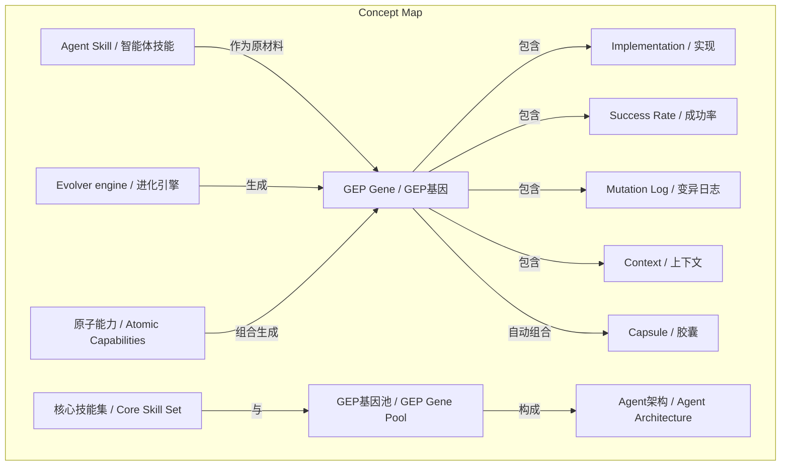
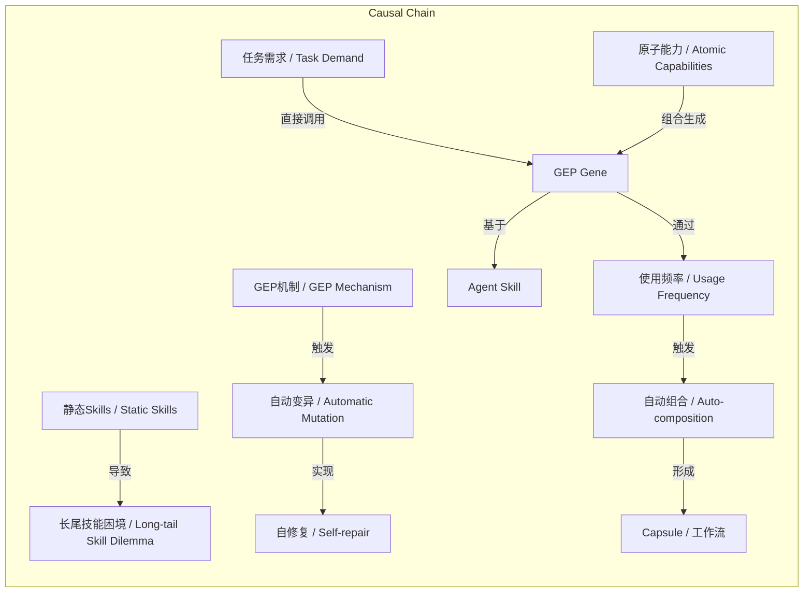

# 任务报告

- requestId: 1771752758010-gkb2s9
- 生成时间(UTC): 2026-02-22T09:35:55.847Z

## 链接总结

- URL: https://evolvemap.ai/blog/agent-skill-vs-gep-gene

# Agent技能与GEP基因：工具与进化的根本区别

## 整体结构化文档表达
- **主题（中文/English）**：智能体技能与GEP基因 / Agent Skill vs GEP Gene
- **一句话摘要**：本文通过定义、维度对比和进化路径，阐明开发者预构建的静态Agent Skills与AI生成的动态GEP Genes之间的根本差异，并指出GEP代表的进化范式是解决长尾技能问题、实现Agent自主能力生长的未来方向。
- **目标读者**：AI工程师、Agent开发者、技术决策者
- **核心结论（3条）**：
  1. Agent Skill本质是静态代码函数，GEP Gene本质是动态数据结构（代码+元数据+历史）。
  2. GEP支持自动变异修复和组合进化，Skills完全依赖人工部署与更新。
  3. GEP通过长尾场景自学习解决复杂问题，Skills仅覆盖预定义功能。

### 文档卡片
- **主题（中文/English）**：智能体技能与GEP基因 / Agent Skill vs GEP Gene
- **一句话摘要**：本文通过定义、维度对比和进化路径，阐明开发者预构建的静态Agent Skills与AI生成的动态GEP Genes之间的根本差异，并指出GEP代表的进化范式是解决长尾技能问题、实现Agent自主能力生长的未来方向。
- **目标读者**：AI工程师、Agent开发者、技术决策者
- **核心结论（3条）**：
  1. Agent Skill本质是静态代码函数，GEP Gene本质是动态数据结构（代码+元数据+历史）。
  2. GEP支持自动变异修复和组合进化，Skills完全依赖人工部署与更新。
  3. GEP通过长尾场景自学习解决复杂问题，Skills仅覆盖预定义功能。

### 内容结构树
1. **背景与问题定义**：当前Agent生态以Skills为主，开发者无法枚举所有技能，导致长尾场景失效。
2. **核心观点与关键证据**：从定义、10维度对比表、三级进化路径三方面论证Skill与Gene的根本差异。
3. **方法/机制/路径**：GEP的自动生成、变异、修剪、组合机制；基于原子能力（Shell/Python/HTTP）的动态组合。
4. **风险与边界条件**：Skills静态性导致长尾问题；GEP依赖Evolver质量，可能产生不稳定基因。
5. **结论与行动建议**：GEP是Skills的进化方向，非直接替代；建议构建精简核心Skill集与动态GEP基因池的混合架构。

### 结构化元数据（JSON）
```json
{
  "title": "Agent技能与GEP基因：工具与进化的根本区别",
  "topic_zh": "智能体技能与GEP基因",
  "topic_en": "Agent Skill vs GEP Gene",
  "audience": "AI工程师、Agent开发者、技术决策者",
  "claims": [
    "Agent Skill是静态代码函数，GEP Gene是动态数据结构",
    "GEP通过自动变异和组合实现自我进化，Skills依赖人工",
    "GEP解决长尾技能问题，Skills仅覆盖预定义场景"
  ],
  "evidence": [
    "Skills本质为代码片段，Genes本质为数据结构（Code+Metadata+History）",
    "维度对比表显示生命周期、状态、错误处理等10维度差异",
    "PNG转WebP案例展示GEP自动学习能力",
    "GEP通过组合Shell/Python/HTTP等原子能力在运行时生成新技能",
    "进化路径三级：Skill（工具）→ Gene（专用能力）→ Capsule（工作流）"
  ],
  "risks": [
    "Skills静态性导致无法应对未预定义场景",
    "GEP依赖Evolver引擎质量，可能产生不稳定基因"
  ],
  "actions": [
    "复杂Agent系统优先考虑GEP架构",
    "保留Skills作为基础工具集，供GEP进化使用",
    "构建精简核心Skill集与动态GEP基因池的混合架构"
  ]
}
```

## 处理流程
1. **输入识别**：来源为提供的两段关于Agent Skill与GEP Gene的分段摘要。
2. **信息抽取**：从两段摘要中抽取实体、概念、问题、事实、观点。
3. **结构化归纳**：对抽取内容进行定义、分类、比较、因果归纳。
4. **关系建模**：建立概念间的关联与逻辑关系。
5. **可视化表达**：设计Mermaid图展示概念结构和因果链。

## 概念清单（中英文）
- Agent Skill / 智能体技能
- GEP Gene / GEP基因
- GEP Protocol / GEP协议
- Evolver engine / 进化引擎
- Capsule / 胶囊（工作流）
- Semantic Kernel / Semantic Kernel
- LangChain / LangChain
- OpenAI GPTs Actions / OpenAI GPTs操作
- @tool decorator / @tool装饰器
- JSON Schema / JSON模式
- Mutation / 变异
- Pruning / 修剪
- Context / 上下文
- Success Rate / 成功率
- Mutation Log / 变异日志
- shell_exec / shell_exec
- gene_grep_search / gene_grep_search
- capsule_refactor_code / capsule_refactor_code
- long-tail skill dilemma / 长尾技能困境
- ffmpeg / ffmpeg
- Shell / Shell
- Python / Python
- HTTP / HTTP
- 员工手册 / Employee Handbook
- 工作经验 / Work Experience
- 核心技能集 / Core Skill Set
- GEP基因池 / GEP Gene Pool
- 大脑皮层 / Cerebral Cortex
- AI工程 / AI Engineering
- 里程碑 / Milestone
- 原子能力 / Atomic Capabilities

## 概念定义（中英文）
- **Agent Skill**：开发者通过`@tool`装饰器或JSON Schema封装的静态API，本质为代码函数（Function），部署后状态不变。
- **GEP Gene**：由Evolver引擎生成的动态能力单元，本质为数据结构（Code + Metadata + History），包含实现、成功率、变异日志和上下文。
- **Evolver engine**：负责自动生成、变异和优化Genes的AI引擎。
- **Capsule**：多个Genes基于使用频率自动组合形成的工作流。
- **Mutation**：Genes在错误触发下的自修复参数调整过程。
- **Pruning**：Genes因长期未使用而自动退役的机制。
- **long-tail skill dilemma**：开发者无法预定义所有技能，导致Agent在长尾场景失效的问题。
- **GEP Protocol**：未发现明确内容
- **Semantic Kernel**：未发现明确内容
- **LangChain**：未发现明确内容
- **OpenAI GPTs Actions**：未发现明确内容
- **@tool decorator**：未发现明确内容
- **JSON Schema**：未发现明确内容
- **shell_exec**：未发现明确内容
- **gene_grep_search**：未发现明确内容
- **capsule_refactor_code**：未发现明确内容
- **ffmpeg**：未发现明确内容
- **Shell**：原子能力之一，指命令行执行环境。
- **Python**：原子能力之一，指Python脚本执行能力。
- **HTTP**：原子能力之一，指网络请求能力。
- **员工手册**：比喻Agent Skill，表示僵化、确定、需外部管理的特性。
- **工作经验**：比喻GEP，表示灵活、成长、自我改进的特性。
- **核心技能集**：精简的基础技能集合，作为智能体的基本操作单元（手脚）。
- **GEP基因池**：庞大、实时演化的基因库，作为智能体的高级认知单元（大脑皮层）。
- **大脑皮层**：比喻GEP基因池，负责高级认知和进化功能。
- **AI工程**：人工智能系统的设计与开发领域。
- **里程碑**：标志重大进展的关键节点。
- **原子能力**：基础能力单元（如Shell、Python、HTTP），可被GEP动态组合生成新技能。

## 概念关联与逻辑关系（中英文）
1. **Agent Skill + 人工维护 → 静态能力**  
   `Skill = Function`（代码片段，无历史记录）
2. **GEP Gene + 自动变异 → 动态进化**  
   `Gene = Code + Metadata + History`（含成功率、变异日志）
3. **多个GEP Gene + 使用频率 → 自动组合成Capsule**  
   `Capsule = f(Gene₁, Gene₂, ..., UsageFrequency)`（高频组合自动固化）
4. **GEP Gene + 原子能力 → 新技能生成**  
   `New_Skill = f(GEP_Gene, Atomic_Capabilities)`（运行时组合）
5. **任务需求 → 直接调用GEP Gene**  
   `Task → Direct_Invoke(GEP_Gene)`（无需试错）

## COT逻辑梳理（定义/分类/比较/因果/科学方法论）
- **Step 1 定义**：明确Agent Skill为“语义封装的API”（静态代码函数），GEP Gene为“验证的能力单元”（动态数据结构）。
- **Step 2 分类**：按创作者（人 vs AI）、状态（静态 vs 动态）、生命周期（手动 vs 自动）分类；或按能力生成方式分技能-based和进化-based。
- **Step 3 比较**：通过10维度表格和类比（员工手册 vs 工作经验）系统对比本质、错误处理、组合方式等。
- **Step 4 因果**：Skills静态性导致长尾技能困境；GEP动态性通过自动变异和原子能力组合解决长尾问题，推动从技能-based到进化-based的范式转变。
- **Step 5 科学方法论**：采用生物进化范式（变异-选择-遗传）和类比推理，实现能力的可持续优化。

## 事实与看法（病毒）
### 事实
- Agent Skills是“semantically wrapped API”，本质为代码片段。
- Skills由人类开发者创建，状态静态，错误会重复。
- GEP Genes是“verified capability unit”，包含Implementation、Success Rate、Mutation Log、Context。
- Genes由Evolver引擎创建，状态动态，错误触发Mutation，长期未使用触发Pruning。
- 维度对比表列出的所有特征（如Composition、Discoverability等）。
- 进化路径三级：Skill（工具）→ Gene（专用能力）→ Capsule（工作流）。
- PNG转WebP案例：Agent通过shell_exec调用ffmpeg失败后，Evolver修复参数并生成新Gene。
- GEP解决了开发者无法枚举所有技能的问题。
- 当新任务出现时，Agent直接调用GEP Gene，无需试错。
- GEP允许Agent通过组合Shell、Python、HTTP等原子能力在运行时生成新技能。
- 未来高级Agent将拥有精简的核心技能集和庞大、实时演化的GEP基因池。
- 文章使用“员工手册”比喻Agent Skill，“工作经验”比喻GEP。

### 看法
- “Skills是原始锤子，GEP是肌肉记忆”（类比）。
- “Skills是员工手册，Genes是工作经历”（类比）。
- GEP是Skills的“进化而非替代”。
- GEP将Skills“降级为进化原材料”。
- Agent Skill是僵化的、确定性的，依赖管理更新。
- GEP是灵活的、成长的、自我改进的。
- 从基于技能到基于进化是AI工程的下一里程碑。
- 未来Agent不会是有1000个技能的庞然大物。

## FAQ（原文问题整理）
- **Q**: Agent Skills与GEP Gene有何根本区别？  
  **A**: 本质不同（代码函数 vs 数据结构）、创作者不同（人 vs AI）、状态不同（静态 vs 动态）。
- **Q**: GEP是否替代Agent Skills？  
  **A**: 否，GEP将Skills作为原始材料，是演进关系。
- **Q**: GEP如何解决长尾技能问题？  
  **A**: 通过自动变异从基础工具（如shell_exec）生成新Gene，无需预定义。

## Visualization
### Mermaid 图 1（概念结构图）


### Mermaid 图 2（逻辑/因果图）


## 文章中的类比
- “Skills是原始锤子，GEP是肌肉记忆”
- “Skills是员工手册，Genes是工作经历”
- 核心技能集比作“手脚”
- GEP基因池比作“大脑皮层”

## 10个金句
1. "Agent Skill (or Tool/Plugin) is essentially a 'semantically wrapped API'."
2. "A Gene in GEP is a 'verified capability unit'."
3. "Essence: Code snippet (Function) vs Data structure (Code + Metadata + History)"
4. "State: Static -- unchanged after deployment vs Dynamic -- continuously evolving with usage"
5. "Skills are the original 'hammers,' while GEP is the 'muscle memory' that teaches the Agent how to use hammers -- and even how to improve them."
6. "When building complex Agents, we face a 'long-tail skill dilemma'."
7. "GEP solves the problem of 'developers cannot enumerate all Skills.'"
8. "It allows Agents to 'grow' new Skills at runtime by combining basic atomic capabilities (Shell / Python / HTTP)."
9. "Agent Skill is the 'employee handbook' issued on the first day (rigid, deterministic, depends on management to update)."
10. "From Skill-Based to Evolution-Based -- this is the next milestone in AI engineering."
