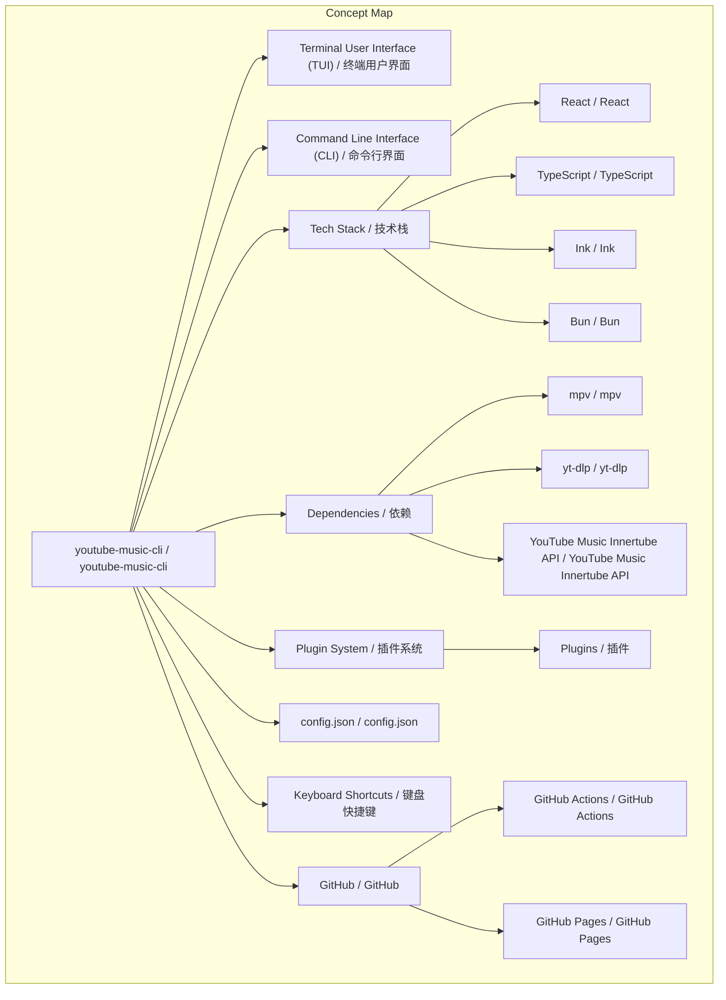
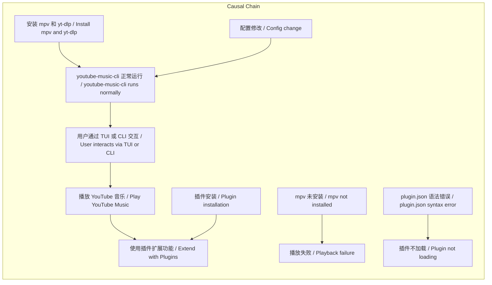

# 任务报告

- requestId: 1771807224871-c8ka07
- 生成时间(UTC): 2026-02-23T00:48:17.484Z

## 链接总结

- URL: https://github.com/involvex/youtube-music-cli

# youtube-music-cli：YouTube音乐终端播放器综合文档

## 整体结构化文档表达
### 文档卡片
- 主题（中文/English）：YouTube音乐终端播放器 / YouTube Music Terminal Player
- 一句话摘要：youtube-music-cli是一个开源的终端用户界面YouTube音乐播放器，采用React、Ink和Bun构建，依赖mpv和yt-dlp进行音频播放，支持插件系统扩展功能，提供CLI命令和TUI交互，包含完整配置和故障排除指南。
- 目标读者：开发者、终端用户、开源贡献者
- 核心结论（3条）：
  1. 项目实现了功能丰富的终端YouTube音乐播放体验，结合TUI和CLI模式，支持搜索、队列、随机播放等核心功能。
  2. 采用分层架构设计，包括状态管理（React Context）、服务层（单例模式）和组件层，并通过插件系统实现可扩展性。
  3. 项目活跃维护，有自动化文档部署（GitHub Pages）、持续集成（GitHub Actions）和社区贡献流程，采用MIT许可证。

### 内容结构树
1. 背景与问题定义：项目旨在解决在终端环境中便捷访问YouTube音乐的需求，提供轻量级、键盘驱动的播放器，避免图形界面开销。
2. 核心观点与关键证据：核心观点是youtube-music-cli是一个强大、可扩展的TUI播放器；关键证据包括：技术栈（React/TypeScript/Ink/Bun）、核心依赖（mpv/yt-dlp/Innertube）、功能特性（搜索、队列、随机播放、主题、插件、无头模式、下载、元数据标记）、开源许可证（MIT）、社区指标（151 stars, 8 forks）、活跃提交记录。
3. 方法/机制/路径：通过Innertube API访问YouTube Music数据和流媒体；使用mpv通过spawn和IPC socket控制音频播放；React+Ink构建终端用户界面；插件系统允许安装第三方插件扩展功能（如广告拦截、歌词显示）；CLI命令支持脚本化操作和自动化。
4. 风险与边界条件：依赖外部工具mpv和yt-dlp必须正确安装并可在PATH中访问；插件需符合规范（plugin.json语法正确）否则不加载；下载格式限于mp3/m4a，目录需有效；可能遇到音频问题（如mpv未找到、音量静音）或TUI渲染问题需故障排除。
5. 结论与行动建议：项目可用且持续开发；用户应安装先决条件、通过包管理器安装工具、编辑config.json自定义设置、使用CLI命令或快捷键操作、按需安装插件；开发者可参考架构文档、开发约定和贡献指南参与开发。

### 结构化元数据（JSON）
```json
{
  "title": "youtube-music-cli：YouTube音乐终端播放器综合文档",
  "topic_zh": "YouTube音乐终端播放器",
  "topic_en": "YouTube Music Terminal Player",
  "audience": "开发者、终端用户、开源贡献者",
  "claims": [
    "youtube-music-cli是一个功能完整的终端YouTube音乐播放器",
    "采用React、Ink、Bun技术栈，依赖mpv和yt-dlp",
    "支持插件系统扩展功能",
    "提供TUI交互和CLI命令两种使用方式",
    "项目采用MIT开源许可证并活跃维护"
  ],
  "evidence": [
    "项目描述：A powerful Terminal User Interface (TUI) music player for YouTube Music",
    "技术栈：Runtime: Bun/Node.js, UI: React+Ink, Language: TypeScript",
    "核心依赖：Audio: mpv (via spawn and IPC socket), Extraction: yt-dlp, API: YouTube Music Innertube API",
    "功能特性：搜索、队列管理、随机播放、重复、主题、插件系统、无头模式、下载、元数据标记",
    "社区数据：151 stars, 8 forks, 最近提交于2026年2月22日",
    "许可证：MIT license",
    "文档：包含架构详解、使用指南、配置与故障排除"
  ],
  "risks": [
    "mpv或yt-dlp未安装或不在PATH中导致播放失败",
    "插件plugin.json语法错误导致插件不加载",
    "下载目录无效导致下载失败",
    "终端渲染问题可能影响显示"
  ],
  "actions": [
    "安装mpv和yt-dlp作为先决条件",
    "通过npm、Bun、Homebrew等方式安装youtube-music-cli",
    "编辑~/.youtube-music-cli/config.json自定义配置",
    "使用CLI命令或TUI快捷键操作播放器",
    "通过插件管理器安装所需插件",
    "开发者可参考架构文档进行贡献"
  ]
}
```

## 处理流程
1. 输入识别：来源为多个GitHub仓库分段摘要，涵盖项目概览、开发动态、架构详解、使用指南、配置与故障排除等。
2. 信息抽取：抽取实体（如mpv、yt-dlp、React、Ink）、概念（TUI、CLI、插件、配置）、问题（无直接问题，但故障排除部分隐含问题）、事实（安装步骤、命令列表、提交记录）、观点（如“强大”、“美观”等主观评价）。
3. 结构化归纳：将内容归纳为背景、核心观点、方法、风险、结论五个维度，并提取关键证据支持核心观点。
4. 关系建模：建立概念间依赖与逻辑关系，如mpv和yt-dlp作为音频后端，React+Ink构建前端，插件系统扩展功能，配置管理用户设置。
5. 可视化表达：使用Mermaid绘制概念结构图展示主要组件关系，以及逻辑因果图展示工作流程和问题因果链。

## 概念清单（中英文）
- youtube-music-cli / youtube-music-cli
- Terminal User Interface (TUI) / 终端用户界面
- Command Line Interface (CLI) / 命令行界面
- React / React
- TypeScript / TypeScript
- Ink / Ink
- Bun / Bun
- mpv / mpv
- yt-dlp / yt-dlp
- YouTube Music / YouTube音乐
- YouTube Music Innertube API / YouTube Music Innertube API
- plugin system / 插件系统
- plugins / 插件
- config.json / config.json
- keyboard shortcuts / 键盘快捷键
- GitHub / GitHub
- GitHub Actions / GitHub Actions
- GitHub Pages / GitHub Pages
- Jekyll / Jekyll
- Homebrew / Homebrew
- Winget / Winget
- Snyk / Snyk
- ava / AVA
- Prettier / Prettier
- State Management / 状态管理
- Service Layer / 服务层
- Components / 组件
- themes / 主题
- shuffle mode / 随机播放模式
- headless mode / 无头模式
- downloads / 下载
- metadata tagging / 元数据标记

## 概念定义（中英文）
- youtube-music-cli / youtube-music-cli: 一个基于终端用户界面的YouTube音乐播放器，支持CLI命令和TUI交互，使用React、Ink和Bun构建，依赖mpv和yt-dlp。（来源：项目描述）
- Terminal User Interface (TUI) / 终端用户界面: 未在原文中提供明确定义，但上下文指在终端中显示的图形化交互界面。
- Command Line Interface (CLI) / 命令行界面: 未在原文中提供明确定义，但上下文指通过命令行参数进行操作的界面形式。
- React / React: 未在原文中提供明确定义，仅提及用于构建TUI。
- TypeScript / TypeScript: 未在原文中提供明确定义，仅提及为编程语言。
- Ink / Ink: 未在原文中提供明确定义，仅提及与React结合使用构建TUI。
- Bun / Bun: 未在原文中提供明确定义，仅提及为运行时环境。
- mpv / mpv: 未在原文中提供明确定义，但提及为音频播放器，通过spawn和IPC socket控制。
- yt-dlp / yt-dlp: 未在原文中提供明确定义，但提及为用于提取音频的YouTube下载工具。
- YouTube Music / YouTube音乐: 未在原文中提供明确定义，但指Google的流媒体音乐服务。
- YouTube Music Innertube API / YouTube Music Innertube API: 未在原文中提供明确定义，但提及为用于与YouTube Music交互的API。
- plugin system / 插件系统: 允许扩展应用功能的机制，如广告拦截、歌词显示等。（来源：项目描述）
- plugins / 插件: 用于扩展功能的模块，如adblock、lyrics等。（来源：插件列表）
- config.json / config.json: 存储youtube-music-cli配置的JSON文件，位于~/.youtube-music-cli/config.json。（来源：配置指南）
- keyboard shortcuts / 键盘快捷键: 未在原文中提供明确定义，但上下文指通过键盘按键触发操作的快捷方式。
- GitHub / GitHub: 未在原文中提供明确定义，仅提及为代码托管平台。
- GitHub Actions / GitHub Actions: 未在原文中提供明确定义，但提及为CI/CD服务。
- GitHub Pages / GitHub Pages: 未在原文中提供明确定义，但提及为静态网站托管服务。
- Jekyll / Jekyll: 未在原文中提供明确定义，但提及为静态站点生成器。
- Homebrew / Homebrew: 未在原文中提供明确定义，但提及为macOS包管理器。
- Winget / Winget: 未在原文中提供明确定义，但提及为Windows包管理器。
- Snyk / Snyk: 未在原文中提供明确定义，但提及为安全扫描工具。
- ava / AVA: 未在原文中提供明确定义，但提及为测试框架。
- Prettier / Prettier: 未在原文中提供明确定义，但提及为代码格式化工具。
- State Management / 状态管理: 使用React Context和useReducer实现的健壮自定义存储模式。（来源：架构详解）
- Service Layer / 服务层: 提供副作用抽象的层，服务实现为单例类。（来源：架构详解）
- Components / 组件: 按功能组织的UI组件，包括layouts、player、search、common等。（来源：架构详解）
- themes / 主题: 界面颜色主题，如dark、light等。（来源：使用指南）
- shuffle mode / 随机播放模式: 随机选择下一首曲目播放的功能。（来源：开发进展）
- headless mode / 无头模式: 不启动TUI，仅通过CLI运行的模式。（来源：使用指南）
- downloads / 下载: 将曲目保存到本地的功能，支持mp3/m4a格式。（来源：使用指南）
- metadata tagging / 元数据标记: 自动为下载文件添加标题、艺术家等标签。（来源：配置指南）

## 概念关联与逻辑关系（中英文）
1. React / React 与 Ink / Ink 共同实现 Terminal User Interface (TUI) / 终端用户界面。
   形式化：React ∧ Ink → TUI
2. mpv / mpv 与 yt-dlp / yt-dlp 共同支持 youtube-music-cli / youtube-music-cli 的音频播放功能。
   形式化：mpv ∧ yt-dlp → AudioPlayback(youtube-music-cli)
3. plugin system / 插件系统 通过 plugins / 插件 扩展 youtube-music-cli / youtube-music-cli 的功能。
   形式化：PluginSystem ∧ Plugin → FeatureExtension(youtube-music-cli)
4. config.json / config.json 包含用户设置，影响 youtube-music-cli / youtube-music-cli 的行为。
   形式化：Config → Behavior(youtube-music-cli)
5. GitHub Actions / GitHub Actions 自动化部署文档到 GitHub Pages / GitHub Pages。
   形式化：GitHubActions → AutomatedDeployment(GitHubPages)

## COT逻辑梳理（定义/分类/比较/因果/科学方法论）
- Step 1 (定义): 定义youtube-music-cli为一个终端YouTube音乐播放器，核心功能包括TUI交互、CLI命令、插件扩展，依赖mpv和yt-dlp。
- Step 2 (分类): 将项目元素分类：技术栈（React/TypeScript/Ink/Bun）、依赖（mpv/yt-dlp/Innertube）、功能（播放控制、搜索、队列、主题、插件、下载）、配置（config.json）、开发工具（GitHub Actions/Prettier/ava）。
- Step 3 (比较): 比较TUI与CLI模式：TUI提供交互式体验，CLI适合脚本化；比较流媒体质量选项：low(64kbps)、medium(128kbps)、high(256kbps+)在带宽和质量间权衡。
- Step 4 (因果): 因用户需要终端音乐播放，故开发youtube-music-cli；因需要音频播放，故集成mpv；因需要获取YouTube数据，故使用Innertube API；因需要扩展功能，故设计插件系统；因mpv未安装，故播放失败。
- Step 5 (科学方法论): 项目采用迭代开发（通过提交记录）、自动化测试（ava）、代码质量工具（Prettier）、持续集成（GitHub Actions），并遵循分层架构和单例模式等软件工程最佳实践。

## 事实与看法（病毒）
### 事实
- 项目名称：youtube-music-cli
- 项目描述：A powerful Terminal User Interface (TUI) music player for YouTube Music
- 技术栈：Runtime: Bun/Node.js, UI: React+Ink, Language: TypeScript
- 核心依赖：Audio: mpv (via spawn and IPC socket), Extraction: yt-dlp, API: YouTube Music Innertube API
- 功能特性：搜索、队列管理、随机播放、重复、主题、插件系统、无头模式、下载、元数据标记
- 许可证：MIT license
- 社区数据：151 stars, 8 forks
- 最近提交：chore(homebrew): update formula for v0.0.38 on Feb 22, 2026
- 项目网站：involvex.github.io/youtube-music-cli/
- GitHub仓库：github.com/involvex/youtube-music-cli
- 仓库状态：Public
- 先决条件：mpv和yt-dlp
- 配置文件：~/.youtube-music-cli/config.json
- 下载格式：mp3或m4a
- 插件管理命令：youtube-music-cli plugins install/enable/disable/update/remove
- 开发约定：纯ESM模块、函数组件、服务单例模式
- 测试框架：ava
- 代码格式化：Prettier
- 文档自动化：GitHub Pages + Jekyll
- CI/CD：GitHub Actions集成Snyk安全扫描
### 看法
- "A powerful Terminal User Interface (TUI) music player for YouTube Music"（“强大的终端用户界面YouTube音乐播放器”）
- "Beautiful TUI"（“美观的终端界面”）
- "high-performance, feature-rich"（“高性能、功能丰富”）
- "Contributions are welcome!"（“欢迎贡献！”）
- "Made with ❤️ for music lovers"（“为音乐爱好者用心制作”）

## FAQ（原文问题整理）
- 问：mpv未找到怎么办？  
  答：确保mpv已安装并在PATH中，启动时CLI会检查并提示安装。
- 问：无音频怎么办？  
  答：1. 检查音量未静音（按=增加）；2. 验证yt-dlp工作（`yt-dlp --version`）；3. 尝试其他曲目。
- 问：TUI渲染问题怎么办？  
  答：调整终端窗口大小或重启应用。
- 问：插件未加载怎么办？  
  答：1. 检查plugin.json语法有效；2. 验证插件已启用（`youtube-music-cli plugins list`）；3. 查看日志错误。
- 问：如何自定义配置？  
  答：编辑~/.youtube-music-cli/config.json文件，修改主题、音量、流媒体质量等设置。
- 问：如何安装插件？  
  答：使用`youtube-music-cli plugins install <plugin-name>`命令安装所需插件。

## Visualization
### Mermaid 图 1（概念结构图）


### Mermaid 图 2（逻辑/因果图）


## 文章中的类比
未发现明确类比。

## 10个金句
1. "A powerful Terminal User Interface (TUI) music player for YouTube Music"
2. "Beautiful TUI - Rich terminal interface built with React and Ink"
3. "feat: implement shuffle mode with Shift+S hotkey"
4. "docs: add GitHub Pages deployment, Jekyll config, and full README"
5. "build(deps): add @types/node and bump CI versions"
6. "Features: Search, Queue Management, Shuffle & Repeat, Volume Control, Smart Suggestions, Themes, Plugin System, Keyboard-Driven, Headless Mode, Downloads, Metadata Tagging"
7. "Roadmap: crossfade + gapless playback"
8. "Prerequisites: Required: mpv"
9. "Plugin System: Extend functionality with plugins"
10. "Contributions are welcome!"
