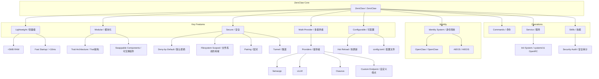
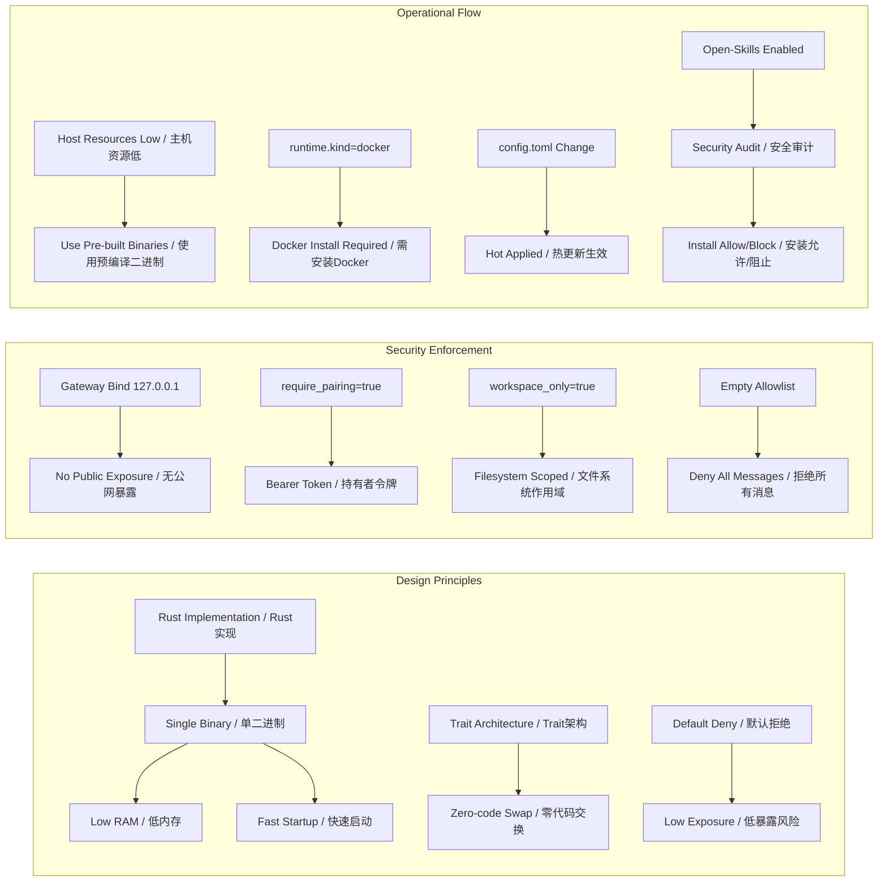

# 任务报告

- requestId: 1771808496571-d3x6x2
- 生成时间(UTC): 2026-02-23T01:10:59.908Z

## 链接总结

- URL: https://github.com/zeroclaw-labs/zeroclaw

# ZeroClaw：轻量级自主AI助手基础设施

## 整体结构化文档表达
### 文档卡片
- **主题（中文/English）**：自主AI代理基础设施 / Autonomous AI Agent Infrastructure  
- **一句话摘要**：ZeroClaw是一个用Rust编写的轻量级、无开销的自主AI助手运行时系统，支持在低成本硬件上部署，抽象模型、工具、内存和执行以实现跨平台运行，提供多层安全机制、模块化trait架构、多提供者支持及热更新配置能力。  
- **目标读者**：AI开发者、系统管理员、技术决策者  
- **核心结论（3条）**：
  1. 极轻量级设计：内存占用小于5MB，资源效率显著高于比较对象（如OpenClaw、Mac mini）。
  2. 模块化与可配置性：采用trait-based架构，支持通过配置无代码交换子系统，提供热更新能力。
  3. 多层安全机制：默认拒绝模型，enforced at every layer，包括网络绑定、配对认证、文件系统作用域、通道白名单。

### 内容结构树
1. **背景与问题定义**：现有AI助手常面临高资源消耗、部署复杂、安全风险等问题，ZeroClaw旨在提供轻量、安全、易部署的解决方案。
2. **核心观点与关键证据**：核心观点是ZeroClaw是高效、安全、模块化的自主AI基础设施；关键证据包括内存<5MB、比OpenClaw少99%内存、比Mac mini便宜98%；trait架构实现零代码更改；默认拒绝安全模型；支持多种本地提供者（llamacpp、vLLM、Osaurus）和自定义端点。
3. **方法/机制/路径**：Rust实现单二进制确保轻量；配置文件（config.toml）驱动所有设置，支持热更新；trait抽象允许交换模型、工具、内存、执行等组件；服务管理适配systemd/OpenRC；安全enforced via网络绑定、配对、文件系统作用域、通道白名单。
4. **风险与边界条件**：仿冒网站风险（需仅信任官方仓库）；配置错误可能导致暴露（如allow_public_bind=true且无隧道）；编译源码需要较高资源（最低2GB RAM+6GB磁盘，推荐4GB+和10GB+）；Open-Skills需显式启用并通过安全审计；平台特定依赖（如Windows需Visual Studio Build Tools）；WASM运行时未实现。
5. **结论与行动建议**：结论是ZeroClaw提供全面的轻量级AI代理解决方案；行动建议包括：查阅官方文档（docs/目录）；使用官方仓库和verified社交媒体；配置deny-by-default白名单；根据主机资源选择安装方式（低资源用预编译二进制）；运行zeroclaw doctor诊断；对于公网访问配置隧道；对工具调用不稳定的模型使用zeroclaw-tools；根据跨平台需求选择AIEOS身份格式。

### 结构化元数据（JSON）
```json
{
  "title": "ZeroClaw：轻量级自主AI助手基础设施",
  "topic_zh": "自主AI代理基础设施",
  "topic_en": "Autonomous AI Agent Infrastructure",
  "audience": "AI开发者、系统管理员、技术决策者",
  "claims": [
    "轻量级设计（内存<5MB）",
    "模块化trait架构支持零代码配置交换",
    "多层安全机制（默认拒绝、白名单、文件系统作用域）",
    "支持多种本地和云端LLM提供者",
    "配置热更新能力",
    "提供完整CLI和服务管理"
  ],
  "evidence": [
    "基准测试：RAM<5MB，启动<10ms，二进制大小8.8MB",
    "比OpenClaw少99%内存，比Mac mini便宜98%",
    "子系统为trait，可通过配置交换实现",
    "安全：网关默认绑定127.0.0.1，require_pairing=true，workspace_only=true，通道allowlist deny-by-default",
    "提供者：支持llamacpp、vLLM、Osaurus及自定义OpenAI/Anthropic兼容端点",
    "热更新：default_provider、api_key等参数在下次入站消息时生效"
  ],
  "risks": [
    "仿冒网站（openagen/zeroclaw等）可能导致信任错误信息或binaries",
    "配置allow_public_bind=true且无隧道会导致公网暴露",
    "allowed_numbers或allowed_users设置不当可能允许未授权访问",
    "编译源码需要至少2GB RAM+6GB磁盘，低资源主机可能失败",
    "Open-Skills安装受安全审计限制，可能阻止某些技能",
    "平台特定依赖（如Windows Build Tools、Docker）增加部署复杂度"
  ],
  "actions": [
    "仅使用官方GitHub仓库（zeroclaw-labs/zeroclaw）和verified社交媒体",
    "运行zeroclaw doctor进行系统诊断，zeroclaw status检查状态",
    "配置通道白名单：精确匹配用户身份（Telegram chat ID、WhatsApp号码等），避免使用\"*\"",
    "公网访问时配置隧道（Tailscale/Cloudflare/ngrok）而非直接allow_public_bind",
    "低资源主机使用预编译二进制或bootstrap.sh --prefer-prebuilt",
    "对工具调用不稳定的模型使用zeroclaw-tools的create_agent封装",
    "跨平台身份移植考虑使用AIEOS格式（[identity] format='aieos'）",
    "启用Open-Skills前评估风险，使用zeroclaw skills audit验证"
  ]
}

## 处理流程
1. 输入识别（来源：网页正文 (https://github.com/zeroclaw-labs/zeroclaw) 的多个文档页面，包括README、安全公告、安装指南、配置参考等）
2. 信息抽取（实体、概念、问题、事实、观点）
3. 结构化归纳（定义/分类/比较/因果/方法论）
4. 关系建模（概念关系、等式/方程/逻辑链）
5. 可视化表达（Mermaid）

## 概念清单（中英文）
- ZeroClaw / ZeroClaw
- AI助手基础设施 / AI Assistant Infrastructure
- 运行时操作系统 / Runtime Operating System
- 代理工作流 / Agentic Workflows
- 模型抽象 / Model Abstraction
- 工具抽象 / Tool Abstraction
- 内存抽象 / Memory Abstraction
- 执行抽象 / Execution Abstraction
- Rust编程语言 / Rust Programming Language
- 硬件 / Hardware
- 内存占用 / Memory Footprint
- 开源许可 / Open Source License
- 社区开发 / Community Development
- Lean Runtime / Lean Runtime
- Cost-Efficient Deployment / Cost-Efficient Deployment
- Fast Cold Starts / Fast Cold Starts
- Portable Architecture / Portable Architecture
- OAuth / OAuth
- Anthropic / Anthropic
- Authentication and Credential Use / Authentication and Credential Use
- benchmark / benchmark
- OpenClaw / OpenClaw
- NanoBot / NanoBot
- PicoClaw / PicoClaw
- RAM / RAM
- Startup time / Startup time
- Binary size / Binary size
- Cost / Cost
- Visual Studio Build Tools / Visual Studio Build Tools
- Rust toolchain / Rust toolchain
- Docker Desktop / Docker Desktop
- 仿冒网站 / impersonation attempts
- 官方仓库 / official repository
- 可交换组件 / swappable components
- Docker沙箱运行时 / Docker sandboxed runtime
- 构建基础工具 / build essentials
- pkg-config / pkg-config
- Xcode命令行工具 / Xcode Command Line Tools
- rustup.rs / rustup.rs
- 一键安装脚本 / one-line installer (install.sh)
- 编译资源要求 / compilation resource requirements
- 预编译二进制 / pre-built binaries
- bootstrap脚本 / bootstrap.sh
- Homebrew / Homebrew
- cargo / cargo
- zeroclaw命令 / zeroclaw command
- agent / agent
- gateway / gateway
- daemon / daemon
- 频道 / channels
- Podman / Podman
- Docker兼容模式 / Docker-compatible mode
- codegen-units / codegen-units
- release-fast配置文件 / release-fast profile
- 订阅 / subscription
- 订阅认证 / Subscription Auth
- Trait / Trait
- 运行时 / Runtime
- 内存系统 / Memory System
- 向量数据库 / Vector DB
- 关键词搜索 / Keyword Search
- 混合检索 / Hybrid Search
- 加密 / Encryption
- 配置文件 / Configuration Profile
- 环境变量 / Environment Variable
- 原子操作 / Atomic Operation
- Gateway / 网关
- Security Layer / 安全层
- Sandbox / 沙箱
- Pairing / 配对
- Bearer Token / 持有者令牌
- Filesystem Scoped / 文件系统作用域
- Workspace / 工作区
- Null Byte Injection / 空字节注入
- Symlink Escape / 符号链接逃逸
- Tunnel / 隧道
- Channel Allowlist / 通道白名单
- Deny-by-Default / 默认拒绝
- Inbound Sender Policy / 入站发送者策略
- Chat ID / 聊天ID
- Media Reply Marker / 媒体回复标记
- WhatsApp Web Mode / WhatsApp网页模式
- WhatsApp Business Cloud API / WhatsApp商业云API
- Meta Business App / Meta商业应用
- Access Token / 访问令牌
- Phone Number ID / 电话号码ID
- Verify Token / 验证令牌
- Webhook / 网络钩子
- E.164 Format / E.164格式
- config.toml / 配置文件
- default_provider / 默认提供商
- openrouter / OpenRouter
- anthropic/claude-sonnet-4-6 / Anthropic Claude Sonnet 4.6
- default_temperature / 默认温度
- api_key / API密钥
- api_url / API URL
- reliability.* / 可靠性参数
- memory / 内存
- backend / 后端
- sqlite / SQLite
- lucid / Lucid
- postgres / PostgreSQL
- markdown / Markdown
- none / 无
- auto_save / 自动保存
- embedding_provider / 嵌入提供商
- vector_weight / 向量权重
- keyword_weight / 关键词权重
- storage.provider.config / 存储提供商配置
- provider / 提供商
- db_url / 数据库URL
- schema / 模式
- table / 表
- connect_timeout_secs / 连接超时秒数
- gateway / 网关
- port / 端口
- host / 主机
- require_pairing / 需要配对
- allow_public_bind / 允许公共绑定
- autonomy / 自主性
- level / 级别
- supervised / 监督
- readonly / 只读
- full / 完整
- workspace_only / 仅工作区
- allowed_commands / 允许的命令
- forbidden_paths / 禁止的路径
- allowed_roots / 允许的根
- runtime / 运行时
- kind / 类型
- native / 原生
- docker / Docker
- image / 镜像
- network / 网络
- memory_limit_mb / 内存限制MB
- cpu_limit / CPU限制
- read_only_rootfs / 只读根文件系统
- mount_workspace / 挂载工作区
- allowed_workspace_roots / 允许的工作区根
- heartbeat / 心跳
- enabled / 启用
- interval_minutes / 间隔分钟
- tunnel / 隧道
- cloudflare / Cloudflare
- tailscale / Tailscale
- ngrok / ngrok
- custom / 自定义
- secrets / 密钥
- encrypt / 加密
- browser / 浏览器
- allowed_domains / 允许的域名
- agent_browser / 代理浏览器
- rust_native / Rust原生
- computer_use / 计算机使用
- auto / 自动
- native_headless / 原生无头
- native_webdriver_url / 原生WebDriver URL
- native_chrome_path / 原生Chrome路径
- browser.computer_use.endpoint / 浏览器计算机使用端点
- timeout_ms / 超时毫秒
- allow_remote_endpoint / 允许远程端点
- window_allowlist / 窗口允许列表
- hints / 提示
- max_coordinate_x / 最大坐标X
- max_coordinate_y / 最大坐标Y
- composio / Composio
- entity_id / 实体ID
- identity / 身份
- format / 格式
- openclaw / OpenClaw
- aieos / AIEOS
- aieos_path / AIEOS路径
- aieos_inline / AIEOS内联
- Ollama / Ollama
- local / 本地
- remote / 远程
- endpoint / 端点
- OLLAMA_API_KEY / OLLAMA_API_KEY
- :cloud suffix / :cloud后缀
- llama.cpp / llama.cpp
- llama-server / llama-server
- provider ID / 提供商标识符
- default endpoint / 默认端点
- example setup / 示例设置
- webhook / Webhook
- Meta / Meta
- WhatsApp / WhatsApp
- commands / Commands
- onboard / Onboard
- agent / Agent
- gateway / Gateway
- daemon / Daemon
- service / Service
- systemd / Systemd
- OpenRC / OpenRC
- config.toml / Config.toml
- Open-Skills / Open-Skills
- security audit / Security Audit
- cargo / Cargo
- git hook / Git Hook
- docs / Docs
- providers / Providers
- channels / Channels
- skills / Skills

## 概念定义（中英文）
- ZeroClaw / ZeroClaw: 一个用Rust编写的轻量级、无开销的自主AI助手运行时系统，支持在低成本硬件上部署，抽象模型、工具、内存和执行以实现跨平台运行。
- AI助手基础设施 / AI Assistant Infrastructure: 未提及明确内容。
- 运行时操作系统 / Runtime Operating System: 未提及明确内容。
- 代理工作流 / Agentic Workflows: 未提及明确内容。
- 模型抽象 / Model Abstraction: 未提及明确内容。
- 工具抽象 / Tool Abstraction: 未提及明确内容。
- 内存抽象 / Memory Abstraction: 未提及明确内容。
- 执行抽象 / Execution Abstraction: 未提及明确内容。
- Rust编程语言 / Rust Programming Language: 未提及明确内容（仅提及使用Rust）。
- 硬件 / Hardware: 未提及明确内容（仅提及$10硬件）。
- 内存占用 / Memory Footprint: 未提及明确内容（仅提及<5MB RAM）。
- 开源许可 / Open Source License: 未提及明确内容（仅提及MIT OR Apache-2.0）。
- 社区开发 / Community Development: 未提及明确内容（仅提及由学生和社区成员开发）。
- Lean Runtime / Lean Runtime: 指运行时在发布版本中仅占用几兆字节内存的优化设计。
- Cost-Efficient Deployment / Cost-Efficient Deployment: 部署成本低，适用于廉价硬件和小型云实例。
- Fast Cold Starts / Fast Cold Starts: 单二进制Rust运行时实现近即时的命令和守护进程启动。
- Portable Architecture / Portable Architecture: 二进制优先的工作流，跨ARM、x86、RISC-V架构，支持可交换提供者/通道/工具。
- OAuth / OAuth: 一种认证协议，本文特指Claude服务的OAuth令牌。
- Anthropic / Anthropic: AI公司，制定Authentication and Credential Use条款。
- Authentication and Credential Use / Authentication and Credential Use: Anthropic关于认证和凭据使用的条款。
- benchmark / benchmark: 性能基准测试，比较不同项目的资源使用。
- OpenClaw / OpenClaw: 对比项目，使用TypeScript，资源占用高。
- NanoBot / NanoBot: 对比项目，使用Python，资源占用中等。
- PicoClaw / PicoClaw: 对比项目，使用Go，资源占用低。
- RAM / RAM: 随机存取存储器，运行时内存占用指标。
- Startup time / Startup time: 启动时间，从执行到就绪的时间。
- Binary size / Binary size: 二进制文件大小。
- Cost / Cost: 部署成本，硬件或云实例费用。
- Visual Studio Build Tools / Visual Studio Build Tools: Windows构建工具，提供MSVC链接器和Windows SDK。
- Rust toolchain / Rust toolchain: Rust工具链，包括rustc和cargo。
- Docker Desktop / Docker Desktop: Docker官方桌面应用，集成Docker引擎和CLI，用于Windows/macOS。
- 仿冒网站 / impersonation attempts: 冒充官方项目或网站的恶意行为。
- 官方仓库 / official repository: https://github.com/zeroclaw-labs/zeroclaw
- 可交换组件 / swappable components: 核心系统作为trait，允许替换提供者、通道、工具等。
- Docker沙箱运行时 / Docker sandboxed runtime: 通过Docker容器提供隔离执行环境，需安装Docker引擎。
- 构建基础工具 / build essentials: 系统编译所需的基础工具包，如gcc、make、libc开发文件（Linux）；Xcode CLI Tools提供clang等（macOS）。
- pkg-config / pkg-config: 辅助编译时查找库路径和版本信息的工具。
- Xcode命令行工具 / Xcode Command Line Tools: macOS上提供编译器（clang）、make等开发工具的轻量级包。
- rustup.rs / rustup.rs: Rust工具链安装和管理器的官方网站及脚本源。
- 一键安装脚本 / one-line installer: `install.sh`脚本，自动安装系统依赖、Rust和ZeroClaw。
- 编译资源要求 / compilation resource requirements: 本地编译ZeroClaw源码所需的最小和推荐内存（RAM+swap）及磁盘空间。
- 预编译二进制 / pre-built binaries: 针对不同平台（Linux、macOS、Windows）和架构预先编译好的可执行文件，无需本地编译。
- bootstrap脚本 / bootstrap.sh: ZeroClaw项目提供的自动化脚本，支持安装依赖、Rust、ZeroClaw，并配置onboarding等。
- Homebrew / Homebrew: macOS/Linux的包管理器，可通过`brew install`安装ZeroClaw。
- cargo / cargo: Rust的构建系统和包管理器，用于编译和管理Rust项目。
- zeroclaw命令 / zeroclaw command: ZeroClaw的命令行接口，包括`onboard`（初始配置）、`agent`（交互式聊天）、`gateway`（启动webhook服务器）、`daemon`（后台服务）等子命令。
- agent / agent: ZeroClaw的交互式代理模式，用于直接与AI模型对话。
- gateway / gateway: ZeroClaw的webhook服务器组件，默认监听127.0.0.1:42617。
- daemon / daemon: ZeroClaw的后台守护进程，管理频道集成和长期运行任务。
- 频道 / channels: ZeroClaw集成的第三方通信平台，需daemon运行并绑定身份到允许列表。
- Podman / Podman: Docker的替代容器引擎，可通过`ZEROCLAW_CONTAINER_CLI=podman`指定。
- Docker兼容模式 / Docker-compatible mode: 通过`--docker`标志使bootstrap脚本在Docker环境中运行。
- codegen-units / codegen-units: Rust编译参数，控制代码生成单元数，值越低编译压力越大但可能优化更彻底；默认`cargo build --release`设为1。
- release-fast配置文件 / release-fast profile: Rust自定义配置文件，用于在强大机器上加速编译（`cargo build --profile release-fast`）。
- 订阅 / subscription: 可能指ZeroClaw的服务订阅或许可证模式，文档末尾提及但不完整。
- 订阅认证 / Subscription Auth: 支持多账户的认证机制，配置文件静态加密存储。
- Trait / Trait: 子系统的抽象接口，允许通过配置更改实现交换而无需修改代码。
- 运行时 / Runtime: 执行agent的环境，当前支持native与docker。
- 内存系统 / Memory System: 全栈搜索引擎，集成向量存储、关键词搜索与混合合并。
- 向量数据库 / Vector DB: 使用SQLite BLOB存储嵌入向量，支持余弦相似度检索。
- 关键词搜索 / Keyword Search: 基于SQLite FTS5虚拟表实现BM25评分检索。
- 混合检索 / Hybrid Search: 自定义加权合并向量与关键词结果（vector_weight + keyword_weight）。
- 加密 / Encryption: 使用.secret_key对auth-profiles.json进行静态加密。
- 配置文件 / Configuration Profile: 定义子系统实现的YAML/TOML配置段（如[memory]）。
- 环境变量 / Environment Variable: 控制Lucid后端行为的变量（如ZEROCLAW_LUCID_CMD）。
- 原子操作 / Atomic Operation: 内存重建时同时更新FTS5与嵌入向量，保证一致性。
- Gateway / 网关: ZeroClaw的核心服务组件，负责接收外部消息并路由给AI代理，是安全策略的执行点。
- Security Layer / 安全层: 指在系统架构的多个层面（网络、认证、文件系统、应用逻辑）都实施安全控制，而非仅依赖单一机制。
- Sandbox / 沙箱: 未提及明确内容。
- Pairing / 配对: ZeroClaw启动时要求用户通过6位一次性代码进行初始认证的过程，用于安全地交换Bearer Token。
- Bearer Token / 持有者令牌: 通过配对获得的API访问凭证，后续所有对/webhook等端点的请求必须在Authorization头中携带此令牌。
- Filesystem Scoped / 文件系统作用域: ZeroClaw的文件操作工具被限制在指定的workspace目录内，通过路径规范化和解析后路径检查，防止访问系统目录或通过符号链接逃逸。
- Workspace / 工作区: ZeroClaw被授权读写的文件系统根目录，所有文件操作应在此树下进行。
- Null Byte Injection / 空字节注入: 一种安全攻击手段，ZeroClaw通过路径规范化防御。
- Symlink Escape / 符号链接逃逸: 一种安全攻击手段，ZeroClaw通过解析后路径检查防御。
- Tunnel / 隧道: 一种将本地服务（如绑定到127.0.0.1的网关）安全暴露到公网的技术（如Tailscale Funnel, Cloudflare Tunnel, ngrok），替代直接公网绑定。
- Channel Allowlist / 通道白名单: 针对每个IM通道（如Telegram, WhatsApp）的入站消息发送者身份列表。列表为空时拒绝所有，为"*"时允许所有，否则仅允许列表中的精确匹配身份。
- Deny-by-Default / 默认拒绝: 一种安全策略，除非显式配置允许，否则默认拒绝所有访问或操作。文中体现为空allowlist拒绝所有消息。
- Inbound Sender Policy / 入站发送者策略: 即通道白名单机制，定义哪些用户/号码/公钥可以成功向ZeroClaw发送消息。
- Chat ID / 聊天ID: Telegram中用于标识聊天的唯一数字ID，用于白名单匹配和回复路由。
- Media Reply Marker / 媒体回复标记: 未提及明确内容。
- WhatsApp Web Mode / WhatsApp网页模式: ZeroClaw通过模拟WhatsApp网页客户端（使用QR码或配对码）与手机WhatsApp应用连接的方式，无需Meta官方API。
- WhatsApp Business Cloud API / WhatsApp商业云API: ZeroClaw通过Meta官方提供的Cloud API（基于Webhook）接收WhatsApp消息的方式，需要创建Meta商业应用并配置Webhook。
- Meta Business App / Meta商业应用: 在Meta开发者平台创建的应用，用于WhatsApp Business Cloud API集成。
- Access Token / 访问令牌: Meta颁发的凭证，用于API认证。
- Phone Number ID / 电话号码ID: Meta分配给WhatsApp商业电话号码的唯一标识。
- Verify Token / 验证令牌: 用于验证Webhook请求来源的令牌。
- Webhook / 网络钩子: 一种API回调机制，Meta在收到新消息时主动向配置的URL（ZeroClaw网关）发送HTTP POST请求。
- E.164 Format / E.164格式: 国际电话号码标准格式，WhatsApp Cloud API要求。
- config.toml / 配置文件: 配置文件路径，位于~/.zeroclaw/config.toml，由onboard命令创建。
- default_provider / 默认提供商: 配置参数，用于指定默认的LLM提供商标识符（如"openrouter"）。
- openrouter / OpenRouter: LLM提供商名称，作为default_provider的取值之一。
- anthropic/claude-sonnet-4-6 / Anthropic Claude Sonnet 4.6: 默认LLM模型标识符，由default_model指定。
- default_temperature / 默认温度: 配置参数，设置生成响应的温度值，默认0.7。
- api_key / API密钥: 配置参数，存储LLM提供商的API密钥。
- api_url / API URL: 配置参数，指定自定义API端点URL。
- reliability.* / 可靠性参数: 可靠性相关参数组，原文未详细说明。
- memory / 内存: 配置节，管理记忆存储设置。
- backend / 后端: 内存后端类型，取值包括sqlite、lucid等。
- sqlite / SQLite: 内存后端选项，使用SQLite数据库。
- lucid / Lucid: 内存后端选项，原文未说明具体实现。
- postgres / PostgreSQL: 内存后端选项，使用PostgreSQL数据库。
- markdown / Markdown: 内存后端选项，使用Markdown文件存储。
- none / 无: 内存后端选项，禁用持久化记忆。
- auto_save / 自动保存: 配置参数，控制记忆自动保存，默认true。
- embedding_provider / 嵌入提供商: 配置参数，指定嵌入模型提供商，取值如"none"、"openai"。
- vector_weight / 向量权重: 配置参数，向量搜索权重，默认0.7。
- keyword_weight / 关键词权重: 配置参数，关键词搜索权重，默认0.3。
- storage.provider.config / 存储提供商配置: 存储提供商配置节，用于远程存储覆盖。
- provider / 提供商: 存储提供商类型，如"postgres"。
- db_url / 数据库URL: 数据库连接URL，用于PostgreSQL存储。
- schema / 模式: PostgreSQL模式名称，默认"public"。
- table / 表: 存储记忆的表名称，默认"memories"。
- connect_timeout_secs / 连接超时秒数: 默认15。
- gateway / 网关: 配置节，管理网关服务器设置。
- port / 端口: 网关监听端口，默认42617。
- host / 主机: 网关绑定主机，默认"127.0.0.1"。
- require_pairing / 需要配对: 配置参数，首次连接是否需要配对码，默认true。
- allow_public_bind / 允许公共绑定: 配置参数，是否允许0.0.0.0绑定（无隧道时拒绝），默认false。
- autonomy / 自主性: 配置节，管理自主性级别。
- level / 级别: 自主性级别，取值"readonly"、"supervised"、"full"，默认"supervised"。
- supervised / 监督: 自主性级别之一，表示监督模式。
- readonly / 只读: 自主性级别之一，表示只读模式。
- full / 完整: 自主性级别之一，表示完全自主模式。
- workspace_only / 仅工作区: 配置参数，是否仅限工作区路径，默认true，拒绝绝对路径输入。
- allowed_commands / 允许的命令: 允许执行的命令列表，如["git", "npm", "cargo", "ls", "cat", "grep"]。
- forbidden_paths / 禁止的路径: 禁止访问的路径列表，如["/etc", "/root", "/proc", "/sys", "~/.ssh", "~/.gnupg", "~/.aws"]。
- allowed_roots / 允许的根: 允许访问的工作区外根目录列表，可选。
- runtime / 运行时: 配置节，管理运行时环境。
- kind / 类型: 运行时类型，取值"native"或"docker"，默认"native"。
- native / 原生: 运行时类型，表示原生执行。
- docker / Docker: 运行时类型，表示容器执行。
- image / 镜像: Docker容器镜像，默认"alpine:3.20"。
- network / 网络: Docker网络模式，默认"none"。
- memory_limit_mb / 内存限制MB: Docker内存限制MB，可选。
- cpu_limit / CPU限制: Docker CPU限制，默认1.0。
- read_only_rootfs / 只读根文件系统: 配置参数，根文件系统是否只读挂载，默认true。
- mount_workspace / 挂载工作区: 配置参数，是否挂载工作区到容器，默认true。
- allowed_workspace_roots / 允许的工作区根: 允许挂载的工作区根目录列表，可选。
- heartbeat / 心跳: 配置节，管理心跳设置。
- enabled / 启用: 心跳是否启用，默认false。
- interval_minutes / 间隔分钟: 心跳间隔分钟数，默认30。
- tunnel / 隧道: 配置节，管理隧道设置。
- cloudflare / Cloudflare: 隧道提供商选项。
- tailscale / Tailscale: 隧道提供商选项。
- ngrok / ngrok: 隧道提供商选项。
- custom / 自定义: 隧道提供商选项，自定义端点。
- secrets / 密钥: 配置节，管理密钥加密。
- encrypt / 加密: 配置参数，是否加密API密钥，默认true。
- browser / 浏览器: 配置节，管理浏览器工具设置。
- allowed_domains / 允许的域名: 允许浏览器访问的域名列表，如["docs.rs"]，启用浏览器时必须设置。
- agent_browser / 代理浏览器: 浏览器后端类型，默认值。
- rust_native / Rust原生: 浏览器后端类型，Rust原生实现。
- computer_use / 计算机使用: 浏览器后端类型，使用外部计算机使用sidecar。
- auto / 自动: 浏览器后端类型，自动选择。
- native_headless / 原生无头: 配置参数，Rust原生后端是否无头运行，默认true。
- native_webdriver_url / 原生WebDriver URL: WebDriver端点URL，默认"http://127.0.0.1:9515"。
- native_chrome_path / 原生Chrome路径: 可选Chrome二进制路径。
- browser.computer_use.endpoint / 浏览器计算机使用端点: 计算机使用sidecar HTTP端点，默认"http://127.0.0.1:8787/v1/actions"。
- timeout_ms / 超时毫秒: 计算机使用动作超时毫秒，默认15000。
- allow_remote_endpoint / 允许远程端点: 是否允许远程端点，默认false（仅本地/私有端点）。
- window_allowlist / 窗口允许列表: 可选窗口标题/进程允许列表。
- hints / 提示: 计算机使用提示配置，原文未详述。
- max_coordinate_x / 最大坐标X: 最大X坐标防护栏，默认3840。
- max_coordinate_y / 最大坐标Y: 最大Y坐标防护栏，默认2160。
- composio / Composio: 配置节，管理Composio集成。
- entity_id / 实体ID: Composio实体ID，默认"default"。
- identity / 身份: 配置节，管理身份设置。
- format / 格式: 身份格式，取值"openclaw"或"aieos"，默认"openclaw"。
- openclaw / OpenClaw: 身份格式，使用Markdown文件。
- aieos / AIEOS: 身份格式，使用JSON文件。
- aieos_path / AIEOS路径: AIEOS JSON文件路径。
- aieos_inline / AIEOS内联: 内联AIEOS JSON字符串。
- Ollama / Ollama: LLM提供商，支持本地和远程部署。
- local / 本地: Ollama部署类型，本地运行。
- remote / 远程: Ollama部署类型，远程端点。
- endpoint / 端点: Ollama API端点，本地默认未设置，远程需设置。
- OLLAMA_API_KEY / OLLAMA_API_KEY: 环境变量或配置的Ollama API密钥。
- :cloud suffix / :cloud后缀: 模型ID后缀，如"qwen3:cloud"被规范化为"qwen3"。
- llama.cpp / llama.cpp: LLM提供商别名，支持llama-server。
- llama-server / llama-server: 本地LLM服务器，提供商ID为"llamacpp"。
- provider ID / 提供商标识符: 如"llamacpp"。
- default endpoint / 默认端点: 如"http://localhost:8080/v1"。
- example setup / 示例设置: 示例配置命令，如"llama-server -hf ..."。
- webhook / Webhook: 未提及明确内容（已列出）。
- Meta / Meta: 未提及明确内容（仅提及Meta平台）。
- WhatsApp / WhatsApp: 未提及明确内容（仅提及WhatsApp集成）。
- commands / Commands: ZeroClaw提供的命令行接口集合，用于执行设置、管理、诊断等操作。
- onboard / Onboard: 初始配置命令，交互式或非交互式设置API密钥、提供商等。
- agent / Agent: 交互式代理命令，用于直接与AI模型对话。
- gateway / Gateway: 启动webhook服务器命令。
- daemon / Daemon: 启动后台守护进程命令。
- service / Service: 以后台进程形式运行的ZeroClaw实例，通过init系统管理生命周期。
- systemd / Systemd: Linux系统默认的init系统，ZeroClaw支持其用户级服务管理。
- OpenRC / OpenRC: Alpine Linux等系统使用的init系统，ZeroClaw支持其系统级服务管理。
- config.toml / Config.toml: 配置文件，位于~/.zeroclaw/config.toml。
- Open-Skills / Open-Skills: 社区贡献的技能集合，需显式启用并经过安全审计后方可安装。
- security audit / Security Audit: ZeroClaw内置的静态检查机制，用于在技能安装前阻止潜在危险内容（如符号链接、shell代码片段）。
- cargo / Cargo: Rust语言的构建工具与包管理器，用于编译ZeroClaw。
- git hook / Git Hook: Git版本控制系统的钩子脚本，ZeroClaw提供pre-push钩子自动执行代码检查与测试。
- docs / Docs: 文档目录，包含命令参考、配置参考、运维手册等。
- providers / Providers: LLM提供者，如OpenRouter、Anthropic、llamacpp等。
- channels / Channels: 通信频道集成，如Telegram、WhatsApp、Discord。
- skills / Skills: 可扩展的功能模块，可通过Open-Skills同步或手动安装。

## 概念关联与逻辑关系（中英文）
1. Rust实现 / Rust implementation 与 单二进制设计 / single-binary design 共同导致 快速启动 / Fast Cold Starts 和 低内存占用 / low RAM footprint。  
   形式化：`Rust × 单二进制 → 启动时间<10ms ∧ RAM<5MB`
2. Trait架构 / Trait Architecture 与 配置驱动 / configuration-driven 共同实现 零代码更改 / zero code changes。  
   形式化：`Trait架构 ∧ 配置驱动 → 支持运行时交换`
3. 通道白名单 / Channel Allowlist 状态 与 入站消息 / inbound message 接受与否 直接逻辑决定。  
   形式化：`allowlist = 空列表 → 拒绝所有；allowlist = 列表 → 发送者身份必须精确匹配才接受`
4. 主机资源 / host resources（RAM、磁盘）低于 最小要求 / minimum 时，必须选择 预编译二进制 / pre-built binaries 以避免编译失败。  
   形式化：`host_resources < minimum ⇒ use_prebuilt_binaries`
5. runtime.kind = "docker" 直接决定 Docker安装 / Docker installation 的必要性。  
   形式化：`runtime.kind == "docker" → Docker_install_required`

## COT逻辑梳理（定义/分类/比较/因果/科学方法论）
- **Step 1（定义）**: 基于描述，ZeroClaw是代理工作流的运行时操作系统，抽象核心组件（模型、工具、内存、执行）以实现跨平台部署，核心特性包括轻量、模块化、安全。
- **Step 2（分类）**: 
  - 按部署方式：本地原生（native）、容器（docker）、服务化（systemd/OpenRC）。
  - 按功能模块：LLM提供者、内存系统、网关、频道、身份、浏览器工具等。
  - 按安全层级：网络层、认证层、数据层、应用层。
  - 按身份格式：OpenClaw（文件）、AIEOS（JSON）。
- **Step 3（比较）**: 
  - 提供者比较：llamacpp（本地HTTP API）、vLLM（高性能服务）、Osaurus（macOS边缘运行时）在部署复杂度和性能上各有侧重。
  - 身份格式比较：OpenClaw易编辑但可移植性差；AIEOS标准化但依赖外部生态系统。
  - 安装方式比较：预编译二进制部署快、资源要求低；源码编译灵活但资源消耗大。
  - 安全策略比较：deny-by-default白名单最安全但需手动维护；"*"允许所有仅用于测试。
- **Step 4（因果）**: 
  - 因：Rust语言和单二进制设计 → 果：低内存占用和快速启动。
  - 因：trait架构 → 果：高可配置性和零代码交换能力。
  - 因：默认拒绝配置（empty allowlist、workspace_only=true） → 果：低意外暴露风险。
  - 因：仿冒网站存在 → 果：官方发布安全警告，强调唯一真实来源。
  - 因：工具调用不一致 → 果：催生zeroclaw-tools包提供统一抽象。
- **Step 5（科学方法论）**: 
  - 可重复性：通过Cargo.lock（`--locked`）和预编译二进制确保环境一致。
  - 可观测性：提供`zeroclaw doctor`、`zeroclaw status`、`zeroclaw channel doctor`等诊断命令。
  - 最小权限：安全设计遵循最小权限原则，如forbidden_paths、allowed_commands、workspace_only。
  - 渐进式配置：通过`onboard`命令交互式或非交互式完成初始设置，支持热更新调优。
  - 安全审计：对第三方技能进行静态分析，阻止危险模式。

## 事实与看法（病毒）
### 事实
- ZeroClaw runs on $10 hardware with <5MB RAM.
- It has 99% less memory than OpenClaw.
- It is 98% cheaper than a Mac mini.
- License: MIT OR Apache-2.0.
- Built by students and members of Harvard, MIT, and Sundai.Club.
- Provides multilingual READMEs (English, 简体中文, 日本語, etc.).
- Official repository: https://github.com/zeroclaw-labs/zeroclaw
- Official website: zeroclawlabs.ai
- Announcement dates: 2026-02-19, 2026-02-21.
- Benchmark environment: macOS arm64, normalized to 0.8GHz edge hardware.
- Release binary size: 8.8MB.
- Startup time: ~0.02s (`--help`), ~0.01s (`status`).
- Peak memory: ~3.9MB (`--help`), ~4.1MB (`status`).
- Gateway default binds to 127.0.0.1.
- require_pairing default true.
- workspace_only default true.
- allowed_commands default includes git, npm, cargo, ls, cat, grep.
- forbidden_paths includes /etc, /root, /proc, /sys, ~/.ssh, ~/.gnupg, ~/.aws.
- memory.backend default sqlite.
- autonomy.level default supervised.
- browser.enabled default false.
- Compilation resource minimum: 2 GB RAM + swap, 6 GB free disk; recommended: 4 GB+ RAM, 10 GB+ disk.
- Supported platforms for pre-built binaries: Linux (x86_64, aarch64, armv7), macOS (x86_64, aarch64), Windows (x86_64).
- Windows prerequisite: Visual Studio Build Tools, Rust toolchain.
- Docker prerequisite: Docker Desktop (Windows/macOS) or Docker engine (Linux).
- Local providers: llamacpp (default endpoint http://127.0.0.1:8033/v1), vLLM (http://localhost:8000/v1), Osaurus (http://localhost:1337/v1, API key "osaurus").
- Gateway API endpoints: /health (GET, public), /pair (POST, requires X-Pairing-Code), /webhook (POST, requires Bearer token).
- Identity formats: OpenClaw (Markdown files in workspace), AIEOS (JSON schema).
- Open-Skills sync disabled by default; requires `open_skills_enabled = true` in config.toml.
- Security audit blocks skills with symlinks, script-mode files, unsafe markdown links, high-risk shell code snippets.
- Init system auto-detected: systemd (user-level, config in ~/.zeroclaw/) or OpenRC (system-wide, config in /etc/zeroclaw/, requires sudo).
- Git hook runs `cargo fmt --check`, `cargo clippy -- -D warnings`, and `cargo test` before push.
- ZeroClaw uses rustls for HTTP/TLS dependencies.
### 看法
- "Zero overhead. Zero compromise."（主观声称无开销、无妥协）
- "100% Rust. 100% Agnostic."（主观强调技术栈和无关性）
- "Fast, small, and fully autonomous"（主观描述性能与自主性）
- "Deploy anywhere. Swap anything."（主观主张部署灵活性）
- "Lean by default: small Rust binary, fast startup, low memory footprint."（主观评价默认轻量）
- "Secure by design: pairing, strict sandboxing, explicit allowlists, workspace scoping."（主观设计理念）
- "Fully swappable: core systems are traits (providers, channels, tools, memory, tunnels)."（主观能力主张）
- "No lock-in: OpenAI-compatible provider support + pluggable custom endpoints."（主观优势）
- "enforces security at every layer — not just the sandbox."（主观安全哲学）
- "keeps accidental exposure low by default."（主观评价默认配置）
- "recommended low-friction setup"（针对Telegram/Discord等平台的建议配置）
- "recommended for personal/self-hosted use"（对WhatsApp Web模式的推荐）
- "Consistent tool calling across all providers"（主张zeroclaw-tools统一性）
- "Automatic tool loop — keeps calling tools until the task is complete"（主张自动循环机制）
- "Easy extensibility — add custom tools with `@tool` decorator"（主张易扩展性）
- "All custom, zero external dependencies — no Pinecone, no Elasticsearch, no LangChain"（认为自研内存系统是优势）
- "exits with a clear error instead of silently falling back"（认为明确报错优于静默回退）
- "Skill installs are now gated by a built-in static security audit."（体现对安全性的重视）
- "Community `open-skills` sync is disabled by default."（暗示社区内容可能存在潜在风险）
- "Init system is auto-detected (`systemd` or `OpenRC`)."（设计上追求开箱即用与适应性）

## FAQ（原文问题整理）
- **Q: 如何在Windows上安装ZeroClaw？**  
  A: 若使用Docker运行时，先通过`winget install Docker.DockerDesktop`安装Docker Desktop；然后可选择运行一键脚本`curl -LsSf ... | bash`、使用bootstrap.sh或下载预编译二进制。
- **Q: 系统最低资源要求是什么？**  
  A: 编译源码至少需要2 GB RAM（含swap）和6 GB空闲磁盘；推荐4 GB+ RAM和10 GB+磁盘。运行预编译二进制要求更低。
- **Q: 如何避免本地编译？**  
  A: 使用`./bootstrap.sh --prefer-prebuilt`优先使用预编译二进制，或`./bootstrap.sh --prebuilt-only`强制仅使用二进制；也可直接从GitHub Releases下载对应平台二进制。
- **Q: 如何快速完成初始配置？**  
  A: 运行`zeroclaw onboard --api-key "sk-..." --provider openrouter [--model "openrouter/auto"]`非交互式配置，或`zeroclaw onboard --interactive`交互式向导。
- **Q: Docker运行时如何启用？**  
  A: 确保Docker已安装，然后运行`./bootstrap.sh --docker`或在配置中设置`runtime.kind = "docker"`。
- **Q: 如何验证安装是否成功？**  
  A: 运行`zeroclaw doctor`进行系统诊断，`zeroclaw status`检查服务状态，或执行`zeroclaw agent -m "Hello"`测试聊天功能。
- **Q: 频道（如Telegram）为何无法使用？**  
  A: 确保`zeroclaw daemon`正在运行，并使用`zeroclaw channel bind-telegram <id>`将Telegram身份绑定到允许列表。
- **Q: 如何从OpenClaw迁移数据？**  
  A: 使用`zeroclaw migrate openclaw`命令，建议先加`--dry-run`预览。
- **Q: 编译速度慢怎么办？**  
  A: 若机器资源充足，使用`cargo build --profile release-fast`加速；否则改用预编译二进制。
- **Q: 如何管理后台服务？**  
  A: 使用`zeroclaw service install`安装服务，`zeroclaw service status`查看状态，`zeroclaw service restart`重启。
- **Q: 如何验证ZeroClaw网关没有意外暴露在公网？**  
  A: 运行`nmap -p 1-65535 <your-host>`，应仅发现localhost上的端口。公网暴露需同时配置`allow_public_bind=true`和有效隧道。
- **Q: 默认的入站消息安全策略是什么？如何允许特定用户？**  
  A: 默认`deny-by-default`。在通道配置的`allowed_users`（或等效字段）中添加用户的精确身份标识（Telegram用户名/ID，Discord用户ID等）。空列表拒绝所有，`"*"`允许所有。
- **Q: Telegram机器人回复失败“chat not found”如何解决？**  
  A: 确保配置了正确的`allowed_users`，且ZeroClaw使用从更新中获取的`chat ID`进行回复，而非username。
- **Q: 如何为Telegram设置一次性手动批准某个用户？**  
  A: 保持`allowed_users = []`，用户会收到包含`zeroclaw channel bind-telegram <IDENTITY>`命令的提示。管理员在本地运行此命令，然后用户重试。
- **Q: WhatsApp有哪两种集成模式？我该选哪个？**  
  A: 1) **Web模式**：无需Meta Business API，通过QR码/配对码连接手机，适合个人/自托管。2) **Cloud API模式**：需创建Meta应用，使用官方Webhook，适合企业。个人用推荐Web模式。
- **Q: 使用WhatsApp Business Cloud API模式为什么必须用隧道？**  
  A: 因为Meta要求Webhook URL必须是公网HTTPS地址，而ZeroClaw网关默认只监听localhost，必须通过隧道（如ngrok）提供公网端点。

## Visualization
### Mermaid 图 1（概念结构图）


### Mermaid 图 2（逻辑/因果图）


## 文章中的类比
未发现明确类比。

## 10个金句
1. "Zero overhead. Zero compromise."
2. "100% Rust. 100% Agnostic."
3. "Runs on $10 hardware with <5MB RAM"
4. "That's 99% less memory than OpenClaw and 98% cheaper than a Mac mini!"
5. "Fast, small, and fully autonomous AI assistant infrastructure"
6. "Deploy anywhere. Swap anything."
7. "ZeroClaw enforces security at every layer — not just the sandbox."
8. "Gateway binds to localhost only, so nothing is exposed unless you explicitly configure a tunnel."
9. "Empty allowlist = deny all inbound messages."
10. "Every subsystem is a trait — swap implementations with a config change, zero code changes."
