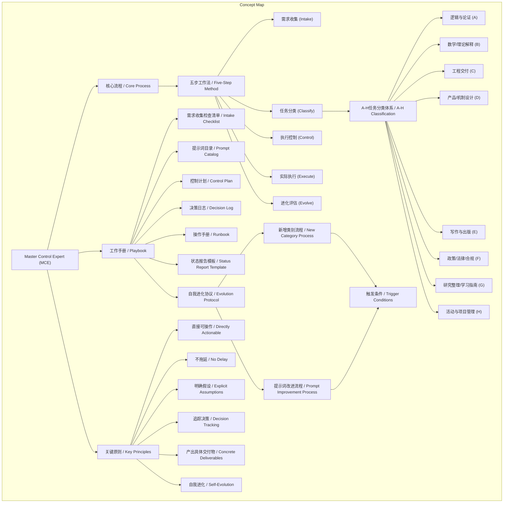
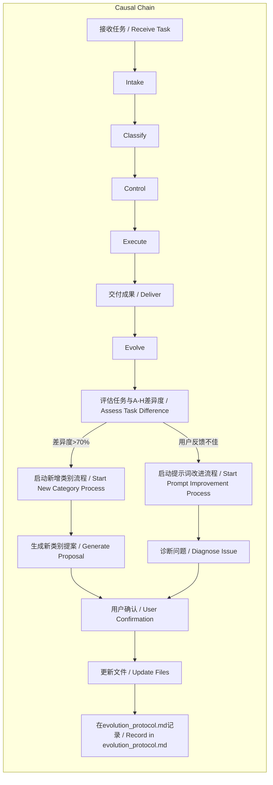

# 任务报告

- requestId: 1771854635319-tfrn3t
- 生成时间(UTC): 2026-02-23T13:56:58.567Z

## 链接总结

- URL: https://github.com/zhuangbiaowei/master-control-expert

# MCE框架：任务处理与自我进化机制

## 整体结构化文档表达
### 文档卡片
- 主题（任务处理框架 / Task Processing Framework）：
- 一句话摘要：MCE是一个用于Claude Code的结构化任务处理框架，通过五步工作法和A-H分类体系实现任务处理，并具备基于触发条件的自我进化能力。
- 目标读者：AI应用开发者、任务流程设计者、GitHub平台用户
- 核心结论（3条）：
  1. MCE通过标准化流程（五步工作法）和分类体系（A-H）提升任务处理质量与效率。
  2. 框架集成工作手册与自我进化协议，支持自动优化类别和提示词。
  3. 关键原则（如直接可操作、不拖延）确保输出具体交付物并追踪决策。

### 内容结构树
1. 背景与问题定义：任务处理缺乏标准化导致效率不一；GitHub作为托管平台提供导航结构。
2. 核心观点与关键证据：MCE框架整合核心流程、A-H分类与进化协议；证据包括五步工作法、八类任务划分、工作手册文件列表、触发条件。
3. 方法/机制/路径：五步工作法作为执行路径，A-H分类作为归类方法，自我进化协议作为优化机制。
4. 风险与边界条件：未明确提及风险；边界条件包括任务差异度阈值（>70%）、连续任务数（3个Other）、用户确认要求。
5. 结论与行动建议：采用MCE框架规范任务处理；按手册步骤执行，并在进化流程中积极反馈。

### 结构化元数据（JSON）
```json
{
  "title": "MCE框架：任务处理与自我进化机制",
  "topic_zh": "任务处理框架",
  "topic_en": "Task Processing Framework",
  "audience": "AI应用开发者、任务流程设计者、GitHub平台用户",
  "claims": [
    "MCE通过标准化流程提升任务处理质量与效率",
    "五步工作法和A-H分类体系构成核心执行机制",
    "自我进化协议允许框架基于触发条件自动优化"
  ],
  "evidence": [
    "核心流程：接收任务 → 需求收集 → 任务分类 → 执行计划 → 交付成果 → 进化评估",
    "五步工作法：需求收集、任务分类、执行控制、实际执行、进化评估",
    "A-H分类体系覆盖逻辑与论证、数学/理论解释等八类",
    "工作手册包含8个文件：intake_checklist.md、prompt_catalog.md等",
    "自我进化触发条件：任务差异度>70%、连续3个任务落入Other、用户明确要求",
    "关键原则：直接可操作、不拖延、明确假设、追踪决策、产出具体交付物、自我进化"
  ],
  "risks": [],
  "actions": [
    "按照工作手册步骤使用MCE处理任务",
    "在进化流程中提供反馈和确认以优化框架"
  ]
}
```

## 处理流程
1. 输入识别：识别出三个分段摘要，分别关于GitHub仓库导航、MCE框架概述、MCE自我进化机制。
2. 信息抽取：抽取实体（MCE、Claude Code、五步工作法、A-H分类、工作手册文件）、概念（任务处理、自我进化）、事实（文件列表、触发条件）、观点（高效处理、系统化）。
3. 结构化归纳：归纳出MCE框架的三大支柱——核心流程（五步）、分类体系（A-H）、进化协议（工作手册与触发条件）。
4. 关系建模：建立MCE与五步工作法、A-H分类、进化协议之间的组成与触发关系。
5. 可视化表达：设计Mermaid图展示概念结构（MCE及其组件）和逻辑因果链（触发条件到进化动作）。

## 概念清单（中英文）
- 未提及 / GitHub
- 未提及 / AI CODE CREATION
- 未提及 / GitHub Copilot
- 未提及 / GitHub Spark
- 未提及 / GitHub Models
- 未提及 / MCP Registry
- 未提及 / DEVELOPER WORKFLOWS
- 未提及 / Actions
- 未提及 / Codespaces
- 未提及 / Issues
- 未提及 / Code Review
- 未提及 / APPLICATION SECURITY
- 未提及 / GitHub Advanced Security
- 未提及 / Code security
- 未提及 / Secret protection
- 未提及 / EXPLORE
- 未提及 / Why GitHub
- 未提及 / Documentation
- 未提及 / Blog
- 未提及 / Changelog
- 未提及 / Marketplace
- 未提及 / Solutions
- 未提及 / BY COMPANY SIZE
- 未提及 / Enterprises
- 未提及 / Small and medium teams
- 未提及 / Startups
- 未提及 / Nonprofits
- 未提及 / BY USE CASE
- 未提及 / App Modernization
- 未提及 / DevSecOps
- 未提及 / DevOps
- 未提及 / CI/CD
- 未提及 / BY INDUSTRY
- 未提及 / Healthcare
- 未提及 / Financial services
- 未提及 / Manufacturing
- 未提及 / Government
- 未提及 / Resources
- 未提及 / EXPLORE BY TOPIC
- 未提及 / AI
- 未提及 / Software Development
- 未提及 / Security
- 未提及 / EXPLORE BY TYPE
- 未提及 / Customer stories
- 未提及 / Events & webinars
- 未提及 / Ebooks & reports
- 未提及 / Business insights
- 未提及 / GitHub Skills
- 未提及 / SUPPORT & SERVICES
- 未提及 / Customer support
- 未提及 / Community forum
- 未提及 / Trust center
- 未提及 / Partners
- 未提及 / Open Source
- 未提及 / COMMUNITY
- 未提及 / GitHub Sponsors
- 未提及 / PROGRAMS
- 未提及 / Security Lab
- 未提及 / Maintainer Community
- 未提及 / Accelerator
- 未提及 / Archive Program
- 未提及 / REPOSITORIES
- 未提及 / Topics
- 未提及 / Trending
- 未提及 / Collections
- 未提及 / Enterprise
- 未提及 / ENTERPRISE SOLUTIONS
- 未提及 / Enterprise platform
- 未提及 / AVAILABLE ADD-ONS
- 未提及 / Copilot for Business
- 未提及 / Premium Support
- 未提及 / Pricing
- 未提及 / Search or jump to...
- 未提及 / Search code, repositories, users, issues, pull requests...
- 未提及 / Provide feedback
- 未提及 / Saved searches
- 未提及 / Appearance settings
- 未提及 / Sign in
- 未提及 / Sign up
- 未提及 / Resetting focus
- 未提及 / You signed in with another tab or window.
- 未提及 / Reload
- Master Control Expert (MCE)
- Claude Code
- 任务处理框架 / Task Processing Framework
- 核心流程 / Core Process
- 五步工作法 / Five-Step Method
- 需求收集 (Intake)
- 任务分类 (Classify)
- 执行控制 (Control)
- 实际执行 (Execute)
- 进化评估 (Evolve)
- 任务分类体系 (A-H) / Classification System (A-H)
- 逻辑与论证 (A) / Logic & Argumentation (A)
- 数学/理论解释 (B) / Math/Theoretical Explanation (B)
- 工程交付 (C) / Engineering Delivery (C)
- 产品/机制设计 (D) / Product/Mechanism Design (D)
- 写作与出版 (E) / Writing & Publishing (E)
- 政策/法律/合规 (F) / Policy/Legal/Compliance (F)
- 研究整理/学习指南 (G) / Research Organization/Learning Guide (G)
- 活动与项目管理 (H) / Event & Project Management (H)
- 文件结构 / File Structure
- 工作手册 / Playbook
- 需求收集检查清单 / Intake Checklist
- 提示词目录 / Prompt Catalog
- 控制计划 / Control Plan
- 决策日志 / Decision Log
- 操作手册 / Runbook
- 状态报告模板 / Status Report Template
- 自我进化协议 / Evolution Protocol
- Claude Code技能 / Claude Code Skill
- 关键原则 / Key Principles
- 直接可操作 / Directly Actionable
- 不拖延 / No Delay
- 明确假设 / Explicit Assumptions
- 追踪决策 / Decision Tracking
- 产出具体交付物 / Concrete Deliverables
- 自我进化 / Self-Evolution
- 新增类别流程 / New Category Process
- 提示词改进流程 / Prompt Improvement Process
- 触发条件 / Trigger Conditions
- 控制摘要 / Control Summary
- 执行计划 / Execution Plan
- 具体交付物 / Specific Deliverables
- 决策日志条目 / Decision Log Entry

## 概念定义（中英文）
- 未提及 / GitHub: 未提及 / Not mentioned
- 未提及 / AI CODE CREATION: 未提及 / Not mentioned
- 未提及 / GitHub Copilot: 未提及 / Not mentioned
- 未提及 / GitHub Spark: 未提及 / Not mentioned
- 未提及 / GitHub Models: 未提及 / Not mentioned
- 未提及 / MCP Registry: 未提及 / Not mentioned
- 未提及 / DEVELOPER WORKFLOWS: 未提及 / Not mentioned
- 未提及 / Actions: 未提及 / Not mentioned
- 未提及 / Codespaces: 未提及 / Not mentioned
- 未提及 / Issues: 未提及 / Not mentioned
- 未提及 / Code Review: 未提及 / Not mentioned
- 未提及 / APPLICATION SECURITY: 未提及 / Not mentioned
- 未提及 / GitHub Advanced Security: 未提及 / Not mentioned
- 未提及 / Code security: 未提及 / Not mentioned
- 未提及 / Secret protection: 未提及 / Not mentioned
- 未提及 / EXPLORE: 未提及 / Not mentioned
- 未提及 / Why GitHub: 未提及 / Not mentioned
- 未提及 / Documentation: 未提及 / Not mentioned
- 未提及 / Blog: 未提及 / Not mentioned
- 未提及 / Changelog: 未提及 / Not mentioned
- 未提及 / Marketplace: 未提及 / Not mentioned
- 未提及 / Solutions: 未提及 / Not mentioned
- 未提及 / BY COMPANY SIZE: 未提及 / Not mentioned
- 未提及 / Enterprises: 未提及 / Not mentioned
- 未提及 / Small and medium teams: 未提及 / Not mentioned
- 未提及 / Startups: 未提及 / Not mentioned
- 未提及 / Nonprofits: 未提及 / Not mentioned
- 未提及 / BY USE CASE: 未提及 / Not mentioned
- 未提及 / App Modernization: 未提及 / Not mentioned
- 未提及 / DevSecOps: 未提及 / Not mentioned
- 未提及 / DevOps: 未提及 / Not mentioned
- 未提及 / CI/CD: 未提及 / Not mentioned
- 未提及 / BY INDUSTRY: 未提及 / Not mentioned
- 未提及 / Healthcare: 未提及 / Not mentioned
- 未提及 / Financial services: 未提及 / Not mentioned
- 未提及 / Manufacturing: 未提及 / Not mentioned
- 未提及 / Government: 未提及 / Not mentioned
- 未提及 / Resources: 未提及 / Not mentioned
- 未提及 / EXPLORE BY TOPIC: 未提及 / Not mentioned
- 未提及 / AI: 未提及 / Not mentioned
- 未提及 / Software Development: 未提及 / Not mentioned
- 未提及 / Security: 未提及 / Not mentioned
- 未提及 / EXPLORE BY TYPE: 未提及 / Not mentioned
- 未提及 / Customer stories: 未提及 / Not mentioned
- 未提及 / Events & webinars: 未提及 / Not mentioned
- 未提及 / Ebooks & reports: 未提及 / Not mentioned
- 未提及 / Business insights: 未提及 / Not mentioned
- 未提及 / GitHub Skills: 未提及 / Not mentioned
- 未提及 / SUPPORT & SERVICES: 未提及 / Not mentioned
- 未提及 / Customer support: 未提及 / Not mentioned
- 未提及 / Community forum: 未提及 / Not mentioned
- 未提及 / Trust center: 未提及 / Not mentioned
- 未提及 / Partners: 未提及 / Not mentioned
- 未提及 / Open Source: 未提及 / Not mentioned
- 未提及 / COMMUNITY: 未提及 / Not mentioned
- 未提及 / GitHub Sponsors: 未提及 / Not mentioned
- 未提及 / PROGRAMS: 未提及 / Not mentioned
- 未提及 / Security Lab: 未提及 / Not mentioned
- 未提及 / Maintainer Community: 未提及 / Not mentioned
- 未提及 / Accelerator: 未提及 / Not mentioned
- 未提及 / Archive Program: 未提及 / Not mentioned
- 未提及 / REPOSITORIES: 未提及 / Not mentioned
- 未提及 / Topics: 未提及 / Not mentioned
- 未提及 / Trending: 未提及 / Not mentioned
- 未提及 / Collections: 未提及 / Not mentioned
- 未提及 / Enterprise: 未提及 / Not mentioned
- 未提及 / ENTERPRISE SOLUTIONS: 未提及 / Not mentioned
- 未提及 / Enterprise platform: 未提及 / Not mentioned
- 未提及 / AVAILABLE ADD-ONS: 未提及 / Not mentioned
- 未提及 / Copilot for Business: 未提及 / Not mentioned
- 未提及 / Premium Support: 未提及 / Not mentioned
- 未提及 / Pricing: 未提及 / Not mentioned
- 未提及 / Search or jump to...: 未提及 / Not mentioned
- 未提及 / Search code, repositories, users, issues, pull requests...: 未提及 / Not mentioned
- 未提及 / Provide feedback: 未提及 / Not mentioned
- 未提及 / Saved searches: 未提及 / Not mentioned
- 未提及 / Appearance settings: 未提及 / Not mentioned
- 未提及 / Sign in: 未提及 / Not mentioned
- 未提及 / Sign up: 未提及 / Not mentioned
- 未提及 / Resetting focus: 未提及 / Not mentioned
- 未提及 / You signed in with another tab or window.: 未提及 / Not mentioned
- 未提及 / Reload: 未提及 / Not mentioned
- Master Control Expert (MCE): 一个用于Claude Code的结构化任务处理框架，将任意请求转化为可执行的、带治理的工作流程。
- Claude Code: 原文中提及的工具名称，未提供详细定义。
- 任务处理框架 / Task Processing Framework: 用于系统化处理任务的方法论与工具集合。
- 核心流程 / Core Process: 任务处理的主要步骤序列，包括接收任务到进化评估。
- 五步工作法 / Five-Step Method: 需求收集、任务分类、执行控制、实际执行、进化评估的五个步骤。
- 需求收集 (Intake): 使用通用检查清单收集必要信息。
- 任务分类 (Classify): 将任务归入A-H类别。
- 执行控制 (Control): 输出控制摘要和目标定义。
- 实际执行 (Execute): 应用对应的提示模板并产出具体交付物。
- 进化评估 (Evolve): 自我评估，必要时提出类别新增或提示词改进。
- 任务分类体系 (A-H) / Classification System (A-H): 将任务分为八类（A-H）的体系，每类有适用场景。
- 逻辑与论证 (A) / Logic & Argumentation (A): 适用于论证审查、有效性检验等。
- 数学/理论解释 (B) / Math/Theoretical Explanation (B): 适用于分层讲解、概念图等。
- 工程交付 (C) / Engineering Delivery (C): 适用于系统架构、重构、故障排查等。
- 产品/机制设计 (D) / Product/Mechanism Design (D): 适用于治理、规则、激励设计等。
- 写作与出版 (E) / Writing & Publishing (E): 适用于大纲、改写、编辑指导等。
- 政策/法律/合规 (F) / Policy/Legal/Compliance (F): 适用于法律推理、合规清单等。
- 研究整理/学习指南 (G) / Research Organization/Learning Guide (G): 适用于知识图谱、阅读指南等。
- 活动与项目管理 (H) / Event & Project Management (H): 适用于会议、论坛、竞赛策划等。
- 文件结构 / File Structure: 仓库中文件的组织方式，包括SKILL.md、README.md等。
- 工作手册 / Playbook: 包含各种模板和协议的目录，用于指导任务处理流程。
- 需求收集检查清单 / Intake Checklist: 用于收集任务需求的标准化清单文件。
- 提示词目录 / Prompt Catalog: 包含A-H类别提示模板的文件，含版本和评估标准。
- 控制计划 / Control Plan: 用于规划任务执行的模板文件。
- 决策日志 / Decision Log: 记录重要决策的文件。
- 操作手册 / Runbook: 详细操作步骤的指南文件。
- 状态报告模板 / Status Report Template: 报告任务状态的模板文件。
- 自我进化协议 / Evolution Protocol: 定义框架如何自动优化类别和提示词的协议文件。
- Claude Code技能 / Claude Code Skill: 在Claude Code中激活MCE功能的集成方式。
- 关键原则 / Key Principles: MCE遵循的六条核心原则，如直接可操作、不拖延等。
- 直接可操作 / Directly Actionable: 提供清晰检查清单、表格和编号步骤，确保立即执行。
- 不拖延 / No Delay: 立即交付成果，不承诺未来工作。
- 明确假设 / Explicit Assumptions: 信息不足时做出合理假设并明确标注。
- 追踪决策 / Decision Tracking: 显式记录决策，维护决策日志。
- 产出具体交付物 / Concrete Deliverables: 生成文件、内容块或可执行步骤。
- 自我进化 / Self-Evolution: 持续评估并主动改进类别和提示词。
- 新增类别流程 / New Category Process: 当任务不属于现有类别时，评估、提案、确认并更新类别的过程。
- 提示词改进流程 / Prompt Improvement Process: 当提示词效果不佳时，诊断、展示方案、确认并更新的过程。
- 触发条件 / Trigger Conditions: 启动自我进化流程的特定条件，如任务差异度阈值。
- 控制摘要 / Control Summary: 任务控制文档，包含目标、交付物、约束等。
- 执行计划 / Execution Plan: 任务执行的里程碑、资源和步骤规划。
- 具体交付物 / Specific Deliverables: 实际产生的文件或内容块。
- 决策日志条目 / Decision Log Entry: 记录关键决策的日志条目。

## 概念关联与逻辑关系（中英文）
1. Master Control Expert (MCE) 通过 核心流程 / Core Process 实现 任务处理 / Task Processing。形式化：`MCE → Core_Process → Task_Processing`
2. 核心流程 / Core Process 由 五步工作法 / Five-Step Method 具体化。形式化：`Core_Process ⊇ {Intake, Classify, Control, Execute, Evolve}`
3. 任务分类 (Classify) 步骤 依赖 任务分类体系 (A-H) / Classification System (A-H) 进行归类。形式化：`Classify → A-H_Classification`
4. 进化评估 (Evolve) 反馈 优化 五步工作法 / Five-Step Method 和 任务分类体系 (A-H)。形式化：`Evolve → Optimize({Five-Step Method, A-H Classification})`
5. 触发条件 / Trigger Conditions 启动 自我进化协议 / Evolution Protocol。形式化：`Trigger_Conditions → Evolution_Protocol`
6. 自我进化协议 / Evolution Protocol 包含 新增类别流程 / New Category Process 和 提示词改进流程 / Prompt Improvement Process。形式化：`Evolution_Protocol ⊇ {New_Category_Process, Prompt_Improvement_Process}`

## COT逻辑梳理（定义/分类/比较/因果/科学方法论）
- Step 1（定义）：MCE框架是一个任务处理系统，核心是工作手册（提供标准化模板）和自我进化协议（实现自动优化），旨在解决AI任务处理缺乏标准化和适应性的问题。
- Step 2（分类）：任务分类体系（A-H）基于适用场景将任务分为八类（逻辑与论证、数学/理论解释等），覆盖从理论到实践的广泛领域；工作手册组件分为需求收集（intake_checklist.md）、模板管理（prompt_catalog.md）、规划控制（control_plan.md）、记录追踪（decision_log.md）等。
- Step 3（比较）：新增类别流程适用于任务与A-H差异度大（>70%）或用户明确要求的情况；提示词改进流程适用于用户反馈不佳或提示词骨架遗漏时。两者均需用户确认，但触发条件不同：前者基于任务特征，后者基于输出质量。
- Step 4（因果）：触发条件（如任务差异度>70%）导致进化评估，评估后向用户展示提案，用户确认导致文件更新（如evolution_protocol.md记录），从而实现框架进化；不拖延原则确保立即交付，避免承诺未来工作。
- Step 5（科学方法论）：通过记录决策（decision_log.md）、评估效果（类别覆盖率、提示词效果）、迭代更新（版本升级），形成“设计-执行-反馈-优化”的科学循环；直接可操作原则通过清单和表格确保可重复性。

## 事实与看法（病毒）
### 事实
- MCE是一个任务分类和执行框架。
- 核心流程包括接收任务、需求收集、任务分类、执行计划、交付成果、进化评估。
- 五步工作法包括：需求收集（使用通用检查清单）、任务分类（归入A-H类别）、执行控制（输出控制摘要和目标定义）、实际执行（应用提示模板产出交付物）、进化评估（自我评估并提出改进）。
- A-H任务分类体系有八个类别，每个类别有名称和适用场景。
- 文件结构包含SKILL.md、README.md、README.en.md等。
- 工作手册目录包含8个文件：intake_checklist.md、prompt_catalog.md、control_plan.md、decision_log.md、runbook.md、status_report.md、evolution_protocol.md。
- 自我进化功能分为新增类别流程和提示词改进流程。
- 新增类别触发条件：任务与A-H差异度>70%；连续3个任务落入Other且主题相关；用户明确要求新增类别。
- 提示词改进触发条件：用户反馈某类别效果不佳；发现提示词骨架遗漏关键项；用户反复要求覆盖默认部分；同一类别连续2次需要重大调整。
- 关键原则列出6条：直接可操作、不拖延、明确假设、追踪决策、产出具体交付物、自我进化。
- 输出示例包括控制摘要、执行计划、具体交付物、决策日志条目。
- 使用方式：在Claude Code中激活技能后输入`/master-control-expert`，或手动参考手册步骤。
### 看法
- “帮助 Claude Code 高效处理各种类型的任务”中的“高效”是主观评价。
- “确保每个任务都能得到系统化、高质量的处理”中的“高质量”是主观判断。
- “标准化的流程和提示模板”中的“标准化”隐含价值判断。
- MCE“具备自我进化能力”是基于设计，实际效果依赖用户参与。
- 框架强调“不拖延”和“立即交付”体现效率导向，但是否最优取决于场景。

## FAQ（原文问题整理）
- 未提及（原文未提供明确问题）

## Visualization
### Mermaid 图 1（概念结构图）


### Mermaid 图 2（逻辑/因果图）


## 文章中的类比
- 未发现明确类比

## 10个金句
1. Master Control Expert (MCE) 是一个任务分类和执行框架。
2. 帮助 Claude Code 高效处理各种类型的任务。
3. 通过标准化的流程和提示模板，MCE 确保每个任务都能得到系统化、高质量的处理。
4. 核心流程：接收任务 → 需求收集 → 任务分类 → 执行计划 → 交付成果 → 进化评估。
5. 五步工作法：1. 需求收集 (Intake) - 使用通用检查清单收集必要信息。
6. 2. 任务分类 (Classify) - 将任务归入 A-H 类别。
7. 3. 执行控制 (Control) - 输出控制摘要和目标定义。
8. 4. 实际执行 (Execute) - 应用对应的提示模板并产出具体交付物。
9. 5. 进化评估 (Evolve) - 自我评估，必要时提出类别新增或提示词改进。
10. 工作手册目录包含8个文件：intake_checklist.md、prompt_catalog.md、control_plan.md、decision_log.md、runbook.md、status_report.md、evolution_protocol.md。
