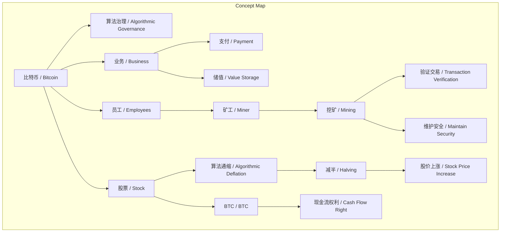
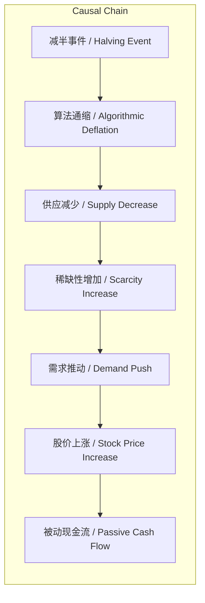

# 任务报告

- requestId: 1771889914313-gqjmzw
- 生成时间(UTC): 2026-02-23T23:39:12.960Z

## 文本总结

# 比特币：算法治理公司的股票通缩分红模型

## 整体结构化文档表达
### 文档卡片
- 主题（中文/English）：比特币的股票属性与算法分红机制 / Bitcoin's Stock Attribute and Algorithmic Dividend Mechanism
- 一句话摘要：本文通过将比特币比作算法治理的公司，阐释其作为股票通过算法通缩实现间接分红的逻辑，并区分其与黄金的本质差异。
- 目标读者：对比特币本质有困惑的投资者、金融学习者、区块链技术关注者
- 核心结论（3条）：
  1. 比特币是算法治理的公司，无传统管理层，由软件算法控制。
  2. BTC是该公司的股票，其价值取决于业务使用量，并通过算法通减半）实现类似股票回购的分红。
  3. 比特币与黄金的关键区别在于比特币有通缩机制产生现金流权利，而黄金没有。

### 内容结构树
1. 背景与问题定义：作者在自驾中思考比特币本质，困惑于“比特币是股票”的说法，通过类比公司结构寻求理解。
2. 核心观点与关键证据：比特币是算法治理公司；业务为支付和储值；BTC是股票；矿工是员工；算法通缩等同于股票回购分红。
3. 方法/机制/路径：使用公司类比方法，将比特币系统映射为公司实体，解释其运作机制。
4. 风险与边界条件：未提及明确风险，但警告类比误用可能导致错误理解。
5. 结论与行动建议：理解比特币需摆脱传统资产类比，认识到其算法分红机制；持有BTC即拥有产生现金流的权利。

### 结构化元数据（JSON）
```json
{
  "title": "比特币：算法治理公司的股票通缩分红模型",
  "topic_zh": "比特币的股票属性与算法分红机制",
  "topic_en": "Bitcoin's Stock Attribute and Algorithmic Dividend Mechanism",
  "audience": "对比特币本质有困惑的投资者、金融学习者、区块链技术关注者",
  "claims": [
    "比特币是人类历史上第一家算法治理的公司",
    "比特币的业务是支付和储值",
    "BTC是比特币公司的股票",
    "矿工是比特币公司的员工",
    "比特币通过算法通缩实现类似股票回购的分红"
  ],
  "evidence": [
    "比特币没有CEO、董事会，完全由软件算法控制",
    "矿工通过验证交易、维护安全来'上班'",
    "每次减半价格大幅上涨，类似股票回购后股价上涨"
  ],
  "risks": [
    "未提及明确风险，但警告类比误用可能导致错误理解"
  ],
  "actions": [
    "将BTC视为股票而非黄金，理解其通缩分红机制",
    "关注比特币业务使用量对股票价值的影响"
  ]
}
```

## 处理流程
1. 输入识别：用户提供日记文本，主题为比特币本质思考。
2. 信息抽取：抽取实体（比特币、BTC、矿工）、概念（算法治理、支付、储值、股票、通缩、分红）、问题（如何理解比特币是股票）、观点（比特币是公司，BTC是股票，算法通缩分红）。
3. 结构化归纳：将比特币系统定义为公司，分类其组件（业务、股票、员工），比较与黄金的区别，因果链（减半→通缩→分红→价格上涨）。
4. 关系建模：建立概念关系，如算法治理→公司结构，通缩机制→分红效果。
5. 可视化表达：用Mermaid绘制概念图和因果图。

## 概念清单（中英文）
- 比特币 / Bitcoin
- 算法治理 / Algorithmic Governance
- 公司 / Company
- CEO / CEO
- 董事会 / Board of Directors
- 管理人员 / Management
- 软件算法 / Software Algorithm
- 支付 / Payment
- 点对点支付 / Peer-to-Peer Payment
- 储值 / Value Storage
- 财富价值存储 / Wealth Value Storage
- 私有财产神圣不可侵犯 / Inviolability of Private Property
- 股票 / Stock
- BTC / BTC
- 矿工 / Miner
- 挖矿 / Mining
- 验证交易 / Transaction Verification
- 维护安全 / Maintain Security
- 算法通缩 / Algorithmic Deflation
- 减半 / Halving
- 股市回购式分红 / Stock Repurchase Dividend
- 电子黄金 / Electronic Gold
- 现金流 / Cash Flow
- 股票回购 / Stock Repurchase
- 注销 / Cancellation
- 通缩股本 / Deflationary Equity
- 每股收益 / Earnings Per Share
- 股价 / Stock Price
- 被动现金流 / Passive Cash Flow

## 概念定义（中英文）
- 比特币：人类历史上第一家由算法治理的公司，其业务包括支付和储值，股票为BTC。/ Bitcoin: The first company in human history governed by algorithms, with businesses in payment and value storage, stock is BTC.
- 算法治理：公司没有CEO、董事会或管理人员，完全由软件算法控制。/ Algorithmic Governance: The company has no CEO, board, or management, fully controlled by software algorithms.
- 公司：在此语境下指比特币系统，作为一个实体提供业务。/ Company: In this context, refers to the Bitcoin system as an entity providing services.
- CEO：传统公司的首席执行官，比特币公司不存在此角色。/ CEO: Chief Executive Officer in traditional companies, absent in Bitcoin company.
- 董事会：传统公司的决策机构，比特币公司不存在。/ Board of Directors: Decision-making body in traditional companies, absent in Bitcoin.
- 管理人员：传统公司的管理团队，比特币公司不存在。/ Management: Management team in traditional companies, absent in Bitcoin.
- 软件算法：控制比特币公司运作的计算机程序。/ Software Algorithm: The computer program controlling the Bitcoin company's operations.
- 支付：比特币提供的无需第三方的点对点支付业务。/ Payment: Bitcoin's peer-to-peer payment service without third parties.
- 点对点支付：直接 between parties without intermediaries。/ Peer-to-Peer Payment: Direct transactions between parties without intermediaries.
- 储值：比特币提供的财富价值存储业务。/ Value Storage: Bitcoin's service for storing wealth value.
- 财富价值存储：保存财富价值的功能。/ Wealth Value Storage: Function of preserving wealth value.
- 私有财产神圣不可侵犯：技术上保证财产权不可侵犯。/ Inviolability of Private Property: Technically ensuring property rights are inviolable.
- 股票：比特币公司发行的所有权凭证，即BTC。/ Stock: Ownership certificate issued by Bitcoin company, i.e., BTC.
- BTC：比特币公司的股票代码。/ BTC: Stock ticker of Bitcoin company.
- 矿工：比特币公司的员工，通过挖矿参与网络维护。/ Miner: Employees of Bitcoin company, participate in network maintenance through mining.
- 挖矿：矿工的工作，验证交易、维护安全。/ Mining: Miners' work, verifying transactions and maintaining security.
- 验证交易：检查交易的有效性。/ Transaction Verification: Checking validity of transactions.
- 维护安全：保护网络免受攻击。/ Maintain Security: Protecting the network from attacks.
- 算法通缩：通过算法（如减半）减少股票供应，实现分红。/ Algorithmic Deflation: Reducing stock supply via algorithms (e.g., halving) to achieve dividends.
- 减半：比特币每四年减少新币发行的机制。/ Halving: Bitcoin's mechanism to reduce new coin issuance every four years.
- 股市回购式分红：公司用利润回购股票并注销，间接分红。/ Stock Repurchase Dividend: Company uses profits to buy back and cancel stocks, indirectly distributing dividends.
- 电子黄金：将比特币类比为黄金的常见但错误的观点。/ Electronic Gold: Common but flawed analogy comparing Bitcoin to gold.
- 现金流：资产产生的现金收入，如分红、利息。/ Cash Flow: Cash income generated by assets, such as dividends or interest.
- 股票回购：公司从市场买回自己的股票。/ Stock Repurchase: Company buying back its own shares from the market.
- 注销：将回购的股票从流通中移除。/ Cancellation: Removing repurchased shares from circulation.
- 通缩股本：减少总股本，提高每股收益。/ Deflationary Equity: Reducing total equity to increase earnings per share.
- 每股收益：公司利润除以总股本。/ Earnings Per Share: Company profit divided by total shares.
- 股价：股票的市场价格。/ Stock Price: Market price of a stock.
- 被动现金流：无需主动工作即可获得的现金收入。/ Passive Cash Flow: Cash income received without active work.

## 概念关联与逻辑关系（中英文）
- 算法治理（Algorithmic Governance） 导致 公司无传统管理层（Company without Traditional Management）。形式化：Algorithmic Governance → ¬(CEO ∨ Board ∨ Management)
- 算法通缩（Algorithmic Deflation） 与 业务使用量（Business Usage） 共同影响 BTC价值（BTC Value）。形式化：Value(BTC) = f(Algorithmic Deflation, Business Usage)
- 减半事件（Halving Event） 导致 通缩（Deflation） 进而 股价上涨（Stock Price Increase）。形式化：Halving → Deflation → ↑Stock Price

## COT逻辑梳理（定义/分类/比较/因果/科学方法论）
- Step 1: 定义问题。如何理解“比特币是股票”？传统股票有现金流，比特币似乎没有。
- Step 2: 分类类比。将比特币系统类比为公司，分类其组件：治理结构（算法）、业务（支付、储值）、股票（BTC）、员工（矿工）。
- Step 3: 比较分析。比较比特币与黄金：黄金无通缩，无现金流；比特币有算法通缩，产生现金流权利。
- Step 4: 因果推理。减半→新币减少→供应通缩→稀缺性增加→需求推动价格上涨→持有者享受增值（被动现金流）。
- Step 5: 科学方法论。使用思想实验（如苹果公司回购案例）验证逻辑一致性，避免类比过度泛化。

## 事实与看法（病毒）
### 事实
- 比特币没有CEO、董事会、管理人员。
- 比特币业务包括点对点支付和储值。
- BTC是比特币系统的股票。
- 矿工通过验证交易维护网络安全。
- 比特币每四年减半发行。
- 黄金总量没有上限，无通缩机制。
### 看法
- 比特币是人类历史上第一家算法治理的公司。
- 比特币通过算法通缩实现股票分红。
- 把BTC类比为电子黄金是误入歧途。
- 持有BTC即拥有产生现金流的权利。
- 减半后价格上涨是因为公司在分红。

## FAQ（原文问题整理）
1. 如何理解比特币是股票？
   - 回答：比特币是算法治理公司，BTC是其股票，通过算法通缩（减半）实现类似股票回购的分红，持有者享受增值。
2. 比特币公司与传统公司有何区别？
   - 回答：比特币公司无CEO、董事会，由算法治理；员工是矿工，无需批准即可参与。
3. 比特币与黄金的区别是什么？
   - 回答：比特币有通缩机制，产生现金流权利；黄金无通缩，不产生现金流。
4. 为什么减半会导致价格上涨？
   - 回答：减半减少新币供应，类似股票回购注销，提升每股价值，推动价格上涨。

## Visualization
### Mermaid 图 1（概念结构图）

### Mermaid 图 2（逻辑/因果图）


## 文章中的类比
- 比特币作为算法治理公司
- BTC作为股票
- 减半作为股票回购分红
- 电子黄金（但作者指出此类比错误）

## 10个金句
1. 比特币是人类历史上第一家算法治理的公司。
2. 这家公司没有CEO，没有董事会，没有管理人员，完全由软件算法来控制。
3. 比特币这家公司发行的股票，也叫BTC。
4. 员工（矿工）的主要工作是验证比特币网络交易，维护安全，保证私有财产从技术上神圣不可侵犯。
5. BTC是比特币的股票。
6. 把BTC类比为电子黄金很容易得出一样的结论：BTC也不产生现金流。
7. 公司用利润买入二级市场的股票并注销，通过通缩股本，提升每股收益，从而推高股价。
8. 比特币公司则通过算法通缩（总量恒定，每4年减半发行）！算法实现股票通缩和人工回购注销来通缩，本质上是一样的！
9. 每次比特币减半，价格都会大幅上涨，跟股市里公司回购股票后，股价上涨是一个道理——公司在分红。
10. 原来比特币公司是通过算法来实现自动通缩，间接地实现BTC股票的分红！
