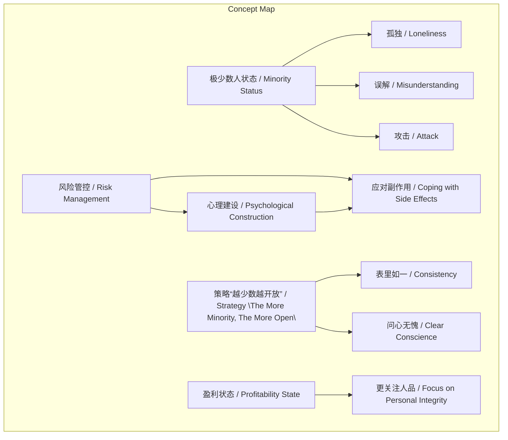
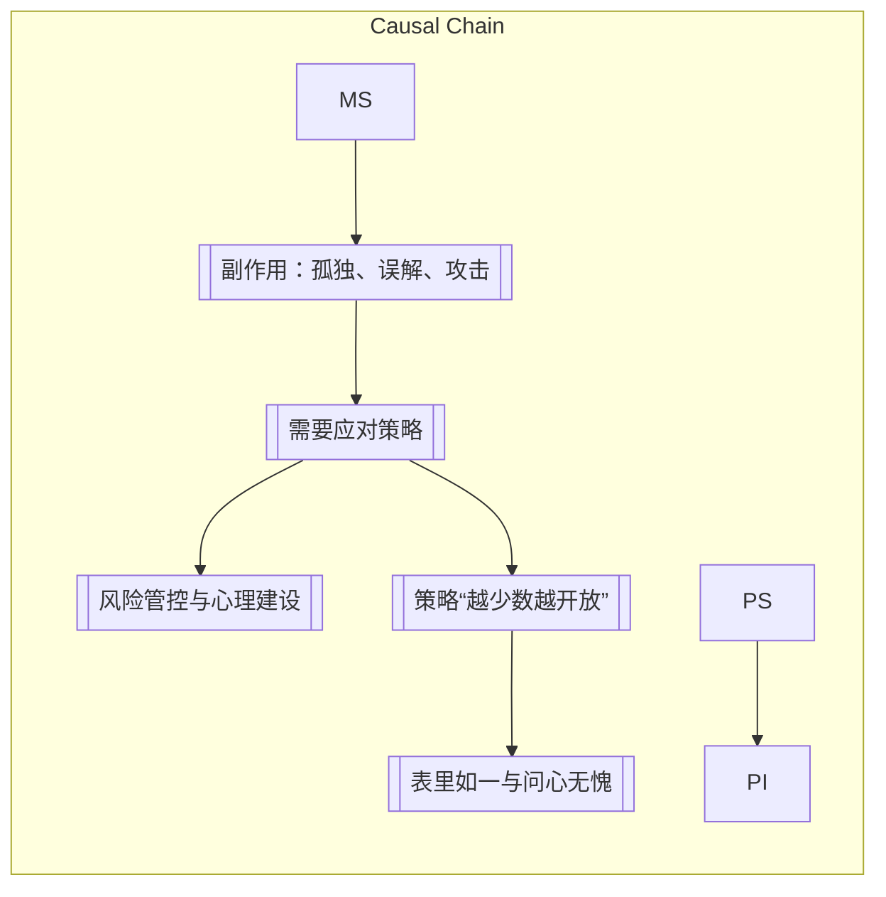

# 任务报告

- requestId: 1771890022195-6rb8ww
- 生成时间(UTC): 2026-02-23T23:41:03.452Z

## 文本总结

# 极少数人的孤独、风险与开放策略

## 整体结构化文档表达
### 文档卡片
- 主题（中文/English）：极少数人生存策略 / Survival Strategies for the Minority
- 一句话摘要：成为极少数人伴随孤独与攻击等副作用，需通过风险管控、心理建设及“越少数越开放”的策略应对。
- 目标读者：处于社会或职业少数位置的人群，或追求非主流路径的个体。
- 核心结论（3条）：
  1. 成为极少数人必然面临孤独、误解与攻击等副作用。
  2. 应对核心是风险管控、心理建设，并践行“越少数越开放”的表里如一原则。
  3. 少数人需采用专属生存方式处理专属问题。

### 内容结构树
1. 背景与问题定义：成为极少数人在社会中的心理与社交挑战。
2. 核心观点与关键证据：副作用包括孤独、误解、攻击；盈利后遇到的人更关注人品；老师提出“越少数越开放”策略。
3. 方法/机制/路径：风险管控、心理建设、表里如一、问心无愧。
4. 风险与边界条件：未提及具体风险类型或策略适用边界。
5. 结论与行动建议：以少数人方式生活，应对专属问题。

### 结构化元数据（JSON）
```json
{
  "title": "极少数人的孤独、风险与开放策略",
  "topic_zh": "极少数人生存策略",
  "topic_en": "Survival Strategies for the Minority",
  "audience": "处于少数位置的个体或追求非主流路径者",
  "claims": [
    "成为极少数人必然面临孤独、误解与攻击",
    "应对需风险管控、心理建设及‘越少数越开放’策略",
    "少数人需以专属生存方式应对专属问题"
  ],
  "evidence": [
    "成为人群当中的极少数人总是孤独的、被误解的、甚至更容易被人攻击",
    "当你赚到的时候会遇到更多能赚到钱的人，他们会更关注人品",
    "老师的策略是：越少数越开放，即是表里如一、问心无愧"
  ],
  "risks": [],
  "actions": [
    "做好风险管控和心理建设",
    "践行表里如一、问心无愧的开放态度",
    "采用少数人的生存方式生活"
  ]
}
```

## 处理流程
未提及

## 概念清单（中英文）
- 极少数人 / The Minority
- 孤独 / Loneliness
- 误解 / Misunderstanding
- 攻击 / Attack
- 风险管控 / Risk Management
- 心理建设 / Psychological Construction
- 盈利状态 / Profitability State
- 人品 / Personal Integrity
- 老师 / Mentor
- 策略 / Strategy
- 开放 / Openness
- 表里如一 / Consistency
- 问心无愧 / Clear Conscience
- 生存方式 / Way of Life
- 问题 / Problems

## 概念定义（中英文）
- 极少数人 / The Minority：在人群或社会中数量稀少、位置独特的个体或群体。
- 孤独 / Loneliness：成为极少数人时常体验的孤立无援的情感状态。
- 误解 / Misunderstanding：极少数人因与主流不同而常受到的错误认知。
- 攻击 / Attack：极少数人更容易面临的直接或间接的负面行为。
- 风险管控 / Risk Management：为应对成为极少数人的潜在负面后果而采取的预防措施。
- 心理建设 / Psychological Construction：增强心理韧性以承受孤独与误解的内在准备。
- 盈利状态 / Profitability State：指个人在财务上获得成功或积累财富的阶段。
- 人品 / Personal Integrity：在盈利状态下，他人更重视的道德品质和诚信。
- 老师 / Mentor：提出“越少数越开放”策略的指导者或权威人物。
- 策略 / Strategy：为应对极少数人处境而制定的行动计划，具体为“越少数越开放”。
- 开放 / Openness：在少数人位置上主动展现透明、接纳的态度。
- 表里如一 / Consistency：思想、言语与行为高度统一，无虚伪。
- 问心无愧 / Clear Conscience：内心对自己行为毫无愧疚，符合道德标准。
- 生存方式 / Way of Life：少数人为适应其独特处境而采用的生活模式。
- 问题 / Problems：少数人才会遇到的特定挑战或困难。

## 概念关联与逻辑关系（中英文）
1. 极少数人状态 / Minority Status → 孤独 / Loneliness  
2. 风险管控 / Risk Management 与 心理建设 / Psychological Construction → 应对副作用 / Coping with Side Effects  
3. 策略“越少数越开放” / Strategy "The More Minority, The More Open" → 要求 表里如一 / Consistency 与 问心无愧 / Clear Conscience  

## COT逻辑梳理（定义/分类/比较/因果/科学方法论）
- Step 1: 定义极少数人状态：在人群中数量稀少，与主流不同。
- Step 2: 分类副作用：情感上孤独，认知上被误解，行为上易受攻击。
- Step 3: 比较应对方式：风险管控（外部预防）与心理建设（内部韧性）结合。
- Step 4: 因果链：成为极少数人 → 副作用 → 需要应对策略 → 采用开放态度。
- Step 5: 科学方法论：未明确提及，但策略基于实践智慧，强调一致性道德行为。

## 事实与看法（病毒）
### 事实
- 文本标注日期为2020年11月20日。
### 看法
- 成为极少数人总是孤独的、被误解的、甚至更容易被人攻击。
- 因而要做好相应的风险管控和心理建设。
- 当你赚到的时候会遇到更多能赚到钱的人，他们会更关注人品。
- 老师的策略是：越少数越开放，即是表里如一、问心无愧。
- 少数人要以少数人的生存方式生活，应对少数人才会遇到的问题。

## FAQ（原文问题整理）
- 未发现明确提问。

## Visualization
### Mermaid 图 1（概念结构图）


### Mermaid 图 2（逻辑/因果图）


## 文章中的类比
未发现明确类比

## 10个金句
1. 成为人群当中的极少数人总是孤独的、被误解的、甚至更容易被人攻击。
2. 因而要做好相应的风险管控和心理建设。
3. 当你赚到的时候会遇到更多能赚到钱的人，他们会更关注人品。
4. 老师的策略是：越少数越开放，即是表里如一、问心无愧。
5. 少数人要以少数人的生存方式生活，应对少数人才会遇到的问题。
6. 原文未提供
7. 原文未提供
8. 原文未提供
9. 原文未提供
10. 原文未提供
