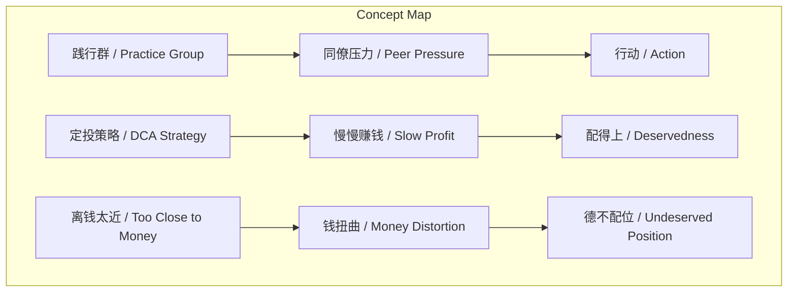
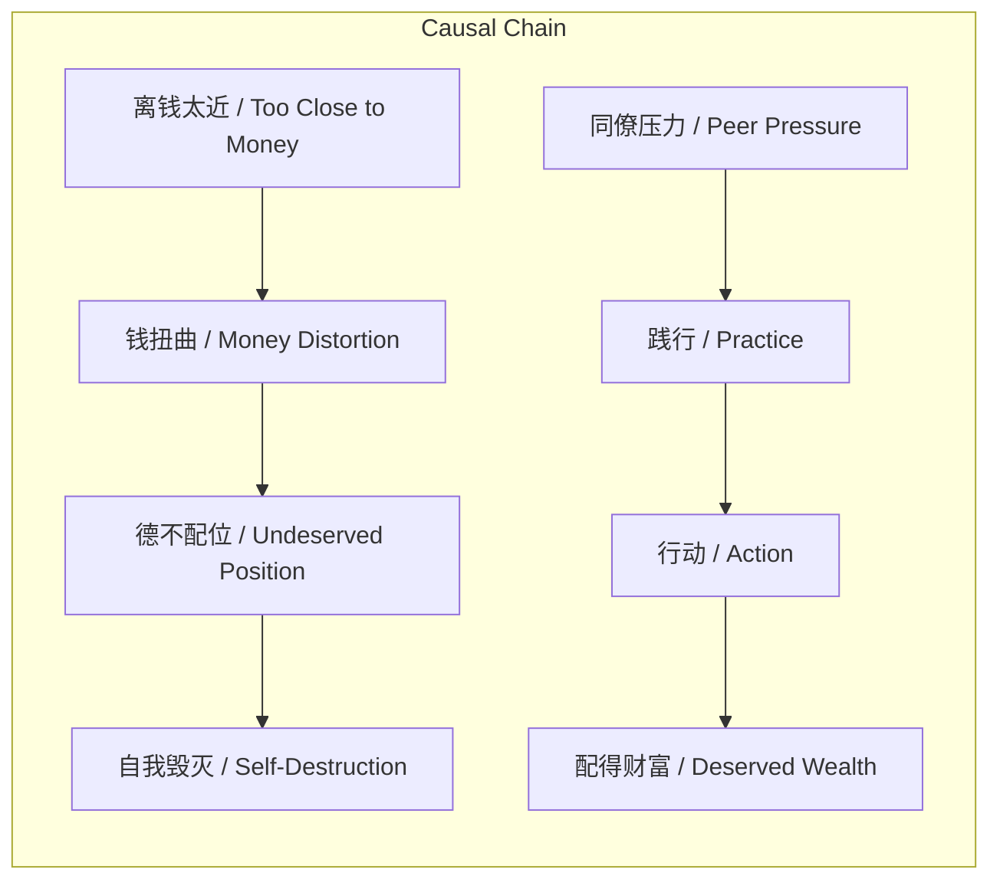

# 任务报告

- requestId: 1771890071043-r6hnlb
- 生成时间(UTC): 2026-02-23T23:41:52.186Z

## 文本总结

# 践行群核心：行动与配得感

## 整体结构化文档表达
### 文档卡片
- 主题（中文/English）：践行群核心价值 / Core Values of Practice Group
- 一句话摘要：阐述践行群通过同僚压力促进行动，强调能力与财富匹配及定投策略的重要性。
- 目标读者：对个人成长、投资实践和社群学习感兴趣的个体。
- 核心结论（3条）：
  1. 快速盈利环境易导致“德不配位”，扭曲个人价值观。
  2. “知道”与“做到”的本质区别在于践行，行动是关键。
  3. 定投策略通过缓慢盈利帮助个体逐步配得财富，实现自我改变。

### 内容结构树
1. **背景与问题定义**：交易市场盈利与亏损速度快，导致能力与认知不匹配赚取的金钱，引发自我毁灭。
2. **核心观点与关键证据**：离钱近易被扭曲；知道与做到的区别在于践行；践行群通过同僚压力促进行动；定投策略实现慢慢赚钱与自我变化；勇气重于智商；不践行则无效。
3. **方法/机制/路径**：践行群制造可模仿榜样施加同僚压力；定投策略作为缓慢赚钱、逐步配得财富的方法。
4. **风险与边界条件**：离钱近易被钱扭曲；若不践行或不足量定投，践行群无效。
5. **结论与行动建议**：必须践行并足量定投，才能配得财富并实现自我成长。

### 结构化元数据（JSON）
```json
{
  "title": "践行群核心：行动与配得感",
  "topic_zh": "践行群核心价值",
  "topic_en": "Core Values of Practice Group",
  "audience": "对个人成长、投资实践和社群学习感兴趣的个体",
  "claims": [
    "快速盈利环境易导致“德不配位”，扭曲个人价值观。",
    "“知道”与“做到”的本质区别在于践行，行动是关键。",
    "定投策略通过缓慢盈利帮助个体逐步配得财富，实现自我改变。"
  ],
  "evidence": [
    "交易市场内赚钱和亏损的速度都比外界快，导致很多德不配位的情况。",
    "能力与认知没有匹配到赚到的钱，于是迅速就把自己毁掉了。",
    "践行群的本质在于在你周围制造了可模仿的榜样，这种“同僚压力”促使你行动。",
    "定投策略在于慢慢赚钱，慢慢让自己配得上赚的钱，最终不仅赚到了钱，自己也发生了变化。"
  ],
  "risks": [
    "离钱太近容易被钱扭曲",
    "如果不践行、不足量定投，践行群对个人无效"
  ],
  "actions": [
    "必须践行，将所学转化为行动",
    "执行足量定投策略，逐步配得财富"
  ]
}
```

## 处理流程
1. 输入识别：识别用户输入为关于践行群核心价值的10点论述。
2. 信息抽取：抽取实体如践行群、同僚压力、定投策略等；观点如离钱近易扭曲等。
3. 结构化归纳：将内容归纳为背景、观点、方法、风险、结论。
4. 关系建模：建立概念间因果与逻辑关系。
5. 可视化表达：生成Mermaid图。

## 概念清单（中英文）
- 践行群 / Practice Group
- 离钱太近 / Too Close to Money
- 钱扭曲 / Money Distortion
- 交易市场 / Trading Market
- 赚钱速度 / Speed of Profit
- 亏损速度 / Speed of Loss
- 德不配位 / Undeserved Position
- 能力 / Ability
- 认知 / Cognition
- 赢不起 / Cannot Win
- 看到 / Seeing
- 知道 / Knowing
- 学到 / Learning
- 做到 / Doing
- 知道份子 / Knowers
- 行动份子 / Actors
- 践行 / Practice
- 同僚压力 / Peer Pressure
- 定投策略 / DCA Strategy
- 慢慢赚钱 / Slow Profit
- 配得上 / Deservedness
- 智商 / IQ
- 勇气 / Courage
- 足量定投 / Sufficient DCA

## 概念定义（中英文）
- **践行群**：以行动为导向的学习社群，通过制造可模仿榜样施加同僚压力，促成员将知识转化为实践。
- **离钱太近**：指个体过于接近金钱交易，容易受到金钱的负面影响。
- **钱扭曲**：金钱导致个人价值观或行为偏离正轨的现象。
- **交易市场**：进行金融资产买卖的场所，特点是盈利和亏损速度快。
- **赚钱速度**：在交易市场中获取利润的速率。
- **亏损速度**：在交易市场中遭受损失的速率。
- **德不配位**：个人的道德或能力不足以匹配其拥有的财富或地位。
- **能力**：个人完成某事的本领。
- **认知**：个人的认识和理解水平。
- **赢不起**：指在快速盈利后无法保持或处理财富，导致自我毁灭。
- **看到**：视觉上的感知。
- **知道**：头脑中的认知或理解。
- **学到**：通过教育或经验获得知识。
- **做到**：将知识转化为实际行动。
- **知道份子**：仅停留在知道层面，缺乏行动的人。
- **行动份子**：将知识付诸实践的人。
- **践行**：将学到的东西实际做出来，是知道与做到之间的桥梁。
- **同僚压力**：来自同伴的比较、竞争或激励，促使个体行动的压力。
- **定投策略**：定期投入固定金额购买资产，以平均成本、降低风险的投资方法。
- **慢慢赚钱**：通过长期、稳定的方式逐步积累财富。
- **配得上**：个人能力与财富相匹配的状态。
- **智商**：智力商数，衡量认知能力的指标。
- **勇气**：面对困难或风险时敢于行动的心理品质。
- **足量定投**：执行足够金额和频率的定期投资，以确保策略有效。

## 概念关联与逻辑关系（中英文）
1. 同僚压力 / Peer Pressure 与 践行 / Practice 共同导致 行动 / Action。形式化：`PeerPressure ∧ Practice → Action`
2. 定投策略 / DCA Strategy 导致 慢慢赚钱 / Slow Profit，进而导致 配得上 / Deservedness。形式化：`DCA → SlowProfit → Deservedness`
3. 离钱太近 / Too Close to Money 导致 钱扭曲 / Money Distortion，进而导致 德不配位 / Undeserved Position。形式化：`TooCloseToMoney → MoneyDistortion → UndeservedPosition`

## COT逻辑梳理（定义/分类/比较/因果/科学方法论）
- **Step 1（定义）**：定义“践行”为“学到与做到的区别”，即知识转化为行动的过程。
- **Step 2（分类）**：将人群分为“知道份子”（仅知不行）和“行动份子”（知行合一）。
- **Step 3（比较）**：比较“看到、知道、学到和做到”，指出只有“做到”才有价值。
- **Step 4（因果）**：分析因果链：离钱近 → 赚钱/亏钱快 → 德不配位 → 自我毁灭；同僚压力 → 践行 → 行动 → 配得财富。
- **Step 5（科学方法论）**：定投策略作为系统化方法，通过时间平滑风险，实现财富与能力同步增长。

## 事实与看法（病毒）
### 事实
- 交易市场内赚钱和亏损的速度都比外界快。
- 能力与认知没有匹配到赚到的钱，于是迅速就把自己毁掉了。
- 践行群的本质在于在你周围制造了可模仿的榜样。
- 这种“同僚压力”促使你行动。
- 定投策略在于慢慢赚钱，慢慢让自己配得上赚的钱。
- 如果你不践行，不足量定投，践行群对你就是没用的。

### 看法
- 离钱太近了，容易被钱扭曲。
- 原因在于交易市场内赚钱和亏损的速度都比外界快，导致很多德不配位的情况。
- 看到、知道、学到和做到是完全不一样的，只有做到才有用、有价值。
- 满天下都是知道份子，但仅有极少数人是真正的行动份子。
- 我们不是靠智商，而是靠勇气。
- 定投策略最终不仅赚到了钱，自己也发生了变化。

## FAQ（原文问题整理）
未发现明确提问。

## Visualization
### Mermaid 图 1（概念结构图）


### Mermaid 图 2（逻辑/因果图）


## 文章中的类比
未发现明确类比。

## 10个金句
1. 离钱太近了，容易被钱扭曲。
2. 原因在于交易市场内赚钱和亏损的速度都比外界快，导致很多德不配位的情况。
3. 能力与认知，没有匹配到赚到的钱，于是迅速就把自己毁掉了（赢不起）。
4. 看到、知道、学到和做到是完全不一样的，只有做到才有用、有价值。
5. 满天下都是知道份子，但仅有极少数人是真正的行动份子。
6. 学到与做到的区别在于践行。
7. 践行群的本质不在于听课，而在于在你周围制造了可模仿的榜样，这种“同僚压力”促使你行动。
8. 定投策略在于慢慢赚钱，慢慢让自己配得上赚的钱，最终不仅赚到了钱，自己也发生了变化。
9. 我们不是靠智商，而是靠勇气。
10. 如果你不践行，不足量定投，践行群对你就是没用的。
