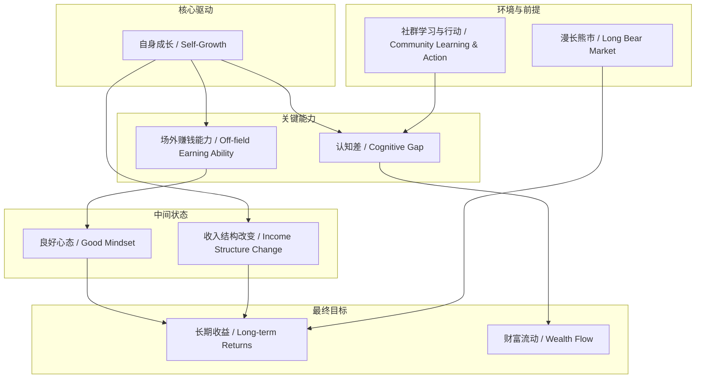
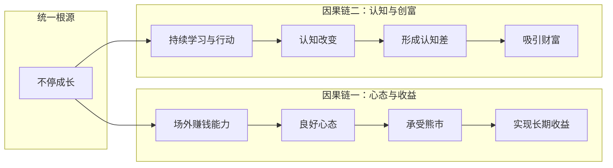

# 任务报告

- requestId: 1771890119755-ipr3j8
- 生成时间(UTC): 2026-02-23T23:42:29.176Z

## 文本总结

# 成长才是核心

## 整体结构化文档表达
### 文档卡片
- 主题（中文/English）：个人成长与财富创造 / Personal Growth and Wealth Creation
- 一句话摘要：文章论述个人持续成长、提升场外赚钱能力及形成认知差是应对市场波动、实现长期财富积累的核心。
- 目标读者：投资者、个人成长追求者、定投参与者。
- 核心结论（3条）：
    1.  长期投资未来收益的根本来源是“漫长的熊市”积累，而非短期连续上涨。
    2.  “场外赚钱能力”是保持良好投资心态的基石，其提升直接体现个人能力成长。
    3.  通过持续学习与行动改变自身认知，与外界形成“认知差”，是未来创富的核心机制。

### 内容结构树
1.  **背景与问题定义**：面对市场“连续上涨”，投资者可能不开心，因其认知到长期收益源于熊市积累；并指出“涨”带来的快乐感低于“跌”。
2.  **核心观点与关键证据**：主张将关注点从外部市场转向“自身成长”与“场外赚钱能力”；认为收入结构向“长期资产”转变是成长体现；“认知差”是创富关键；社群中不学习不行动是“傻”。
3.  **方法/机制/路径**：通过“不停成长”来匹配未来财富；将“学习”定义为社交活动，强调在社群中行动；提出“钱有灵魂”，会流向“更有智慧操作它们的手”。
4.  **风险与边界条件**：未提及明确风险与边界条件。
5.  **结论与行动建议**：结论即“成长才是核心”；行动建议是专注于提升场外能力、改变认知、在社群中持续学习与行动。

### 结构化元数据（JSON）
```json
{
  "title": "成长才是核心",
  "topic_zh": "个人成长与财富创造",
  "topic_en": "Personal Growth and Wealth Creation",
  "audience": "投资者、个人成长追求者、定投参与者",
  "claims": [
    "长期投资未来收益的根本来源是漫长的熊市积累，而非短期连续上涨。",
    "场外赚钱能力是保持良好投资心态的基石，其提升直接体现个人能力成长。",
    "通过持续学习与行动改变自身认知，与外界形成认知差，是未来创富的核心机制。"
  ],
  "evidence": [
    "当连续上涨来临时，我们可能会不开心，因为我们的未来收益来自于漫长的熊市。",
    "涨带来的快乐，比跌带来的快乐少。",
    "良好的心态是场外赚钱能力保证的。",
    "赚钱增加，就是个人能力成长的体现之一。",
    "在我们的长期定投过程中，我们在逐渐的改变自己的收入结构：属于长期资产的部分在逐渐增加。",
    "改变自己的认知，和外界形成认知差，这是未来创富的核心。",
    "所有的学习，都是社交活动。",
    "钱是有灵魂的，它会自然流向更有智慧操作它们的手里。"
  ],
  "risks": [],
  "actions": [
    "关注自身成长而非外部市场波动。",
    "全力提升场外赚钱能力。",
    "在社群中坚持学习与行动。",
    "不停成长以配得更多财富。"
  ]
}
```

## 处理流程
1.  **输入识别**：来源为用户提供的关于投资心态与个人成长的论述文本。
2.  **信息抽取**：抽取实体（如熊市、场外赚钱能力、认知差、社群）、概念（成长、财富、心态）、问题（为何上涨反而不开心？）、事实（涨的快乐少于跌）、观点（成长是核心）。
3.  **结构化归纳**：将内容归纳为“背景-观点-方法-结论”结构；对“成长”、“场外能力”、“认知差”进行定义与分类。
4.  **关系建模**：建立“成长 → 能力提升 → 收入增加/认知差形成 → 财富流动”的逻辑链；建立“场外能力 → 心态稳定 → 长期收益”的因果链。
5.  **可视化表达**：使用Mermaid绘制概念关系图与因果链图。

## 概念清单（中英文）
- 连续上涨 / Continuous Rise
- 熊市 / Bear Market
- 快乐 / Happiness
- 场外赚钱能力 / Off-field Earning Ability
- 心态 / Mindset
- 个人能力成长 / Personal Capability Growth
- 收入结构 / Income Structure
- 长期资产 / Long-term Asset
- 认知差 / Cognitive Gap
- 创富 / Wealth Creation
- 学习 / Learning
- 社交活动 / Social Activity
- 社群 / Community
- 财富 / Wealth
- 智慧 / Wisdom
- 灵魂 / Soul

## 概念定义（中英文）
- **连续上涨 / Continuous Rise**：指资产价格在短时间内持续攀升的市场状态。
- **熊市 / Bear Market**：指资产价格持续下跌、市场情绪悲观的长期市场状态。
- **快乐 / Happiness**：文中指投资者从市场波动中获得的情绪体验。
- **场外赚钱能力 / Off-field Earning Ability**：指投资活动之外，个人通过职业、生意等途径创造收入的能力。
- **心态 / Mindset**：指投资者在市场波动中保持的稳定心理状态。
- **个人能力成长 / Personal Capability Growth**：指个体知识、技能、认知水平的综合提升。
- **收入结构 / Income Structure**：指个人总收入中，不同来源（如工资、投资、资产性收入）的构成比例。
- **长期资产 / Long-term Asset**：指能为持有者带来长期稳定价值或现金流的资产（文中指向投资积累）。
- **认知差 / Cognitive Gap**：指个体与外部环境（市场、他人）在认知深度、广度或准确性上的差异。
- **创富 / Wealth Creation**：指创造和积累财富的过程与结果。
- **学习 / Learning**：文中定义为一种必须通过社交互动和行动来完成的实践活动。
- **社交活动 / Social Activity**：指需要与他人互动、交流的行为。
- **社群 / Community**：指具有共同目标或兴趣的群体。
- **财富 / Wealth**：指 accumulated assets and resources。
- **智慧 / Wisdom**：指对事物本质和规律有深刻理解并能做出正确判断与操作的能力。
- **灵魂 / Soul**：文中为拟人化比喻，指财富具有趋向性，会主动流向更匹配它的主体。

## 概念关联与逻辑关系（中英文）
1.  **个人能力成长（Personal Capability Growth）** 直接驱动 **场外赚钱能力（Off-field Earning Ability）** 提升。
    *   `个人能力成长 → 场外赚钱能力`
2.  **场外赚钱能力（Off-field Earning Ability）** 是保障 **良好心态（Good Mindset）** 的必要条件，而 **良好心态** 是承受 **熊市（Bear Market）**、实现 **长期收益（Long-term Returns）** 的基础。
    *   `场外赚钱能力 → 良好心态 → 长期收益`
    *   `良好心态 ∧ 熊市 → 长期收益`
3.  **持续学习（Continuous Learning）** 与 **行动（Action）**（在 **社群（Community）** 中）导致 **认知改变（Cognitive Change）**，从而形成 **认知差（Cognitive Gap）**，这是 **创富（Wealth Creation）** 的核心。
    *   `(学习 ∧ 行动) → 认知改变 → 认知差 → 创富`

## COT逻辑梳理（定义/分类/比较/因果/科学方法论）
*   **Step 1 (定义核心矛盾)**：定义市场波动（连续上涨/熊市）与投资者情绪（快乐/不开心）之间的矛盾。上涨本应带来快乐，但文中指出“涨带来的快乐比跌带来的快乐少”，且上涨意味着未来收益来源（熊市积累）的减少，故引发不开心。
*   **Step 2 (分类解决方案)**：将解决方案分为两类：1) 关注外部市场（无效，因外部发展焦虑无用）；2) 关注内部成长（有效）。明确核心路径是“关注自身成长”。
*   **Step 3 (比较与因果)**：比较“上涨”与“下跌”的情绪价值，得出“涨的快乐少于跌”的结论。建立因果链：**成长**（因）→ **能力提升/收入增加**（果）→ **心态稳定**（中间果）→ **能利用熊市积累**（最终果）→ **长期收益**。
*   **Step 4 (机制深化)**：提出“认知差”是创富的深层机制。通过“学习是社交活动”这一前提，强调在社群中“不学习不行动”的负面后果，从而论证主动成长以形成认知差的必要性。
*   **Step 5 (科学方法论)**：提出可验证的假设：“钱会自然流向更有智慧操作它们的手”。这暗示了一个可观察的现象（资金流向）与一个主体属性（智慧操作能力）之间的相关性，为“成长/智慧”导向“财富”提供了拟人化但可观察的逻辑终点。

## 事实与看法（病毒）
### 事实
- 文本标注日期为：2020.11.17。
- 文中陈述了“涨带来的快乐，比跌带来的快乐少”这一心理现象描述。
- 文中陈述了“在我们的长期定投过程中，我们在逐渐的改变自己的收入结构：属于长期资产的部分在逐渐增加”这一过程描述。
- 文中陈述了“所有的学习，都是社交活动”这一论断。
### 看法
- “我们的未来收益来自于漫长的熊市”（这是一种投资哲学观点）。
- “我们要做的事场外赚钱，因为良好的心态是场外赚钱能力保证的”（这是因果推断与建议）。
- “改变自己的认知，和外界形成认知差，这是未来创富的核心”（这是核心观点）。
- “在社群里，你不学习、你不行动，你就是傻”（这是价值判断）。
- “你需要不停的成长，才能配得其更多的财富”（这是价值主张）。
- “钱是有灵魂的，它会自然流向更有智慧操作它们的手里”（这是拟人化比喻与观点）。

## FAQ（原文问题整理）
- **Q：为什么市场连续上涨时，我们可能会不开心？**
  A：因为从长期投资角度看，未来收益的根本来源是漫长的熊市积累，上涨减少了这种积累机会。
- **Q：我们应该关注什么？**
  A：应该关注自身成长和场外赚钱能力，而非外部市场波动。
- **Q：为什么总说要关注场外赚钱能力？**
  A：因为赚钱能力的增加是个人能力成长最直接的体现之一，且能保证良好的投资心态。
- **Q：如何改变收入结构？**
  A：通过长期定投，使收入中属于长期资产的部分逐渐增加。
- **Q：未来创富的核心是什么？**
  A：改变自己的认知，与外界形成认知差。
- **Q：在社群中不学习不行动意味着什么？**
  A：意味着“傻”，因为学习本质是社交活动，不参与即放弃成长。
- **Q：如何获得更多财富？**
  A：需要不停成长，以匹配（配得）更多财富。
- **Q：财富具有什么特性？**
  A：钱有灵魂，会自然流向更有智慧操作它们的手。

## Visualization
### Mermaid 图 1（概念结构图）

### Mermaid 图 2（逻辑/因果图）


## 文章中的类比
- **钱是有灵魂的，它会自然流向更有智慧操作它们的手里。**（将“钱”拟人化，比作有“灵魂”且具有趋向性的实体，流向“更有智慧操作它们的手”，即更具备认知与操作能力的主体。）

## 10个金句
1.  成长才是核心。
2.  当连续上涨来临时，我们可能会不开心，因为我们的未来收益来自于漫长的熊市。
3.  涨带来的快乐，比跌带来的快乐少。
4.  我们要做的事场外赚钱，因为良好的心态是场外赚钱能力保证的。
5.  外部的发展，我们焦虑是没有的，我们应该关注自身成长。
6.  我们总说要关注场外赚钱能力，其原因在于赚钱增加，就是个人能力成长的体现之一。
7.  在我们的长期定投过程中，我们在逐渐的改变自己的收入结构：属于长期资产的部分在逐渐增加。
8.  改变自己的认知，和外界形成认知差，这是未来创富的核心。
9.  所有的学习，都是社交活动，因而在社群里，你不学习、你不行动，你就是傻。
10. 你需要不停的成长，才能配得其更多的财富。
