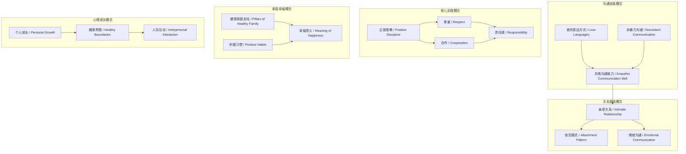
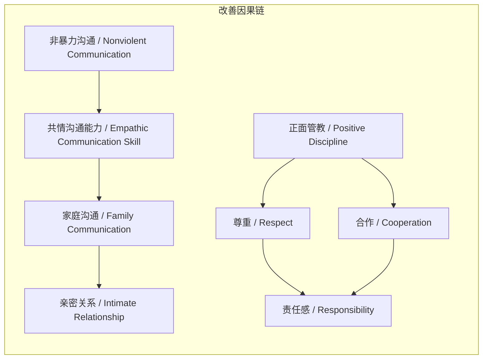

# 任务报告

- requestId: 1771890779079-45qgji
- 生成时间(UTC): 2026-02-23T23:54:08.923Z

## 文本总结

# 家庭关系改善经典书单推荐

## 整体结构化文档表达
### 文档卡片
- **主题（中文/English）**：家庭关系改善 / Family Relationship Improvement  
- **一句话摘要**：本文分类推荐覆盖家庭沟通、亲子育儿、夫妻幸福等领域的经典书籍，并提供基于目标的选书建议。  
- **目标读者**：寻求系统性提升家庭关系质量的个人或家庭。  
- **核心结论（3条）**：  
  1. 书单全面覆盖家庭关系核心领域（沟通、育儿、夫妻、心理成长）。  
  2. 推荐书籍兼具理论模型（如爱的五种语言）与实操策略（如正面管教）。  
  3. 读者可根据具体目标（如改善夫妻沟通）精准选择书籍，实现针对性提升。  

### 内容结构树
1. **背景与问题定义**：现代家庭在亲密互动、亲子教育、夫妻协调等方面常遇挑战，需基于研究与实践的指导。  
2. **核心观点与关键证据**：精选书籍提供多维度方案，如《亲密关系》解析互动模式，《非暴力沟通》训练共情技能，《正面管教》强调尊重合作。  
3. **方法/机制/路径**：通过阅读学习理论框架与实操方法（如爱的表达方式模型、非暴力沟通四步法），应用于日常家庭互动。  
4. **风险与边界条件**：书单为通用推荐，未针对特定文化背景、家庭结构或个人心理状态定制，效果依赖读者实践与调整。  
5. **结论与行动建议**：根据改善目标（如提升亲子关系）选择对应书籍；针对特殊需求（如婴幼儿期、婆媳关系）可进一步定制书单。  

### 结构化元数据（JSON）
```json
{
  "title": "家庭关系改善经典书单推荐",
  "topic_zh": "家庭关系改善",
  "topic_en": "Family Relationship Improvement",
  "audience": "寻求家庭关系改善的个人或家庭",
  "claims": [
    "书单全面覆盖家庭关系关键领域",
    "推荐书籍兼顾理论深度与实践指导",
    "可根据具体改善目标精准选择书籍"
  ],
  "evidence": [
    "《亲密关系》系统讲述夫妻关系、情绪沟通、依恋模式",
    "《非暴力沟通》提升共情沟通能力，让家庭对话更理解、更连接",
    "《正面管教》以尊重、合作为基础培养孩子责任感"
  ],
  "risks": [
    "书单为通用推荐，未考虑文化或个人差异",
    "书籍效果依赖读者实践与应用"
  ],
  "actions": [
    "根据改善目标选择对应书籍",
    "针对特定需求（如婴幼儿期亲子关系）可定制书单"
  ]
}
```

## 处理流程
1. **输入识别**：用户提供家庭关系类书籍推荐列表，含分类、书名、作者及核心内容描述。  
2. **信息抽取**：提取实体（书名、作者）、概念（如亲密关系、非暴力沟通）、问题（家庭沟通挑战）、事实（书籍内容描述）、观点（书籍价值评价）。  
3. **结构化归纳**：将书籍按主题（家庭沟通、亲子育儿、夫妻幸福、生活哲学、心理成长）分类，定义各领域关键概念。  
4. **关系建模**：建立书籍方法与家庭关系改善间的逻辑链，如“非暴力沟通 → 共情能力 → 家庭对话质量”。  
5. **可视化表达**：使用Mermaid图展示概念结构及因果链。  

## 概念清单（中英文）
- 家庭沟通 / Family Communication  
- 亲密关系 / Intimate Relationship  
- 依恋模式 / Attachment Pattern  
- 情绪沟通 / Emotional Communication  
- 爱的表达方式 / Love Languages  
- 共情沟通能力 / Empathic Communication Skill  
- 非暴力沟通 / Nonviolent Communication  
- 正面管教 / Positive Discipline  
- 尊重 / Respect  
- 合作 / Cooperation  
- 责任感 / Responsibility  
- 亲子沟通 / Parent-Child Communication  
- 性别孩子成长特点 / Gender-Specific Child Development  
- 关系模式 / Relationship Patterns  
- 冲突修复 / Conflict Repair  
- 亲密 / Intimacy  
- 爱的接收 / Love Reception  
- 健康家庭支柱 / Pillars of Healthy Family  
- 积极习惯 / Positive Habits  
- 幸福意义 / Meaning of Happiness  
- 个人成长 / Personal Growth  
- 自由 / Freedom  
- 健康界限 / Healthy Boundaries  
- 人际互动 / Interpersonal Interaction  

## 概念定义（中英文）
- **家庭沟通 / Family Communication**：家庭成员间信息与情感交流的过程，涵盖语言与非语言互动。  
- **亲密关系 / Intimate Relationship**：个体间亲密的情感联结，如夫妻或亲子关系，涉及情绪依赖与支持。  
- **依恋模式 / Attachment Pattern**：个体在亲密关系中表现出的典型行为与情感反应模式，影响关系稳定性。  
- **情绪沟通 / Emotional Communication**：家庭中情感的表达、识别与回应过程，是关系深度的关键。  
- **爱的表达方式 / Love Languages**：加里·查普曼提出的理论，描述人们表达和接收爱的五种方式（如肯定言语、精心的时刻）。  
- **共情沟通能力 / Empathic Communication Skill**：通过理解他人感受进行有效沟通的能力，减少误解与冲突。  
- **非暴力沟通 / Nonviolent Communication**：马歇尔·卢森堡提出的沟通方法，通过观察、感受、需要、请求四步促进共情连接。  
- **正面管教 / Positive Discipline**：简·尼尔森倡导的育儿方法，不惩罚、不溺爱，以尊重与合作培养孩子自律与责任感。  
- **尊重 / Respect**：对他人价值、权利与边界的认可与重视。  
- **合作 / Cooperation**：家庭成员共同工作、相互支持以实现共同目标的行为。  
- **责任感 / Responsibility**：个体对自身义务的认知、担当与履行。  
- **亲子沟通 / Parent-Child Communication**：父母与孩子之间的双向交流，影响孩子情感发展与行为养成。  
- **性别孩子成长特点 / Gender-Specific Child Development**：基于性别差异的儿童生理、心理与社会化发展特征与需求。  
- **关系模式 / Relationship Patterns**：亲密关系中反复出现的互动行为序列，如批评-防御循环。  
- **冲突修复 / Conflict Repair**：解决关系冲突并重建信任与亲密的过程。  
- **亲密 / Intimacy**：关系中的情感亲近、连接与开放程度。  
- **爱的接收 / Love Reception**：个体感知并接受他人爱意的方式，影响关系满意度。  
- **健康家庭支柱 / Pillars of Healthy Family**：维持家庭健康的核心要素，如情感连接、有效沟通、共同价值观。  
- **积极习惯 / Positive Habits**：支持家庭幸福的日常行为模式，如定期家庭活动、感恩表达。  
- **幸福意义 / Meaning of Happiness**：个体对幸福本质的理解与追求，受家庭关系影响。  
- **个人成长 / Personal Growth**：个体在心理、情感、认知等方面的自我提升与完善。  
- **自由 / Freedom**：个体在关系中自主选择与行动的权利，需与责任平衡。  
- **健康界限 / Healthy Boundaries**：在人际互动中维护自我与他人空间的合理界限，促进尊重与和谐。  
- **人际互动 / Interpersonal Interaction**：人与人之间的社会交流，包括家庭内外关系。  

## 概念关联与逻辑关系（中英文）
1. **爱的表达方式 / Love Languages** 与 **共情沟通能力 / Empathic Communication Skill** 共同影响 **家庭沟通 / Family Communication** 效果。  
   形式化：LL ∧ ECS → FC（LL: Love Languages, ECS: Empathic Communication Skill, FC: Family Communication）  
2. **尊重 / Respect** 与 **合作 / Cooperation** 共同影响 **责任感 / Responsibility** 培养。  
   形式化：R ∧ C → Res（R: Respect, C: Cooperation, Res: Responsibility）  
3. **依恋模式 / Attachment Pattern** 与 **情绪沟通 / Emotional Communication** 共同影响 **亲密关系 / Intimate Relationship** 质量。  
   形式化：AP ∧ EC → IR（AP: Attachment Pattern, EC: Emotional Communication, IR: Intimate Relationship）  

## COT逻辑梳理（定义/分类/比较/因果/科学方法论）
- **Step 1: 定义问题**：家庭关系面临沟通低效、亲子冲突、夫妻疏离等挑战，需系统知识指导改善。  
- **Step 2: 分类解决方案**：将推荐书籍按领域分为五类——家庭沟通（如《非暴力沟通》）、亲子育儿（如《正面管教》）、夫妻幸福（如《婚姻心理学》）、生活哲学（如《习惯的力量》）、心理成长（如《被讨厌的勇气》）。  
- **Step 3: 比较方法特点**：  
  - 理论型（如《亲密关系》）侧重机制解析，实践型（如《怎么说孩子才会听》）侧重技巧训练。  
  - 通用型（如《非暴力沟通》）适用于多场景，专项型（如《养育男孩》）针对特定群体。  
- **Step 4: 因果分析**：学习书籍中的模型与策略 → 提升相关技能（如共情、尊重） → 改善家庭互动模式 → 增进关系满意度与稳定性。  
- **Step 5: 科学方法论**：部分书籍（如戈特曼系列）基于实证研究（如婚姻实验室数据），提供可验证的方法，增强推荐可信度。  

## 事实与看法（病毒）
### 事实
- 《亲密关系》由罗兰·米勒和丹尼尔·珀尔曼合著，系统讲述夫妻关系、情绪沟通、依恋模式。  
- 《爱的五种语言》由加里·查普曼提出“爱的表达方式”模型。  
- 《非暴力沟通》由马歇尔·卢森堡撰写，旨在提升共情沟通能力。  
- 《正面管教》由简·尼尔森撰写，强调不惩罚、不溺爱，以尊重、合作培养责任感。  
- 《怎么说孩子才会听》由阿黛尔·费伯和伊莱恩·玛兹利什撰写，提供实用亲子沟通策略。  
- 《养育男孩》和《养育女孩》由史蒂夫·比达尔夫等撰写，针对不同性别孩子成长特点。  
- 《婚姻心理学》系列由约翰·戈特曼撰写，基于大量研究识别关系模式、修复冲突。  
- 《伴侣：婚姻中的五种语言》由加里·查普曼撰写，深入讲述婚姻中爱的接收。  
- 《家庭的未来》由约翰·戈特曼和娜恩·西尔弗撰写，从研究角度解析健康家庭支柱。  
- 《习惯的力量》由查尔斯·都希格撰写，讲述如何建立积极习惯。  
- 《被讨厌的勇气》由岸见一郎和古贺史健撰写，关于个人成长、自由与关系。  
- 书单分类小建议表格列出改善夫妻沟通、提升亲子关系等目标对应书籍。  

### 看法
- 这些书籍“帮助理解关系中的互动”。  
- “教你更好理解伴侣和孩子的需求”。  
- “让家庭对话更理解、更连接”。  
- “培养孩子责任感”。  
- “提供理解与陪伴方式”。  
- “教你识别关系模式、修复冲突、增进亲密”。  
- “解析健康家庭的支柱和实践方式”。  
- “建立支持幸福家庭的积极习惯”。  
- “有助于家庭成员更好理解自我与他人”。  
- “帮助理解健康界限与人际互动，是维持和谐家庭的重要部分”。  

## FAQ（原文问题整理）
- 未提及（原文无直接提问，仅提供推荐与建议）。  

## Visualization
### Mermaid 图 1（概念结构图）

### Mermaid 图 2（逻辑/因果图）


## 文章中的类比
- 未发现明确类比。  

## 10个金句
1. 系统讲述夫妻关系、情绪沟通、依恋模式  
2. 提出“爱的表达方式”模型  
3. 提升共情沟通能力  
4. 不惩罚、不溺爱  
5. 以尊重、合作为基础培养孩子责任感  
6. 基于大量研究教你识别关系模式、修复冲突、增进亲密  
7. 从研究角度解析健康家庭的支柱和实践方式  
8. 教你如何建立支持幸福家庭的积极习惯  
9. 有助于家庭成员更好理解自我与他人  
10. 帮助理解健康界限与人际互动
