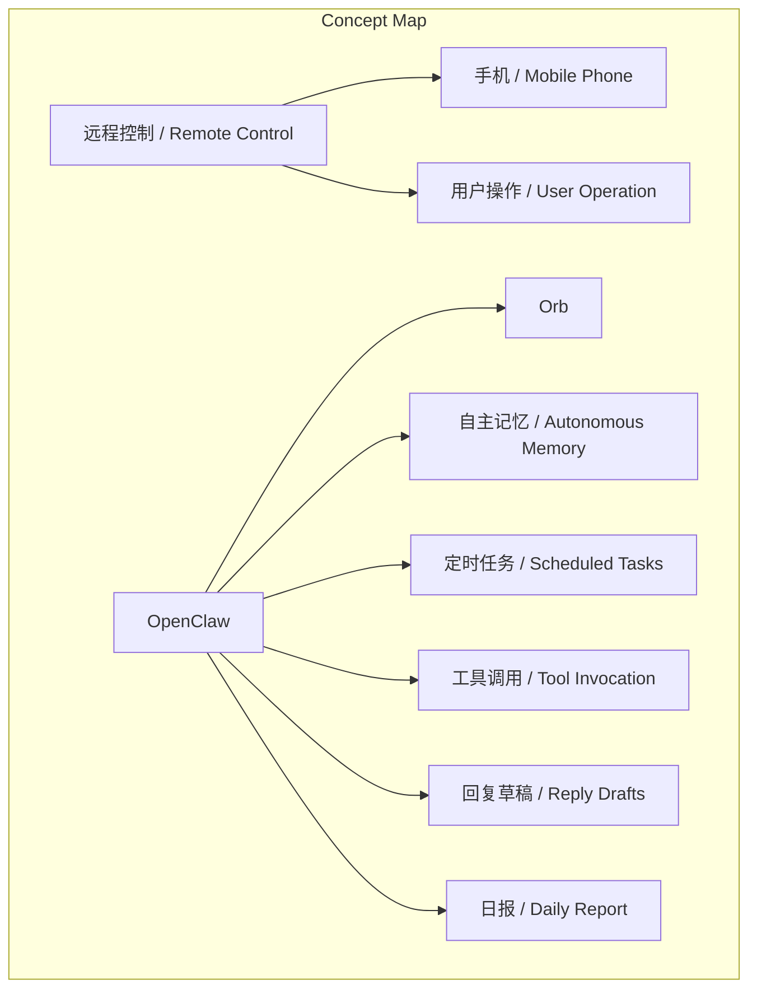
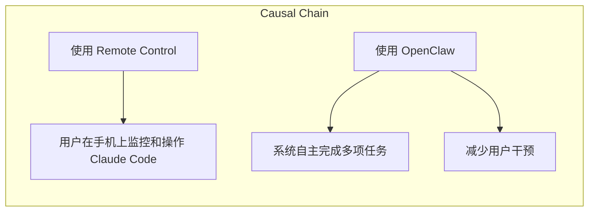

# 任务报告

- requestId: 1772150164425-0188xl
- 生成时间(UTC): 2026-02-26T23:56:53.969Z

## 文本总结

# 远程控制与后台代理：工具与运行时的区别

## 整体结构化文档表达

### 文档卡片
- 主题（中文/English）：远程控制与后台代理 / Remote Control and Background Agent
- 一句话摘要：Remote Control 和 OpenClaw 分别解决了不同的问题，前者是远程控制工具，后者是后台运行的代理。
- 目标读者：技术用户、软件开发者、自动化工具使用者
- 核心结论（3条）：
  1. Remote Control 是一个远程控制工具，用于在手机上监控和操作 Claude Code。
  2. OpenClaw 是一个后台运行时，具有自主记忆、定时任务和工具调用功能。
  3. 两者不是替代关系，而是互补工具，分别解决不同的需求。

### 内容结构树
1. 背景与问题定义
2. 核心观点与关键证据
3. 方法/机制/路径
4. 风险与边界条件
5. 结论与行动建议

### 结构化元数据（JSON）
```json
{
  "title": "远程控制与后台代理：工具与运行时的区别",
  "topic_zh": "远程控制与后台代理",
  "topic_en": "Remote Control and Background Agent",
  "audience": "技术用户、软件开发者、自动化工具使用者",
  "claims": [
    "Remote Control 是一个远程控制工具，用于在手机上监控和操作 Claude Code。",
    "OpenClaw 是一个后台运行时，具有自主记忆、定时任务和工具调用功能。",
    "两者不是替代关系，而是互补工具，分别解决不同的需求。"
  ],
  "evidence": [
    "Remote Control 让用户在手机上能看到 Claude Code 的进度、发指令。",
    "OpenClaw 的 Orb（我的 Agent）有自己的记忆、定时、工具调用功能，每天自动扫 X 提及、拟好回复草稿、发到 Discord 等我审批。",
    "OpenClaw 晚上还会自己写日报、整理记忆。"
  ],
  "risks": [
    "用户可能误解两者的功能，导致使用不当。",
    "Remote Control 和 OpenClaw 的集成需要额外的配置和管理。"
  ],
  "actions": [
    "明确区分 Remote Control 和 OpenClaw 的功能，避免混淆。",
    "根据具体需求选择合适的工具，或同时使用两者以提高效率。"
  ]
}
```

## 处理流程
1. 输入识别（来源：用户输入文本）
2. 信息抽取（实体、概念、问题、事实、观点）
3. 结构化归纳（定义/分类/比较/因果/方法论）
4. 关系建模（概念关系、等式/方程/逻辑链）
5. 可视化表达（Mermaid）

## 概念清单（中英文）
- 远程控制 / Remote Control
- OpenClaw
- Orb
- 运行时 / Runtime
- 工具调用 / Tool Invocation
- 自主记忆 / Autonomous Memory
- 定时任务 / Scheduled Tasks
- 回复草稿 / Reply Drafts
- 日报 / Daily Report

## 概念定义（中英文）
- 远程控制 / Remote Control：一个工具，允许用户在手机上监控和操作 Claude Code。
- OpenClaw：一个后台运行时，具有自主记忆、定时任务和工具调用功能。
- Orb：OpenClaw 中的代理，具有自主记忆和定时任务功能。
- 运行时 / Runtime：程序运行时的环境，支持程序的执行。
- 工具调用 / Tool Invocation：调用外部工具或服务以完成特定任务。
- 自主记忆 / Autonomous Memory：系统能够自主记录和管理信息。
- 定时任务 / Scheduled Tasks：系统在预定时间自动执行的任务。
- 回复草稿 / Reply Drafts：预先准备的回复文本，等待用户审批。
- 日报 / Daily Report：系统自动生成的每日总结报告。

## 概念关联与逻辑关系（中英文）
- 远程控制 / Remote Control 与 OpenClaw 共同影响 用户体验 / User Experience
- 远程控制 / Remote Control 与 手机 / Mobile Phone 共同影响 用户操作 / User Operation
- OpenClaw 与 Orb 共同影响 自动化任务 / Automated Tasks

## COT逻辑梳理（定义/分类/比较/因果/科学方法论）
### 定义
1. **远程控制 / Remote Control**：一个工具，允许用户在手机上监控和操作 Claude Code。
2. **OpenClaw**：一个后台运行时，具有自主记忆、定时任务和工具调用功能。
3. **Orb**：OpenClaw 中的代理，具有自主记忆和定时任务功能。

### 分类
1. **工具类型**：
   - 远程控制工具：Remote Control
   - 后台运行时：OpenClaw

### 比较
1. **功能对比**：
   - Remote Control：远程监控和操作
   - OpenClaw：自主记忆、定时任务、工具调用

### 因果
1. **使用 Remote Control 导致**：用户可以在手机上实时监控和操作 Claude Code。
2. **使用 OpenClaw 导致**：系统能够自主完成多项任务，减少用户干预。

### 科学方法论
1. **实验设计**：通过实际使用 Remote Control 和 OpenClaw，观察用户在不同场景下的效率和满意度。
2. **数据分析**：收集用户反馈和系统日志，分析工具的使用频率和效果。

## 事实与看法（病毒）
### 事实
- Remote Control 让用户在手机上能看到 Claude Code 的进度、发指令。
- OpenClaw 的 Orb（我的 Agent）有自己的记忆、定时、工具调用功能。
- OpenClaw 每天自动扫 X 提及、拟好回复草稿、发到 Discord 等我审批。
- OpenClaw 晚上还会自己写日报、整理记忆。

### 看法
- 有人认为 OpenClaw 没用了，这可能是误解了两者的功能。
- Remote Control 和 OpenClaw 不是替代关系，而是互补工具。

## FAQ（原文问题整理）
- 问题：Remote Control 和 OpenClaw 有什么区别？
  - 答：Remote Control 是一个远程控制工具，用于在手机上监控和操作 Claude Code。OpenClaw 是一个后台运行时，具有自主记忆、定时任务和工具调用功能。
- 问题：两者是否可以替代？
  - 答：不能替代，两者解决不同的问题，是互补工具。

## Visualization
### Mermaid 图 1（概念结构图）


### Mermaid 图 2（逻辑/因果图）


## 文章中的类比
- 一个是"远程控制器"，一个是"后台当班的队友"。

## 10个金句
1. Remote Control 解决了一个真实痛点：离开电脑也能跟进。
2. 但看到有人说「OpenClaw 没用了」感觉是没理解两者在解决什么。
3. Remote Control 是一个工具——让你手机上能看到 Claude Code 的进度、发指令。
4. 本质还是你在操作。
5. OpenClaw 是一个运行时——Orb（我的 Agent）有自己的记忆、定时、工具调用。
6. 每天自动扫 X 提及、拟好回复草稿、发到 Discord 等我审批。
7. 晚上还会自己写日报、整理记忆。
8. 我不需要"接上去" 它一直在跑。
9. 一个是"远程控制器" 一个是"后台当班的队友"。
10. 不是替代关系。
