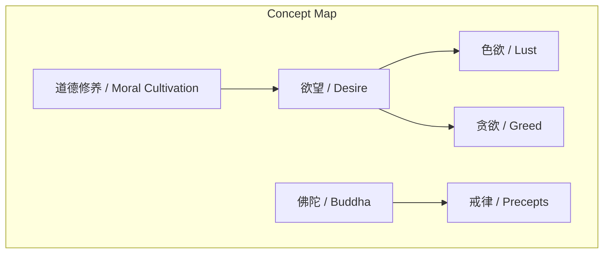
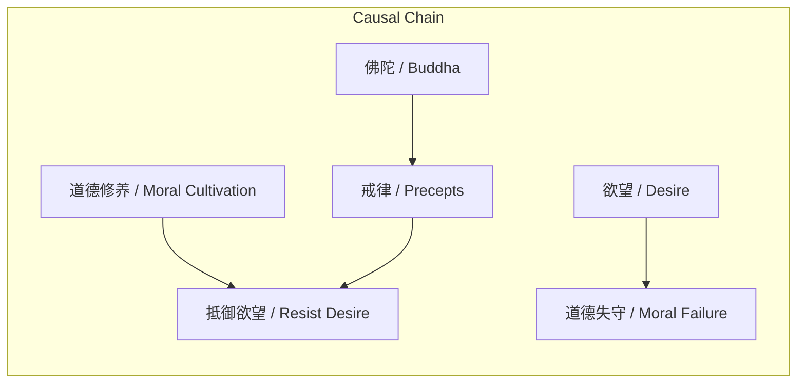

# 任务报告

- requestId: 1772150231847-lwnchn
- 生成时间(UTC): 2026-02-26T23:57:50.854Z

## 文本总结

# 守住道义与修养
- 生成一个能准确概括内容主旨的标题（20字以内）

## 整体结构化文档表达

### 文档卡片
- 主题（中文/English）：道德修养与欲望控制 / Moral Cultivation and Desire Control
- 一句话摘要：文章强调了道德修养的重要性，指出欲望是导致道德失守的根本原因。
- 目标读者：关注个人修养与道德提升的读者
- 核心结论（3条）：
  1. 道德修养是抵御欲望的关键。
  2. 欲望是导致道德失守的根本原因。
  3. 佛陀的教诲强调戒除贪欲的重要性。

### 内容结构树
1. 背景与问题定义
2. 核心观点与关键证据
3. 方法/机制/路径
4. 风险与边界条件
5. 结论与行动建议

### 结构化元数据（JSON）
```json
{
  "title": "守住道义与修养",
  "topic_zh": "道德修养与欲望控制",
  "topic_en": "Moral Cultivation and Desire Control",
  "audience": "关注个人修养与道德提升的读者",
  "claims": [
    "道德修养是抵御欲望的关键",
    "欲望是导致道德失守的根本原因",
    "佛陀的教诲强调戒除贪欲的重要性"
  ],
  "evidence": [
    "欲望引领躯体，色欲本身来源于贪欲",
    "佛陀临终之前告诫弟子们以戒为师"
  ],
  "risks": [
    "无法克服欲望可能导致道德失守"
  ],
  "actions": [
    "加强道德修养，戒除贪欲"
  ]
}
```

## 处理流程
1. 输入识别（来源：用户输入文本）
2. 信息抽取（实体、概念、问题、事实、观点）
3. 结构化归纳（定义/分类/比较/因果/方法论）
4. 关系建模（概念关系、等式/方程/逻辑链）
5. 可视化表达（Mermaid）

## 概念清单（中英文）
- 道德修养 / Moral Cultivation
- 欲望 / Desire
- 色欲 / Lust
- 贪欲 / Greed
- 佛陀 / Buddha
- 戒律 / Precepts

## 概念定义（中英文）
- 道德修养 / Moral Cultivation：个人在道德和伦理方面的自我提升和修炼。
- 欲望 / Desire：对某种事物或状态的强烈渴望。
- 色欲 / Lust：对性的强烈欲望。
- 贪欲 / Greed：对财富、权力等的过度追求。
- 佛陀 / Buddha：佛教的创始人，释迦牟尼佛。
- 戒律 / Precepts：佛教中规定的修行者应遵守的行为准则。

## 概念关联与逻辑关系（中英文）
- 道德修养（道德修养 / Moral Cultivation）与欲望（欲望 / Desire）：道德修养能够帮助个体抵御欲望的诱惑。
- 欲望（欲望 / Desire）与色欲（色欲 / Lust）：色欲是欲望的一种具体表现形式。
- 佛陀（佛陀 / Buddha）与戒律（戒律 / Precepts）：佛陀强调戒律的重要性，以帮助弟子克服欲望。

## COT逻辑梳理（定义/分类/比较/因果/科学方法论）
### Step 1：定义
- 道德修养：个人在道德和伦理方面的自我提升和修炼。
- 欲望：对某种事物或状态的强烈渴望。
- 色欲：对性的强烈欲望。
- 贪欲：对财富、权力等的过度追求。
- 佛陀：佛教的创始人，释迦牟尼佛。
- 戒律：佛教中规定的修行者应遵守的行为准则。

### Step 2：分类
- 欲望分为色欲和贪欲。
- 戒律是佛陀为弟子制定的行为准则。

### Step 3：比较
- 道德修养与欲望：道德修养能够帮助个体抵御欲望的诱惑。
- 色欲与贪欲：色欲是欲望的一种具体表现形式，而贪欲是对财富、权力等的过度追求。

### Step 4：因果
- 欲望是导致道德失守的根本原因。
- 佛陀强调戒律的重要性，以帮助弟子克服欲望。

### Step 5：科学方法论
- 通过加强道德修养，个体可以更好地抵御欲望的诱惑，从而避免道德失守。

## 事实与看法（病毒）
### 事实
- 佛陀临终之前告诫弟子们以戒为师。

### 看法
- 欲望是导致道德失守的根本原因。
- 道德修养是抵御欲望的关键。

## FAQ（原文问题整理）
- 未发现明确问题

## Visualization
### Mermaid 图 1（概念结构图）


### Mermaid 图 2（逻辑/因果图）


## 文章中的类比
- 未发现明确类比

## 10个金句
1. 一个守字简单，守得住活寡，守得住道义。
2. 本质上还是修养上下功夫。
3. 沾花惹草就是失守了。
4. 欲望引领躯体，色欲本身来源于贪欲。
5. 这个欲望克服不了，修养上不了层次。
6. 佛陀临终之前告诫弟子们以戒为师，就是这个意思。
7. 戒掉贪嗔痴各种欲望。
8. 原文未提供
9. 原文未提供
10. 原文未提供
