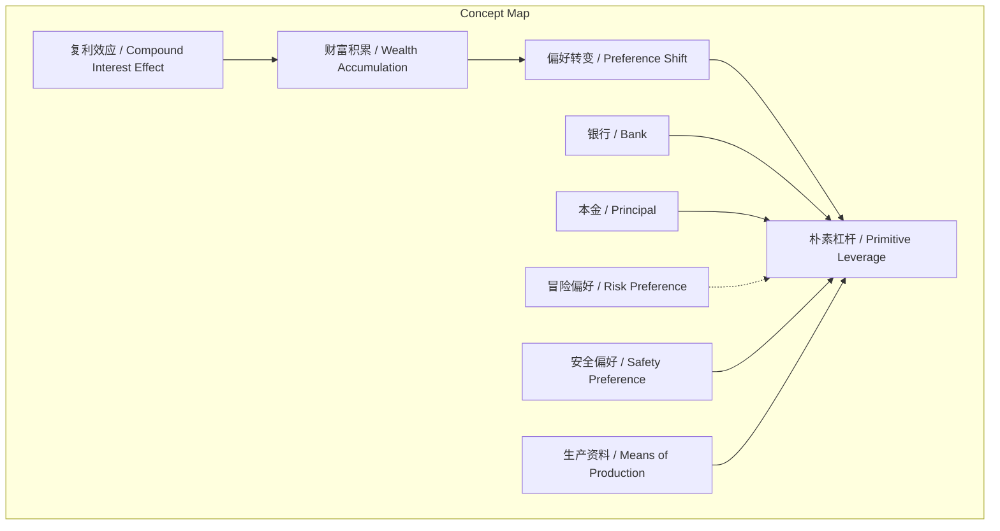
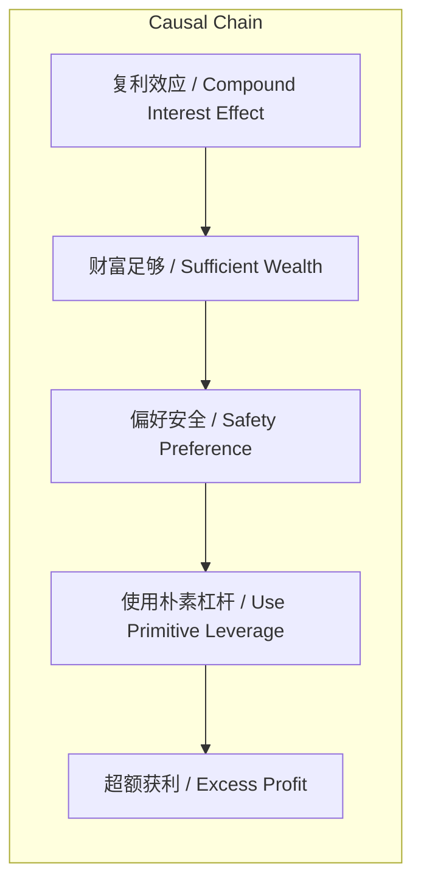

# 任务报告

- requestId: 1772150374678-5yb873
- 生成时间(UTC): 2026-02-27T00:00:28.616Z

## 文本总结

# 朴素杠杆：富裕后的安全偏好与生产工具

## 整体结构化文档表达
### 文档卡片
- **主题（中文/English）**：朴素杠杆 / Primitive Leverage  
- **一句话摘要**：本文阐述朴素杠杆的正确使用前提是财富足够积累、个人偏好从冒险转向安全，并通过银行商业模式类比说明其作为生产工具的本质。  
- **目标读者**：对投资理财、财富管理感兴趣的普通读者或初学者。  
- **核心结论（3条）**：
  1. 杠杆本身非危险工具，但必须在财富足够、偏好安全时使用，否则易沦为赌博。
  2. 银行是使用“钱”作为生产资料的杠杆典范，其模式为低利润率×高杠杆=暴利。
  3. 普通人应通过复利积累本金，避免过早使用杠杆，待成为“万分之一富人”后再应用朴素杠杆。

### 内容结构树
1. **背景与问题定义**：作者因市场爆仓报道和巴菲特警告，对杠杆心存恐惧与疑惑，遂学习《朴素杠杆》课程。
2. **核心观点与关键证据**：杠杆是生产工具；使用前提是财富足够、偏好安全；99.99%的人因本金少而用错杠杆；银行商业模式是杠杆核心。
3. **方法/机制/路径**：通过复利积累财富；达到富裕后，以自有本金为抵押（力矩），低息借入资金，配置高回报资产（如26%-35%收益）。
4. **风险与边界条件**：本金不足时使用杠杆即冒险；个体无银行牌照，不能非法集资；朴素杠杆仅适用于财富积累后的安全偏好阶段。
5. **结论与行动建议**：牢记使用前提，长期持有积累复利，目标成为万分之一富人。

### 结构化元数据（JSON）
```json
{
  "title": "朴素杠杆：富裕后的安全偏好与生产工具",
  "topic_zh": "朴素杠杆",
  "topic_en": "Primitive Leverage",
  "audience": "对投资理财、财富管理感兴趣的普通读者或初学者",
  "claims": [
    "杠杆本身非危险工具，但必须在财富足够、偏好安全时使用，否则易沦为赌博。",
    "银行是使用“钱”作为生产资料的杠杆典范，其模式为低利润率×高杠杆=暴利。",
    "普通人应通过复利积累本金，避免过早使用杠杆，待成为“万分之一富人”后再应用朴素杠杆。"
  ],
  "evidence": [
    "课程案例：如何用100个比特币做朴素杠杆操作。",
    "银行商业模式：原材料为钱（存款），产品为钱（贷款），加工工艺为风险控制，模式为低利润率×高杠杆=暴利。",
    "作者认为：99.99%的人杠杆都用错，因本金太少追求效率，变成赌博。"
  ],
  "risks": [
    "本金不足时使用杠杆等同于冒险，可能导致爆仓、归零。",
    "个体无银行牌照，不能非法集资，故不能直接开银行。",
    "若偏好未从冒险转为安全，使用杠杆可能违背前提，导致失败。"
  ],
  "actions": [
    "通过长期投资积累复利，增加本金。",
    "等待财富足够、偏好安全后，再考虑朴素杠杆。",
    "学习银行风险管理，以自有本金为抵押借入资金，配置高回报资产。"
  ]
}
```

## 处理流程
1. 输入识别（来源：用户输入文本）
2. 信息抽取（实体、概念、问题、事实、观点）
3. 结构化归纳（定义/分类/比较/因果/方法论）
4. 关系建模（概念关系、等式/方程/逻辑链）
5. 可视化表达（Mermaid）

## 概念清单（中英文）
- 朴素杠杆 / Primitive Leverage
- 杠杆 / Leverage
- 比特币 / Bitcoin
- 特斯拉AP / Tesla Autopilot
- 复利效应 / Compound Interest Effect
- 银行 / Bank
- 存款 / Deposit
- 贷款 / Loan
- 利差 / Interest Rate Spread
- 风险控制 / Risk Control
- 抵押 / Collateral
- 信誉 / Creditworthiness
- 本金 / Principal
- 暴利 / Excessive Profit
- 万分之一富人 / One in Ten Thousand Wealthy Individuals
- 冒险偏好 / Risk Preference
- 安全偏好 / Safety Preference
- 生产资料 / Means of Production
- 体力和脑力马拉松 / Physical and Mental Marathon

## 概念定义（中英文）
- **朴素杠杆 / Primitive Leverage**：指在个人财富足够积累、偏好从冒险转向安全后，使用杠杆作为生产工具的投资方式，其商业模式类似银行，以自有本金为抵押借入资金配置高回报资产。
- **杠杆 / Leverage**：指用少量本金撬动更大资产规模的金融操作，文中区分了错误使用（冒险）和正确使用（朴素杠杆）。
- **比特币 / Bitcoin**：文中作为朴素杠杆案例中使用的资产示例。
- **特斯拉AP / Tesla Autopilot**：特斯拉自动驾驶系统，在自驾中承担驾驶任务，使作者能专注于思考。
- **复利效应 / Compound Interest Effect**：指财富通过利息再投资逐步增长的过程，是积累本金的关键途径。
- **银行 / Bank**：金融机构，其核心商业模式是使用“钱”作为生产资料，通过杠杆赚取利差。
- **存款 / Deposit**：银行吸收的资金，作为杠杆操作的原材料，成本较低。
- **贷款 / Loan**：银行发放的资金，作为产品，收取更高利息。
- **利差 / Interest Rate Spread**：贷款利率与存款利率之差，是银行利润来源之一。
- **风险控制 / Risk Control**：银行通过抵押、信誉评估等手段管理贷款风险，是杠杆加工的工艺。
- **抵押 / Collateral**：借款人提供的资产担保，降低贷款风险，文中作为朴素杠杆中的“力矩”。
- **信誉 / Creditworthiness**：借款人的信用状况，影响贷款审批和利率。
- **本金 / Principal**：自有资金，是杠杆操作的基础，不足时使用杠杆易导致冒险。
- **暴利 / Excessive Profit**：银行通过低利润率乘以高杠杆获得的巨额利润。
- **万分之一富人 / One in Ten Thousand Wealthy Individuals**：指财富积累到足够程度、偏好安全的极少数人群（0.01%）。
- **冒险偏好 / Risk Preference**：追求高风险高回报的心理倾向，常见于本金不足者。
- **安全偏好 / Safety Preference**：追求稳健、避免风险的心理倾向，常见于财富足够者。
- **生产资料 / Means of Production**：指用于生产的资源或工具，文中“钱”是最本质的生产资料。
- **体力和脑力马拉松 / Physical and Mental Marathon**：比喻长途自驾、跑步、游泳等运动，需同时消耗体力和脑力，促进深入思考。

## 概念关联与逻辑关系（中英文）
1. **复利效应 / Compound Interest Effect** 与 **财富积累 / Wealth Accumulation** 共同导致 **偏好转变 / Preference Shift**（从冒险到安全），进而允许 **朴素杠杆 / Primitive Leverage** 的使用。  
   形式化：复利效应 ∧ 财富积累足够 → 安全偏好 → 朴素杠杆。
2. **银行 / Bank** 的商业模式 = **低利润率 / Low Profit Margin** × **高杠杆 / High Leverage** → **暴利 / Excessive Profit**。  
   形式化：银行模式 = (低利润率) × (高杠杆) = 暴利。
3. **本金 / Principal** 不足 → **冒险偏好 / Risk Preference** → **杠杆误用 / Misuse of Leverage**（如赌博）。  
   形式化：本金不足 → 冒险偏好 → 杠杆误用。

## COT逻辑梳理（定义/分类/比较/因果/科学方法论）
- **Step 1: 定义**：明确杠杆是金融工具，但常被误解为危险；朴素杠杆特指财富足够后安全使用的杠杆。
- **Step 2: 分类**：区分“冒险式杠杆”（本金少、追求效率、易成赌博）和“朴素杠杆”（富裕后、安全偏好、类似银行模式）。
- **Step 3: 比较**：对比99.99%普通人与万分之一富人对杠杆的使用——前者因本金少而用错，后者因财富够而善用。
- **Step 4: 因果**：复利效应导致财富积累 → 财富足够引发偏好从冒险转为安全 → 安全偏好下朴素杠杆成为生产工具 → 实现超额获利。
- **Step 5: 科学方法论**：通过长期复利验证财富积累；通过抵押、风险控制模拟银行模式；以偏好转变作为朴素杠杆使用的前提条件。

## 事实与看法（病毒）
### 事实
- 作者喜欢长途自驾、跑步、游泳，因可主动或被动摆脱电子屏幕、隔绝信息。
- 《朴素杠杆》课程案例使用100个比特币演示操作。
- 银行商业模式：原材料为钱（存款，低息揽储），产品为钱（贷款，收取更高利息），加工工艺为风险控制（抵押、信誉），模式为低利润率×高杠杆=暴利。
- 个体无银行牌照，不能非法集资，故不能直接开银行。
- 巴菲特、段永平等告诫“不要用杠杆”。
### 看法
- 杠杆在潜意识里是“洪水猛兽”、危险东西，碰了会上瘾。
- “冒险是稀缺的偏好，安全是富足的偏好。”
- 99.99%的人杠杆都用错，他们在冒险而不自知，错在本金太少、追求效率。
- 朴素杠杆是“富人思维方式”，需等到足够富裕、偏好安全后才能使用。
- “我们不一样，我们终究会成为那万分之一的富人。”
- 总想着用杠杆赚更多比特币，说明财富积累不够，本身在冒险。

## FAQ（原文问题整理）
- **Q：为什么要用杠杆？**  
  A：因为“钱”是最本质的生产资料，杠杆是让钱从事生产的方式，类似银行商业模式。
- **Q：为什么要冒险？**  
  A：朴素杠杆的前提是足够富裕、偏好安全，此时使用杠杆不是冒险，而是生产工具。
- **Q：不用杠杆慢慢变富不也挺好嘛？**  
  A：慢慢变富可行，但朴素杠杆是富裕后的必修课，可加速财富增长。
- **Q：如何用朴素杠杆多赚比特币？**  
  A：以自有本金为抵押（力矩），低息借入资金，再配置26%甚至35%高回报资产。
- **Q：我们能不能开银行从事生产？**  
  A：不能，个体无牌照，不能非法集资；但可模拟其商业模式：用自己的钱做抵押借别人的钱再放贷。

## Visualization
### Mermaid 图 1（概念结构图）

### Mermaid 图 2（逻辑/因果图）


## 文章中的类比
1. 朴素杠杆 ≈ 开个人银行的商业模式（用自己的钱做抵押借别人的钱再放贷）。
2. 长途自驾、跑步、游泳 = 体力和脑力马拉松运动。
3. 杠杆（最初认知） = 洪水猛兽。

## 10个金句
1. 冒险是稀缺的偏好，安全是富足的偏好。
2. 杠杆不是洪水猛兽。
3. 我们不一样，我们终究会成为那万分之一的富人。
4. 钱是最本质的生产资料。
5. 银行的商业模式核心是杠杆：用极少的本金撬动极大的资产规模。
6. 朴素杠杆的前提一定等到足够富裕，等到偏好从冒险变成安全的时候才能用杠杆。
7. 总想着怎么用杠杆赚更多比特币，恰恰说明自己财富积累得还不够多，其实是在冒险，本不应用任何杠杆。
8. 对于99.99%的人们，财富积累都不足够多，以至于用任何杠杆看起来都像是在冒险。
9. 我们终将足够富裕，必须学会让“钱”成为我们的生产资料。
10. 长期持有，等待收获复利效应。
