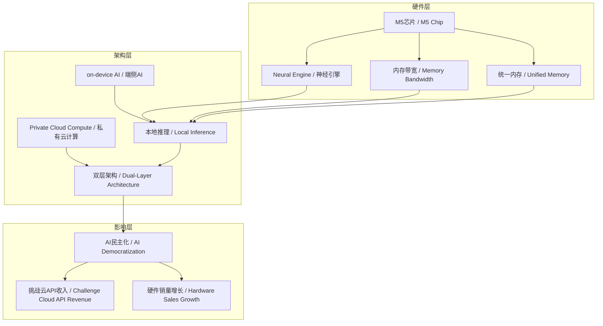
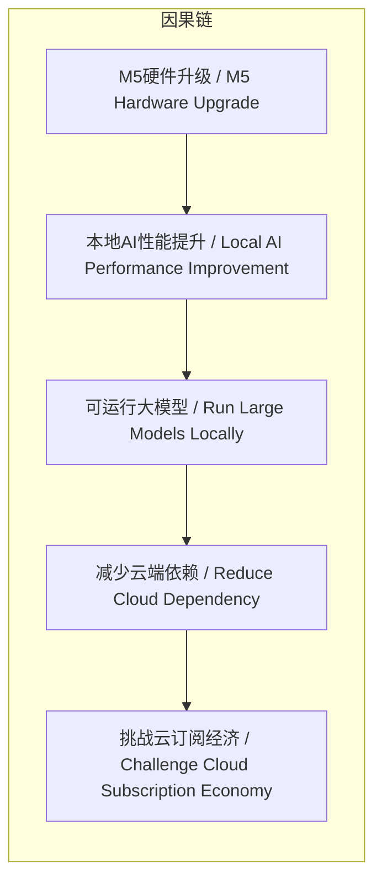

# 任务报告

- requestId: 1772150684171-c4wh5l
- 生成时间(UTC): 2026-02-27T00:05:45.137Z

## 文本总结

# M5芯片：AI硬件本地化拐点

## 整体结构化文档表达
### 文档卡片
- **主题**：苹果M5芯片与AI硬件变革 / Apple M5 Chip and AI Hardware Transformation
- **一句话摘要**：苹果M5系列芯片通过架构升级，推动AI从云端向本地设备迁移，可能颠覆云服务模式并加速AI民主化。
- **目标读者**：科技行业从业者、投资者、开发者、企业决策者
- **核心结论**：
  1. M5是AI本地化的关键硬件转折点，通过芯片级优化实现高性能本地推理。
  2. 本地推理能力将挑战云API订阅经济，降低用户成本并提升隐私。
  3. 苹果通过硬件生态闭环（本地+私有云）强化竞争力，可能弯道超车云巨头。

### 内容结构树
1. **背景与问题定义**：AI计算依赖云端导致隐私风险、延迟高、API费用昂贵，需硬件革新实现本地化。
2. **核心观点与关键证据**：
   - M5工艺与架构升级：TSMC N3P制程、GPU内置Neural Accelerator、内存带宽大幅提升。
   - 生态闭环：Private Cloud Compute形成本地与私有云双层架构。
   - 投资影响：利好苹果硬件与服务，冲击云巨头API收入，加速AI民主化。
3. **方法/机制/路径**：硬件层面（芯片架构、模块设计）、软件框架（MLX）、生态整合（端到端加密）共同实现on-device AI。
4. **风险与边界条件**：TSMC产量、实际热控、Apple Intelligence等软件生态落地深度可能制约效果。
5. **结论与行动建议**：M5可能使苹果在本地AI赛道弯道超车；个人/企业可关注Mac Studio作为AI工作站；云服务商需应对本地化趋势。

### 结构化元数据（JSON）
```json
{
  "title": "M5芯片：AI硬件本地化拐点",
  "topic_zh": "苹果M5芯片与AI硬件变革",
  "topic_en": "Apple M5 Chip and AI Hardware Transformation",
  "audience": "科技行业从业者、投资者、开发者、企业决策者",
  "claims": [
    "M5是AI本地化的关键硬件转折点",
    "本地推理将挑战云API订阅经济",
    "苹果通过硬件生态闭环强化竞争力"
  ],
  "evidence": [
    "M5基于TSMC N3P制程，GPU AI性能比M4高4倍以上",
    "内存带宽从120GB/s跳到153GB/s，M5 Max可达500GB/s",
    "M5 Ultra支持512GB以上统一内存，适合运行大模型",
    "Private Cloud Compute形成本地与私有云无缝双层架构",
    "Mac Studio可本地运行70B-200B参数模型"
  ],
  "risks": [
    "TSMC产量不确定性",
    "实际热控问题",
    "Apple Intelligence等软件生态落地深度不足"
  ],
  "actions": [
    "个人/企业可评估Mac Studio作为AI工作站",
    "云服务商需调整策略应对本地化趋势",
    "开发者关注MLX框架优化AI应用"
  ]
}
```

## 处理流程
1. **输入识别**：识别文本为关于苹果M5芯片的新闻分析，主题聚焦AI硬件本地化变革。
2. **信息抽取**：抽取实体（M5系列、TSMC、Neural Engine）、概念（on-device AI、本地推理）、问题（云端依赖）、观点（拐点、颠覆）及事实数据。
3. **结构化归纳**：将内容分类为背景、核心观点、方法、风险、结论；定义关键概念；建立因果链。
4. **关系建模**：识别概念间逻辑，如硬件升级→性能提升→本地推理可行→挑战云服务。
5. **可视化表达**：使用Mermaid绘制概念结构图与因果图，节点均基于真实概念。

## 概念清单（中英文）
- Apple M5系列 / Apple M5 Series
- AI硬件拐点 / AI Hardware Inflection Point
- M系列芯片 / M-Series Chip
- 计算边界 / Computing Boundary
- 2026年 / 2026
- M5家族 / M5 Family
- M5 Pro / M5 Pro
- M5 Max / M5 Max
- MacBook Pro / MacBook Pro
- M5 Ultra / M5 Ultra
- Mac Studio / Mac Studio
- TSMC / TSMC (台积电)
- N3P制程 / N3P Process
- GPU / GPU
- Neural Accelerator / 神经加速器
- Neural Engine / 神经引擎
- 内存带宽 / Memory Bandwidth
- CPU/GPU模块设计 / CPU/GPU Module Design
- 双Max融合 / Dual-Max Fusion
- 统一内存 / Unified Memory
- on-device AI / 端侧AI
- 隐私优先 / Privacy-First
- API费用 / API Costs
- 本地推理 / Local Inference
- 70B-200B参数模型 / 70B-200B Parameter Models
- Claude 3.5 / Claude 3.5
- Llama 405B / Llama 405B
- 云订阅 / Cloud Subscription
- Private Cloud Compute / 私有云计算
- 双层架构 / Dual-Layer Architecture
- MLX框架 / MLX Framework
- AI应用 / AI Application
- 图像生成 / Image Generation
- 代码助手 / Code Assistant
- 视频增强 / Video Enhancement
- 投资视角 / Investment Perspective
- 硬件销量 / Hardware Sales
- 服务粘性 / Service Stickiness
- AI工作站标杆 / AI Workstation Benchmark
- NVIDIA高端卡 / NVIDIA High-End Cards
- 功耗 / Power Consumption
- 生态闭环 / Ecosystem Closed-Loop
- 云巨头 / Cloud Giants
- API收入模型 / API Revenue Model
- AI民主化 / AI Democratization
- 中小企业 / SMEs
- 创作者 / Creators
- 开发者 / Developers
- GPU集群 / GPU Clusters
- 个人AI代理 / Personal AI Agent
- TSMC产量 / TSMC Production Volume
- 热控 / Thermal Control
- 软件生态 / Software Ecosystem
- Apple Intelligence / Apple Intelligence
- 本地AI赛道 / Local AI Track
- 弯道超车 / Overtaking on Curves
- AI即硬件 / AI as Hardware
- 个人超级智能 / Personal Superintelligence
- 计算胜负 / Computing Victory

## 概念定义（中英文）
- **Apple M5系列 / Apple M5 Series**：苹果公司预计2026年推出的新一代处理器系列，包括M5 Pro/Max/Ultra，专为AI计算优化。
- **AI硬件拐点 / AI Hardware Inflection Point**：指硬件技术（如M5）使AI从云端大规模转向本地设备的转折点。
- **M系列芯片 / M-Series Chip**：苹果自研的ARM架构处理器系列，以能效和集成度著称。
- **计算边界 / Computing Boundary**：比喻计算能力可触及的范围，M系列芯片通过本地AI扩展此边界。
- **2026年 / 2026**：M5系列预计亮相及全面铺货的时间节点。
- **M5家族 / M5 Family**：包括M5 Pro、M5 Max、M5 Ultra等型号的芯片总称。
- **M5 Pro / M5 Pro**：M5系列的高端型号，首次分离CPU/GPU模块设计以优化并行AI。
- **M5 Max / M5 Max**：M5系列的超高端型号，内存带宽极高（传闻500GB/s），适合大模型推理。
- **MacBook Pro / MacBook Pro**：搭载M5 Pro/Max的笔记本电脑，面向专业用户。
- **M5 Ultra / M5 Ultra**：M5系列的顶级型号，采用“双Max融合”，核心数翻倍，统一内存可达512GB以上。
- **Mac Studio / Mac Studio**：搭载M5 Max/Ultra的台式工作站，定位AI计算标杆。
- **TSMC / TSMC (台积电)**：半导体代工厂，为苹果生产M5芯片，采用N3P制程。
- **N3P制程 / N3P Process**：台积电第三代3nm工艺，提升能效和性能。
- **GPU / GPU**：图形处理器，M5中内置Neural Accelerator以增强AI计算。
- **Neural Accelerator / 神经加速器**：M5 GPU核心内置的专用AI计算单元，提升峰值AI性能。
- **Neural Engine / 神经引擎**：苹果芯片中的专用AI处理单元，M5升级为16核，更高效。
- **内存带宽 / Memory Bandwidth**：内存与处理器间数据传输速率，M5提升至153GB/s（Pro/Max版更高），加速大模型加载。
- **CPU/GPU模块设计 / CPU/GPU Module Design**：M5 Pro/Max分离CPU与GPU模块，优化并行AI任务。
- **双Max融合 / Dual-Max Fusion**：M5 Ultra将两颗M5 Max芯片融合，核心数翻倍。
- **统一内存 / Unified Memory**：CPU、GPU共享的高带宽内存，M5 Ultra可能达512GB以上。
- **on-device AI / 端侧AI**：在设备本地（如Mac）直接运行AI模型，无需云端。
- **隐私优先 / Privacy-First**：本地AI避免数据上传，保护用户隐私。
- **API费用 / API Costs**：使用云AI服务（如GPT-4o）的订阅费用，本地AI可省去。
- **本地推理 / Local Inference**：在设备上执行AI模型推理，低延迟、无数据外泄。
- **70B-200B参数模型 / 70B-200B Parameter Models**：大语言模型规模，M5 Ultra可本地运行。
- **Claude 3.5 / Claude 3.5**：Anthropic的大语言模型，M5本地运行性能可比。
- **Llama 405B / Llama 405B**：Meta的开源大模型，M5可本地运行。
- **云订阅 / Cloud Subscription**：按月付费使用云AI服务（如$20/月GPT-4o）。
- **Private Cloud Compute / 私有云计算**：苹果服务，当本地算力不足时无缝调用私有云，保持端到端加密。
- **双层架构 / Dual-Layer Architecture**：本地设备与私有云协同的AI计算架构。
- **MLX框架 / MLX Framework**：苹果为机器学习优化的开发框架，便于开发者部署本地AI应用。
- **AI应用 / AI Application**：如本地图像生成、代码助手、视频增强等软件。
- **图像生成 / Image Generation**：AI生成图像的任务，本地运行可提升隐私和速度。
- **代码助手 / Code Assistant**：AI辅助编程工具，本地运行减少延迟。
- **视频增强 / Video Enhancement**：AI提升视频质量的应用。
- **投资视角 / Investment Perspective**：从投资者角度分析M5对苹果及行业的影响。
- **硬件销量 / Hardware Sales**：M5可能推动Mac系列销量增长。
- **服务粘性 / Service Stickiness**：硬件升级增强用户对苹果生态的依赖。
- **AI工作站标杆 / AI Workstation Benchmark**：M5 Ultra Mac Studio可能成为行业标准。
- **NVIDIA高端卡 / NVIDIA High-End Cards**：如H100等云端AI训练卡，M5 Ultra在功耗和生态上形成对比。
- **功耗 / Power Consumption**：M5 Ultra相比NVIDIA卡功耗更低。
- **生态闭环 / Ecosystem Closed-Loop**：苹果通过芯片、OS、服务整合，提供端到端体验。
- **云巨头 / Cloud Giants**：如OpenAI、Anthropic、Google，依赖API收入。
- **API收入模型 / API Revenue Model**：云服务商通过API调用收费的商业模式。
- **AI民主化 / AI Democratization**：降低AI使用门槛，使更多个人/企业能访问强大AI。
- **中小企业 / SMEs**：中小型企业，可受益于本地AI降低算力成本。
- **创作者 / Creators**：内容创作者，可本地运行AI工具提升效率。
- **开发者 / Developers**：软件开发者，可基于MLX框架构建本地AI应用。
- **GPU集群 / GPU Clusters**：云端租用的多GPU计算资源，本地AI减少对此依赖。
- **个人AI代理 / Personal AI Agent**：个性化AI助手，本地运行更私密、实时。
- **TSMC产量 / TSMC Production Volume**：台积电N3P制程的产能，可能影响M5供货。
- **热控 / Thermal Control**：设备散热能力，高功耗下可能限制性能。
- **软件生态 / Software Ecosystem**：如Apple Intelligence等软件对M5的利用深度。
- **Apple Intelligence / Apple Intelligence**：苹果AI功能集，依赖硬件支持。
- **本地AI赛道 / Local AI Track**：聚焦设备端AI计算的竞争领域。
- **弯道超车 / Overtaking on Curves**：比喻苹果在本地AI领域快速超越云巨头。
- **AI即硬件 / AI as Hardware**：将AI能力深度集成到硬件中，而非仅软件服务。
- **个人超级智能 / Personal Superintelligence**：本地运行的高性能AI模型，提供类超级智能体验。
- **计算胜负 / Computing Victory**：未来计算竞争的关键在于谁能将最强模型本地化。

## 概念关联与逻辑关系（中英文）
1. **M5芯片的GPU AI性能提升 / GPU AI Performance Improvement of M5 Chip** 与 **内存带宽增加 / Memory Bandwidth Increase** 共同影响 **本地推理速度 / Local Inference Speed**。  
   形式化：Local Inference Speed ∝ GPU AI Performance × Memory Bandwidth
2. **on-device AI / 端侧AI** 与 **Private Cloud Compute / 私有云计算** 共同构成 **双层架构 / Dual-Layer Architecture**。  
   形式化：Dual-Layer Architecture = on-device AI ∪ Private Cloud Compute
3. **硬件销量增长 / Hardware Sales Growth** 与 **服务粘性提升 / Service Stickiness Increase** 共同驱动 **苹果公司价值 / Apple's Corporate Value**。  
   形式化：Apple's Value = f(Hardware Sales, Service Stickiness)

## COT逻辑梳理（定义/分类/比较/因果/科学方法论）
- **Step 1: 定义问题**  
  当前AI依赖云端，导致隐私泄露、延迟高、API费用昂贵（事实：云订阅$20/月）。需硬件革新实现本地化。
- **Step 2: 分类方案**  
  苹果提出硬件本地化方案：通过M5芯片升级（工艺、架构、内存）支持本地推理，结合Private Cloud Compute形成双层架构。
- **Step 3: 比较分析**  
  对比本地AI与云端AI：本地在隐私、延迟、成本有优势（零延迟、无数据外泄、免费）；云端在模型规模（如Claude 3.5）和算力弹性有优势。M5缩小差距，使本地可运行70B-200B模型。
- **Step 4: 因果关系**  
  M5架构改进（Neural Accelerator、高带宽内存）→ 本地AI性能指数级提升 → 可运行大模型 → 减少对云端依赖 → 挑战云API收入模型。
- **Step 5: 科学方法论**  
  苹果采用硬件优先策略：垂直整合（芯片设计+OS+生态），通过端到端优化（如统一内存、MLX框架）实现“AI即硬件”，这是其科学方法论的核心。

## 事实与看法（病毒）
### 事实
- M5基于TSMC N3P制程，GPU AI性能比M4高4倍以上。
- 内存带宽从120GB/s跳到153GB/s，M5 Max传闻可达500GB/s。
- M5 Pro/Max首次分离CPU/GPU模块设计，优化并行AI。
- M5 Ultra预计“双Max融合”，统一内存可能达512GB以上。
- 发布时间线：3月2日起官宣M5 Pro/Max MacBook Pro，随后M5 Max/Ultra Mac Studio。
- 本地可运行70B-200B参数模型（如Llama 405B）。
- Private Cloud Compute提供本地与私有云无缝切换，端到端加密。
- MLX框架用于优化AI应用（图像生成、代码助手、视频增强）。
- Mac Studio价格范围$4000-8000。
- 风险：TSMC产量、热控、Apple Intelligence软件生态落地深度。
### 看法
- M5是AI从“云端依赖”转向“本地主权”的关键转折点。
- 云订阅模式（如$20/月GPT-4o）瞬间显得昂贵且多余。
- 苹果在“本地AI”赛道上弯道超车，不花一分钱AI研发预算。
- M5不是又一代芯片，而是“AI即硬件”的第一步。
- 下一个十年计算胜负在于谁让最强模型跑到桌面上——免费、私密、永远在线。
- M5 Ultra Mac Studio成为“AI工作站标杆”，对标NVIDIA高端卡但功耗低、生态封闭。
- 加速AI民主化，中小企业/创作者/开发者无需租GPU集群。

## FAQ（原文问题整理）
- **问题：Apple M5系列是下一个AI硬件拐点吗？**  
  **回答**：基于M5的硬件升级（Neural Accelerator、高带宽内存）和生态闭环（Private Cloud Compute），它很可能成为AI从云端转向本地的关键转折点，推动本地推理革命。

## Visualization
### Mermaid 图 1（概念结构图）

### Mermaid 图 2（逻辑/因果图）


## 文章中的类比
- “像在悄无声息地重塑计算边界” - 比喻M系列芯片对计算范围的渐进式扩展。
- “AI从‘云端依赖’转向‘本地主权’” - 隐喻AI控制权从云端转移到设备端。
- “弯道超车” - 比喻苹果在本地AI领域快速超越云巨头。
- “AI即硬件” - 将AI能力本质化为硬件集成。
- “个人超级智能” - 比喻本地运行的高性能AI模型提供超强个人能力。

## 10个金句
1. 苹果的M系列芯片每次迭代都像在悄无声息地重塑计算边界。
2. M5很可能成为AI从“云端依赖”转向“本地主权”的关键转折点。
3. 这些不是简单的升级，而是苹果在硬件层面为on-device AI铺路：隐私优先、无需联网、零API费用。
4. 云订阅（如$20/月GPT-4o）瞬间显得昂贵且多余。
5. 苹果很可能不花一分钱AI研发预算，就在“本地AI”赛道上弯道超车。
6. M5不是又一代芯片，而是苹果把“AI即硬件”这件事做到极致的第一步。
7. 下一个十年，计算的胜负可能不在于谁的模型最大，而在于谁先让最强模型跑到你的桌面上——免费、私密、永远在线。
8. 你的Mac Studio本地运行相当于Claude 3.5或Llama 405B的模型，零延迟、无数据外泄。
9. 利好苹果：硬件销量与服务粘性双升。
10. 加速AI民主化，中小企业/创作者/开发者无需租GPU集群，一台$4000-8000的Mac就能拥有数据中心级推理能力。
