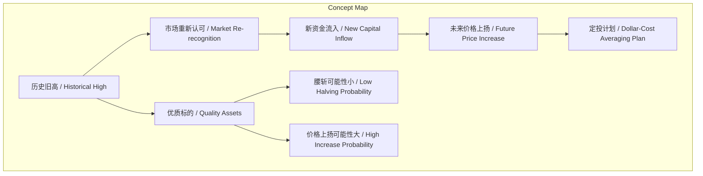
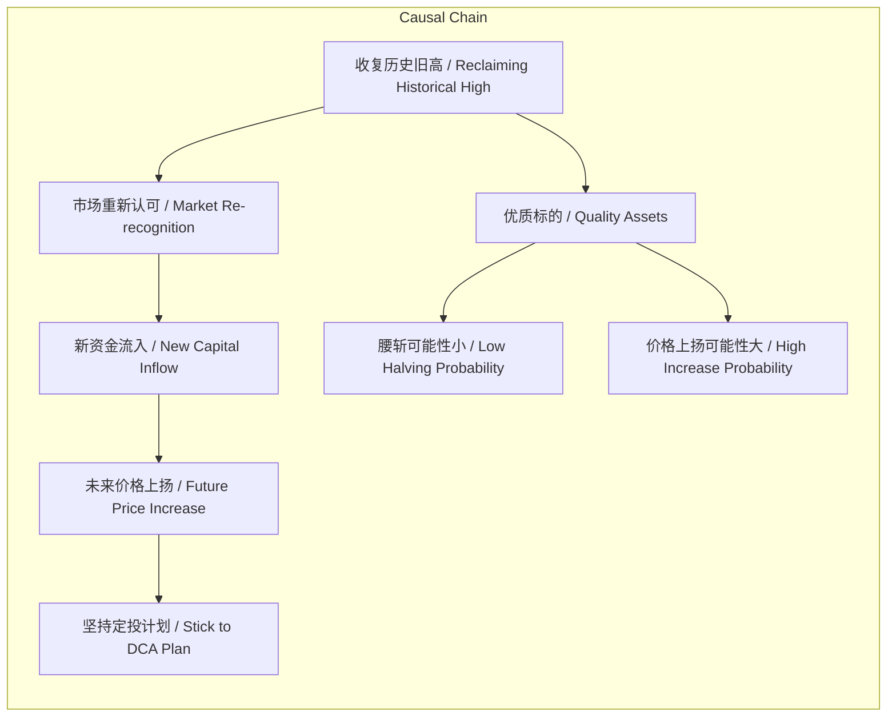

# 任务报告

- requestId: 1772152538332-18dsj6
- 生成时间(UTC): 2026-02-27T00:36:04.149Z

## 文本总结

# 收复历史旧高的市场意义与定投策略

## 整体结构化文档表达
### 文档卡片
- 主题（中文/English）：市场分析 / Market Analysis
- 一句话摘要：分析收复历史旧高对市场认可度、资金流向及未来价格的影响，并强调坚持定投计划。
- 目标读者：投资者、市场分析师
- 核心结论（3条）：
  1. 收复历史旧高标志市场重新认可该历史价格水平。
  2. 伴随新资金流入，优质标的后续大幅下跌风险低、上涨潜力大。
  3. 投资者应无视短期波动，坚持执行定投计划。

### 内容结构树
1. 背景与问题定义：收复历史旧高意味着什么？
2. 核心观点与关键证据：五点具体意义（市场认可、资金流入、优质标的下跌风险低、上涨可能性大、坚持定投）。
3. 方法/机制/路径：未提及
4. 风险与边界条件：未提及明确风险，但隐含假设标的为“优质”。
5. 结论与行动建议：坚持定投计划不变。

### 结构化元数据（JSON）
```json
{
  "title": "收复历史旧高的市场意义与定投策略",
  "topic_zh": "市场分析",
  "topic_en": "Market Analysis",
  "audience": "投资者、市场分析师",
  "claims": [
    "市场重新认可历史旧高",
    "新资金流入市场",
    "优质标的腰斩可能性小且上扬可能性大",
    "投资者应坚持定投计划"
  ],
  "evidence": [
    "市场重新认可了当年的旧高",
    "意味着有新的资金的流入",
    "优质标的旧高修复后再次腰斩的可能性很小",
    "未来价格出现大幅上扬的可能性不小",
    "无论发生什么事，不要改变你的定投计划"
  ],
  "risks": [],
  "actions": [
    "坚持定投计划，不因价格变化而改变"
  ]
}
```

## 处理流程
1. 输入识别：用户提供文本讨论“收复历史旧高”的市场含义及定投建议。
2. 信息抽取：实体包括历史旧高、市场、资金、优质标的、腰斩、价格上扬、定投计划；核心问题是“意味着什么”；观点为五点陈述。
3. 结构化归纳：将观点归纳为市场心理、资金面、价格预测、策略四个维度。
4. 关系建模：建立“收复旧高→市场认可→资金流入→价格变化→定投决策”因果链。
5. 可视化表达：使用Mermaid绘制概念与因果图。

## 概念清单（中英文）
- 历史旧高 / Historical High
- 市场 / Market
- 资金流入 / Capital Inflow
- 优质标的 / Quality Assets
- 腰斩 / Halving (Price)
- 价格上扬 / Price Increase
- 定投计划 / Dollar-Cost Averaging Plan

## 概念定义（中英文）
- 历史旧高 / Historical High：过去交易中达到过的价格高点。
- 市场 / Market：指金融投资市场或特定资产交易市场。
- 资金流入 / Capital Inflow：新资金进入市场或特定资产。
- 优质标的 / Quality Assets：投资者认为具有良好基本面或价值的资产。
- 腰斩 / Halving (Price)：价格下跌至原价的50%。
- 价格上扬 / Price Increase：价格出现显著上涨。
- 定投计划 / Dollar-Cost Averaging Plan：定期投入固定金额购买资产的投资策略。

## 概念关联与逻辑关系（中英文）
1. 收复历史旧高 / Reclaiming Historical High 导致 市场重新认可 / Market Re-recognition。
   - 形式化：A → B
2. 市场重新认可 / Market Re-recognition 与 新资金流入 / New Capital Inflow 共同导致 未来价格上扬 / Future Price Increase。
   - 形式化：B ∧ C → D
3. 优质标的 / Quality Assets 的 收复历史旧高 / Reclaiming Historical High 意味着 腰斩可能性小 / Low Halving Probability 和 价格上扬可能性大 / High Increase Probability。
   - 形式化：E ∧ A → (F ∧ G)

## COT逻辑梳理（定义/分类/比较/因果/科学方法论）
- Step 1 (定义)：明确“收复历史旧高”指价格回到过去高点，“意味着”探讨其市场含义。
- Step 2 (分类)：将五点含义分为市场心理（认可）、资金面（流入）、价格预测（下跌风险低、上涨潜力）、策略建议（定投）。
- Step 3 (比较)：隐含比较“优质标的”与普通标的，前者在收复旧高后表现更佳。
- Step 4 (因果)：收复旧高 → 市场认可 → 吸引新资金 → 支撑价格 → 降低腰斩风险、增加上扬可能 → 强化定投有效性。
- Step 5 (科学方法论)：未提及明确方法论，分析基于历史价格行为观察与投资者经验。

## 事实与看法（区分）
### 事实
- 未提及明确可核验的客观事实（如具体数据、事件）。
### 看法
- 市场重新认可了当年的旧高。
- 意味着有新的资金的流入。
- 优质标的旧高修复后再次腰斩的可能性很小。
- 未来价格出现大幅上扬的可能性不小。
- 无论发生什么事，不要改变你的定投计划。

## FAQ（原文问题整理）
- 问题：收复历史旧高意味着什么？
  - 回答：1. 市场重新认可旧高；2. 新资金流入；3. 优质标的腰斩可能性小；4. 价格上扬可能性大；5. 坚持定投计划。

## Visualization
### Mermaid 图 1（概念结构图）


### Mermaid 图 2（逻辑/因果图）


## 文章中的类比
- 未发现明确类比

## 10个金句
1. 市场重新认可了当年的旧高。
2. 也意味着有新的资金的流入。
3. 如果是我们认为优质的标的，也意味着旧高修复后再次腰斩的可能性很小。
4. 未来价格出现大幅上扬的可能性不小。
5. 无论发生什么事，不要改变你的定投计划。
6. 原文未提供
7. 原文未提供
8. 原文未提供
9. 原文未提供
10. 原文未提供
