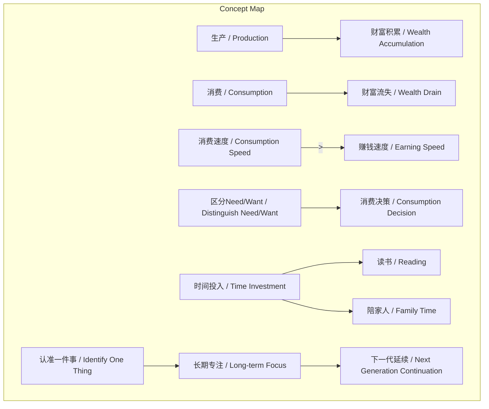
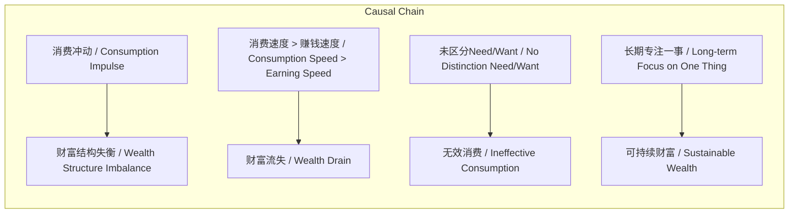

# 任务报告

- requestId: 1772152773599-eekusc
- 生成时间(UTC): 2026-02-27T00:39:59.761Z

## 文本总结

# 长期主义与财富管理实践要点

## 整体结构化文档表达
### 文档卡片
- 主题（中文/English）：个人财富管理与长期主义实践 / Personal Wealth Management and Long-termism Practice
- 一句话摘要：通过克制消费、优化财富结构及长期专注，实现可持续的财富积累与生活平衡。
- 目标读者：关注个人成长与财务管理的普通成年人。
- 核心结论（3条）：
  1. 生产创造财富应优先于消费消耗。
  2. 控制消费速度，避免其超过赚钱速度导致财富流失。
  3. 消费决策需严格区分“需求”与“欲望”。

### 内容结构树
1. 背景与问题定义：现代消费主义环境下，个人易陷入消费冲动与财富结构失衡。
2. 核心观点与关键证据：提出生产优先、控制消费速度、区分Need/Want等原则，并以明星消费过快为例证。
3. 方法/机制/路径：通过反思消费习惯、将时间投入阅读与家庭、认准长期事业来落实。
4. 风险与边界条件：主要风险为消费速度大于赚钱速度；边界条件在于个人执行力与长期坚持。
5. 结论与行动建议：践行克制消费、改造财富流向、终身专注一事。

### 结构化元数据（JSON）
```json
{
  "title": "长期主义与财富管理实践要点",
  "topic_zh": "个人财富管理与长期主义实践",
  "topic_en": "Personal Wealth Management and Long-termism Practice",
  "audience": "关注个人成长与财务管理的普通成年人",
  "claims": [
    "生产创造财富应优先于消费消耗",
    "控制消费速度，避免其超过赚钱速度导致财富流失",
    "消费决策需严格区分“需求”与“欲望”"
  ],
  "evidence": [
    "提出“生产在前 消费在后”",
    "指出“一个陷阱：消费速度比赚钱速度快 比如明星”",
    "建议“消费的时候应该反思 自己是“Need”（必须）还是“Want”（欲望）”"
  ],
  "risks": [
    "消费速度大于赚钱速度导致财富流失"
  ],
  "actions": [
    "克制消费冲动，生产优先",
    "改造财富结构和财富流向",
    "赚到钱后更应控制消费、审视习惯",
    "消费时反思Need与Want",
    "将时间用于读书、陪家人而非只看价格",
    "认准一件事并做一辈子，甚至延续至下一代"
  ]
}
```

## 处理流程
1. 输入识别：用户提供一段关于践行群500天财富管理要点的文本。
2. 信息抽取：抽取实体（消费、赚钱、财富结构）、概念（Need/Want、生产/消费）、问题（消费陷阱）、事实（明星例子）、观点（七条建议）。
3. 结构化归纳：将内容归纳为财富管理原则，分类为行为准则、风险警示、长期策略。
4. 关系建模：建立生产-消费、消费速度-财富流失、Need/Want-消费决策等逻辑关系。
5. 可视化表达：使用Mermaid绘制概念与因果图。

## 概念清单（中英文）
- 赚钱 / Earning
- 消费 / Consumption
- 消费冲动 / Consumption Impulse
- 生产 / Production
- 财富结构 / Wealth Structure
- 财富流向 / Wealth Flow
- 消费速度 / Consumption Speed
- 赚钱速度 / Earning Speed
- 明星 / Celebrity
- 消费习惯 / Consumption Habit
- Need（必须） / Need (Necessity)
- Want（欲望） / Want (Desire)
- 时间 / Time
- 价格 / Price
- 读书 / Reading
- 家人 / Family
- 认准一件事 / Identifying One Thing
- 一辈子 / A Lifetime
- 下一代 / Next Generation

## 概念定义（中英文）
- 赚钱（Earning）：通过劳动或投资获取金钱的过程。
- 消费（Consumption）：使用金钱或资源满足个人需求或欲望的行为。
- 消费冲动（Consumption Impulse）：未经理性思考的即时消费欲望。
- 生产（Production）：创造产品或服务以获取财富的活动。
- 财富结构（Wealth Structure）：个人或家庭资产与负债的配置比例。
- 财富流向（Wealth Flow）：资金流入与流出的方向与模式。
- 消费速度（Consumption Speed）：单位时间内消费支出的速率。
- 赚钱速度（Earning Speed）：单位时间内收入增加的速率。
- 明星（Celebrity）：公众知名度高的个体，文中作为消费过快案例。
- 消费习惯（Consumption Habit）：长期形成的消费行为模式。
- Need（必须）（Need）：维持生存或基本功能的必要需求。
- Want（欲望）（Want）：非必要的、由欲望驱动的需求。
- 时间（Time）：可用于活动分配的有限资源。
- 价格（Price）：商品或服务的货币价值标识。
- 读书（Reading）：通过阅读获取知识的行为。
- 家人（Family）：亲属关系群体，文中指陪伴对象。
- 认准一件事（Identifying One Thing）：选定一个目标或领域并专注投入。
- 一辈子（A Lifetime）：完整的个人生命时长。
- 下一代（Next Generation）：自己的子女或后继者。

## 概念关联与逻辑关系（中英文）
1. 生产（Production）增加财富，消费（Consumption）减少财富，二者共同决定净财富变化：净财富变化 = 生产 - 消费。
2. 消费速度（Consumption Speed）大于赚钱速度（Earning Speed）导致财富流失（Wealth Drain）：若 消费速度 > 赚钱速度，则 财富流失。
3. 区分Need（必须）与Want（欲望）优化消费决策（Consumption Decision），从而控制消费速度：区分Need/Want → 理性消费 → 控制消费速度。

## COT逻辑梳理（定义/分类/比较/因果/科学方法论）
- Step 1（定义）：明确“生产”为财富创造，“消费”为财富消耗，定义“财富结构”为资产配置，“财富流向”为资金流动方向。
- Step 2（分类）：将消费分为基于Need（必须）的理性消费与基于Want（欲望）的非理性消费。
- Step 3（比较）：比较生产与消费的优先级，得出“生产在前 消费在后”；比较消费速度与赚钱速度，指出陷阱在于前者更快。
- Step 4（因果）：因消费冲动导致财富结构失衡；因未区分Need/Want导致无效消费；因长期专注一事实现可持续财富积累。
- Step 5（科学方法论）：提出可验证的行动框架——记录消费以识别Need/Want、监控消费与赚钱速度比率、将时间资源重新分配至读书与家庭、选定长期事业并评估代际传承可行性。

## 事实与看法（病毒）
### 事实
- 文本提出“生产在前 消费在后”的原则。
- 文本指出“一个陷阱：消费速度比赚钱速度快 比如明星”。
- 文本建议“消费的时候应该反思 自己是“Need”（必须）还是“Want”（欲望）”。
- 文本提到“有时间不是看价格 而是多读书、多陪家人”。
- 文本主张“认准一件事就可以做一辈子 甚至连下一代也可以做”。
### 看法
- “赚钱要克制自己的消费冲动”是主观建议。
- “改造自己的财富结构和财富流向”是个人行动主张。
- “赚到钱了 越是要控制自己的消费 更应该审视自己消费习惯”是基于经验的判断。
- 将时间用于读书和陪家人而非关注价格，是价值取向表达。

## FAQ（原文问题整理）
- 未发现明确提问。原文均为陈述性建议与观点。

## Visualization
### Mermaid 图 1（概念结构图）

### Mermaid 图 2（逻辑/因果图）


## 文章中的类比
- 未发现明确类比。

## 10个金句
1. 生产在前 消费在后
2. 赚钱要克制自己的消费冲动
3. 改造自己的财富结构和财富流向
4. 一个陷阱：消费速度比赚钱速度快 比如明星
5. 赚到钱了 越是要控制自己的消费 更应该审视自己消费习惯
6. 消费的时候应该反思 自己是“Need”（必须）还是“Want”（欲望）
7. 有时间不是看价格 而是多读书、多陪家人
8. 认准一件事就可以做一辈子
9. 甚至连下一代也可以做
10. 原文未提供
