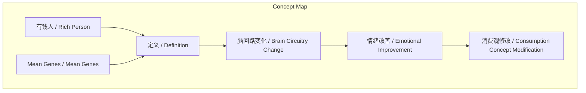
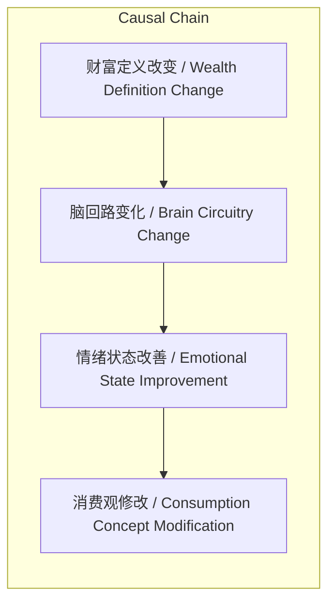

# 任务报告

- requestId: 1772152805084-dg5g4w
- 生成时间(UTC): 2026-02-27T00:41:10.394Z

## 文本总结

# 心理定义如何重塑财富感知

## 整体结构化文档表达
### 文档卡片
- 主题（中文/English）：财富心理学 / Wealth Psychology
- 一句话摘要：通过将“有钱人”重新定义为拥有永久不用之财，作者实现了心理富足并改变了消费观。
- 目标读者：对个人理财与心理建设感兴趣的普通读者
- 核心结论（3条）：
  1. “有钱人”的核心定义是拥有一笔这辈子都用不上的钱，而非高消费能力。
  2. 将一笔钱心理上“判死刑”能改变脑回路，消除穷感、自卑与焦虑。
  3. 这种定义修改能根本性地改变消费观。

### 内容结构树
1. 背景与问题定义：受《Mean Genes》启发，反思传统以消费定义的富足导致焦虑，提出重新定义“有钱人”。
2. 核心观点与关键证据：核心观点是“有钱人”定义为有永久不用之财；关键证据是作者实践后不再感到穷、自卑、着急，脑回路变化。
3. 方法/机制/路径：方法是将一笔钱心理“判死刑”；机制是此操作引发脑回路变化；路径是通过心理定义改变影响情绪和消费观。
4. 风险与边界条件：未提及
5. 结论与行动建议：结论是重新定义财富带来心理富足；行动建议：未提及

### 结构化元数据（JSON）
```json
{
  "title": "心理定义如何重塑财富感知",
  "topic_zh": "财富心理学",
  "topic_en": "Wealth Psychology",
  "audience": "对个人理财与心理建设感兴趣的普通读者",
  "claims": [
    "“有钱人”定义为拥有永久不用之财",
    "心理“判死刑”改变脑回路消除焦虑",
    "定义修改根本改变消费观"
  ],
  "evidence": [
    "将一笔钱“判死刑”引发脑回路变化",
    "不再觉得自己穷、自卑、着急蛮慌"
  ],
  "risks": ["未提及"],
  "actions": ["未提及"]
}
```

## 处理流程
1. 输入识别（来源：用户输入文本）
2. 信息抽取（实体、概念、问题、事实、观点）
3. 结构化归纳（定义/分类/比较/因果/方法论）
4. 关系建模（概念关系、等式/方程/逻辑链）
5. 可视化表达（Mermaid）

## 概念清单（中英文）
- 有钱人 / Rich Person
- 定义 / Definition
- 脑回路 / Brain Circuitry
- 消费观 / Consumption Concept
- 穷 / Poverty
- 自卑 / Inferiority
- 着急蛮慌 / Anxiety
- 危险 / Danger
- Mean Genes / Mean Genes

## 概念定义（中英文）
- 有钱人 / Rich Person: 指拥有一笔这辈子都用不上的财富的人。
- 定义 / Definition: 未提及（输入中未对“定义”概念本身进行定义）。
- 脑回路 / Brain Circuitry: 指心理或认知模式，变化由心理操作引发。
- 消费观 / Consumption Concept: 指对消费的看法和观念。
- 穷 / Poverty: 指缺乏财富的主观感受。
- 自卑 / Inferiority: 指自我评价低下的感受。
- 着急蛮慌 / Anxiety: 指焦虑、慌张的情绪状态。
- 危险 / Danger: 指感到受威胁或不安全的感觉。
- Mean Genes / Mean Genes: 一本探讨基因如何影响人类行为的书籍。

## 概念关联与逻辑关系（中英文）
1. 有钱人定义 / Rich Person Definition 改变 → 脑回路变化 / Brain Circuitry Change（将钱“判死刑”引发变化）
2. 脑回路变化 / Brain Circuitry Change → 情绪状态改善 / Improved Emotional State（不再穷、自卑、着急、危险）
3. 情绪状态改善 / Improved Emotional State → 消费观修改 / Consumption Concept Modification（反过来修改消费观）

## COT逻辑梳理（定义/分类/比较/因果/科学方法论）
Step 1: 定义“有钱人”为拥有一笔永久不用之财的人，区别于传统消费定义。
Step 2: 比较：新定义强调财富的“不可用性”，而非消费能力，避免焦虑。
Step 3: 因果：新定义通过心理操作（判死刑）导致脑回路变化，进而改善情绪。
Step 4: 科学方法论：基于个人实践与自我观察验证效果，但未提系统科学方法。
Step 5: 分类：未提及明确分类。

## 事实与看法
### 事实
- 作者阅读了《Mean Genes》一书。
- 作者将一笔钱心理上“判死刑”。
- 作者报告自己不再感到穷、自卑、着急蛮慌和危险。
### 看法
- 作者认为“有钱人”的关键定义是拥有一笔用不上的钱。
- 作者认为没有用消费来定义富足。
- 作者认为这修改了消费观。

## FAQ（原文问题整理）
- 问题：什么是有钱人？
  回答：有一笔这辈子都用不上的财富的人。
- 问题：如何提前过上“有钱人的日子”？
  回答：通过将一笔钱心理上“判死刑”，改变脑回路和消费观。

## Visualization
### Mermaid 图 1（概念结构图）


### Mermaid 图 2（逻辑/因果图）


## 文章中的类比
未发现明确类比

## 10个金句
1. “我是如何提前过上了‘有钱人的日子’的”
2. “什么是有钱人 就是有一笔这辈子用不上”
3. “将一笔钱‘判死刑’ 会引发自己脑回路的变化”
4. “不会觉得自己穷、不会自卑、不再觉得着急蛮慌 不再觉得自己时时刻刻危险”
5. “关键在于‘有钱人’的定义”
6. “没有用消费来定义富足”
7. “这反过来修改了我们的消费观”
8. 原文未提供
9. 原文未提供
10. 原文未提供
