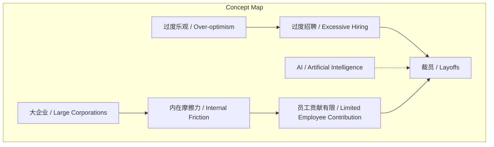
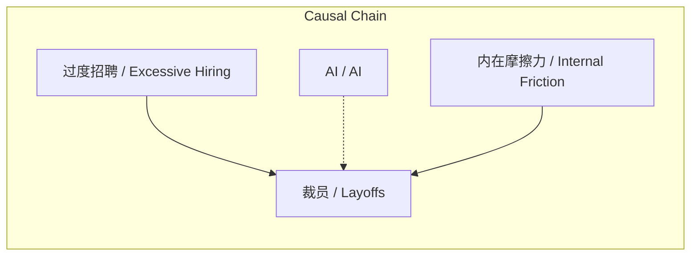

# 任务报告

- requestId: 1772201034463-fln3eg
- 生成时间(UTC): 2026-02-27T14:04:57.681Z

## 文本总结

# 裁员主因过度招聘，非AI替代

## 整体结构化文档表达
### 文档卡片
- 主题（中文/English）：互联网行业裁员原因分析 / Analysis of Layoffs in Internet Industry
- 一句话摘要：本文主张软件和互联网行业裁员主要源于疫情期间过度招聘，而非AI技术替代，被裁员工在大型组织中作用有限。
- 目标读者：科技行业从业者、企业管理者、政策研究者
- 核心结论（3条）：
  1. 裁员主因是疫情期间过度乐观招聘，而非AI抢工作。
  2. 被裁员工在大型企业中原先贡献有限，仅产生内在摩擦力。
  3. “AI抢工作”是陈词滥调，影响工作的只有人本身。

### 内容结构树
1. 背景与问题定义：软件和互联网行业出现裁员潮，公众常归因于AI发展。
2. 核心观点与关键证据：作者提出裁员主因是疫情期间过度招聘；被裁员工作用有限，比喻为“电梯里做俯卧撑”；AI抢工作说法不成立。
3. 方法/机制/路径：未提及具体方法或机制。
4. 风险与边界条件：未提及相关风险或边界条件。
5. 结论与行动建议：结论重申核心观点；行动建议未明确给出。

### 结构化元数据（JSON）
```json
{
  "title": "裁员主因过度招聘，非AI替代",
  "topic_zh": "互联网行业裁员原因分析",
  "topic_en": "Analysis of Layoffs in Internet Industry",
  "audience": "科技行业从业者、企业管理者、政策研究者",
  "claims": [
    "裁员主因是疫情期间过度乐观招聘，而非AI抢工作",
    "被裁员工在大型企业中原先贡献有限，仅产生内在摩擦力",
    "AI抢工作的说法是陈词滥调，影响工作的只有人本身"
  ],
  "evidence": [
    "之前疫情期间过度乐观招了太多人",
    "被裁掉的这些人在大企业里本来也做不了什么事",
    "他们起到的作用就是产生内在摩擦力，在电梯里做俯卧撑上上下下而已"
  ],
  "risks": [],
  "actions": []
}
```

## 处理流程
1. 输入识别：来源为用户提供的关于互联网行业裁员的观点文本。
2. 信息抽取：抽取实体（软件和互联网行业、裁员、AI、大企业）、概念（过度乐观、内在摩擦力）、观点（裁员主因、AI非原因、员工作用有限）。
3. 结构化归纳：将观点归纳为背景、核心论点、结论等结构；定义关键概念如“内在摩擦力”为比喻性表达。
4. 关系建模：建立“过度招聘 → 裁员”的因果链；建立“AI ≠ 裁员原因”的否定关系；建立“员工作用有限 → 裁员”的关联。
5. 可视化表达：使用Mermaid绘制概念图和因果图。

## 概念清单（中英文）
- 软件和互联网行业 / Software and Internet Industry
- 裁员 / Layoffs
- 疫情期间 / Pandemic Period
- 过度乐观 / Over-optimism
- AI / Artificial Intelligence
- 大企业 / Large Corporations
- 内在摩擦力 / Internal Friction
- 电梯里做俯卧撑 / Doing Push-ups in an Elevator (metaphor)

## 概念定义（中英文）
- 软件和互联网行业 / Software and Internet Industry：文本中指从事软件开发、互联网服务及相关技术的企业和产业领域。
- 裁员 / Layoffs：企业终止部分员工雇佣关系的行为，文本中特指该行业近期现象。
- 疫情期间 / Pandemic Period：文本中指新冠疫情爆发期间，企业招聘行为受影响的时期。
- 过度乐观 / Over-optimism：文本中指在疫情期间对人才需求产生不切实际的高估，导致过度招聘。
- AI / Artificial Intelligence：文本中指人工智能技术，作者认为其未直接导致裁员。
- 大企业 / Large Corporations：文本中指规模庞大、层级复杂的组织。
- 内在摩擦力 / Internal Friction：文本中的比喻概念，指员工在大型组织中因协调、沟通等产生的非productive成本。
- 电梯里做俯卧撑 / Doing Push-ups in an Elevator：文本中的比喻，形容员工看似忙碌但无实质贡献的行为。

## 概念关联与逻辑关系（中英文）
1. 过度乐观 (Over-optimism) 导致 过度招聘 (Excessive Hiring)，进而导致 裁员 (Layoffs)。
   - 形式化：过度招聘 = f(过度乐观) → 裁员
2. AI (Artificial Intelligence) 与 裁员 (Layoffs) 无直接因果关系，作者否定AI是裁员原因。
   - 形式化：AI ↛ 裁员
3. 大企业 (Large Corporations) 的 内在摩擦力 (Internal Friction) 使得部分员工贡献有限，这些员工在裁员中被裁减。
   - 形式化：内在摩擦力 ↑ → 员工贡献 ↓ → 裁员概率 ↑

## COT逻辑梳理（定义/分类/比较/因果/科学方法论）
Step 1: 定义问题。裁员是现象，需确定主要原因。文本提出两个候选原因：AI替代 vs 过度招聘。
Step 2: 分类证据。将证据分为：支持过度招聘的（“疫情期间过度乐观招了太多人”）；支持员工作用有限的（“做不了某事”“内在摩擦力”）；反对AI原因的（“AI抢工作是陈词滥调”）。
Step 3: 比较原因。比较AI与过度招聘对裁员的影响：文本认为AI影响未显现，过度招聘是直接原因。
Step 4: 建立因果链。过度招聘 → 人员冗余 → 裁员；员工作用有限 → 易被裁减。
Step 5: 科学方法论反思。文本基于观察和比喻提出观点，但未提供数据或严谨验证，属于论述性分析，缺乏实证支持。

## 事实与看法（病毒）
### 事实
- 软件和互联网行业发生了裁员。
- 裁员发生在疫情期间之后。
- 被裁员工曾在大型企业工作。
### 看法
- 裁员主因是疫情期间过度招聘，而非AI。
- 被裁员工在大型企业里做不了什么事。
- 被裁员工起到的作用是产生内在摩擦力。
- “AI抢工作”是不假思索的陈词滥调。
- 影响人的工作只有人本身，而不是AI或机器人。

## FAQ（原文问题整理）
- 未发现明确提问。原文均为陈述句，无直接问题。

## Visualization
### Mermaid 图 1（概念结构图）

### Mermaid 图 2（逻辑/因果图）


## 文章中的类比
- “在电梯里做俯卧撑上上下下”：比喻员工在大型组织中看似忙碌但无实质产出，仅增加协调成本。

## 10个金句
1. 软件和互联网行业裁员是之前疫情期间过度乐观招了太多人。
2. 而不是 AI 抢了这些人的工作。
3. 被裁掉的这些人在大企业里本来也做不了什么事。
4. 他们起到的作用就是产生内在摩擦力。
5. 在电梯里做俯卧撑上上下下而已。
6. 所谓 AI 抢了人的工作，到现在看是不假思索的陈词滥调。
7. 影响人的工作，只有人本身。
8. 而不是 AI 或是机器人。
9. 原文未提供
10. 原文未提供
