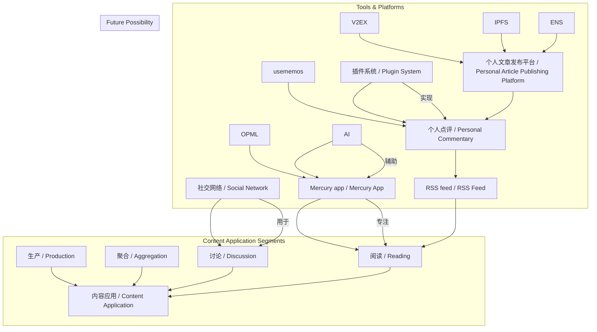
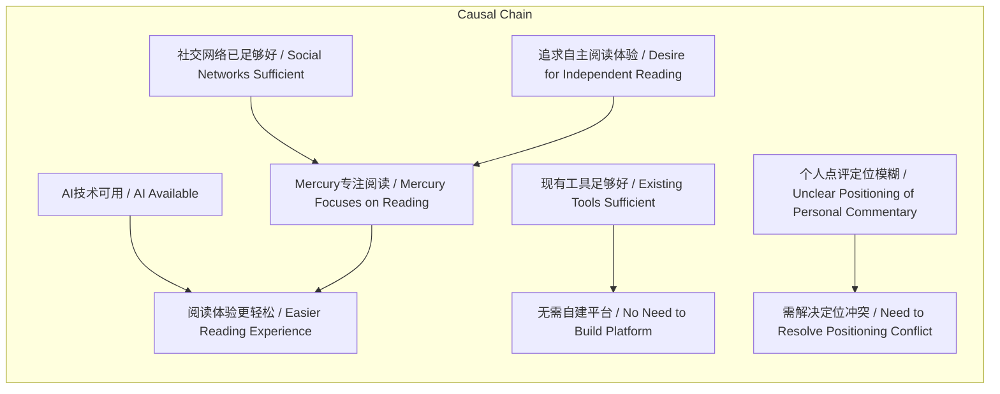

# 任务报告

- requestId: 1772201171725-sypnxm
- 生成时间(UTC): 2026-02-27T14:07:51.005Z

## Hacker News 热点分析

### 原始榜单
- 1. Statement from Dario Amodei on our discussions with the Department of War | score=2266 | comments=1221 | https://www.anthropic.com/news/statement-department-of-war
- 2. Can you reverse engineer our neural network? | score=105 | comments=38 | https://blog.janestreet.com/can-you-reverse-engineer-our-neural-network/
- 3. F-Droid Board of Directors nominations 2026 | score=59 | comments=23 | https://f-droid.org/2026/02/26/board-of-directors-nominations.html
- 4. PostmarketOS in 2026-02: generic kernels, bans use of generative AI | score=38 | comments=30 | https://postmarketos.org/blog/2026/02/26/pmOS-update-2026-02/
- 5. An interactive intro to quadtrees | score=85 | comments=6 | https://growingswe.com/blog/quadtrees
- 6. The Hunt for Dark Breakfast | score=325 | comments=125 | https://moultano.wordpress.com/2026/02/22/the-hunt-for-dark-breakfast/
- 7. The normalization of corruption in organizations (2003) [pdf] | score=139 | comments=63 | https://gwern.net/doc/sociology/2003-ashforth.pdf
- 8. Show HN: RetroTick – Run classic Windows EXEs in the browser | score=17 | comments=3 | https://retrotick.com/
- 9. Breaking Free | score=53 | comments=8 | https://www.forbrukerradet.no/breakingfree/
- 10. Reading English from 1000 Ad | score=34 | comments=6 | https://lewiscampbell.tech/blog/260224.html

### 分析
### 1) 今日技术热点主线（3条）
- **AI伦理与国防合作争议**：Anthropic与国防部讨论引发AI安全与军事化应用的大规模辩论。
- **开源系统对生成式AI的抵制**：PostmarketOS明确禁止生成式AI工具，反映开源社区对AI渗透的警惕。
- **网络安全实战挑战活跃**：Dark Breakfast等高热度项目指向白帽社区对隐蔽漏洞挖掘的兴趣。

### 2) 热度最高的5条及原因
| 排名 | 标题 | 热度原因 |
|------|------|----------|
| 1 | Anthropic与国防部讨论声明 | AI巨头直接涉及国防合作，触及伦理红线，引发行业震动与政策讨论（分/评双高）。 |
| 2 | The Hunt for Dark Breakfast | 疑似高级CTF或隐蔽漏洞挑战，激发安全社区探索欲，评论密集讨论解题思路。 |
| 3 | 组织腐败的 Normalization（2003论文） | 经典研究被重提，映射硅谷近期文化焦虑，引发企业治理联想。 |
| 4 | 逆向工程神经网络挑战 | 顶级量化公司（Jane Street）出题，吸引算法与安全交叉领域高手实战参与。 |
| 5 | 四叉树交互教程 | 图形学基础技术可视化教学，填补入门资源缺口，实用性强获开发者推荐。 |

### 3) 对内容策略的建议（3条）
- **开设“AI治理前线”专栏**：持续跟踪Anthropic类事件，提供企业、伦理、政策三方解读，满足高关注度需求。
- **深化开源生态报道**：以PostmarketOS AI禁令为切入点，挖掘其他开源项目对AI的立场，形成“技术自主性”系列。
- **增加实战导向内容**：针对Dark Breakfast等挑战，推出解题思路解析、逆向工程案例库，强化社区互动。
## 文本总结

# Mercury：专注阅读体验的内容应用

## 整体结构化文档表达
### 文档卡片
- 主题（中文/English）：内容应用环节与Mercury定位 / Content Application Segments and Mercury's Positioning
- 一句话摘要：本文基于内容应用的生产、聚合、讨论、阅读四环节框架，阐述Mercury app仅聚焦阅读体验，并探讨未来通过插件或去中心化方案实现个人点评分享的可能性。
- 目标读者：内容产品设计者、阅读应用开发者、数字内容消费者
- 核心结论（3条）：
  1. Mercury仅聚焦阅读环节，其他环节（生产、聚合、讨论）均可通过RSS feed整合至阅读器。
  2. 社交网络在分享、聚合、讨论方面已足够成熟，Mercury旨在提供独立于社交网络的自主长文阅读体验。
  3. 个人内容加点评的分享可能通过插件系统或基于IPFS/ENS的去中心化平台实现，但需避免与社交网络定位重叠。

### 内容结构树
1. 背景与问题定义：内容应用逻辑上包含生产、聚合、讨论、阅读四个环节；Mercury仅做阅读，其他环节可呈现为可订阅的RSS feed。
2. 核心观点与关键证据：社交网络适合讨论分享，但Mercury追求“不管别人怎么说自己去读长文”的体验；AI可辅助摘要翻译提升阅读轻松度；个人点评分享是潜在方向但定位未清晰。
3. 方法/机制/路径：使用AI强化摘要翻译能力；设计插件系统导出至usememos等平台提供RSS；评估基于IPFS和ENS的去中心化个人文章发布方案。
4. 风险与边界条件：个人点评分享与社交网络功能重叠；若现有工具（如RSS、插件）已足够好，则无需自建平台。
5. 结论与行动建议：保持Mercury阅读核心体验；探索插件系统实现个人点评分享；优先利用现有工具，避免重复建设。

### 结构化元数据（JSON）
```json
{
  "title": "Mercury：专注阅读体验的内容应用",
  "topic_zh": "内容应用环节与Mercury定位",
  "topic_en": "Content Application Segments and Mercury's Positioning",
  "audience": "内容产品设计者、阅读应用开发者、数字内容消费者",
  "claims": [
    "Mercury仅聚焦阅读环节，其他环节通过RSS feed整合",
    "社交网络在分享、聚合、讨论方面已足够成熟，Mercury旨在提供独立于社交网络的阅读体验",
    "个人内容加点评的分享可能通过插件系统或去中心化平台实现，但需解决定位冲突"
  ],
  "evidence": [
    "Google Reader通过Gmail整理加星文章推送到Kindle",
    "Mercury app自带OPML，包含最被讨论的80几个源feed",
    "社交网络如Reddit/Twitter/Techmeme用于相关讨论",
    "AI用于摘要翻译等能力提升阅读体验",
    "插件系统导出到usememos，提供个人点评的RSS",
    "去中心化方案类似V2EX的Planet，基于IPFS和ENS"
  ],
  "risks": [
    "个人点评分享与社交网络定位重叠",
    "自建平台可能不必要，若现有工具足够好"
  ],
  "actions": [
    "保持Mercury阅读核心体验",
    "探索插件系统实现个人点评分享",
    "优先评估现有工具，避免重复造轮子"
  ]
}
```

## 处理流程
1. 输入识别（来源：用户输入文本）
2. 信息抽取（实体、概念、问题、事实、观点）
3. 结构化归纳（定义/分类/比较/因果/方法论）
4. 关系建模（概念关系、等式/方程/逻辑链）
5. 可视化表达（Mermaid）

## 概念清单（中英文）
- Google Reader
- Gmail
- Kindle
- 内容应用 / Content Application
- 生产 / Production
- 聚合 / Aggregation
- 讨论 / Discussion
- 阅读 / Reading
- Mercury app / Mercury App
- RSS feed / RSS Feed
- 社交网络 / Social Network
- Reddit
- Twitter
- Techmeme
- OPML
- AI
- 摘要翻译 / Summary Translation
- 个人点评 / Personal Commentary
- usememos
- 插件系统 / Plugin System
- 导出/分享插件 / Export/Share Plugin
- V2EX
- Planet
- IPFS
- ENS
- 个人文章发布平台 / Personal Article Publishing Platform

## 概念定义（中英文）
- Google Reader：原文提及的RSS阅读服务，具有通过Gmail整理加星文章并推送到Kindle的功能。
- Gmail：用于接收和整理Google Reader加星文章的邮件服务。
- Kindle：接收推送文章的电子阅读设备。
- 内容应用：逻辑上包含生产、聚合、讨论、阅读四个环节的内容处理系统。
- 生产：内容创作的过程（原文定义：生产就是内容创作）。
- 聚合：筛选、编排、推荐内容的过程（原文定义：聚合就是筛选编排推荐）。
- 讨论：评价与再创作内容的过程（原文定义：讨论是评价与再创作）。
- 阅读：消费内容的过程。
- Mercury app：一个仅聚焦阅读环节的内容应用，旨在提供自主长文阅读体验。
- RSS feed：一种可订阅的内容聚合格式，用于向阅读器呈现聚合、讨论等环节的结果（原文：其它事情都可以最终呈现为一个可以订阅的RSS feed给阅读器用）。
- 社交网络：用于分享、聚合、讨论的平台，如Reddit、Twitter、Techmeme。
- Reddit：用于内容讨论的社交平台（原文举例）。
- Twitter：用于内容讨论的社交平台（原文举例）。
- Techmeme：用于内容讨论的科技新闻聚合平台（原文举例）。
- OPML：Mercury app自带的一种feed列表格式（原文未提供明确定义）。
- AI：用于摘要翻译等能力，使阅读体验更轻松的技术（原文：可以用AI来让这个体验变得更轻松些）。
- 摘要翻译：对文章进行摘要和翻译的功能（原文：重视摘要翻译等能力）。
- 个人点评：一个内容加一句点评的生成和分享形式（原文：个人（一个内容加一句点评）的生成和分享）。
- usememos：一个轻型笔记平台（self-hosted），可作为个人点评的导出目标（原文：导出到 usememos 这样的轻型笔记平台）。
- 插件系统：设计用于实现导出/分享等功能的扩展机制（原文：或许可以考虑设计插件系统）。
- 导出/分享插件：将个人点评导出到其他平台的插件（原文：提供导出/分享插件）。
- V2EX：一个社区，其Planet功能用于聚合成员文章（原文举例）。
- Planet：V2EX的成员文章聚合功能（原文举例）。
- IPFS：一种去中心化存储协议，用于个人文章发布（原文提及）。
- ENS：以太坊域名服务，用于去中心化身份解析（原文提及）。
- 个人文章发布平台：基于IPFS和ENS的个人文章发布系统（原文：基于 IPFS 和 ENS 的个人文章发布平台）。

## 概念关联与逻辑关系（中英文）
1. 内容应用 / Content Application = 生产 / Production + 聚合 / Aggregation + 讨论 / Discussion + 阅读 / Reading  
   （原文：内容的应用 逻辑上有生产、聚合、讨论和阅读等环节）
2. Mercury的目标 / Mercury's Goal = 独立阅读体验 / Independent Reading Experience + AI辅助 / AI Assistance  
   （原文：不管别人怎么说自己去读长文的体验；可以用AI来让这个体验变得更轻松）
3. 个人点评分享 / Personal Commentary Sharing = 插件系统 / Plugin System + RSS输出 / RSS Output  
   （原文：设计插件系统...提供个人 的 RSS）

## COT逻辑梳理（定义/分类/比较/因果/科学方法论）
- Step 1（定义）：明确内容应用包含生产、聚合、讨论、阅读四个环节，并给出各环节的原文定义。
- Step 2（分类）：将Mercury app归类为阅读环节工具，将社交网络（Reddit/Twitter/Techmeme）归类为讨论分享环节工具。
- Step 3（比较）：比较Mercury与社交网络——社交网络在讨论分享上已成熟，Mercury则追求脱离社交网络的自主阅读体验；两者在内容环节上互补而非竞争。
- Step 4（因果）：因社交网络在讨论分享上“已经足够好了”，故Mercury不做这些环节；因想“让阅读体验更轻松”，故重视AI的摘要翻译能力。
- Step 5（科学方法论）：通过用户需求分析（自主阅读长文）确定产品定位；通过工具评估（现有RSS、插件、IPFS/ENS方案）决定是否自建平台，遵循“如果最后证明可以很好运用现有工具那就不用自己做了”的务实原则。

## 事实与看法（病毒）
### 事实
- Google Reader具有通过Gmail整理好友加星文章并推送到Kindle的功能。
- 内容应用逻辑上分为生产、聚合、讨论、阅读四个环节。
- 生产即内容创作，聚合即筛选编排推荐，讨论即评价与再创作。
- Mercury app仅做阅读，其他环节可呈现为可订阅的RSS feed。
- Mercury app自带OPML，包含最被讨论的80几个源feed。
- 社交网络（如Reddit、Twitter、Techmeme）用于相关讨论。
- AI可用于摘要翻译以提升阅读体验。
- usememos是一个轻型笔记平台（self-hosted）。
- V2EX有Planet功能，基于IPFS和ENS的个人文章发布平台是可能方案。
### 看法
- Google Reader的上述功能是“最棒的功能”。
- 分享/聚合/讨论在某种程度上类似于社交网络（原文不完整）。
- Mercury的目标是提供“不管别人怎么说自己去读长文”的体验。
- 个人点评的生成和分享是“未来我可能会做的另一个事情”，但“还没想清楚要咋做”。
- 如果现有工具足够好，则“不用自己做了”。

## FAQ（原文问题整理）
- 未发现明确提问。原文为陈述性讨论，未包含直接问题。

## Visualization
### Mermaid 图 1（概念结构图）

### Mermaid 图 2（逻辑/因果图）


## 文章中的类比
- 类似 V2EX 的 Planet（用于描述去中心化个人文章发布方案）

## 10个金句
1. 这个功能是我认为Google Reader 最棒的功能。
2. 通过Gmail 把好友加星的文章每天整理成一个小册子 推送到我的kindle 上。
3. 内容的应用 逻辑上有生产、聚合、讨论和阅读等环节。
4. 生产就是内容创作 聚合就是你们提到的筛选编排推荐 讨论是评价与再创作。
5. Mercury只做阅读 其它事情都可以最终呈现为一个可以订阅的RSS feed给阅读器用。
6. 感觉分享/聚合/讨论这一块 在某种程度上类似于社交网络。
7. 我做Mercury想要的是另一种体验 不管别人怎么说自己去读长文的体验。
8. 可以用AI来让这个体验变得更轻松些（所以重视摘要翻译等能力）。
9. 个人 （一个内容加一句点评）的生成和分享 是未来我可能会做的另一个事情。
10. 如果最后证明可以很好运用现有工具那就不用自己做了。
