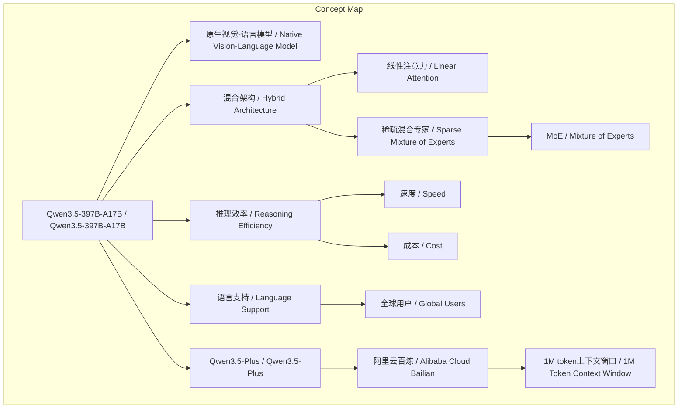
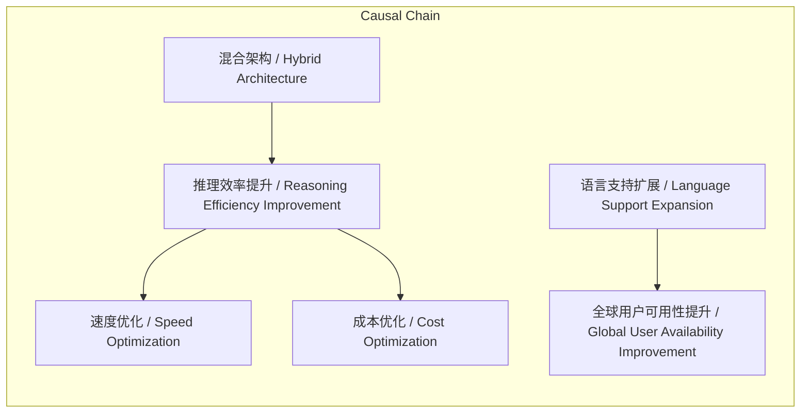

# 任务报告

- requestId: 1772201752537-2y8ers
- 生成时间(UTC): 2026-02-27T14:17:25.790Z

## 文本总结

# Qwen3.5-397B-A17B发布：混合架构提升多模态能力

## 整体结构化文档表达
### 文档卡片
- 主题（中文/English）：人工智能模型发布 / AI Model Release
- 一句话摘要：阿里发布Qwen3.5-397B-A17B开放权重版本，采用混合架构结合线性注意力与MoE，提升多模态推理效率并扩展语言支持至201种。
- 目标读者：开发者与企业
- 核心结论（3条）：
  1. 正式发布Qwen3.5系列首款模型Qwen3.5-397B-A17B的开放权重版本。
  2. 采用混合架构（线性注意力与稀疏混合专家结合）实现高效推理，激活参数仅170亿。
  3. 语言与方言支持从119种扩展至201种，并通过阿里云百炼提供API服务。

### 内容结构树
1. 背景与问题定义：未提及明确背景问题
2. 核心观点与关键证据：观点：模型表现优异；证据：全方位基准评估结果
3. 方法/机制/路径：混合架构结合线性注意力（Gated Delta Networks）与稀疏混合专家（MoE）
4. 风险与边界条件：未提及
5. 结论与行动建议：结论：提升生产力；建议：使用Qwen3.5-Plus API版本

### 结构化元数据（JSON）
```json
{
  "title": "Qwen3.5-397B-A17B发布：混合架构提升多模态能力",
  "topic_zh": "人工智能模型发布",
  "topic_en": "AI Model Release",
  "audience": "开发者与企业",
  "claims": ["发布Qwen3.5-397B-A17B开放权重版本", "采用混合架构实现高效推理", "语言支持扩展至201种"],
  "evidence": ["在推理、编程、智能体能力与多模态理解等全方位基准评估中表现优异", "总参数量达3970亿，每次前向传播仅激活170亿参数", "语言与方言支持从119种扩展至201种"],
  "risks": [],
  "actions": ["使用Qwen3.5-Plus API版本", "通过阿里云百炼服务访问"]
}
```

## 处理流程
1. 输入识别（来源：用户输入文本）
2. 信息抽取（实体、概念、问题、事实、观点）
3. 结构化归纳（定义/分类/比较/因果/方法论）
4. 关系建模（概念关系、等式/方程/逻辑链）
5. 可视化表达（Mermaid）

## 概念清单（中英文）
- Qwen3.5 / Qwen3.5
- Qwen3.5-397B-A17B / Qwen3.5-397B-A17B
- 开放权重版本 / Open Weight Version
- 原生视觉-语言模型 / Native Vision-Language Model
- 推理 / Reasoning
- 编程 / Programming
- 智能体能力 / Agent Capabilities
- 多模态理解 / Multimodal Understanding
- 基准评估 / Benchmark Evaluation
- 开发者 / Developers
- 企业 / Enterprises
- 生产力 / Productivity
- 混合架构 / Hybrid Architecture
- 线性注意力 / Linear Attention
- Gated Delta Networks / Gated Delta Networks
- 稀疏混合专家 / Sparse Mixture of Experts
- MoE / Mixture of Experts
- 参数量 / Parameter Count
- 前向传播 / Forward Propagation
- 激活参数 / Activated Parameters
- 推理效率 / Reasoning Efficiency
- 速度 / Speed
- 成本 / Cost
- 语言 / Languages
- 方言 / Dialects
- 支持 / Support
- 全球用户 / Global Users
- 可用性 / Availability
- Qwen3.5-Plus / Qwen3.5-Plus
- API版本 / API Version
- 阿里云百炼 / Alibaba Cloud Bailian
- 1M token上下文窗口 / 1M Token Context Window
- 官方工具 / Official Tools
- 自适应调用 / Adaptive Invocation

## 概念定义（中英文）
- Qwen3.5 / Qwen3.5：原文未提供明确定义
- Qwen3.5-397B-A17B / Qwen3.5-397B-A17B：Qwen3.5系列的第一款模型，型号为397B-A17B
- 开放权重版本 / Open Weight Version：原文未提供明确定义
- 原生视觉-语言模型 / Native Vision-Language Model：原文未提供明确定义
- 推理 / Reasoning：原文未提供明确定义
- 编程 / Programming：原文未提供明确定义
- 智能体能力 / Agent Capabilities：原文未提供明确定义
- 多模态理解 / Multimodal Understanding：原文未提供明确定义
- 基准评估 / Benchmark Evaluation：原文未提供明确定义
- 开发者 / Developers：原文未提供明确定义
- 企业 / Enterprises：原文未提供明确定义
- 生产力 / Productivity：原文未提供明确定义
- 混合架构 / Hybrid Architecture：将线性注意力（Gated Delta Networks）与稀疏混合专家（MoE）相结合的架构
- 线性注意力 / Linear Attention：原文未提供明确定义
- Gated Delta Networks / Gated Delta Networks：原文未提供明确定义
- 稀疏混合专家 / Sparse Mixture of Experts：与线性注意力相结合以提升推理效率的组件
- MoE / Mixture of Experts：稀疏混合专家的缩写
- 参数量 / Parameter Count：模型中参数的总数
- 前向传播 / Forward Propagation：原文未提供明确定义
- 激活参数 / Activated Parameters：每次前向传播中实际使用的参数数量
- 推理效率 / Reasoning Efficiency：原文未提供明确定义
- 速度 / Speed：原文未提供明确定义
- 成本 / Cost：原文未提供明确定义
- 语言 / Languages：原文未提供明确定义
- 方言 / Dialects：原文未提供明确定义
- 支持 / Support：原文未提供明确定义
- 全球用户 / Global Users：原文未提供明确定义
- 可用性 / Availability：原文未提供明确定义
- Qwen3.5-Plus / Qwen3.5-Plus：Qwen3.5-397B-A17B模型的API版本
- API版本 / API Version：通过API接口提供的模型服务版本
- 阿里云百炼 / Alibaba Cloud Bailian：阿里云提供的模型服务平台
- 1M token上下文窗口 / 1M Token Context Window：支持100万token上下文长度的窗口
- 官方工具 / Official Tools：原文未提供明确定义
- 自适应调用 / Adaptive Invocation：原文未提供明确定义

## 概念关联与逻辑关系（中英文）
1. 混合架构 / Hybrid Architecture 包含 线性注意力 / Linear Attention 和 稀疏混合专家 / Sparse Mixture of Experts
2. 线性注意力 / Linear Attention 与 稀疏混合专家 / Sparse Mixture of Experts 相结合 → 推理效率 / Reasoning Efficiency 提升
3. 推理效率 / Reasoning Efficiency 提升 → 速度 / Speed 优化 ∧ 成本 / Cost 优化
4. 语言支持扩展 / Language Support Expansion → 全球用户 / Global Users 可用性 / Availability 提升

## COT逻辑梳理（定义/分类/比较/因果/科学方法论）
Step 1: 定义目标：设计高效多模态模型以提升开发者生产力（基于发布背景隐含）。
Step 2: 分类方案：考虑架构类型，如纯注意力或纯专家模型，但选择混合架构作为创新路径。
Step 3: 比较分析：混合架构结合线性注意力与MoE，相比传统架构，通过减少激活参数（170亿 vs 总参数3970亿）实现效率优势。
Step 4: 因果推导：混合架构结合线性注意力与MoE → 减少激活参数 → 推理效率提升 → 优化速度与成本。
Step 5: 科学方法论：通过全方位基准评估验证性能，并扩展语言支持至201种以增强全球可用性，最终提供API服务落地。

## 事实与看法（病毒）
### 事实
- 发布Qwen3.5-397B-A17B开放权重版本
- 该模型是原生视觉-语言模型
- 在推理、编程、智能体能力与多模态理解等全方位基准评估中表现优异
- 采用混合架构结合线性注意力（Gated Delta Networks）与稀疏混合专家（MoE）
- 总参数量达3970亿
- 每次前向传播仅激活170亿参数
- 语言与方言支持从119种扩展至201种
- Qwen3.5-Plus为API版本
- 通过阿里云百炼提供服务
- 提供1M token上下文窗口、官方工具及自适应调用

### 看法
- 表现优异（主观评价）
- 显著提升生产力（主观）
- 出色的推理效率（主观）
- 创新的混合架构（主观）
- 更广泛的可用性与更完善的支持（主观）

## FAQ（原文问题整理）
- 未发现明确提问

## Visualization
### Mermaid 图 1（概念结构图）


### Mermaid 图 2（逻辑/因果图）


## 文章中的类比
- 未发现明确类比

## 10个金句
1. 我们很高兴正式发布 Qwen3.5 并推出Qwen3.5系列的第一款模型 Qwen3.5-397B-A17B 的开放权重版本。
2. 作为原生视觉-语言模型 Qwen3.5-397B-A17B 在推理、编程、智能体能力与多模态理解等全方位基准评估中表现优异。
3. 该模型采用创新的混合架构 将线性注意力（Gated Delta Networks）与稀疏混合专家（MoE）相结合。
4. 实现出色的推理效率：总参数量达 3970 亿 每次前向传播仅激活 170 亿参数。
5. 在保持能力的同时优化速度与成本。
6. 我们还将语言与方言支持从 119 种扩展至 201 种。
7. 为全球用户提供更广泛的可用性与更完善的支持。
8. Qwen3.5-Plus 为该模型的 API 版本。
9. 通过阿里云百炼提供服务： 1M token 上下文窗口 官方工具及自适应调用。
10. 原文未提供
