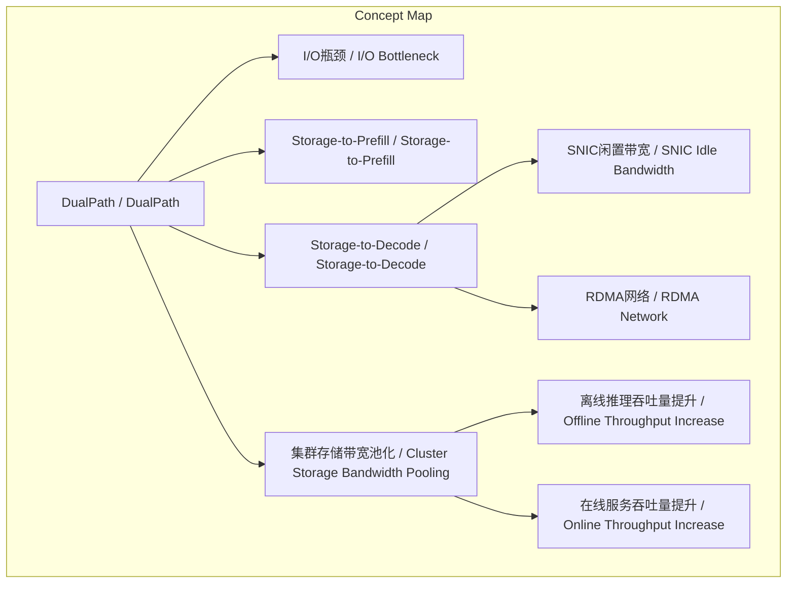
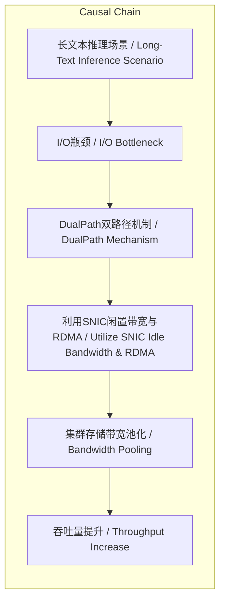

# 任务报告

- requestId: 1772201934355-67i2u4
- 生成时间(UTC): 2026-02-27T14:19:49.502Z

## 文本总结

# DualPath双路径技术突破大模型I/O瓶颈

## 整体结构化文档表达
### 文档卡片
- 主题（中文/English）：双路径存储优化机制 / DualPath Dual-Path Storage Optimization
- 一句话摘要：DualPath通过引入第二存储读取路径，利用闲置网络带宽，解决大模型长文本推理中的I/O瓶颈，显著提升吞吐量。
- 目标读者：AI系统架构师、大模型推理工程师、数据中心技术决策者
- 核心结论（3条）：
  1. DualPath创新性地在Storage-to-Prefill之外增加Storage-to-Decode路径，直接缓解长文本推理的I/O瓶颈。
  2. 通过利用解码引擎的SNIC闲置带宽和RDMA高速网络，实现集群存储带宽的全局池化与动态负载均衡。
  3. 在660B参数生产级模型测试中，离线推理吞吐量提升1.87倍，在线服务吞吐量平均提升1.96倍。

### 内容结构树
1. 背景与问题定义：长文本推理场景中，KV-Cache从外部存储加载的I/O瓶颈拖累计算资源利用率。
2. 核心观点与关键证据：DualPath双路径机制是解决方案；证据为660B模型测试中吞吐量大幅提升。
3. 方法/机制/路径：传统单路径（Storage-to-Prefill）改为双路径（增加Storage-to-Decode）；利用SNIC闲置带宽和RDMA传输实现带宽池化。
4. 风险与边界条件：原文未提及具体风险或边界条件。
5. 结论与行动建议：DualPath性能验证有效，建议在类似场景中评估部署。

### 结构化元数据（JSON）
```json
{
  "title": "DualPath双路径技术突破大模型I/O瓶颈",
  "topic_zh": "双路径存储优化机制",
  "topic_en": "DualPath Dual-Path Storage Optimization",
  "audience": "AI系统架构师、大模型推理工程师、数据中心技术决策者",
  "claims": [
    "DualPath通过双路径存储读取解决长文本推理I/O瓶颈",
    "利用SNIC闲置带宽和RDMA实现存储带宽池化与负载均衡",
    "在660B模型测试中离线吞吐量提升1.87倍，在线吞吐量提升1.96倍"
  ],
  "evidence": [
    "生产级660B模型实际测试数据：离线推理吞吐量增加1.87倍，在线服务吞吐量平均增加1.96倍"
  ],
  "risks": [],
  "actions": []
}
```

## 处理流程
未提及

## 概念清单（中英文）
- DualPath / DualPath
- I/O瓶颈 / I/O Bottleneck
- 长文本推理 / Long-Text Inference
- AI代理 / Agents
- 键值缓存 / KV Cache
- 外部存储 / External Storage
- 计算资源 / Computing Resources
- 存储读取 / Storage Reading
- 存储至预填充 / Storage-to-Prefill
- 存储至解码 / Storage-to-Decode
- 存储网络接口卡 / Storage Network Interface Card (SNIC)
- 解码引擎 / Decoding Engine
- 高速计算网络 / High-Speed Computing Network (RDMA)
- 集群存储带宽 / Cluster Storage Bandwidth
- 生产级模型 / Production-Level Model
- 660B模型 / 660B Model
- 离线推理吞吐量 / Offline Inference Throughput
- 在线服务吞吐量 / Online Service Throughput

## 概念定义（中英文）
- DualPath / DualPath：一种优化长文本推理中存储读取的双路径机制，通过增加Storage-to-Decode路径缓解I/O瓶颈。
- I/O瓶颈 / I/O Bottleneck：在长文本推理场景下，外部存储加载KV-Cache的速度限制计算资源利用率的瓶颈现象。
- 长文本推理 / Long-Text Inference：涉及处理超长上下文序列的AI模型推理任务。
- AI代理 / Agents：部署人工智能代理的应用场景，常需长文本处理能力。
- 键值缓存 / KV Cache：存储注意力机制键值对的高速缓存，用于加速推理。
- 外部存储 / External Storage：位于计算节点外部的存储设备，如SSD或HDD。
- 计算资源 / Computing Resources：用于执行模型计算的CPU/GPU等硬件资源。
- 存储读取 / Storage Reading：从存储设备加载数据到计算单元的过程。
- 存储至预填充 / Storage-to-Prefill：传统单路径中，存储数据直接加载至预填充阶段。
- 存储至解码 / Storage-to-Decode：DualPath引入的第二路径，存储数据直接加载至解码阶段。
- 存储网络接口卡 / Storage Network Interface Card (SNIC)：连接存储网络的网卡，常用于存储访问。
- 解码引擎 / Decoding Engine：执行模型解码阶段的计算单元。
- 高速计算网络 / High-Speed Computing Network (RDMA)：远程直接内存访问网络，实现低延迟、高带宽节点间数据传输。
- 集群存储带宽 / Cluster Storage Bandwidth：集群范围内所有存储设备提供的总带宽资源。
- 生产级模型 / Production-Level Model：经过大规模数据训练、部署于实际生产环境的AI模型。
- 660B模型 / 660B Model：参数规模约为6600亿的大型AI模型。
- 离线推理吞吐量 / Offline Inference Throughput：非实时场景下单位时间处理的推理请求数。
- 在线服务吞吐量 / Online Service Throughput：实时服务场景下单位时间处理的推理请求数。

## 概念关联与逻辑关系（中英文）
1. DualPath（双路径机制）通过引入Storage-to-Decode（存储至解码路径）缓解I/O bottleneck（I/O瓶颈）。
2. Storage-to-Decode（存储至解码路径）利用SNIC闲置带宽（SNIC闲置带宽）和RDMA网络（RDMA网络）实现集群存储带宽池化（集群存储带宽池化）。
3. 集群存储带宽池化（集群存储带宽池化）导致离线推理吞吐量提升（离线推理吞吐量提升）和在线服务吞吐量提升（在线服务吞吐量提升）。

## COT逻辑梳理（定义/分类/比较/因果/科学方法论）
Step 1: 定义问题 - 在长文本推理场景中，AI代理的KV-Cache从外部存储加载导致I/O瓶颈，拖累计算资源利用率。
Step 2: 分类传统方法 - 传统采用单路径Storage-to-Prefill，所有存储读取均通过此路径至预填充阶段。
Step 3: 比较提出新方案 - 对比单路径，DualPath引入第二路径Storage-to-Decode，实现读取路径分流。
Step 4: 因果机制 - 第二路径利用解码引擎的SNIC闲置带宽读取缓存，通过RDMA高速网络传输至预填充引擎，从而全局池化集群存储带宽并动态负载均衡。
Step 5: 科学方法论验证 - 在660B参数生产级模型上进行实际测试，通过离线/在线吞吐量指标量化性能提升。
Step 6: 结论 - DualPath有效解决I/O瓶颈，显著提升推理吞吐量。

## 事实与看法（病毒）
### 事实
- DualPath引入了Storage-to-Decode第二路径。
- 利用SNIC闲置带宽和RDMA网络进行数据传输。
- 在660B模型测试中，离线推理吞吐量增加1.87倍，在线服务吞吐量平均增加1.96倍。
### 看法
- “amazing performance” - 认为DualPath性能惊人。
- “ensures that computing resources are not dragged down by storage reading” - 断言DualPath确保计算资源不被存储读取拖累。

## FAQ（原文问题整理）
未发现明确提问

## Visualization
### Mermaid 图 1（概念结构图）

### Mermaid 图 2（逻辑/因果图）


## 文章中的类比
未发现明确类比

## 10个金句
1. “The core of DualPath is to solve the I/O bottleneck in the long-text inference scenario of agents.”
2. “By optimizing the speed of loading KV-Cache from external storage it ensures that computing resources are not dragged down by storage reading.”
3. “It changes the traditional single-path loading mode of Storage-to-Prefill and introduces a second path of Storage-to-Decode.”
4. “By using the idle bandwidth of the Storage Network Interface Card (SNIC) of the decoding engine to read the cache and transmitting it to the pre-fill engine through the high-speed computing network (RDMA)”
5. “DualPath realizes the global pooling and dynamic load balancing of the cluster storage bandwidth.”
6. “In the actual test of a production-level model with a scale of 660B DualPath showed amazing performance:”
7. “The offline inference throughput increased by 1.87 times and the online service throughput increased by an average of 1.96 times.”
8. “Moreover it is related to the computing power topic exposed a few days ago.”
9. 原文未提供
10. 原文未提供
