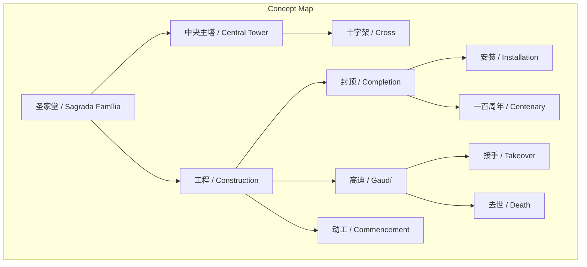
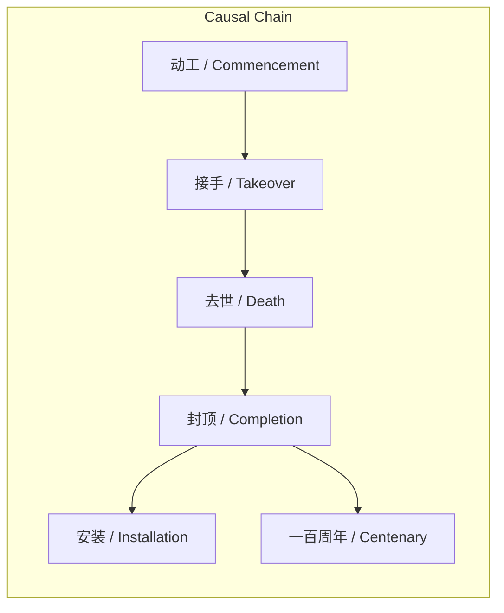

# NEWS/NEWS 任务报告

- agent: news/news
- requestId: 1772203952795-z2tsy4
- 生成时间(UTC): 2026-02-27T14:53:54.526Z

## 文本总结

# 圣家堂封顶 纪念高迪百年忌辰

## 整体结构化文档表达
### 文档卡片
- 主题（中文/English）：圣家堂封顶事件 / Sagrada Família Completion Event
- 一句话摘要：圣家堂中央主塔十字架上臂安装完成，标志工程重大进展，恰逢高迪逝世一百周年。
- 目标读者：对建筑、文化遗产、宗教或历史感兴趣的公众
- 核心结论（3条）：
  1. 圣家堂中央主塔十字架最后一段上臂安装到位，工程取得里程碑进展。
  2. 该工程自1882年动工，高迪1883年接手，1926年去世时仅完成不到四分之一，历时漫长。
  3. 封顶时间选择在高迪逝世一百周年，具有纪念意义。

### 内容结构树
1. 背景与问题定义：圣家堂是世界最高教堂，工程始于1882年，高迪1883年接手，1926年去世时进度缓慢。
2. 核心观点与关键证据：2026年2月20日10:30，中央主塔十字架上臂安装完成；历史时间点证明工程长期性。
3. 方法/机制/路径：未提及
4. 风险与边界条件：未提及
5. 结论与行动建议：未提及

### 结构化元数据（JSON）
```json
{
  "title": "圣家堂封顶 纪念高迪百年忌辰",
  "topic_zh": "圣家堂封顶事件",
  "topic_en": "Sagrada Família Completion Event",
  "audience": "对建筑、文化遗产、宗教或历史感兴趣的公众",
  "claims": [
    "圣家堂中央主塔十字架最后一段上臂安装完成",
    "工程自1882年动工，高迪1883年接手，1926年去世时仅完成不到四分之一",
    "封顶时间恰逢高迪逝世一百周年"
  ],
  "evidence": [
    "西班牙时间2月20日10:30安装到位",
    "1882年动工",
    "1883年高迪接手",
    "1926年高迪去世时工程不到四分之一"
  ],
  "risks": [],
  "actions": []
}
```

## 处理流程
未提及

## 概念清单（中英文）
- 圣家堂 / Sagrada Família
- 高迪 / Gaudí
- 中央主塔 / Central Tower
- 十字架 / Cross
- 工程 / Construction
- 动工 / Commencement
- 接手 / Takeover
- 去世 / Death
- 封顶 / Completion
- 安装 / Installation
- 一百周年 / Centenary

## 概念定义（中英文）
- 圣家堂 / Sagrada Família：世界最高教堂，位于西班牙巴塞罗那，由高迪设计的著名建筑。
- 高迪 / Gaudí：圣家堂的设计师，1883年接手工程，1926年去世。
- 中央主塔 / Central Tower：圣家堂的中央主塔，用于安装十字架。
- 十字架 / Cross：基督教符号，安装在中央主塔上。
- 工程 / Construction：圣家堂的建设过程。
- 动工 / Commencement：1882年开始建设。
- 接手 / Takeover：高迪于1883年开始负责设计。
- 去世 / Death：高迪于1926年逝世。
- 封顶 / Completion：中央主塔十字架安装完成，标志工程重大进展。
- 安装 / Installation：将最后一段上臂固定到位的动作。
- 一百周年 / Centenary：高迪逝世一百周年纪念。

## 概念关联与逻辑关系（中英文）
1. 高迪 / Gaudí 负责 工程 / Construction：高迪于1883年接手圣家堂工程。
2. 时间(高迪去世) / Time(Gaudí's Death) 与 时间(封顶) / Time(Completion) 相差100年：封顶时间恰逢高迪逝世一百周年。
3. 工程完成度 / Construction Completion 在 高迪去世 / Gaudí's Death 时低于25%，在 封顶 / Completion 时显著提高：高迪去世时工程不到四分之一，封顶标志进展。

## COT逻辑梳理（定义/分类/比较/因果/科学方法论）
Step 1: 定义事件：圣家堂中央主塔十字架上臂安装完成，称为“封顶”事件。
Step 2: 分类：属于建筑 completion 事件，文化遗产里程碑。
Step 3: 比较：对比历史时间点，工程从1882年至今约144年（2026年），高迪负责43年（1883-1926）但进度慢。
Step 4: 因果：高迪的长期艺术追求导致工程缓慢但精细；一百周年选择封顶时间以纪念高迪。
Step 5: 科学方法论：无明确科学方法，但工程管理涉及长期规划和纪念性选择。

## 事实与看法（病毒）
### 事实
- 圣家堂是世界最高教堂。
- 1882年动工。
- 1883年高迪接手。
- 1926年高迪去世时工程不到四分之一。
- 西班牙时间2月20日10:30，中央主塔十字架最后一段上臂安装到位。
- 恰逢高迪逝世一百周年。

### 看法
- 未发现明确看法（原文均为事实陈述）

## FAQ（原文问题整理）
- 未发现明确提问

## Visualization
### Mermaid 图 1（概念结构图）


### Mermaid 图 2（逻辑/因果图）


## 文章中的类比
未发现明确类比

## 10个金句
1. 世界最高教堂圣家堂封顶了
2. 1882年动工
3. 1883年高迪接手
4. 1926年73岁的高迪去世时工程仅完成不到四分之一
5. 西班牙时间2月20日10:30
6. 圣家堂中央主塔十字架的最后一段上臂被安装到位
7. 恰逢设计师高迪逝世一百周年
8. 原文未提供
9. 原文未提供
10. 原文未提供
