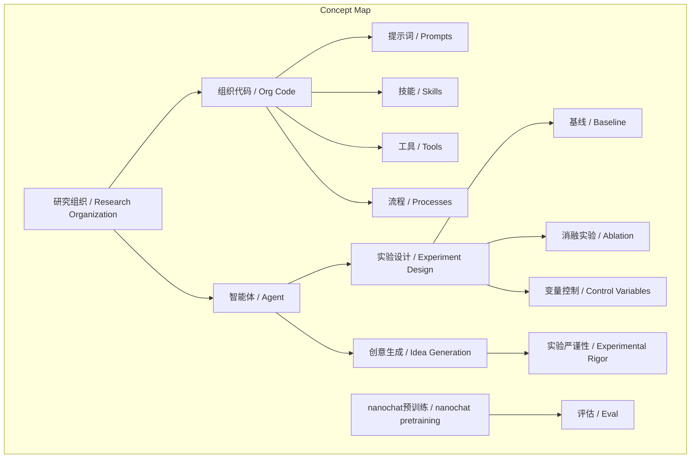
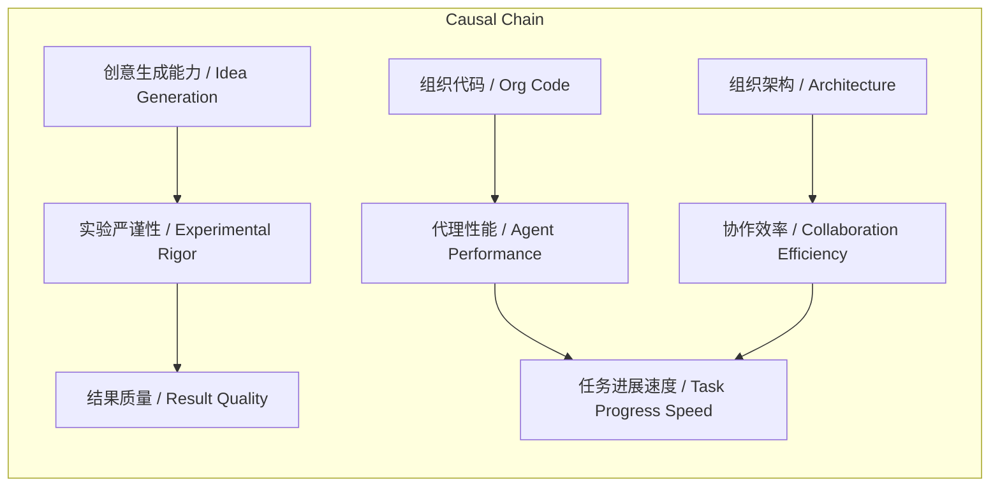

# NEWS/NEWS 任务报告

- agent: news/news
- requestId: 1772237022583-hpii0q
- 生成时间(UTC): 2026-02-28T00:04:53.469Z

## 文本总结

# AI代理研究组织模拟实验揭示创意瓶颈

## 整体结构化文档表达
### 文档卡片
- 主题（中文/English）：AI代理研究组织模拟 / AI Agent Research Organization Simulation
- 一句话摘要：通过模拟不同架构的研究组织，测试AI代理在实验设计中的表现，发现其创意生成能力不足但实现能力强，强调组织流程作为“源代码”的关键作用。
- 目标读者：AI研究者、组织设计者、机器学习工程师
- 核心结论（3条）：
  1. AI代理在实现给定想法时表现良好，但缺乏创造性实验设计能力。
  2. 研究组织的“源代码”（提示词、技能、工具、流程）是优化关键。
  3. 当前实验（如删除logit softcap）因代理方法不严谨而失败。

### 内容结构树
1. 背景与问题定义：尝试用多AI代理模拟研究组织进行nanochat实验，目标是测试代理在任意任务上生成进展的速度。
2. 核心观点与关键证据：核心观点是代理创意生成差；证据包括代理不会设计实验、建立基线、控制变量，举例伪发现。
3. 方法/机制/路径：使用git分支、tmux窗口网格等工具模拟组织，代理通过提示词和流程协作，每日站会作为组织代码一部分。
4. 风险与边界条件：风险是低质量想法导致无效实验；边界条件是实验在nanochat平台，使用Claude和Codex模型。
5. 结论与行动建议：结论是组织设计需优化以提升创意生成；建议将组织流程作为可编程实体优化，并评估组织在多样化任务上的表现。

### 结构化元数据（JSON）
```json
{
  "title": "AI代理研究组织模拟实验报告",
  "topic_zh": "AI代理研究组织模拟",
  "topic_en": "AI Agent Research Organization Simulation",
  "audience": "AI研究者、组织设计者、机器学习工程师",
  "claims": [
    "AI代理实现能力强但创意生成弱",
    "研究组织的'源代码'是关键优化对象",
    "当前实验因方法不严谨失败"
  ],
  "evidence": [
    "代理不会设计严谨实验，如不建立基线、不控制变量",
    "代理'发现'增大隐藏层降低验证损失是伪结果，因未考虑训练时间延长",
    "使用git分支和tmux模拟组织架构"
  ],
  "risks": [
    "代理低质量想法导致无效实验和误导结论",
    "缺乏科学方法论可能浪费计算资源"
  ],
  "actions": [
    "优化组织提示词和流程以提升代理创意生成能力",
    "将研究组织设计作为可编程实体，其'源代码'包括提示词、技能、工具和流程",
    "以多样化任务评估研究组织的进展速度"
  ]
}
```

## 处理流程
1. 输入识别：识别用户提供的英文文本，内容为AI代理研究组织模拟实验的描述。
2. 信息抽取：抽取实体如nanochat、Claude、Codex、GPU、git branch、tmux；概念如研究组织、创意生成、实验设计、logit softcap；问题如如何提升代理创意；事实如实验设置和结果；观点如代理想法差。
3. 结构化归纳：定义研究组织为代理集合；分类组织架构为独立型和层级型；比较不同架构效果；因果分析代理创意不足因提示设计或训练数据；科学方法论强调控制变量。
4. 关系建模：建立概念关系，如组织流程影响代理性能，创意生成影响实验质量。
5. 可视化表达：设计Mermaid图展示概念结构和因果链。

## 概念清单（中英文）
- nanochat / nanochat
- agents / 智能体
- Claude / Claude模型
- Codex / Codex模型
- GPU / 图形处理器
- logit softcap / 对数软上限
- git branch / Git分支
- feature branch / 功能分支
- git worktrees / Git工作树
- Docker / Docker容器
- VMs / 虚拟机
- tmux / 终端复用器
- window grids / 窗口网格
- interactive sessions / 交互式会话
- research org / 研究组织
- daily standup / 每日站会
- org code / 组织代码
- nanochat pretraining / nanochat预训练
- eval / 评估
- experiment design / 实验设计
- baseline / 基线
- ablation / 消融实验
- runtime / 运行时间
- flops / 浮点运算次数
- hidden size / 隐藏层大小
- validation loss / 验证损失

## 概念定义（中英文）
- nanochat / nanochat: 用于AI实验的聊天平台或框架。
- agents / 智能体: 指AI模型实例（如Claude或Codex），被分配执行研究任务。
- Claude / Claude模型: Anthropic开发的大语言模型。
- Codex / Codex模型: OpenAI开发的代码生成模型。
- GPU / 图形处理器: 用于并行计算的硬件，每个代理分配一个。
- logit softcap / 对数软上限: 一种训练稳定技术，实验试图删除但失败。
- git branch / Git分支: 版本控制分支，用于隔离研究程序。
- feature branch / 功能分支: 从主分支分出的开发分支。
- git worktrees / Git工作树: Git功能，允许同一仓库多个工作目录以实现隔离。
- Docker / Docker容器: 容器化技术，实验跳过以简化。
- VMs / 虚拟机: 虚拟化技术，实验跳过以简化。
- tmux / 终端复用器: 终端多路复用工具，用于管理窗口网格。
- window grids / 窗口网格: tmux中排列的多个窗口，模拟Teams界面以可视化代理工作。
- interactive sessions / 交互式会话: 代理的实时交互环境。
- research org / 研究组织: 由多个AI代理组成的模拟研究机构。
- daily standup / 每日站会: 敏捷开发中的短会，作为组织流程的一部分。
- org code / 组织代码: 定义研究组织的提示词、技能、工具和流程的集合。
- nanochat pretraining / nanochat预训练: 在nanochat平台上的预训练过程，作为评估任务。
- eval / 评估: 衡量组织在任务上表现的标准。
- experiment design / 实验设计: 规划实验的方法，包括设立基线、控制变量等。
- baseline / 基线: 对照实验组，用于比较新方法效果。
- ablation / 消融实验: 移除某组件以评估其贡献的实验。
- runtime / 运行时间: 实验执行时间，需控制变量。
- flops / 浮点运算次数: 计算量度量，需控制变量。
- hidden size / 隐藏层大小: 神经网络隐藏层维度，代理错误关联验证损失。
- validation loss / 验证损失: 模型在验证集上的损失，用于评估性能。

## 概念关联与逻辑关系（中英文）
1. 研究组织 (Research Organization) 的“源代码” (Org Code) 由 提示词 (Prompts)、技能 (Skills)、工具 (Tools) 和 流程 (Processes) 组成，共同决定 代理性能 (Agent Performance)。形式化：Org_Code = {Prompts, Skills, Tools, Processes}；Agent_Performance = f(Org_Code)。
2. 代理创意生成能力 (Creative_Idea_Generation) 与 实验严谨性 (Experimental_Rigor) 正相关。形式化：Experimental_Rigor ∝ Creative_Idea_Generation。
3. 组织架构 (Organization_Architecture) 影响 协作效率 (Collaboration_Efficiency)，进而影响 任务进展速度 (Task_Progress_Speed)。形式化：Task_Progress_Speed = g(Collaboration_Efficiency, Organization_Architecture)。

## COT逻辑梳理（定义/分类/比较/因果/科学方法论）
Step 1: 定义研究组织为可编程的代理集合，其行为由提示词和流程控制，目标是在任意任务上快速生成进展。
Step 2: 分类组织架构：独立型（8个独立研究员）与层级型（1首席科学家带8初级研究员）。
Step 3: 比较：两种架构下，代理均表现创意不足但实现能力强；架构差异未显著改善创意生成。
Step 4: 因果分析：代理创意生成弱可能因训练数据缺乏研究启发，或提示词未激励探索；实验不严谨（如不设基线、不控制变量）导致伪发现（如隐藏层大小与验证损失的误关联）。
Step 5: 科学方法论：强调任何实验需设立基线、进行消融实验、严格控制变量（运行时间、flops），以确保结果有效和可复现。

## 事实与看法（病毒）
### 事实
- 实验使用8个代理（4个Claude，4个Codex），每个配1个GPU。
- 使用git分支隔离研究程序，feature分支用于开发，git worktrees提供隔离。
- 跳过Docker/VMs，依赖指令防止干扰。
- 使用tmux窗口网格管理交互会话，类似Teams界面。
- 代理能实现给定想法，但不会创意生成。
- 代理不设计严谨实验：不创建基线、不消融、不控制运行时间或flops。
- 具体例子：代理“发现”增大隐藏层降低验证损失，但未考虑训练时间延长，是伪结果。
- 研究组织的“源代码”包括提示词、技能、工具、流程，如每日站会。
- 优化nanochat预训练是作为评估任务之一。
- 目标：评估组织在任意任务上生成进展的速度。

### 看法
- 代理想法“pretty bad out of the box”。
- 实验“doesn't work and it's a mess... but it's still very pretty to look at :)”。
- 需要优化组织“源代码”以提升性能。
- 代理“don't think carefully through experiment design”。
- 代理“don't create strong baselines and ablate things properly”。
- 代理“very good at implementing any given well-scoped and described idea”。

## FAQ（原文问题整理）
未发现明确提问。

## Visualization
### Mermaid 图 1（概念结构图）


### Mermaid 图 2（逻辑/因果图）


## 文章中的类比
- tmux窗口网格 类似 Teams会议界面（用于可视化代理工作）。

## 10个金句
1. "I had the same thought so I've been playing with it in nanochat."
2. "The TLDR is that it doesn't work and it's a mess... but it's still very pretty to look at :)"
3. "They are very good at implementing any given well-scoped and described idea but they don't creatively generate them."
4. "They don't think carefully through experiment design they run a bit non-sensical variations they don't create strong baselines and ablate things properly they don't carefully control for runtime or flops."
5. "just as an example an agent yesterday 'discovered' that increasing the hidden size of the network improves the validation loss which is a totally spurious result"
6. "But the goal is that you are now programming an organization (e.g. a 'research org') and its individual agents so the 'source code' is the collection of prompts skills tools etc. and processes that make it up."
7. "E.g. a daily standup in the morning is now part of the 'org code'."
8. "Then - given an arbitrary task how quickly does your research org generate progress on it?"
9. "I tried a few setups: 8 independent solo researchers 1 chief scientist giving work to 8 junior researchers etc."
10. "Each research program is a git branch each scientist forks it into a feature branch git worktrees for isolation simple files for comms skip Docker/VMs for simplicity atm"
