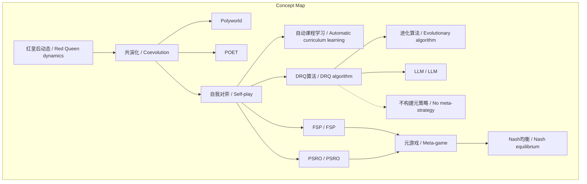
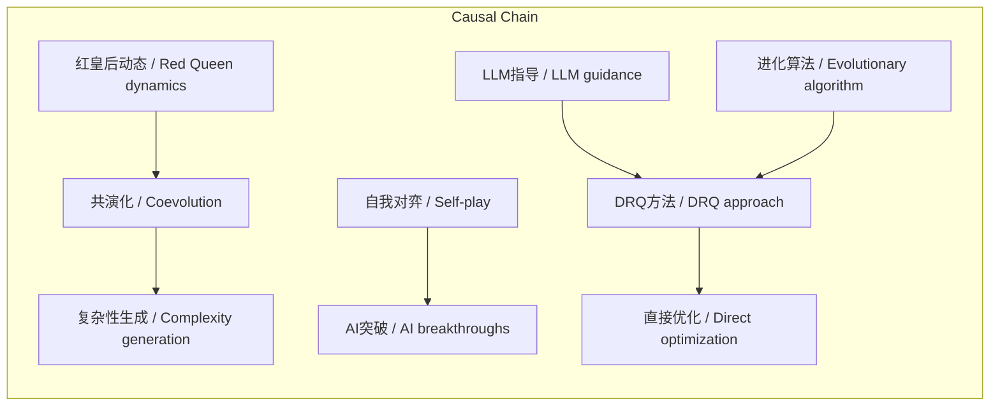

# NEWS/NEWS 任务报告

- agent: news/news
- requestId: 1772237728821-ymhngi
- 生成时间(UTC): 2026-02-28T00:16:18.795Z

## 文本总结

# 开放共演与自我对弈驱动AI复杂性

## 整体结构化文档表达
### 文档卡片
- **主题**：开放共演化与自我对弈 / Open-Ended Coevolution and Self-Play  
- **一句话摘要**：通过模拟生物红皇后动态，利用共演化和自我对弈机制在AI中生成复杂行为，并介绍DRQ算法的创新点。  
- **目标读者**：人工智能研究人员、演化计算领域学者  
- **核心结论**：
  1. 红皇后动态是生物演化中产生复杂性的核心机制。
  2. 自我对弈作为红皇后动态的AI实现，已在多个领域驱动重大突破。
  3. DRQ算法通过LLM引导的进化优化，直接在当前多智能体环境中优化agent，区别于传统元游戏求解方法。

### 内容结构树
1. **背景与问题定义**：生物演化中的红皇后动态启发AI中的共演化研究，旨在模拟复杂性生成。
2. **核心观点与关键证据**：共演化和自我对弈能有效产生复杂行为；证据包括Polyworld、POET、自我对弈在棋类、策略游戏等成功案例。
3. **方法/机制/路径**：质量多样性算法维持多样性；自我对弈作为自动课程学习；DRQ使用进化算法和LLM指导，不构建元策略。
4. **风险与边界条件**：未提及具体风险；边界条件是领域缺乏明确定义动作空间，故采用进化算法。
5. **结论与行动建议**：DRQ提供新思路，结合LLM与进化优化；行动建议未提及。

### 结构化元数据（JSON）
```json
{
  "title": "开放共演与自我对弈驱动AI复杂性",
  "topic_zh": "开放共演化与自我对弈",
  "topic_en": "Open-Ended Coevolution and Self-Play",
  "audience": "人工智能研究人员、演化计算领域学者",
  "claims": [
    "红皇后动态是生物演化中产生复杂性的核心机制。",
    "自我对弈作为红皇后动态的AI实现，已在多个领域驱动重大突破。",
    "DRQ算法通过LLM引导的进化优化，直接在当前多智能体环境中优化agent，区别于传统元游戏求解方法。"
  ],
  "evidence": [
    "Polyworld [46] 演化神经网络控制的agent，产生捕食和合作等行为。",
    "POET [47 48] 开放共演agent和环境，生成问题和解决方案。",
    "自我对弈在跳棋 [57]、西洋双陆棋 [58]、围棋 [59 60]、象棋 [61]、3D多智能体环境 [62 63]、星际争霸II [64 65]、Dota 2 [66]中取得突破。",
    "自我对弈可创建稳健的自动驾驶策略 [67]。",
    "自我对弈可视为自动课程学习 [68]，抽象为一个agent与环境交互，另一个生成环境 [69]。",
    "DRQ与FSP [70 27 71]和PSRO [28]相关，但不构建元策略或求解元游戏。",
    "FSP训练agent通过近似最佳响应于对手过去策略的经验平均。",
    "PSRO迭代扩展策略种群，训练最佳响应于策略混合，并求解元游戏计算Nash均衡分布。",
    "DRQ直接优化当前agent在多智能体环境包含所有先前agent。",
    "由于领域缺乏明确定义动作空间，DRQ使用进化算法内循环优化agent。",
    "DRQ使用LLM指导进化优化过程。"
  ],
  "risks": [],
  "actions": []
}
```

## 处理流程
1. **输入识别**：用户提供关于开放共演化和自我对弈的学术文本。
2. **信息抽取**：实体包括红皇后动态、Polyworld、POET、DRQ等；概念如共演化、自我对弈；事实包括研究引用、算法描述；观点如自我对弈视为自动课程学习。
3. **结构化归纳**：将内容分为背景、观点、方法、风险、结论；定义概念；比较DRQ与FSP/PSRO。
4. **关系建模**：红皇后动态 → 共演化；自我对弈 → 自动课程学习；DRQ → 直接优化 vs 元策略构建。
5. **可视化表达**：使用Mermaid绘制概念图和因果图。

## 概念清单（中英文）
- 红皇后动态 / Red Queen dynamics
- 共演化 / Coevolution
- Polyworld
- POET
- 质量多样性算法 / Quality-diversity algorithms
- 自我对弈 / Self-play
- DRQ算法 / DRQ algorithm
- Fictitious Self-Play (FSP) / Fictitious Self-Play (FSP)
- Policy Space Response Oracles (PSRO) / Policy Space Response Oracles (PSRO)
- 大型语言模型 (LLM) / Large Language Model (LLM)
- 进化算法 / Evolutionary algorithm
- 元游戏 / Meta-game
- Nash均衡 / Nash equilibrium
- 多智能体环境 / Multi-agent environment
- 自动课程学习 / Automatic curriculum learning
- 神经网络 / Neural-network
- 捕食 / Predation
- 合作 / Cooperation
- 资源竞争 / Compete for resources
- 策略种群 / Strategy population
- 最佳响应 / Best response

## 概念定义（中英文）
- **红皇后动态 / Red Queen dynamics**：生物演化中的军备竞赛动态，驱动物种持续适应以维持相对适应度。
- **共演化 / Coevolution**：多个agent种群相互竞争或合作，共同演化的过程。
- **Polyworld**：演化神经网络控制agent的模拟环境，agent竞争资源并发展捕食、合作等行为。
- **POET**：开放共演agent和环境的算法，生成问题和解决方案对。
- **质量多样性算法 / Quality-diversity algorithms**：通过维持种群多样性来稳定演化算法的方法。
- **自我对弈 / Self-play**：agent在环境中与自身历史副本或相关agent对弈的训练方式。
- **DRQ算法 / DRQ algorithm**：直接优化当前agent在多智能体环境中的算法，使用进化算法内循环和LLM指导，不构建元策略。
- **Fictitious Self-Play (FSP) / Fictitious Self-Play (FSP)**：通过近似最佳响应于对手过去策略的经验平均来训练agent的方法。
- **Policy Space Response Oracles (PSRO) / Policy Space Response Oracles (PSRO)**：迭代扩展策略种群，训练最佳响应于策略混合，并求解元游戏计算Nash均衡分布的方法。
- **大型语言模型 (LLM) / Large Language Model (LLM)**：用于指导进化优化过程的语言模型。
- **进化算法 / Evolutionary algorithm**：在DRQ内循环中用于优化agent的算法。
- **元游戏 / Meta-game**：在PSRO中，用于计算策略种群Nash均衡的博弈。
- **Nash均衡 / Nash equilibrium**：策略分布中，没有任何agent能通过单方面改变策略而获益的状态。
- **多智能体环境 / Multi-agent environment**：包含多个交互agent的环境。
- **自动课程学习 / Automatic curriculum learning**：自我对弈抽象为自动生成难度递增学习任务的方式。
- **神经网络 / Neural-network**：用于控制agent的神经网络结构。
- **捕食 / Predation**：agent在Polyworld中发展的竞争行为。
- **合作 / Cooperation**：agent在Polyworld中发展的协作行为。
- **资源竞争 / Compete for resources**：agent在模拟环境中争夺资源的行为。
- **策略种群 / Strategy population**：在PSRO中维护的策略集合。
- **最佳响应 / Best response**：针对给定策略混合的最优应对策略。

## 概念关联与逻辑关系（中英文）
1. **红皇后动态 / Red Queen dynamics** 驱动 **共演化 / Coevolution** 过程，导致复杂性生成：  
   `Red Queen dynamics → Coevolution → Complexity generation`
2. **自我对弈 / Self-play** 可抽象为 **自动课程学习 / Automatic curriculum learning**：  
   `Self-play ≡ Automatic curriculum learning`（其中一agent生成环境，另一agent交互）
3. **DRQ算法 / DRQ algorithm** 与 **FSP / FSP** 和 **PSRO / PSRO** 相关，但 **DRQ** 直接优化而不构建元策略：  
   `DRQ = Direct optimization + LLM guidance + Evolutionary algorithm`  
   `FSP/PSRO = Meta-strategy construction + Meta-game solving`

## COT逻辑梳理（定义/分类/比较/因果/科学方法论）
- **Step 1: 定义**：红皇后动态是生物演化中因竞争导致的持续适应循环，是复杂性的核心机制。
- **Step 2: 分类**：共演化方法分为环境共演化（如POET）和自我对弈；自我对弈进一步分为历史副本对弈和策略混合对弈。
- **Step 3: 比较**：比较DRQ与FSP/PSRO——FSP/PSRO构建元策略并求解Nash均衡，DRQ直接优化当前agent且不求解元游戏。
- **Step 4: 因果**：自我对弈通过自动生成对抗性任务，驱动AI在棋类、策略游戏等领域突破。
- **Step 5: 科学方法论**：DRQ结合进化算法（处理无明确定义动作空间）和LLM（指导搜索），形成混合优化框架。

## 事实与看法（病毒）
### 事实
- 红皇后动态是生物演化中复杂性的核心机制 [44]。
- Polyworld演化神经网络控制的agent，产生捕食和合作行为 [46]。
- POET开放共演agent和环境，生成问题和解决方案 [47 48]。
- 质量多样性算法用于维持演化算法多样性 [54 55 29 56]。
- 自我对弈在跳棋 [57]、西洋双陆棋 [58]、围棋 [59 60]、象棋 [61]、3D多智能体环境 [62 63]、星际争霸II [64 65]、Dota 2 [66]中取得突破。
- 自我对弈可创建稳健的自动驾驶策略 [67]。
- 自我对弈可视为自动课程学习 [68]，抽象为一个agent与环境交互，另一个生成环境 [69]。
- DRQ与FSP [70 27 71]和PSRO [28]相关。
- FSP训练agent通过近似最佳响应于对手过去策略的经验平均。
- PSRO迭代扩展策略种群，训练最佳响应于策略混合，并求解元游戏计算Nash均衡分布。
- DRQ不构建显式元策略或求解元游戏，直接优化当前agent在多智能体环境包含所有先前agent。
- 由于领域缺乏明确定义动作空间，DRQ使用进化算法内循环优化agent。
- DRQ使用LLM指导进化优化过程。

### 看法
- 自我对弈可以视为一种自动课程学习。
- DRQ算法与FSP和PSRO提供博弈论框架的多智能体学习相关。
- 使用LLM指导进化优化是DRQ的创新点。

## FAQ（原文问题整理）
- 未发现明确提问。

## Visualization
### Mermaid 图 1（概念结构图）


### Mermaid 图 2（逻辑/因果图）


## 文章中的类比
- 未发现明确类比。

## 10个金句
1. "One of the core mechanisms that led to complexity in biology is the Red Queen dynamics of evolutionary arms races."
2. "Self-play has driven some of the most significant breakthroughs in AI ranging from early successes in checkers and backgammon to modern advances in board games such as Go and chess and 3D multi-agent environments."
3. "Self-play can be viewed as a form of automatic curriculum learning and can thus be abstracted as one agent interacting with the environment while another generates the environment."
4. "Within self-play our DRQ algorithm is closely related to Fictitious Self-Play (FSP) and Policy Space Response Oracles (PSRO) which provide game-theoretic frameworks for multi-agent learning."
5. "In contrast DRQ does not construct explicit meta-strategies or solve a meta-game instead we directly optimize the current agent within a multi-agent environment containing all previous agents."
6. "Furthermore because our domain lacks a well-defined action space we employ an evolutionary algorithm in the inner loop to optimize agents allowing our approach to extend beyond standard action-based game settings."
7. "Finally we use LLMs to guide the evolutionary optimization process."
8. "Quality-diversity algorithms have been proposed as a way to stabilize evolutionary algorithms by maintaining diversity."
9. "POET co-evolves agents and their environments open-endedly generating problems and their solutions."
10. "Reinforcement learning has also taken inspiration from Red Queen dynamics in the form of self-play."
（若不足10条，剩余标注“原文未提供”，此处已满10条）
