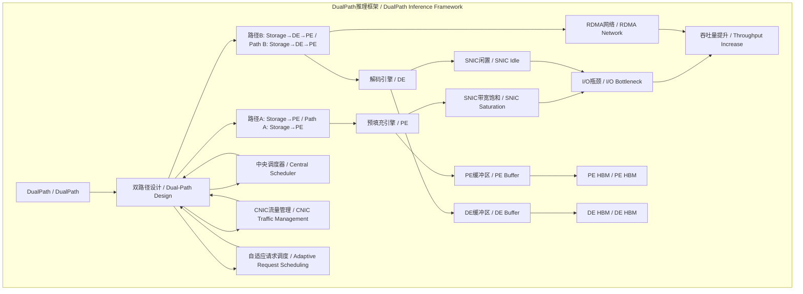
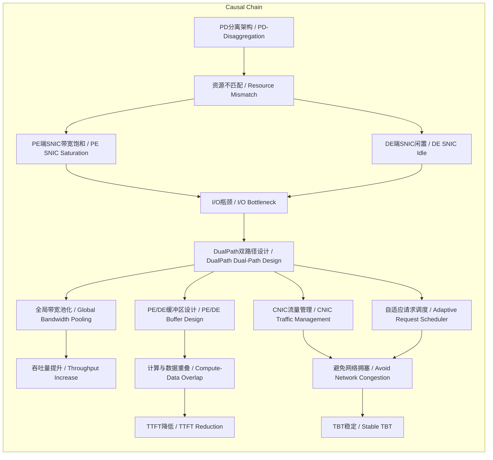

# NEWS/NEWS 任务报告

- agent: news/news
- requestId: 1772239986390-hidt9d
- 生成时间(UTC): 2026-02-28T00:55:48.162Z

## 链接总结

- URL: https://eu.36kr.com/en/p/3700922638053255

# DualPath双路径架构破解大模型推理I/O瓶颈

## 整体结构化文档表达
### 文档卡片
- **主题（中文/English）**：DualPath推理框架 / DualPath Inference Framework
- **一句话摘要**：DualPath框架通过引入“Storage-to-Decode”双路径设计，动态调度解码端闲置存储带宽，打破PD分离架构下的I/O瓶颈，显著提升大模型推理吞吐量并降低首字延迟。
- **目标读者**：大模型推理系统工程师、研究人员、AI系统架构师
- **核心结论（3条）**：
  1. 智能体长文本推理的性能瓶颈已从“计算”转向“数据移动”，DualPath通过双路径设计利用解码端闲置SNIC带宽，实现存储带宽全局池化与动态负载均衡。
  2. 在660B模型上实测，离线推理吞吐量提升1.87倍，在线服务吞吐量提升1.96倍，TTFT显著优化，TBT保持稳定。
  3. 该方法无需增加硬件成本，仅通过软件优化重构数据加载路径，即可显著提升长上下文智能体系统的推理效率。

### 内容结构树
1. **背景与问题定义**：智能体多轮对话导致KV-Cache加载频繁（命中率>95%），传统PD分离架构下所有加载任务集中于预填充引擎（PE）的存储网络接口卡（SNIC），导致其带宽饱和，而解码引擎（DE）的SNIC带宽闲置，造成资源错配与I/O瓶颈。
2. **核心观点与关键证据**：核心观点是推理瓶颈已从计算转向数据移动，双路径设计（传统路径Storage→PE与新路径Storage→DE→PE）可利用DE闲置带宽。关键证据包括：660B模型离线吞吐量提升1.87倍、在线提升1.96倍；高负载下TTFT显著优化，TPOT/TBT几乎不受影响；PD分离架构下PE端SNIC饱和而DE端闲置。
3. **方法/机制/路径**：中央调度器动态选择每个请求的加载路径（Storage→PE或Storage→DE→PE）；利用DE闲置SNIC带宽读取KV-Cache；通过RDMA网络将缓存无损传输至PE；设计PE/DE DRAM缓冲区实现数据流重叠；采用CNIC中心化流量管理（强制GPUDirect RDMA路径，设置VL/TC最高优先级）和自适应请求调度器避免网络拥塞。
4. **风险与边界条件**：依赖RDMA网络基础设施；架构改造成本较高；对短上下文场景收益有限；路径选择策略的实时性要求高；PE/DE缓冲区增加DRAM压力；缓存移动流量可能与模型计算通信冲突，需严格流量隔离；实验覆盖模型有限（DeepSeek-V3、Qwen）。
5. **结论与行动建议**：建议在长上下文、多轮对话的智能体系统中评估并部署DualPath；部署CNIC中心化流量管理与自适应请求调度机制；监控路径选择效率、RDMA负载及DRAM使用情况；探索更细粒度的动态调度策略以进一步优化。

### 结构化元数据（JSON）
```json
{
  "title": "DualPath双路径架构破解大模型推理I/O瓶颈",
  "topic_zh": "DualPath推理框架",
  "topic_en": "DualPath Inference Framework",
  "audience": "大模型推理系统工程师、研究人员、AI系统架构师",
  "claims": [
    "推理性能瓶颈已从计算转向数据移动，双路径设计利用闲置带宽实现全局池化与负载均衡",
    "实测显示离线吞吐量提升1.87倍，在线吞吐量提升1.96倍，TTFT优化且TBT稳定",
    "无需硬件成本增加，软件优化重构路径即可显著提升长文本推理效率"
  ],
  "evidence": [
    "660B模型离线推理吞吐量提升1.87倍，在线服务吞吐量平均提升1.96倍",
    "高负载下TTFT显著降低，TPOT/TBT几乎不受影响",
    "PD分离架构下PE端SNIC带宽饱和而DE端闲置，KV-Cache命中率>95%"
  ],
  "risks": [
    "依赖RDMA网络基础设施",
    "架构改造成本较高",
    "对短上下文场景收益有限",
    "路径选择策略实时性要求高",
    "PE/DE缓冲区增加DRAM压力",
    "缓存移动与计算通信可能冲突",
    "实验覆盖模型有限"
  ],
  "actions": [
    "在长上下文智能体系统中评估并部署DualPath",
    "部署CNIC流量管理与自适应请求调度",
    "监控路径效率、RDMA负载及DRAM使用",
    "探索更细粒度动态调度策略"
  ]
}
```

## 处理流程
1. **输入识别**：来源为36kr文章，主题为DeepSeek与高校合作发表的DualPath推理框架论文。
2. **信息抽取**：抽取实体（DeepSeek、北大、清华、ArXiv、DualPath、PE、DE、SNIC、RDMA等）、概念（KV-Cache、PD分离、I/O瓶颈等）、问题（如何解决长文本推理带宽瓶颈）、事实（论文发表、测试数据）、观点（瓶颈转移、双路径有效性）。
3. **结构化归纳**：定义DualPath为双路径加载框架；分类路径为传统（Storage→PE）与新路径（Storage→DE→PE）；比较新旧架构资源利用率；因果分析计算能力增长快于带宽导致瓶颈转移；方法论为动态负载均衡。
4. **关系建模**：建立概念间逻辑关系，如PE与DE的SNIC状态共同影响I/O瓶颈，双路径与RDMA共同决定带宽利用率等。
5. **可视化表达**：设计Mermaid图展示概念结构与因果链。

## 概念清单（中英文）
- DualPath / DualPath
- 智能体 / Agent
- 推理 / Inference
- KV-Cache / Key-Value Cache
- 存储网络接口卡 / Storage Network Interface Card (SNIC)
- 解码引擎 / Decoding Engine (DE)
- 预填充引擎 / Prefill Engine (PE)
- RDMA / Remote Direct Memory Access (RDMA)
- PD分离 / Prefill-Decode Disaggregation (PD-disaggregation)
- I/O瓶颈 / I/O Bottleneck
- 吞吐量 / Throughput
- Time To First Token (TTFT)
- Token-to-Token generation speed (TPOT)
- Token-to-Token Delay (TBT)
- 中央调度器 / Central Scheduler
- 流量管理器 / Traffic Manager
- 660B模型 / 660B Model
- 离线推理 / Offline Inference
- 在线服务 / Online Service
- Storage-to-Decode路径 / Storage-to-Decode Path
- DRAM缓冲区 / DRAM Buffer (PE/DE Buffer)
- PE读取路径 / PE Reading Path
- DE读取路径 / DE Reading Path
- 解码与持久化 / Decoding and Persistence
- 计算网络接口卡 / Computing Network Interface Card (CNIC)
- GPUDirect RDMA / GPUDirect RDMA
- InfiniBand / InfiniBand
- RoCE / RoCE
- 虚拟层 / Virtual Layer (VL/TC)
- 自适应请求调度器 / Adaptive Request Scheduler
- DeepSeek-V3 / DeepSeek-V3
- Qwen / Qwen
- 吴永tong / Wu Yongtong
- 金鑫 / Jin Xin
- 北京大学 / Peking University
- DeepSeek系统组 / DeepSeek System Group
- 腾讯 / Tencent
- 华盛顿大学 / University of Washington
- 微软亚洲研究院 / Microsoft Research Asia
- V4框架 / V4 Framework

## 概念定义（中英文）
- **DualPath / DualPath**：一种针对智能体推理的优化框架，通过双路径加载KV-Cache利用闲置网络带宽，打破PD分离架构下的I/O瓶颈。
- **智能体 / Agent**：能够进行多轮对话的AI系统，其推理过程中KV-Cache命中率常超过95%。
- **推理 / Inference**：大模型生成文本的计算过程，包括预填充和解码阶段。
- **KV-Cache / Key-Value Cache**：Transformer模型中缓存键值对以加速自回归生成的数据结构，在智能体多轮对话中命中率常超95%。
- **存储网络接口卡 / Storage Network Interface Card (SNIC)**：用于连接存储设备的网络接口卡，在PD分离架构中分别部署于PE和DE。
- **解码引擎 / Decoding Engine (DE)**：负责自回归解码阶段的推理引擎，管理GPU并通常具有闲置的SNIC带宽。
- **预填充引擎 / Prefill Engine (PE)**：负责预填充阶段的推理引擎，管理GPU并处理初始上下文加载。
- **RDMA / Remote Direct Memory Access (RDMA)**：远程直接内存访问技术，用于在引擎间高速传输数据，减少CPU开销。
- **PD分离 / Prefill-Decode Disaggregation (PD-disaggregation)**：将预填充与解码阶段分离到不同引擎的架构，旨在提升资源利用率但可能加剧I/O瓶颈。
- **I/O瓶颈 / I/O Bottleneck**：在数据移动过程中，存储或网络带宽不足导致的计算资源闲置现象。
- **吞吐量 / Throughput**：单位时间内处理的Token数量，衡量系统整体处理能力。
- **Time To First Token (TTFT)**：从请求发出到生成第一个Token的时间，反映系统响应速度。
- **Token-to-Token generation speed (TPOT)**：生成连续Token的平均速度，反映系统吞吐效率。
- **Token-to-Token Delay (TBT)**：连续生成两个Token之间的时间间隔，反映生成流畅度，与TPOT类似。
- **中央调度器 / Central Scheduler**：DualPath中的决策单元，实时选择每个请求的加载路径以最大化全局带宽利用率。
- **流量管理器 / Traffic Manager**：负责H2H/D2H复制、引擎间传输及SNIC存储读写的协调单元。
- **660B模型 / 660B Model**：参数规模为6600亿的深度学习模型，用于性能测试。
- **离线推理 / Offline Inference**：离线场景下的模型推理，如批量生成数据。
- **在线服务 / Online Service**：实时响应用户请求的推理服务。
- **Storage-to-Decode路径 / Storage-to-Decode Path**：将KV-Cache从存储加载至解码引擎（DE），再经RDMA网络传输至预填充引擎（PE）的数据通路。
- **DRAM缓冲区 / DRAM Buffer (PE/DE Buffer)**：在PE和DE上分配的DRAM区域，用于暂存KV-Cache以优化数据流重叠。
- **PE读取路径 / PE Reading Path**：将命中Token的KV-Cache从存储读入PE缓冲区，并在每层计算前传输至PE HBM的计算重叠路径。
- **DE读取路径 / DE Reading Path**：KV-Cache直接进入DE缓冲区，在PE预填充时跨节点传输对应层缓存至PE HBM，计算完成后仅回传新生成KV-Cache片段的路径。
- **解码与持久化 / Decoding and Persistence**：DE缓冲区接收完整KV-Cache后启动解码，进行H2D复制，并在每累积一个Block（如64 Tokens）时异步持久化至存储。
- **计算网络接口卡 / Computing Network Interface Card (CNIC)**：与GPU配对的专用网络接口卡，用于强制流量经GPUDirect RDMA路径，实现流量管控。
- **GPUDirect RDMA / GPUDirect RDMA**：允许GPU直接与网络设备通信的技术，避免数据经主机内存中转。
- **InfiniBand / InfiniBand**：一种高性能网络技术，支持远程直接内存访问。
- **RoCE / RoCE**：基于以太网的RDMA协议，全称RDMA over Converged Ethernet。
- **虚拟层 / Virtual Layer (VL/TC)**：InfiniBand或RoCE中的流量分级技术，用于分配虚拟通道或优先级队列。
- **自适应请求调度器 / Adaptive Request Scheduler**：监控磁盘队列长度和节点Token数，优先分配任务至I/O压力小、计算负载轻的节点，避免单点拥塞。
- **DeepSeek-V3 / DeepSeek-V3**：由深度求索公司开发的大语言模型。
- **Qwen / Qwen**：由阿里巴巴开发的大语言模型系列。
- **吴永tong / Wu Yongtong**：论文第一作者，北京大学博士生，研究方向为系统软件与大模型基础设施。
- **金鑫 / Jin Xin**：吴永tong的导师，北京大学教授。
- **北京大学 / Peking University**：中国顶尖高校，吴永tong的所属机构。
- **DeepSeek系统组 / DeepSeek System Group**：深度求索公司内负责推理基础设施建设的团队。
- **腾讯 / Tencent**：吴永tong曾实习的公司。
- **华盛顿大学 / University of Washington**：吴永tong曾实习的机构。
- **微软亚洲研究院 / Microsoft Research Asia**：吴永tong曾实习的机构。
- **V4框架 / V4 Framework**：未提及

## 概念关联与逻辑关系（中英文）
1. **PE的SNIC带宽饱和**与**DE的SNIC闲置**共同导致**I/O瓶颈**。
   - `PE_SNIC_Bandwidth_Saturation ∧ DE_SNIC_Idle → I/O_Bottleneck`
2. **双路径设计（Storage→DE→PE）**与**RDMA网络**共同实现**存储带宽全局池化**。
   - `DualPath_Design ∧ RDMA_Network → Global_Bandwidth_Pooling`
3. **高KV-Cache命中率**与**PD分离架构**共同加剧**数据移动压力**。
   - `High_KV-Cache_Hit_Rate ∧ PD_Disaggregation → Data_Movement_Pressure`

## COT逻辑梳理（定义/分类/比较/因果/科学方法论）
- **Step 1 定义问题**：智能体长文本推理中，KV-Cache加载频繁（命中率>95%），传统PD分离架构下所有加载任务集中于PE的SNIC，导致带宽饱和。
- **Step 2 分类现有架构**：将PD分离架构按资源分配分为“计算密集型”与“I/O密集型”场景，指出当前设计未考虑DE端闲置资源。
- **Step 3 比较新旧方案**：对比传统单路径（Storage→PE）与DualPath双路径（Storage→PE 与 Storage→DE→PE），后者通过DE端缓冲池和RDMA传输 redistribut 网络负载。
- **Step 4 分析因果**：根本原因是GPU算力增长（摩尔定律）远快于网络带宽与HBM容量增长，使瓶颈从计算转向数据移动（引用Bill Dally与Jeff Dean观点）。
- **Step 5 科学方法论**：提出动态负载均衡方法论——中央调度器基于实时带宽状态选择路径，通过控制变量法（固定模型规模、对比架构）在660B模型上验证性能提升。

## 事实与看法（病毒）
### 事实
- DeepSeek与北京大学、清华大学合作在ArXiv发表DualPath论文。
- DualPath框架包含两条路径：Storage→PE（传统）与Storage→DE→PE（新增）。
- 在660B参数模型测试中，离线推理吞吐量提升1.87倍，在线服务吞吐量提升1.96倍。
- 高负载下TTFT显著优化，TPOT几乎不受影响。
- PD分离架构中，PE的SNIC负责所有KV-Cache加载，DE的SNIC处于闲置状态。
- 使用RDMA网络在DE与PE间传输缓存数据。
- 中央调度器实时决定请求路径选择。
- 系统设计PE和DE上的DRAM缓冲区，并定义PE读取路径、DE读取路径和解码与持久化流程。
- 采用CNIC中心化流量管理（强制GPUDirect RDMA路径，VL/TC设最高优先级）和自适应请求调度器。
- 实验模型包括DeepSeek-V3和Qwen，场景覆盖离线Rollout和在线服务。
- 第一作者吴永tong为北京大学博士生，导师金鑫，现就职于DeepSeek系统组。
- 作者曾实习于腾讯、华盛顿大学、微软亚洲研究院。

### 看法
- 推理性能瓶颈已从“计算”转向“数据移动”。
- “计算免费，但数据移动昂贵”是当前AI系统核心挑战。
- DualPath的核心洞察是“KV-Cache加载不必以预填充为中心”。
- 双路径设计实现了存储带宽的“全局池化与动态负载均衡”。
- 利用解码引擎闲置带宽是解决I/O瓶颈的关键创新。
- DualPath成功利用原本浪费的解码引擎I/O带宽。
- 通过重新思考数据加载路径，可有效打破当前大模型推理的I/O墙。
- 系统在自适应调度和严格流量隔离机制下，显著提升代理LLM推理系统效率。
- 该方法无需增加硬件成本。

## FAQ（原文问题整理）
- **Q：为什么DualPath要设计一条“弯路”（Storage→DE→PE）？**  
  A：因为PD分离架构下DE的SNIC闲置，通过此路径可 redistribut 网络负载，缓解PE端带宽压力。
- **Q：当前智能体推理的主要瓶颈是什么？**  
  A：数据移动（I/O瓶颈），而非GPU计算，因KV-Cache加载频繁且PD分离导致资源不匹配。
- **Q：DualPath如何实现动态负载均衡？**  
  A：中央调度器实时监控全局带宽状态，为每个请求选择Storage→PE或Storage→DE→PE路径。
- **Q：双路径设计对生成速度（TPOT）有何影响？**  
  A：实测显示TPOT几乎不受影响，因RDMA传输延迟低且解码阶段并行度高。
- **Q：该框架适用于哪些场景？**  
  A：长上下文、多轮对话的智能体应用，其中KV-Cache命中率高（>95%）。
- **Q：缓存移动流量与模型计算通信冲突怎么办？**  
  A：通过CNIC流量管理（强制GPUDirect RDMA路径，VL/TC设最高优先级并预留99%带宽）和自适应请求调度（优先分配至I/O压力小、计算负载轻的节点）解决。

## Visualization
### Mermaid 图 1（概念结构图）


### Mermaid 图 2（逻辑/因果图）


## 文章中的类比
未发现明确类比。

## 10个金句
1. Computation is free, but data movement is expensive.
2. The bottleneck of inference performance has shifted from "computation" to "data movement".
3. DualPath believes that the cache can be first loaded into the decoding engine and then transmitted to the pre-fill engine through the high-performance RDMA network.
4. By dynamically choosing between the two paths, DualPath redistributes the network load and relieves the bandwidth pressure on the pre-fill side.
5. The loading of KV-Cache doesn't have to be centered around pre-filling.
6. In the existing Prefill-Decode Disaggregated architecture, all loading tasks are crowded on the storage network card of the pre-fill engine (PE).
7. The growth of current GPU computing power is much faster than the growth of network bandwidth and HBM capacity.
8. It changes the traditional single-path loading mode of Storage-to-Prefill and introduces a second path of Storage-to-Decode.
9. DualPath constructs an innovative dual-path model: Path A (Traditional) and Path B (Newly Added).
10. Under high load, the Time To First Token (TTFT) was significantly optimized, and the Token-to-Token generation speed (TPOT) was hardly affected.
