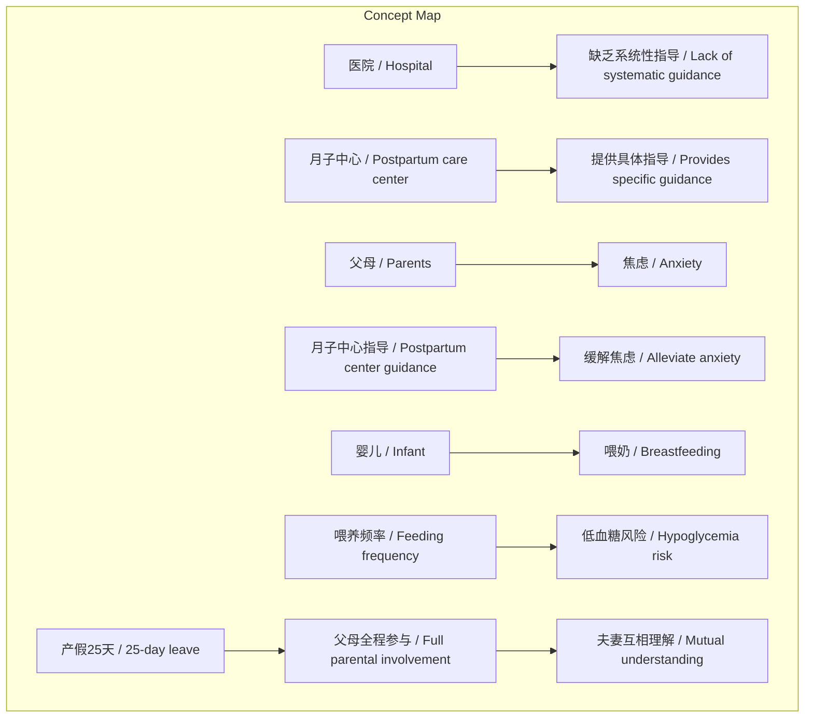
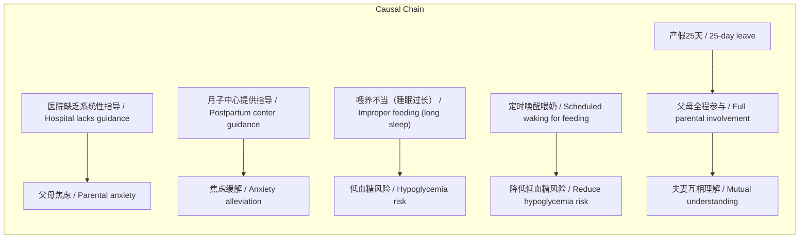

# NEWS/NEWS 任务报告

- agent: news/news
- requestId: 1772290103087-otc1ll
- 生成时间(UTC): 2026-02-28T14:49:23.353Z

## 文本总结

# 三胎育儿经历：月子中心体验与喂养请教

## 整体结构化文档表达
### 文档卡片
- **主题**：新生儿护理与产后支持 / Neonatal Care and Postpartum Support  
- **一句话摘要**：一位三胎父亲分享无老人协助下的育儿挑战，月子中心缓解焦虑，并请教婴儿喂养频率问题。  
- **目标读者**：新手父母、育儿社区、医疗保健提供者  
- **核心结论**：  
  1. 医院产科缺乏系统性指导导致新手父母焦虑。  
  2. 专业月子中心提供有效指导，缓解焦虑并提升父母信心。  
  3. 婴儿喂养频率需平衡按需喂养与定时喂养，避免低血糖风险。  

### 内容结构树
1. **背景与问题定义**：第三胎出生，无老人帮助，父母需自学育儿技能，医院指导不足。  
2. **核心观点与关键证据**：月子中心指导正确（冷敷而非热敷），产假25天全程陪伴促进夫妻理解。  
3. **方法/机制/路径**：月子中心提供开奶服务、具体护理指导；父母实践学习。  
4. **风险与边界条件**：婴儿低血糖风险（若睡眠超过3小时不喂）；医院指导不系统。  
5. **结论与行动建议**：寻求专业机构支持；喂养需根据婴儿状态灵活处理，但注意定时喂奶防低血糖。  

### 结构化元数据（JSON）
```json
{
  "title": "三胎育儿经历：月子中心体验与喂养请教",
  "topic_zh": "新生儿护理与产后支持",
  "topic_en": "Neonatal Care and Postpartum Support",
  "audience": "新手父母、育儿社区、医疗保健提供者",
  "claims": [
    "医院产科缺乏系统性指导导致新手父母焦虑。",
    "专业月子中心提供有效指导，缓解焦虑并提升父母信心。",
    "婴儿喂养频率需平衡按需喂养与定时喂养，避免低血糖风险。"
  ],
  "evidence": [
    "医院产科医生护士未给出具体喂奶和乳房胀痛处理流程。",
    "月子中心指导使用冷敷（保鲜膜包住、冷水冷敷、轻按摩）缓解乳房胀痛。",
    "产假25天全程陪伴，夫妻互相理解支持，学习育儿技能。",
    "婴儿出生四五天，喂奶时易睡着，需考虑低血糖风险。"
  ],
  "risks": [
    "婴儿睡眠超过3小时可能导致低血糖。",
    "父母因缺乏指导产生焦虑。"
  ],
  "actions": [
    "寻求专业月子中心或育儿指导。",
    "婴儿喂养时，若睡着需定时唤醒喂奶，防止低血糖。"
  ]
}
```

## 处理流程
未提及

## 概念清单（中英文）
- 三娃 / Third child
- 顺产 / Vaginal delivery
- 产假 / Maternity leave
- 月子中心 / Postpartum care center
- 开奶服务 / Lactation initiation service
- 产科 / Obstetrics department
- 医生护士 / Doctors and nurses
- 热敷 / Hot compress
- 冷敷 / Cold compress
- 保鲜膜 / Plastic wrap
- 按摩 / Massage
- 乳房胀痛 / Breast engorgement
- 低血糖 / Hypoglycemia
- 喂奶 / Breastfeeding
- 尿不湿 / Diaper
- 吐奶 / Spitting up
- 产假25天 / 25-day maternity leave
- 夫妻 / Couple
- 焦虑 / Anxiety
- 睡眠 / Sleep
- 精神 / Mental state
- 婴儿喂养频率 / Infant feeding frequency

## 概念定义（中英文）
- **三娃 / Third child**：家庭中的第三个孩子，本文指刚出生的婴儿。  
- **顺产 / Vaginal delivery**：婴儿通过阴道自然分娩的方式。  
- **产假 / Maternity leave**：母亲在分娩后休息的假期。  
- **月子中心 / Postpartum care center**：提供产后护理和婴儿照护服务的机构。  
- **开奶服务 / Lactation initiation service**：帮助母亲开始分泌乳汁的专业服务。  
- **产科 / Obstetrics department**：医院中负责妊娠和分娩的科室。  
- **医生护士 / Doctors and nurses**：医疗专业人员。  
- **热敷 / Hot compress**：使用热毛巾等敷于患处，文中医院建议但被证明不正确的方法。  
- **冷敷 / Cold compress**：使用冷毛巾等敷于患处，文中月子中心建议的正确方法。  
- **保鲜膜 / Plastic wrap**：用于包裹乳房进行冷敷的材料。  
- **按摩 / Massage**：轻柔按摩乳房以缓解胀痛。  
- **乳房胀痛 / Breast engorgement**：乳房因乳汁积聚而肿胀疼痛。  
- **低血糖 / Hypoglycemia**：血糖水平过低，婴儿可能因长时间不进食发生。  
- **喂奶 / Breastfeeding**：给婴儿喂食母乳。  
- **尿不湿 / Diaper**：婴儿使用的吸收性衬垫。  
- **吐奶 / Spitting up**：婴儿喂奶后吐出少量乳汁。  
- **产假25天 / 25-day maternity leave**：作者享有的25天产后假期。  
- **夫妻 / Couple**：作者和妻子。  
- **焦虑 / Anxiety**：因缺乏指导而产生的担忧情绪。  
- **睡眠 / Sleep**：休息状态，文中指父母和婴儿的睡眠。  
- **精神 / Mental state**：心理状态，文中指父母的精神状况。  
- **婴儿喂养频率 / Infant feeding frequency**：喂奶的时间间隔，如每两小时一次。  

## 概念关联与逻辑关系（中英文）
1. **月子中心指导（冷敷方法）与父母实践共同缓解乳房胀痛和焦虑**  
   Postpartum care center guidance (cold compress method) and parental practice jointly alleviate breast engorgement and anxiety.  
   形式化：冷敷指导 ∧ 父母实践 → 胀痛缓解 ∧ 焦虑降低  

2. **医院缺乏系统性指导导致父母焦虑，而月子中心提供指导缓解焦虑**  
   Lack of systematic guidance from hospital causes parental anxiety, while postpartum care center provides guidance to alleviate anxiety.  
   形式化：医院指导不足 → 焦虑增加；月子中心指导 → 焦虑减少  

3. **婴儿喂养频率不当（睡眠过长不喂）可能导致低血糖，因此需要定时唤醒喂奶**  
   Improper infant feeding frequency (long sleep without feeding) may lead to hypoglycemia, thus requiring scheduled waking for feeding.  
   形式化：睡眠时间 > 3小时 ∧ 未喂奶 → 低血糖风险；定时唤醒 ∧ 喂奶 → 低血糖风险降低  

## COT逻辑梳理（定义/分类/比较/因果/科学方法论）
- **Step 1: 定义问题**：第三胎父母无老人帮助，需自学育儿技能，面临喂养和护理挑战。  
- **Step 2: 分类**：挑战分为知识缺乏（如正确喂奶、处理乳房胀痛）、资源不足（无老人协助）、情绪焦虑。  
- **Step 3: 比较**：医院产科指导 vs. 月子中心指导——医院无系统流程，月子中心提供具体方法（如冷敷）。  
- **Step 4: 因果**：医院指导不足 → 父母焦虑；月子中心指导 → 焦虑缓解；产假25天 → 父母全程参与 → 夫妻理解加深。  
- **Step 5: 科学方法论**：通过实践学习（如尝试冷敷）、咨询专业机构（月子中心）、参考医学建议（低血糖风险）来优化育儿方法。  

## 事实与看法（病毒）
### 事实
- 大年初八，三娃顺产6.4斤，母子平安。  
- 前两胎有老人帮忙，第三胎只有夫妻两人处理。  
- 产假只有一周左右（之前），这次有25天。  
- 月子中心收费20000元一个月。  
- 医院产科医生护士未给出具体喂奶和乳房胀痛处理流程。  
- 月子中心指导使用保鲜膜、冷水冷敷、轻按摩缓解乳房胀痛。  
- 婴儿出生四五天，喂奶时易睡着。  
- 医生护士建议每两小时喂奶。  
- 查得婴儿睡眠不能超过3小时，否则易低血糖。  

### 看法
- 父母手忙脚乱。  
- 医院指导让父母非常焦虑。  
- 月子中心指导让焦虑大大缓解。  
- 夫妻互相理解彼此支持的过程特别重要。  
- 亲自参与育儿与听说感受完全不同。  
- 请教其他父母如何处理婴儿喂养问题。  

## FAQ（原文问题整理）
**问题**：婴儿出生四五天之后，喂奶是等他睡醒了精神了后再喂，还是说两小时左右就叫醒他呢？  
**回答**：基于低血糖风险，建议每两小时左右唤醒婴儿喂奶，即使他睡着，以防睡眠超过3小时导致低血糖。可尝试弹脚心等轻微刺激唤醒，但需注意方法。  

## Visualization
### Mermaid 图 1（概念结构图）


### Mermaid 图 2（逻辑/因果图）


## 文章中的类比
未发现明确类比

## 10个金句
1. 大年初八 我们家三娃顺产6.4斤 母子平安哈。  
2. 虽然是第三个小孩之前的两胎都有老人帮忙 第三胎的时候只能是夫妻两个人处理。  
3. 前面两个已经10多岁了 所以现在像刚生第一胎一样手忙脚乱。  
4. 一天会有十几个医生护士进进出出都没有给出具体的建议 让我们非常的焦虑。  
5. 原来不是热敷 而是用保鲜膜包住 然后呢 用冷水进行冷敷 然后轻轻的进行按摩就可以得到缓解。  
6. 这一次产假有25天能够全程的陪老婆照顾小孩 虽然辛苦 但是也学到了很多东西。  
7. 夫妻之间互相理解 彼此支持 都知道彼此全力以赴 这种的过程虽然是很痛苦 但也是特别重要。  
8. 只是这样你听说 跟自己虔诚真正参与下来 那个感受完全不一样的。  
9. 现在月子中心 相对来讲松了很多 我和老婆都能够得到相比之前一些睡眠更充足 精神也更加的好。  
10. 请教一下各位大家一般遇到种情况是怎么处理的？婴儿出生四五天之后 喂奶是等他睡醒了精神了后再喂 还是说两小时左右就叫醒他呢？
