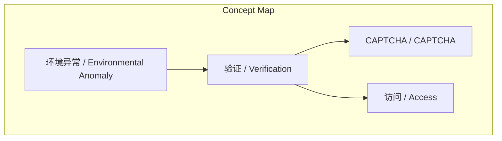
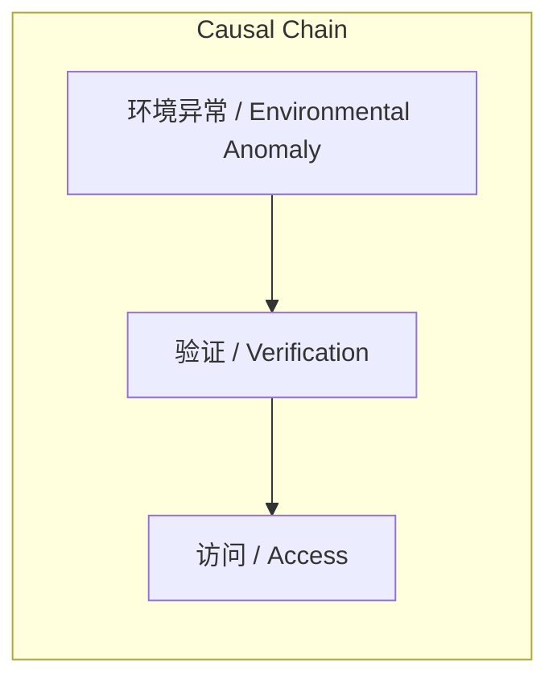

# NEWS/NEWS 任务报告

- agent: news/news
- requestId: 1772291107907-nz2hjw
- 生成时间(UTC): 2026-02-28T15:07:06.706Z

## 链接总结

- URL: https://mp.weixin.qq.com/s/bM3iAIJocpmwjphgX8Wo1A

# 环境异常致内容无法获取

## 整体结构化文档表达
### 文档卡片
- 主题（中文/English）：环境异常 / Environmental Anomaly
- 一句话摘要：当前访问环境异常，需完成验证后方可继续访问目标文章。
- 目标读者：未提及
- 核心结论（3条）：
  1. 系统检测到当前访问环境存在异常。
  2. 用户必须完成验证流程才能继续访问。
  3. 文章正文内容因环境异常而暂时不可获取。

### 内容结构树
1. 背景与问题定义：未提及
2. 核心观点与关键证据：未提及
3. 方法/机制/路径：未提及
4. 风险与边界条件：未提及
5. 结论与行动建议：未提及

### 结构化元数据（JSON）
```json
{
  "title": "未提供",
  "topic_zh": "环境异常",
  "topic_en": "Environmental Anomaly",
  "audience": "",
  "claims": [],
  "evidence": [],
  "risks": [],
  "actions": ["完成验证"]
}
```

## 处理流程
1. 输入识别（来源：https://mp.weixin.qq.com/s/bM3iAIJocpmwjphgX8Wo1A）：识别到网页返回环境异常警告，无法获取正文内容。
2. 信息抽取：从警告文本中抽取关键信息：环境异常、验证要求、访问限制、CAPTCHA提及。
3. 结构化归纳：由于正文内容缺失，无法进行有效归纳。
4. 关系建模：基于有限信息建立概念间基本关联。
5. 可视化表达：基于抽取的概念生成概念结构与因果图。

## 概念清单（中英文）
- 环境异常 / Environmental Anomaly
- 验证 / Verification
- CAPTCHA / CAPTCHA
- 访问 / Access

## 概念定义（中英文）
- 环境异常 / Environmental Anomaly：指当前访问网页时所处的网络或系统环境存在异常，导致正常访问被阻止的状态（基于“当前环境异常”）。
- 验证 / Verification：指用户为证明自身非自动化程序而需完成的身份确认流程（基于“完成验证”）。
- CAPTCHA / CAPTCHA：原文中提及的验证相关术语，具体机制未定义。
- 访问 / Access：指用户获取网页内容的行为或状态（基于“继续访问”）。

## 概念关联与逻辑关系（中英文）
1. 环境异常 / Environmental Anomaly 与 验证 / Verification 之间存在因果关联：环境异常触发验证需求。逻辑表达式：环境异常 → 验证需求。
2. 验证 / Verification 与 CAPTCHA / CAPTCHA 之间存在依赖关联：验证过程可能涉及CAPTCHA机制。逻辑表达式：验证 → CAPTCHA。
3. 验证 / Verification 与 访问 / Access 之间存在条件关联：完成验证是访问的前提。逻辑表达式：验证完成 → 访问允许。

## COT逻辑梳理（定义/分类/比较/因果/科学方法论）
- Step 1: 定义 - 基于输入文本，定义环境异常为访问环境异常状态，验证为身份确认流程，CAPTCHA为验证术语，访问为内容获取行为。
- Step 2: 分类 - 原文未对环境异常或验证进行分类。
- Step 3: 比较 - 原文未与其他异常类型或验证方法进行比较。
- Step 4: 因果 - 环境异常导致验证需求，验证需求导致CAPTCHA使用，验证完成允许访问。
- Step 5: 科学方法论 - 原文未采用科学方法论（如实验、数据验证）进行论证。

## 事实与看法（病毒）
### 事实
- 当前环境异常（来自警告文本）。
- 需要完成验证（来自警告文本）。
- 访问被阻止（来自警告文本）。
- 页面可能要求CAPTCHA（来自警告文本）。

### 看法
- 无（警告文本为客观状态描述，未包含观点或判断）。

## FAQ（原文问题整理）
- 未发现明确提问。

## Visualization
### Mermaid 图 1（概念结构图）


### Mermaid 图 2（逻辑/因果图）


## 文章中的类比
- 未发现明确类比。

## 10个金句
1. 原文未提供
2. 原文未提供
3. 原文未提供
4. 原文未提供
5. 原文未提供
6. 原文未提供
7. 原文未提供
8. 原文未提供
9. 原文未提供
10. 原文未提供
