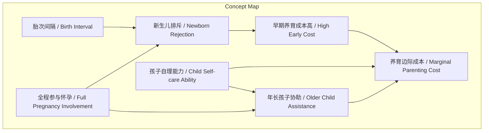
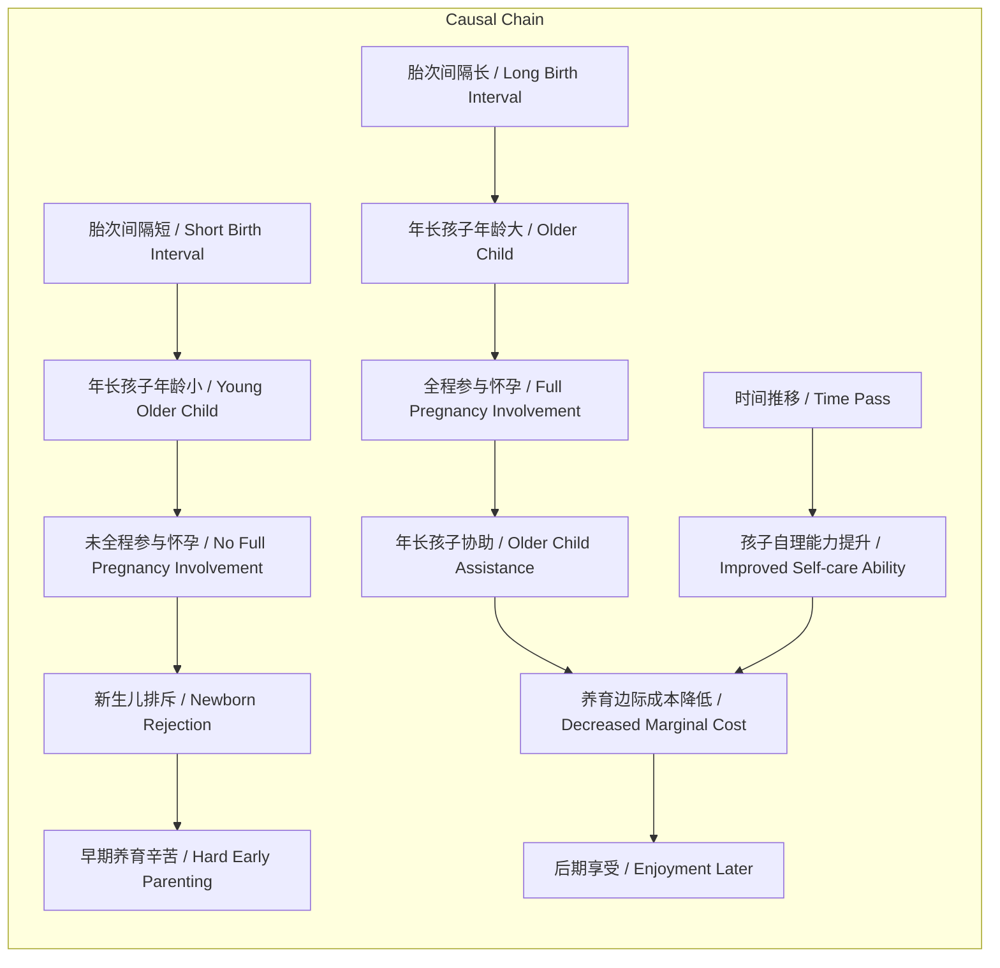

# NEWS/NEWS 任务报告

- agent: news/news
- requestId: 1772325950111-307b4m
- 生成时间(UTC): 2026-03-01T00:46:30.846Z

## 文本总结

# 多胎养育边际成本递减现象

## 整体结构化文档表达
### 文档卡片
- 主题（中文/English）：多胎家庭养育体验 / Multi-child Family Parenting Experience
- 一句话摘要：通过对比不同胎次孩子的反应，阐述年长孩子参与能显著降低多胎养育的边际精力成本。
- 目标读者：准父母、多胎家庭、家庭政策研究者
- 核心结论（3条）：
  1. 年长孩子对新生儿的态度受其是否全程参与母亲怀孕过程影响。
  2. 孩子具备基本自理能力后（会走路说话），多胎共同玩耍可大幅减少对成人的依赖。
  3. 在特定阶段（孩子均>2岁），多胎养育的边际精力投入可能趋近于单胎。

### 内容结构树
1. 背景与问题定义：作者基于一、二、三胎养育经历，提出多胎养育的精力投入是否随孩子数量线性增加的问题。
2. 核心观点与关键证据：核心观点为养育边际成本递减。证据：二胎时哥哥（约1岁）排斥新生儿；三胎时哥哥姐姐（11-12岁）因全程见母亲怀孕而主动帮忙、欢喜照顾三妹；孩子会走路说话后能自玩，不粘大人。
3. 方法/机制/路径：机制是“年长孩子参与”与“孩子自理能力提升”共同作用。路径：年长孩子从“被照顾者”转变为“协助者”，分担育儿与家务。
4. 风险与边界条件：边界条件为所有孩子需达到一定自理年龄（约2岁+）；未明确提及但可推断早期（0-2岁）阶段依然辛苦，成本较高。
5. 结论与行动建议：结论是在孩子均成长至自理阶段后，多胎养育效率显著提升。建议：家庭可考虑在年长孩子具备一定能力后生育下一胎，以利用协同效应降低长期总成本。

### 结构化元数据（JSON）
```json
{
  "title": "多胎养育边际成本递减现象",
  "topic_zh": "多胎家庭养育体验",
  "topic_en": "Multi-child Family Parenting Experience",
  "audience": "准父母、多胎家庭、家庭政策研究者",
  "claims": [
    "年长孩子对新生儿的态度受其是否全程参与母亲怀孕过程影响",
    "孩子具备基本自理能力后，多胎共同玩耍可大幅减少对成人的依赖",
    "在孩子均>2岁后，多胎养育的边际精力投入可能趋近于单胎"
  ],
  "evidence": [
    "一二胎相隔一年，二妹出生时哥哥哭闹、排斥妈妈抱",
    "三胎时哥哥姐姐十一二岁，全程见到妈妈怀孕、保胎、体检、身体变化",
    "三胎时哥哥姐姐见到三妹欢喜激动，抢着照顾",
    "孩子会走路说话后可以一起玩很久，不粘大人",
    "买菜做饭时多一个小孩少一个小孩感觉没区别"
  ],
  "risks": [
    "未提及明确风险，但隐含早期（0-2岁）阶段养育辛苦、成本高"
  ],
  "actions": [
    "在年长孩子具备一定自理与协助能力后考虑生育下一胎",
    "鼓励年长孩子参与母亲怀孕过程以促进其对新生儿的接纳"
  ]
}
```

## 处理流程
1. 输入识别：用户提供一段关于多胎养育体验的个人叙述文本。
2. 信息抽取：提取实体（哥哥、二妹、三胎小孩、三妹）、概念（胎次间隔、新生儿排斥、全程参与怀孕、孩子自理能力、养育边际成本）、事实（具体行为与时间点）和观点（辛苦、享受、成本比较）。
3. 结构化归纳：将内容按“背景-观点-机制-边界-结论”逻辑重组，定义核心概念，建立因果链条。
4. 关系建模：识别“全程参与怀孕”与“新生儿态度”、“孩子自理能力”与“成人依赖度”等概念间的因果关系，并形式化为逻辑表达式。
5. 可视化表达：设计概念结构图与因果链Mermaid图，使用真实概念节点。

## 概念清单（中英文）
- 胎次间隔 / Birth Interval
- 新生儿排斥 / Newborn Rejection
- 全程参与怀孕 / Full Pregnancy Involvement
- 年长孩子协助 / Older Child Assistance
- 孩子自理能力 / Child Self-care Ability
- 养育边际成本 / Marginal Parenting Cost

## 概念定义（中英文）
- 胎次间隔：指连续生育子女之间的时间差，文中体现为“一二胎相隔一年”。
- 新生儿排斥：指已有孩子对新出生弟妹表现出的哭闹、拒绝母亲亲近等负面情绪反应。
- 全程参与怀孕：指年长孩子见证了母亲从怀孕到生产（保胎、体检、身体变化）的全过程。
- 年长孩子协助：指年长孩子主动参与照顾新生儿及家务的行为。
- 孩子自理能力：指孩子能够独立完成基本生活活动（如走路、说话、洗澡）的状态。
- 养育边际成本：指每多养育一个孩子所增加的额外精力与时间投入。

## 概念关联与逻辑关系（中英文）
1. 全程参与怀孕 / Full Pregnancy Involvement → 减少 / Reduces 新生儿排斥 / Newborn Rejection
2. 孩子自理能力提升 / Child Self-care Ability Improvement ∧ 年长孩子协助 / Older Child Assistance → 降低 / Decreases 养育边际成本 / Marginal Parenting Cost
3. 胎次间隔短 / Short Birth Interval ∧ 年长孩子年龄小 / Young Older Child → 增加 / Increases 新生儿排斥风险 / Risk of Newborn Rejection

## COT逻辑梳理（定义/分类/比较/因果/科学方法论）
- Step 1 (定义)：界定核心分析变量“养育边际成本”，即每增加一个孩子所带来的额外精力与时间投入。
- Step 2 (分类)：根据孩子年龄与胎次，将养育阶段划分为“早期依赖期（0-2岁，孩子需高度照顾）”和“协同独立期（2岁+，孩子可互动自玩）”。
- Step 3 (比较)：对比二胎场景（哥哥约1岁，未参与怀孕）与三胎场景（哥哥姐姐11-12岁，全程参与怀孕）下，年长孩子对新生儿的态度（排斥 vs 欢喜协助）及家庭精力感受（辛苦 vs 享受）。
- Step 4 (因果)：推断态度与感受差异的因果机制：年长孩子是否“全程参与怀孕”影响了其情感接纳，进而促成了“年长孩子协助”行为；同时“孩子自理能力提升”减少了直接看护需求，两者共同导致“养育边际成本”在后期显著降低。
- Step 5 (科学方法论)：提出可验证假设：在控制胎次间隔、家庭结构等变量下，促进年长孩子对母亲怀孕过程的了解，可正向预测其对新生儿的接纳度与协助行为，并负向预测家庭在后续阶段的报告养育压力。这体现了从观察到机制推断的初步科学思路。

## 事实与看法（病毒）
### 事实
- 一二胎相隔一年。
- 二妹出生抱回来，哥哥会哭闹，排斥妈妈抱另外一个小孩。
- 三胎两个小孩已经十一二岁，他们全程见到妈妈怀孕、保胎、体检、肚子一点点变大、身体一点点臃肿。
- 见到三妹也欢喜激动，抢着照顾妹妹。
- 孩子会走路了会说话后，可以一起玩很久。
- 小孩不会粘着大人。
- 买菜做饭多一个小孩少一个小孩，没有什么区别。
- 当时想养五六个小孩跟养一个付出的精力和时间差不多。

### 看法
- 前两年相对辛苦。
- 第三年我感觉完全是享受了。
- 其实一下子养五六个小孩，真的跟养一个付出的精力和时间差不多。（此为基于特定阶段的推测性结论）

## FAQ（原文问题整理）
- Q1: 不同胎次的孩子对新生儿的态度有何不同？
  A1: 二胎时年长孩子（约1岁）会哭闹排斥；三胎时年长孩子（11-12岁）因全程参与怀孕而欢喜激动、主动帮忙。
- Q2: 何时多胎养育会变得相对轻松？
  A2: 当所有孩子均达到会走路、说话的自理阶段后（文中指第三年），他们可以相互玩耍，减少对大人的依赖。
- Q3: 多胎养育的边际成本是怎样的？
  A3: 在孩子均>2岁后，每增加一个孩子所带来的额外精力投入可能非常小，甚至感觉与养一个差不多。

## Visualization
### Mermaid 图 1（概念结构图）


### Mermaid 图 2（逻辑/因果图）


## 文章中的类比
未发现明确类比。

## 10个金句
1. 一二胎相隔一年。
2. 二妹出生抱回来，哥哥会哭闹，排斥妈妈抱另外一个小孩。
3. 三胎两个小孩已经十一二岁，他们全程见到妈妈怀孕、保胎、体检、肚子一点点变大、身体一点点臃肿。
4. 见到三妹也欢喜激动，抢着照顾妹妹。
5. 连续两个小孩，前两年相对辛苦。
6. 但第三年我感觉完全是享受了。
7. 两个小孩会走路了会说话后，可以一起玩很久。
8. 小孩不会粘着大人。
9. 买菜做饭多一个小孩少一个小孩，没有什么区别。
10. 当时就想其实一下子养五六个小孩，真的跟养一个付出的精力和时间差不多。
