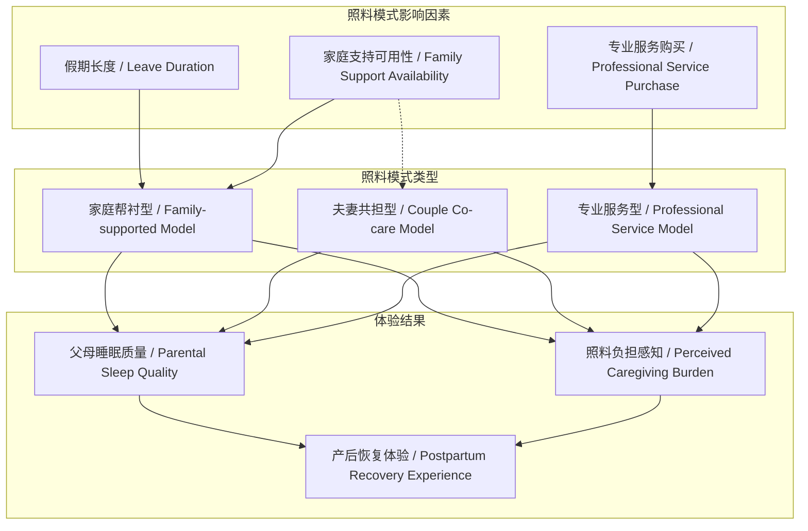
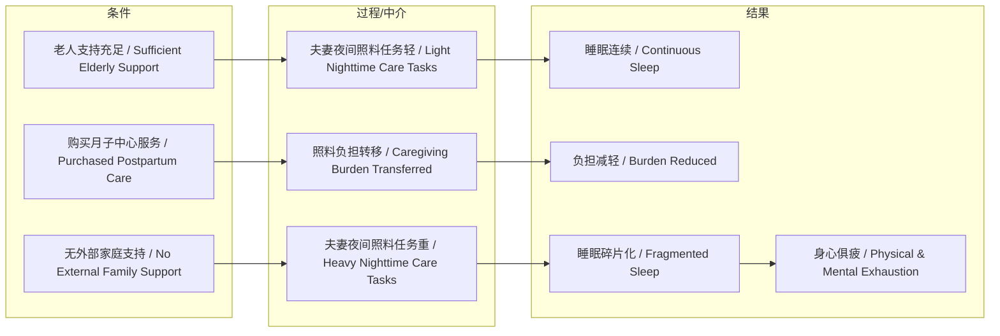

# NEWS/NEWS 任务报告

- agent: news/news
- requestId: 1772326493501-sbyyjx
- 生成时间(UTC): 2026-03-01T00:55:38.242Z

## 文本总结

# 两次生育假期体验对比：从帮衬到共担

## 整体结构化文档表达
### 文档卡片
- **主题（中文/English）**：产后家庭照料模式 / Postpartum Family Care Model
- **一句话摘要**：通过对比两次生育假期的照料条件差异，揭示家庭支持与专业服务对新手父母体验的关键影响。
- **目标读者**：准父母、家庭政策研究者、社会观察者
- **核心结论（3条）**：
  1. 老人支持能显著减轻新手父母（尤其是夜间）的照料负担与睡眠剥夺。
  2. 夫妻共同照料新生儿（特别是夜间高频次照料）对双方身心均是巨大挑战。
  3. 购买专业月子服务是有效缓解产后照料压力、改善母婴休息质量的关键策略。

### 内容结构树
1. **背景与问题定义**：作者以自身两次生育经历为样本，对比不同假期长度、家庭支持条件与工作地点下的产后照料现实。
2. **核心观点与关键证据**：
  - 观点1：老人帮衬是获得基本休息（如整夜睡眠）的前提。
    - 证据：第一次生育时，两位母亲年轻有空，作者可“回家睡整觉”，仅做跑腿工作。
  - 观点2：夫妻亲自照料导致睡眠严重碎片化与身心俱疲。
    - 证据：第二次生育，每1-2小时起床一次，每次耗时1个多小时，睡眠周期难超90分钟；作者“作为男人都觉得特别累”。
  - 观点3：专业月子服务能快速扭转困境，实现“重生”。
    - 证据：选择月子中心后，“一下子有人帮忙就轻松很多”，妻儿得到很好照顾。
3. **方法/机制/路径**：采用个人叙事比较法，通过同一主体在不同时空条件下的经历对比，呈现照料模式变化对体验的影响。
4. **风险与边界条件**：
  - 个人经验可能不具普遍性。
  - 选择月子中心存在经济成本门槛。
  - “老人老了且没空”是部分家庭面临的不可控风险。
5. **结论与行动建议**：
  - 家庭应提前规划产后支持系统（家庭帮衬或购买服务）。
  - 社会应关注新手父母，尤其是夜间照料的极端疲劳问题。

### 结构化元数据（JSON）
```json
{
  "title": "两次生育假期体验对比：从帮衬到共担",
  "topic_zh": "产后家庭照料模式",
  "topic_en": "Postpartum Family Care Model",
  "audience": "准父母、家庭政策研究者、社会观察者",
  "claims": [
    "老人支持能显著减轻新手父母（尤其是夜间）的照料负担与睡眠剥夺。",
    "夫妻共同照料新生儿（特别是夜间高频次照料）对双方身心均是巨大挑战。",
    "购买专业月子服务是有效缓解产后照料压力、改善母婴休息质量的关键策略。"
  ],
  "evidence": [
    "第一次生育有7天假期，两位母亲帮忙，作者可睡整觉。",
    "第二次生育有25天假期，但老人无法帮忙，作者每1-2小时起床一次，睡眠周期难超90分钟。",
    "选择月子中心后，作者感觉‘一下子轻松很多’，妻儿得到很好照顾。"
  ],
  "risks": [
    "个人经历可能不具备统计普遍性。",
    "月子中心服务存在经济成本门槛。",
    "家庭支持（老人）的可用性不可控。"
  ],
  "actions": [
    "家庭需提前规划产后支持方案（家庭支援或专业服务）。",
    "社会应重视新手父母，特别是夜间照料的疲劳问题。"
  ]
}
```

## 处理流程
1.  **输入识别**：用户提供一段第一人称叙事文本，描述两次生育假期的照料条件与体验对比。
2.  **信息抽取**：抽取实体（作者、婴儿、两位母亲、老婆、医生护士）、概念（生育假期、照料、睡眠、月子中心）、事实（假期天数、照料频率、服务选择）、观点（累、轻松、感觉重生）。
3.  **结构化归纳**：将内容归纳为“背景-观点-方法-风险-结论”的逻辑链；对“照料模式”进行分类（家庭帮衬型、夫妻共担型、专业服务型）。
4.  **关系建模**：建立“家庭支持不足 -> 夫妻负担加重 -> 睡眠碎片化 -> 身心俱疲”的因果链；建立“专业服务介入 -> 照料负担转移 -> 休息改善”的缓解路径。
5.  **可视化表达**：使用Mermaid绘制概念关系图与因果链图。

## 概念清单（中英文）
- 生育假期 / Maternity Leave
- 跨省工作 / Cross-provincial Work
- 老人支持 / Elderly Support
- 夫妻共同照料 / Couple Co-care
- 睡眠碎片化 / Fragmented Sleep
- 月子中心 / Postpartum Care Center
- 单间产房 / Single-room Delivery Room
- 一对一服务 / One-on-one Service
- 产后恢复 / Postpartum Recovery
- 照料负担 / Caregiving Burden

## 概念定义（中英文）
- **生育假期**：女性生育前后依法享有的休假，文中指作者两次不同的休假时长（7天 vs 25天）。
- **老人支持**：由祖辈（文中为丈母娘和母亲）提供的育儿协助，是家庭照料的重要资源。
- **夫妻共同照料**：配偶双方共同承担新生儿日常护理工作，文中特指夜间高频次、高耗时的照料活动。
- **睡眠碎片化**：因外部干扰（如婴儿哭醒）导致睡眠被多次打断，无法形成完整睡眠周期（文中指难超90分钟）的状态。
- **月子中心**：提供产后专业护理、母婴照看的一站式商业服务机构，文中作者选择的“一对一服务”是其核心特征。
- **照料负担**：在育儿过程中所需投入的时间、精力和情感成本，文中体现为身体疲劳与心理压力。

## 概念关联与逻辑关系（中英文）
1.  **老人支持（Elderly Support）** 与 **夫妻共同照料（Couple Co-care）** 共同影响 **父母睡眠质量（Parental Sleep Quality）**。老人支持充足时，夫妻可减少夜间照料，获得整夜睡眠；反之则需共同承担，导致睡眠碎片化。
2.  **专业服务介入（Professional Service Intervention）**（如月子中心）直接减轻 **照料负担（Caregiving Burden）**，并间接改善 **产后恢复（Postpartum Recovery）** 与 **家庭情绪氛围（Family Emotional Atmosphere）**。
3.  **假期长度（Leave Duration）** 与 **家庭支持可用性（Availability of Family Support）** 共同决定 **照料模式（Care Model）**。长假期若缺乏家庭支持，则导向夫妻共担模式；短假期若有强家庭支持，则父母参与度低。

## COT逻辑梳理（定义/分类/比较/因果/科学方法论）
- **Step 1 (定义)**：界定核心概念“产后照料模式”，指新生儿出生后一个月内，主要由谁、以何种方式承担日常护理（喂养、换洗、安抚）的工作安排。
- **Step 2 (分类)**：基于文中案例，将照料模式分为三类：**家庭帮衬型**（依赖老人）、**夫妻共担型**（无外部帮助）、**专业服务型**（购买月子中心）。
- **Step 3 (比较)**：比较三类模式在“父母参与度”、“睡眠连续性”、“经济成本”、“情绪压力”四个维度的差异。家庭帮衬型：父母参与度低、睡眠连续、成本低、压力小；夫妻共担型：父母参与度极高、睡眠碎片化、成本低、压力极大；专业服务型：父母参与度中等（白天可探视）、睡眠改善、成本高、压力缓解。
- **Step 4 (因果)**：分析体验差异的因果链。**原因**：家庭支持资源（老人）的有无与可用性。**直接结果**：夫妻夜间照料任务量。**中介结果**：父母睡眠质量与疲劳程度。**最终结果**：主观体验（“特别累” vs “轻松” vs “重生”）。
- **Step 5 (科学方法论)**：本文采用**个人叙事比较法**，通过同一研究主体（作者）在不同自变量（假期长度、家庭支持、服务购买）下的自然实验，观察因变量（照料体验、睡眠、情绪）的变化。这是一种有效的质性研究路径，但需注意其结论的外部效度有限。

## 事实与看法（病毒）
### 事实
- 第一次生育假期为7天，第二次为25天。
- 第一次生育时，丈母娘和母亲均年轻有空，负责婴儿照料，作者可睡整觉。
- 第二次生育时，两位老人“老了且没有空”，无法帮忙。
- 第二次生育期间，作者“每一两个小时起床一次”，每次“换洗喂奶等折腾1个多小时”，“很难有超过90分钟以上的睡眠周期”。
- 作者“选择了当地最好的产房用单间”和“月子去月子中心一对一服务”。
- 在月子中心，“一下子有人帮忙就轻松很多”，老婆休息更好，小孩和大人都得到很好照顾。
### 看法
- 作者认为第二次亲自照料“特别累”，并推测“何况是刚生产完小孩的产妇”（隐含对产妇更累的判断）。
- 作者将月子中心的体验描述为“感觉重生了一下哈”，表达极度 relief（解脱/焕新）的主观感受。
- 作者描述夜间心情为“一惊一乍，波澜起伏”，并认为夫妻“分享彼此的感受”是重要支撑。

## FAQ（原文问题整理）
- 未发现明确提问。

## Visualization
### Mermaid 图 1（概念结构图）


### Mermaid 图 2（逻辑/因果图）


## 文章中的类比
- 未发现明确类比。

## 10个金句
1.  每一两个小时起床一次。
2.  很难有超过90分钟以上的睡眠周期。
3.  作为男人都觉得特别累。
4.  一惊一乍，波澜起伏的心情。
5.  听到老婆的睡着打呼噜声会很开心。
6.  想着她能尽量睡一会，等老婆睡了一会我才能安心睡一会。
7.  一下子有人帮忙就轻松很多。
8.  老婆也休息更好，小孩和大人都能得到很好照顾。
9.  感觉重生了一下哈。
10. 原文未提供。
