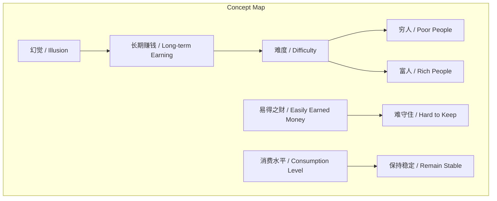
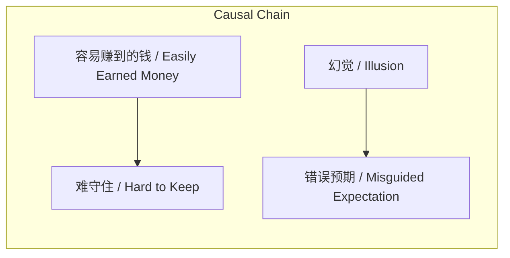

# NEWS/NEWS 任务报告

- agent: news/news
- requestId: 1772337747615-c91yiz
- 生成时间(UTC): 2026-03-01T04:03:13.744Z

## 文本总结

# 长期赚钱恒难，消费当守恒

## 整体结构化文档表达
### 文档卡片
- 主题（中文/English）：长期赚钱的困难性 / The Difficulty of Long-term Earning
- 一句话摘要：长期赚钱对任何人难度相同，易得之财难守，应保持消费水平稳定。
- 目标读者：普通公众、投资者
- 核心结论（3条）：
  1. 长期赚钱的难度具有普遍性，不因贫富而异。
  2. “有钱则易赚钱”是常见幻觉。
  3. 易赚之钱难以守住，需维持消费水平不变。

### 内容结构树
1. 背景与问题定义：2020.12.15讨论长期赚钱的困难性。
2. 核心观点与关键证据：
   - 观点一：难度无差别；证据：对穷人富人一样。
   - 观点二：幻觉；证据：人们误以为有钱就简单。
   - 观点三：易赚难守；证据：陈述。
   - 建议：不改变消费水平。
3. 方法/机制/路径：未明确方法，仅给出消费建议。
4. 风险与边界条件：风险是容易赚的钱难守住；边界条件是长期赚钱。
5. 结论与行动建议：结论是难度恒常；行动建议是保持消费水平。

### 结构化元数据（JSON）
```json
{
  "title": "长期赚钱恒难，消费当守恒",
  "topic_zh": "长期赚钱的困难性",
  "topic_en": "The Difficulty of Long-term Earning",
  "audience": "普通公众、投资者",
  "claims": [
    "长期赚钱的难度对任何人（穷人、富人）都一样",
    "人们误以为有钱赚钱就简单是一种幻觉",
    "很容易赚到的钱很难守住，因此不要改变自己的消费水平"
  ],
  "evidence": [
    "赚钱是困难的（我们说的是“长期赚钱”）",
    "赚钱的难度任何时候对任何人（穷人、富人）都一样的",
    "很容易赚到的钱很难守住"
  ],
  "risks": [
    "容易赚到的钱难以守住"
  ],
  "actions": [
    "不要改变自己的消费水平"
  ]
}
```

## 处理流程
1. 输入识别（来源：用户输入文本）
2. 信息抽取（实体、概念、问题、事实、观点）
3. 结构化归纳（定义/分类/比较/因果/方法论）
4. 关系建模（概念关系、等式/方程/逻辑链）
5. 可视化表达（Mermaid）

## 概念清单（中英文）
- 赚钱 / Earning
- 长期赚钱 / Long-term Earning
- 穷人 / Poor People
- 富人 / Rich People
- 消费水平 / Consumption Level
- 难度 / Difficulty
- 幻觉 / Illusion
- 系安全带 / Fastening Seatbelt
- 起飞 / Takeoff
- 降落 / Landing

## 概念定义（中英文）
- 赚钱：指获取金钱的行为。
- 长期赚钱：指持续、长时间地获取金钱。
- 穷人：指经济上贫困的人群。
- 富人：指经济上富裕的人群。
- 消费水平：指个人或家庭在消费上的支出程度。
- 难度：指完成某事的困难程度。
- 幻觉：指错误的感知或信念。
- 系安全带：在交通工具起飞和降落时采取的安全措施。
- 起飞：飞机等离开地面上升的过程。
- 降落：飞机等返回地面的过程。

## 概念关联与逻辑关系（中英文）
1. 难度（长期赚钱） / Difficulty (Long-term Earning) 与 人群（穷人/富人） / People (Poor/Rich) 无关：难度(长期赚钱) = 常数，独立于人群类型。
2. 幻觉（有钱则易赚钱） / Illusion (Money Makes Earning Easy) 导致 错误预期 / Misguided Expectation：幻觉 → 错误预期。
3. 易得之财 / Easily Earned Money 与 守住钱 / Keeping Money 负相关：易得性 ↑ → 守住能力 ↓。

## COT逻辑梳理（定义/分类/比较/因果/科学方法论）
- Step 1: 定义核心概念。长期赚钱指持续获取金钱，难度指困难程度。
- Step 2: 分类讨论。按人群分：穷人、富人；按赚钱易度分：容易赚、难赚。
- Step 3: 比较分析。比较不同人群的难度，发现无差别；比较容易赚和难赚的钱，发现易赚难守。
- Step 4: 因果分析。容易赚的钱因可能伴随轻率或高风险而难守住；幻觉源于对有钱后资源的误解。
- Step 5: 科学方法论。原文未提出系统方法论，仅基于观察给出建议。

## 事实与看法
### 事实
- 赚钱是困难的（我们说的是“长期赚钱”）。
- 赚钱的难度任何时候对任何人（穷人、富人）都一样的。
- 很容易赚到的钱很难守住。
### 看法
- 人们会误以为有钱赚钱就简单（这是一种幻觉）。
- 不要改变自己的消费水平（建议）。

## FAQ（原文问题整理）
- 未提及

## Visualization
### Mermaid 图 1（概念结构图）

### Mermaid 图 2（逻辑/因果图）


## 文章中的类比
- 起飞和降落才需要系安全带，赚钱也是类似的（比喻赚钱需要始终谨慎，类似飞行关键时需系安全带）。

## 10个金句
1. 赚钱是困难的（我们说的是“长期赚钱”）。
2. 比喻：起飞和降落才需要系安全带 赚钱也是类似的。
3. 赚钱的难度 任何时候对任何人（穷人、富人）都一样的。
4. 人们会误以为有钱赚钱就简单 这是一种幻觉。
5. 很容易赚到的钱 很难守住。
6. 不要改变自己的消费水平。
7. 原文未提供
8. 原文未提供
9. 原文未提供
10. 原文未提供
