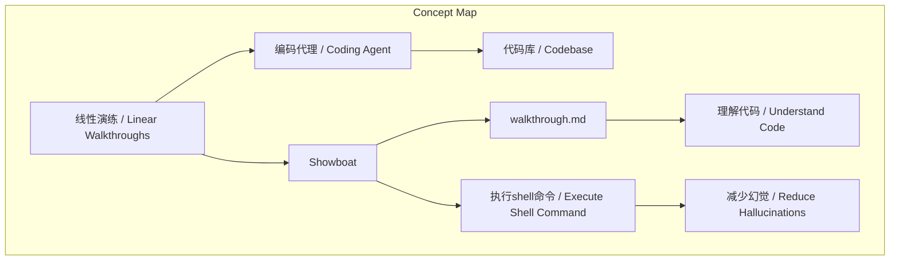
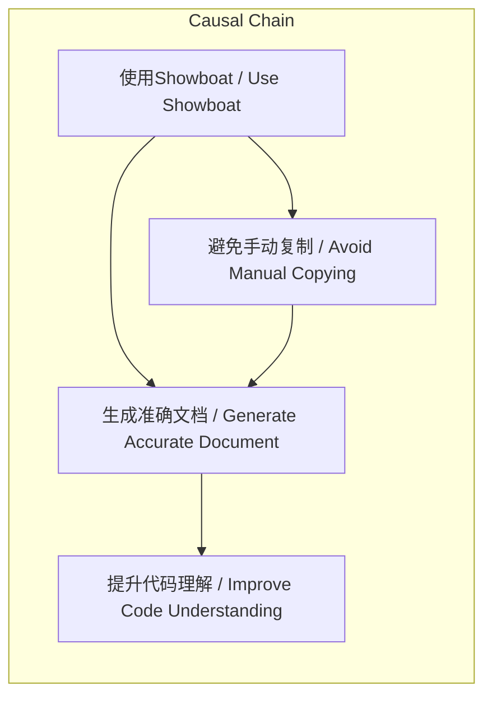
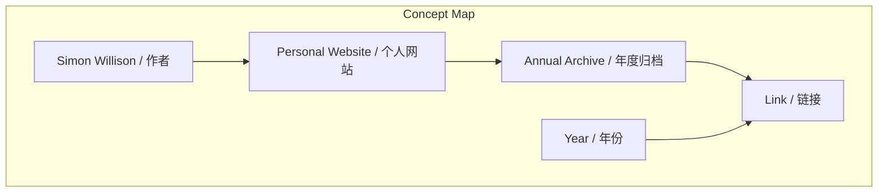
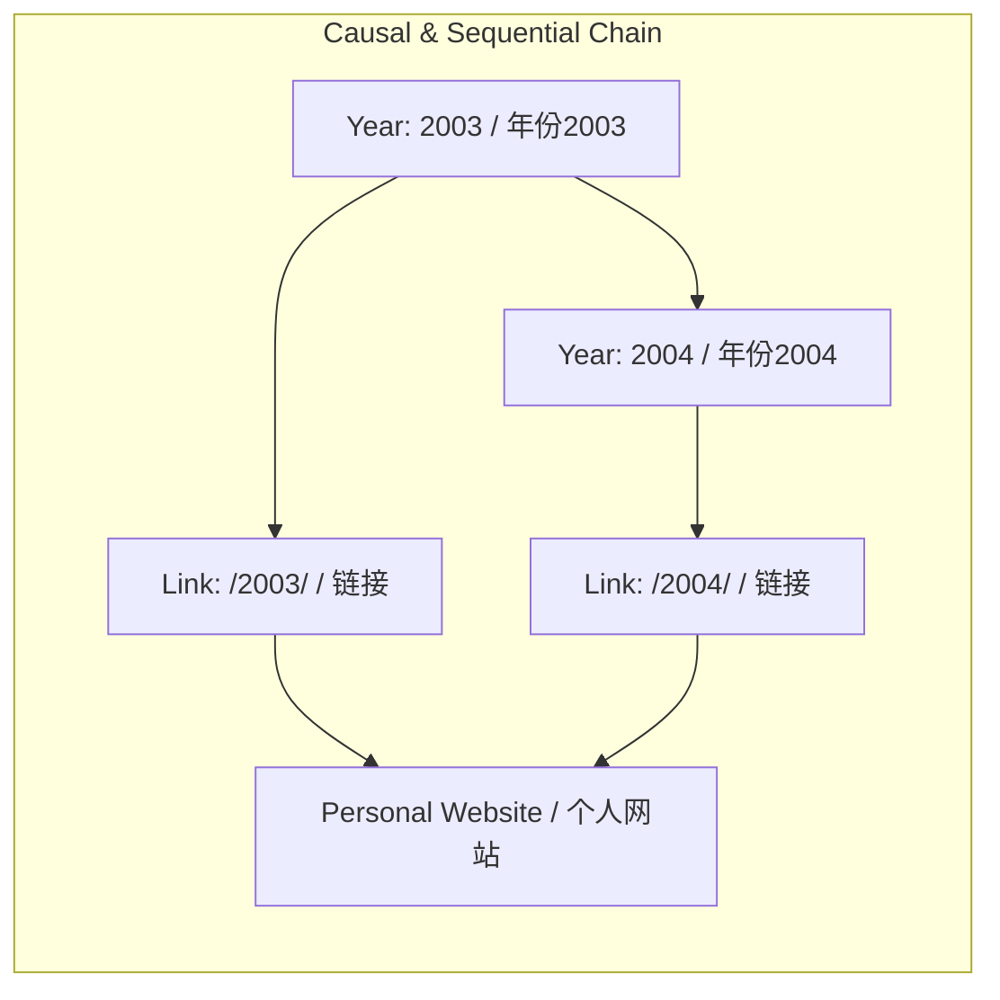

# NEWS/NEWS 任务报告

- agent: news/news
- requestId: 1772338283144-adjno1
- 生成时间(UTC): 2026-03-01T04:13:29.875Z

## 链接总结

- URL: http://simonwillison.net/guides/agentic-engineering-patterns/linear-walkthroughs/

# 线性演练：AI代理讲解代码库

## 整体结构化文档表达
### 文档卡片
- 主题（中文/English）：线性演练 / Linear Walkthroughs
- 一句话摘要：利用编码代理生成代码库结构化讲解文档，以帮助理解代码工作原理。
- 目标读者：开发者、AI辅助编程实践者
- 核心结论（3条）：
  1. 线性演练能有效帮助开发者快速理解陌生或遗忘的代码库结构。
  2. 使用Showboat等工具通过执行shell命令生成内容，可减少手动复制代码导致的幻觉风险。
  3. 即使通过vibe coding快速创建的项目，也能通过线性演练转化为深入学习新语言和框架的机会。

### 内容结构树
1. 背景与问题定义：开发者需要理解代码库，但可能因vibe coding或遗忘而缺乏知识。
2. 核心观点与关键证据：线性演练提供详细解释；Showboat确保内容准确。
3. 方法/机制/路径：使用Showboat工具，代理执行相关shell命令并自动记录到文档。
4. 风险与边界条件：依赖代理能力；工具配置不当可能影响效果。
5. 结论与行动建议：采用线性演练模式提升代码理解和学习效率。

### 结构化元数据（JSON）
```json
{
  "title": "线性演练：AI代理讲解代码库",
  "topic_zh": "线性演练",
  "topic_en": "Linear Walkthroughs",
  "audience": "开发者、AI辅助编程实践者",
  "claims": [
    "线性演练能有效帮助开发者快速理解陌生或遗忘的代码库结构。",
    "使用Showboat等工具通过执行shell命令生成内容，可减少手动复制代码导致的幻觉风险。",
    "即使通过vibe coding快速创建的项目，也能通过线性演练转化为深入学习新语言和框架的机会。"
  ],
  "evidence": [
    "作者使用Claude Code和Showboat为SwiftUI应用生成了walkthrough.md文档。",
    "文档详细讲解了六个.swift文件，作者从中学习了SwiftUI结构和Swift语言细节。",
    "Showboat的showboat exec命令执行shell命令并记录输出，避免手动复制。"
  ],
  "risks": [
    "依赖编码代理的理解能力和生成质量。",
    "如果工具配置不当，可能无法有效减少幻觉。"
  ],
  "actions": [
    "对于需要理解的代码库，尝试使用线性演练模式。",
    "使用Showboat或类似工具确保内容准确性。",
    "将vibe coding项目作为学习机会，主动生成演练文档。"
  ]
}
```

## 处理流程
1. 输入识别：网页正文关于线性演练，来自Agentic Engineering Patterns指南。
2. 信息抽取：实体包括Showboat、Claude Code、present repo；概念包括线性演练、编码代理、vibe coding；问题是如何理解代码；事实是作者生成了walkthrough.md；观点是线性演练有用。
3. 结构化归纳：定义线性演练为结构化代码讲解；分类为代码理解方法；比较：与手动阅读对比；因果：使用Showboat减少幻觉；科学方法论：通过实践验证效果。
4. 关系建模：编码代理 + Showboat → 线性演练文档；线性演练 → 代码理解；Showboat执行命令 → 减少幻觉。
5. 可视化表达：准备Mermaid概念图和因果图。

## 概念清单（中英文）
- 线性演练 / Linear Walkthroughs
- 编码代理 / Coding Agent
- 代码库 / Codebase
- Showboat
- vibe coding
- Claude Code
- SwiftUI
- Swift
- walkthrough.md
- 幻觉 / Hallucinations
- 风险 / Risk
- 结构化文档 / Structured Document

## 概念定义（中英文）
- 线性演练：让编码代理提供代码库的结构化讲解。 / Linear walkthroughs: having a coding agent give you a structured walkthrough of a codebase.
- 编码代理：能够执行编码任务的AI模型，如Claude Code。 / Coding agent: AI models that can perform coding tasks, e.g., Claude Code.
- 代码库：一组源代码文件，如present应用的.swift文件。 / Codebase: A set of source code files, e.g., the .swift files in the present app.
- Showboat：作者开发的工具，帮助编码代理生成文档，通过执行shell命令并记录输出来避免手动复制。 / Showboat: A tool built to help coding agents write documents by executing shell commands and recording outputs.
- vibe coding：快速编码方式，开发者 prompting AI 生成代码而不深入理解。 / Vibe coding: A fast coding approach where the developer prompts AI to generate code without deep understanding.
- Claude Code：Anthropic的AI编码代理，用于生成演练文档。 / Claude Code: An AI coding agent by Anthropic used to generate walkthrough documents.
- SwiftUI：用于构建用户界面的框架，在输入中用于创建幻灯片演示应用。 / SwiftUI: A framework for building user interfaces, used in the input to create a slide presentation app.
- Swift：编程语言，用于编写present应用的代码。 / Swift: A programming language used to write the present app's code.
- walkthrough.md：由Claude Code使用Showboat生成的Markdown文档，讲解present应用的代码。 / walkthrough.md: A Markdown document generated by Claude Code using Showboat, explaining the present app's code.
- 幻觉：AI生成不准确内容的风险，Showboat通过避免手动复制来减少此风险。 / Hallucination: The risk of AI generating inaccurate content, mitigated by Showboat's avoidance of manual copying.
- 风险：潜在问题，如幻觉或工具配置不当。 / Risk: Potential issues such as hallucinations or improper tool configuration.
- 结构化文档：有组织的文档，如walkthrough.md，便于理解。 / Structured document: An organized document like walkthrough.md for easy comprehension.

## 概念关联与逻辑关系（中英文）
1. 编码代理（Coding Agent）使用Showboat工具生成线性演练文档（Linear Walkthrough Document）。
2. 线性演练（Linear Walkthrough）帮助开发者理解代码库（Codebase）结构。
3. Showboat通过执行shell命令（Shell Command）记录输出，减少手动复制代码导致的幻觉（Hallucinations）风险。

## COT逻辑梳理（定义/分类/比较/因果/科学方法论）
Step 1: 定义问题——开发者需要理解代码库，但可能因vibe coding或遗忘而缺乏知识。
Step 2: 提出方案——采用线性演练模式，让AI代理生成结构化讲解。
Step 3: 实施方法——使用Showboat工具，代理执行相关shell命令（如sed、grep）来提取代码片段，并自动记录到文档。
Step 4: 验证效果——作者通过阅读生成的walkthrough.md，成功学习了SwiftUI和Swift细节。
Step 5: 得出结论——线性演练是有效的学习工具，推荐在AI辅助编程中采用。
- 定义：线性演练是AI代理生成代码库讲解文档的过程。
- 分类：属于代码理解方法，区别于交互式解释。
- 比较：相比手动阅读代码，线性演练更高效；相比无工具代理，Showboat减少幻觉。
- 因果：使用Showboat（因）导致文档准确（果），进而提升理解（果）。
- 科学方法论：通过个人实验（作者实践）验证模式有效性。

## 事实与看法（病毒）
### 事实
- 作者使用Claude Code和Showboat为present应用生成了walkthrough.md文档。
- walkthrough.md文档详细讲解了六个.swift文件。
- Showboat的showboat exec命令执行shell命令并记录输出。
- 作者从文档中学习了SwiftUI应用结构和Swift语言细节。
- present应用是作者用vibe coding方式在2026年2月创建的。
### 看法
- 线性演练对理解代码库很有用。
- 使用Showboat可以避免手动复制代码引入的幻觉风险。
- 即使vibe coding项目也能成为学习新生态系统和技巧的机会。
- 如果担心LLMs降低学习速度，应采用此类模式。

## FAQ（原文问题整理）
未提及明确问题。

## Visualization
### Mermaid 图 1（概念结构图）

### Mermaid 图 2（逻辑/因果图）


## 文章中的类比
- STAR moment：Something They'll Always Remember，指演讲中令人难忘的亮点。
- vibe coding：比喻为凭感觉编码，不深入细节。

## 10个金句
1. "Sometimes it's useful to have a coding agent give you a structured walkthrough of a codebase."
2. "Frontier models with the right agent harness can construct a detailed walkthrough to help you understand how code works."
3. "By telling it to use 'sed or grep or cat or whatever you need to include snippets of code you are talking about' I ensured that Claude Code would not manually copy snippets of code into the document, since that could introduce a risk of hallucinations or mistakes."
4. "This worked extremely well."
5. "I learned a great deal about how SwiftUI apps are structured and absorbed some solid details about the Swift language itself just from reading this document."
6. "If you are concerned that LLMs might reduce the speed at which you learn new skills I strongly recommend adopting patterns like this one."
7. "Even a ~40 minute vibe coded toy project can become an opportunity to explore new ecosystems and pick up some interesting new tricks."
8. "Showboat is a tool I built to help coding agents write documents that demonstrate their work."
9. "The showboat exec command accepts a shell command, executes it and then adds both the command and its output to the document."
10. "I fired up a new instance of Claude Code for web, pointed it at my repo and prompted."

# Simon Willison网站年度归档

## 整体结构化文档表达
### 文档卡片
- 主题（中文/English）：个人网站归档 / Personal Website Archive
- 一句话摘要：该页面列出了Simon Willison个人网站从2003年至2026年的年度归档链接。
- 目标读者：内容研究者、历史追溯者、对该作者长期产出感兴趣的读者
- 核心结论（3条）：
  1. 网站内容按年份进行系统性归档。
  2. 归档时间跨度覆盖2003年至2026年。
  3. 提供通过年份链接访问历史内容的入口。

### 内容结构树
1. 背景与问题定义：这是一个个人网站的年度归档索引页面。
2. 核心观点与关键证据：核心信息为一系列按年份排列的超链接，每个链接对应一年的内容集合。
3. 方法/机制/路径：采用按日历年份创建独立归档页面的方法组织内容。
4. 风险与边界条件：未提及。
5. 结论与行动建议：结论是网站有长期、结构化的历史记录；行动建议是用户可点击特定年份链接进行浏览。

### 结构化元数据（JSON）
```json
{
  "title": "Simon Willison网站年度归档",
  "topic_zh": "个人网站归档",
  "topic_en": "Personal Website Archive",
  "audience": "内容研究者、历史追溯者",
  "claims": ["网站内容按年份进行系统性归档", "归档时间跨度覆盖2003年至2026年", "提供通过年份链接访问历史内容的入口"],
  "evidence": ["http://simonwillison.net/2003/", "http://simonwillison.net/2004/", "...", "http://simonwillison.net/2026/"],
  "risks": [],
  "actions": ["点击特定年份链接访问对应年度内容"]
}
```

## 处理流程
1. 输入识别：来源为网页正文，内容为年度归档链接列表。
2. 信息抽取：实体为年份（2003-2026）和对应URL；概念为“归档”、“链接”。
3. 结构化归纳：定义——年度归档是按年份索引的网站内容集合；分类——按年份线性分类。
4. 关系建模：年份与URL之间存在“对应”关系；年份之间存在“顺序”关系。
5. 可视化表达：使用Mermaid展示归档的层次与顺序结构。

## 概念清单（中英文）
- Simon Willison（人名，不翻译）
- 个人网站 / Personal Website
- 年度归档 / Annual Archive
- 链接 / Link
- 年份 / Year

## 概念定义（中英文）
- Simon Willison：本文所述个人网站的维护者与内容创作者。
- 个人网站 / Personal Website：由Simon Willison独立拥有和运营的网站。
- 年度归档 / Annual Archive：将网站内容按日历年份进行分组和索引的集合。
- 链接 / Link：指向特定年度归档页面的超文本引用。
- 年份 / Year：用于组织和标识归档内容的时间单位（如2003年）。

## 概念关联与逻辑关系（中英文）
1. Simon Willison（作者） 维护 个人网站（平台）。
2. 个人网站（平台） 包含 年度归档（内容组织方式）。
3. 年度归档（内容组织方式） 由 链接（访问入口） 指向。
4. 年份（时间标识） 与 链接（访问入口） 存在 一一对应 关系。
5. 年份（时间标识） 之间 存在 线性递增 关系（2003 < 2004 < ... < 2026）。

## COT逻辑梳理（定义/分类/比较/因果/科学方法论）
- **Step 1 (定义)**：明确“年度归档”是指为网站历史内容建立的、以公历年份为索引的访问结构。
- **Step 2 (分类)**：将所有归档条目按年份数值（2003至2026）进行严格线性分类，每年为一个独立类别。
- **Step 3 (比较)**：比较不同年份的归档条目，发现其结构（均为指向该年内容的链接）完全一致，仅时间标签不同。
- **Step 4 (因果)**：作者持续创作与更新网站（因）导致每年均产生新内容，进而需要建立新的年度归档（果）。
- **Step 5 (科学方法论)**：采用系统化归档方法，通过可验证的URL结构，实现了网站历史内容的长期、有序保存与可追溯性。

## 事实与看法（病毒）
### 事实
- 页面列出了从2003年到2026年的链接。
- 每个链接格式为 `http://simonwillison.net/年份/`。
- 链接按年份从早到晚排列。
### 看法
- 原文未提供明确观点、判断或推测。

## FAQ（原文问题整理）
- 原文未提供任何提问。

## Visualization
### Mermaid 图 1（概念结构图）


### Mermaid 图 2（逻辑/因果图）


## 文章中的类比
- 未发现明确类比。

## 10个金句
1. 原文未提供
2. 原文未提供
3. 原文未提供
4. 原文未提供
5. 原文未提供
6. 原文未提供
7. 原文未提供
8. 原文未提供
9. 原文未提供
10. 原文未提供
