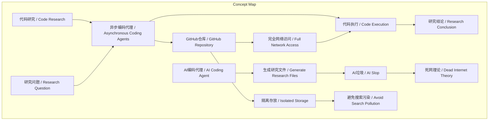
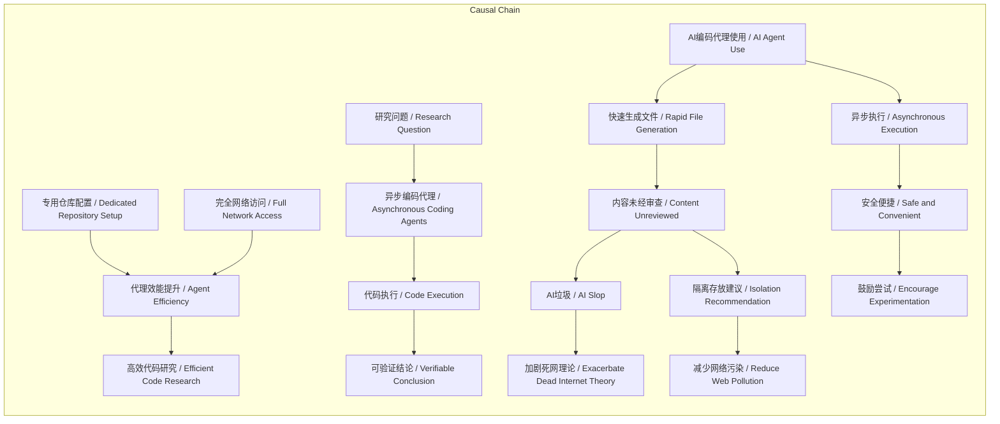

# NEWS/NEWS 任务报告

- agent: news/news
- requestId: 1772338428196-z5y0uh
- 生成时间(UTC): 2026-03-01T04:17:23.954Z

## 链接总结

- URL: https://simonwillison.net/2025/Nov/6/async-code-research/

# 异步编码代理：自动化代码研究新范式

## 整体结构化文档表达
### 文档卡片
- 主题（中文/English）：代码研究 / Code Research
- 一句话摘要：作者通过异步编码代理自动化代码研究，使用专用GitHub仓库和完全网络访问，实现高效低干预的技术验证，并警告AI生成内容需隔离存放以避免“死网”理论。
- 目标读者：软件开发者、技术研究员、AI工具实践者。
- 核心结论（3条）：
  1. 异步编码代理能自主执行代码研究任务，显著减少人工时间投入。
  2. 专用GitHub仓库配合完全网络访问是最大化代理效能的关键配置。
  3. 代码执行的可验证性降低了LLM幻觉对研究结果的影响，但生成内容未经审查，需隔离存放。

### 内容结构树
1. 背景与问题定义：传统代码研究依赖人工编写实验代码，效率有限；编码代理可自动化此过程。
2. 核心观点与关键证据：异步编码代理（如Codex Cloud、Claude Code、Jules、Copilot）可fire-and-forget执行任务；作者每日发起2-3个项目，结果常有用；具体案例如Claude Code生成性能基准、GitHub Workflow自动更新README。
3. 方法/机制/路径：创建专用仓库，配置完全网络访问，提交清晰任务，代理执行并提交PR；使用GitHub Workflow集成AI模型自动更新文档；跨项目复用成果（如Pyodide与cmarkgfm结合）。
4. 风险与边界条件：代理无法证明不可能性；敏感仓库需限制网络访问以防安全风险（如lethal trifecta攻击）；AI生成内容未经审查，质量存疑，可能加剧“死网”理论；缺乏搜索索引隔离功能可能污染网络。
5. 结论与行动建议：采用异步编码代理进行代码研究，使用专用非敏感仓库，开放网络权限；将AI生成内容隔离在单独仓库；利用Claude Code或Gemini Jules的免费额度尝试；建议GitHub增加搜索索引排除功能。

### 结构化元数据（JSON）
```json
{
  "title": "异步编码代理：自动化代码研究新范式",
  "topic_zh": "代码研究",
  "topic_en": "Code Research",
  "audience": "软件开发者、技术研究员、AI工具实践者",
  "claims": [
    "异步编码代理能高效执行代码研究任务，减少人工干预",
    "专用GitHub仓库和完全网络访问权限可最大化代理效能",
    "代码执行的可验证性降低了LLM幻觉的影响，但生成内容需隔离审查"
  ],
  "evidence": [
    "作者每日发起2-3个代码研究项目，时间投入 minimal",
    "代理例子包括Codex Cloud、Claude Code for web、Jules、Copilot coding agent",
    "代理通过提交PR报告结果",
    "Claude Code生成了cmarkgfm性能基准图表",
    "GitHub Workflow使用GitHub Models自动更新README文件",
    "cmarkgfm-in-pyodide项目成功编译C扩展的Wheel文件",
    "仓库包含13个项目，提交历史链接至提示和转录",
    "Claude Code提供$250免费额度至2025年11月18日，Gemini Jules有免费层级"
  ],
  "risks": [
    "代理无法证明某事不可能",
    "在敏感仓库中，网络访问可能被用于提示注入攻击（如lethal trifecta）",
    "AI生成内容未经审查可能导致低质量（AI垃圾）",
    "在线发布可能贡献“死网”理论",
    "缺乏搜索索引排除功能可能污染网络"
  ],
  "actions": [
    "为代理研究创建专用GitHub仓库（公共或私有）",
    "配置仓库允许完全网络访问，以便代理安装依赖和获取数据",
    "将研究问题转化为清晰提示提交给异步编码代理",
    "将AI生成内容隔离在单独仓库，避免污染搜索索引",
    "利用Claude Code或Gemini Jules的免费额度尝试模式"
  ]
}
```

## 处理流程
1. 输入识别：来源为Simon Willison博客文章（https://simonwillison.net/2025/Nov/6/async-code-research/），内容涵盖异步代码研究实践、AI辅助自动化案例及研究模式警告。
2. 信息抽取：提取实体（异步编码代理、GitHub仓库、Claude Code等）、概念（代码研究、AI垃圾、死网理论）、事实（每日2-3个项目、免费额度）、观点（代理高效、需隔离内容）。
3. 结构化归纳：定义代码研究为通过代码执行验证假设；分类编码代理为同步与异步；比较异步代理低干预优势；因果分析专用仓库与网络访问提升效能，但AI生成内容导致风险；科学方法论强调假设-实验-验证循环。
4. 关系建模：建立专用仓库与网络访问共同提升代理效能；代码执行决定研究结论有效性；AI编码代理生成文件导致AI垃圾风险。
5. 可视化表达：使用Mermaid绘制概念结构图和因果链图。

## 概念清单（中英文）
- 代码研究 / Code Research
- 编码代理 / Coding Agents
- 异步编码代理 / Asynchronous Coding Agents
- GitHub仓库 / GitHub Repository
- 网络访问 / Network Access
- 拉取请求 / Pull Request
- 代码执行 / Code Execution
- 幻觉 / Hallucination
- lethal trifecta / lethal trifecta
- 专用仓库 / Dedicated Repository
- 公共仓库 / Public Repository
- 私有仓库 / Private Repository
- Codex Cloud / Codex Cloud
- Claude Code for web / Claude Code for web
- Google Gemini’s Jules / Jules
- GitHub’s Copilot coding agent / Copilot coding agent
- 研究问题 / Research Question
- 实验 / Experiments
- 证明概念 / Proof-of-Concept
- 模拟 / Simulate
- 生产环境 / Production
- 论坛 / Forums
- Redis / Redis
- 通知源 / Notifications Feed
- 应用 / App
- 依赖 / Dependencies
- 数据 / Data
- 环境变量 / Environment Variables
- 提示注入攻击 / Prompt Injection Attack
- 敏感代码 / Sensitive Code
- 研究项目 / Research project
- GitHub Workflow / GitHub Workflow
- GitHub Models / GitHub Models
- README / README
- Cog / Cog
- LLM / LLM
- llm-github-models / llm-github-models
- Python / Python
- node-pyodide / node-pyodide
- Node.js / Node.js
- Pyodide / Pyodide
- WebAssembly / WebAssembly
- python-markdown-comparison / python-markdown-comparison
- 性能基准 / Performance benchmark
- cmarkgfm / cmarkgfm
- marko / marko
- markdown2 / markdown2
- mistletoe / mistletoe
- markdown / markdown
- commonmark / commonmark
- mistune / mistune
- cmarkgfm-in-pyodide / cmarkgfm-in-pyodide
- C扩展 / C extension
- pytest / pytest
- blog-tags-scikit-learn / blog-tags-scikit-learn
- scikit-learn / scikit-learn
- 文本分类 / Text classification
- SQLite / SQLite
- blog_entry表 / blog_entry table
- tags / tags
- JSON / JSON
- HTML / HTML
- 可视化 / Visualization
- AI编码代理 / AI Coding Agent
- 异步代理 / Asynchronous Agent
- AI垃圾 / AI Slop
- 死网理论 / Dead Internet Theory
- 搜索索引隔离 / Search Index Exclusion
- AGENTS.md / AGENTS.md
- 提交历史 / Commit History

## 概念定义（中英文）
- 代码研究 / Code Research：通过编写和执行代码来回答技术问题的实践方法，强调实证验证。
- 编码代理 / Coding Agents：能够理解指令并编写、执行代码的AI工具，如Claude Code和Codex。
- 异步编码代理 / Asynchronous Coding Agents：以fire-and-forget方式运行的编码代理，在远程服务器执行任务并自动提交拉取请求。
- GitHub仓库 / GitHub Repository：用于存储和管理代码的版本控制仓库，代理在此环境中工作。
- 网络访问 / Network Access：代理访问互联网以安装依赖、获取数据的能力。
- 拉取请求 / Pull Request：代理完成研究后向GitHub仓库提交的代码变更请求。
- 代码执行 / Code Execution：运行编写的代码以验证假设或测试功能的过程。
- 幻觉 / Hallucination：LLM生成错误或虚构信息的能力，在代码研究中因执行验证而影响降低。
- lethal trifecta / lethal trifecta：一种提示注入攻击类型，可能同时窃取代码、环境变量和敏感数据。
- 专用仓库 / Dedicated Repository：专门用于代理研究的独立GitHub仓库，通常非敏感。
- 公共仓库 / Public Repository：公开可见的GitHub仓库，用于无需隐私的研究。
- 私有仓库 / Private Repository：受限访问的GitHub仓库，用于未公开的研究。
- Codex Cloud / Codex Cloud：OpenAI提供的异步编码代理服务。
- Claude Code for web / Claude Code for web：Anthropic提供的基于Web的异步编码代理。
- Google Gemini’s Jules / Jules：Google Gemini的异步编码代理。
- GitHub’s Copilot coding agent / Copilot coding agent：GitHub提供的编码代理。
- 研究问题 / Research Question：需要代码实验回答的技术疑问，如“Redis能否用于通知源？”
- 实验 / Experiments：为验证假设而进行的代码编写和运行过程。
- 证明概念 / Proof-of-Concept：小型实验代码，用于验证想法可行性。
- 模拟 / Simulate：在代码中模仿生产环境模式以进行测试。
- 生产环境 / Production：实际运行应用程序的部署环境。
- 论坛 / Forums：在线讨论平台，常见代码研究问题来源。
- Redis / Redis：开源内存数据库，常作为技术选型例子。
- 通知源 / Notifications Feed：应用程序中推送通知的机制。
- 应用 / App：软件应用程序。
- 依赖 / Dependencies：代码运行所需的第三方库或包。
- 数据 / Data：代理从网络获取或处理的信息。
- 环境变量 / Environment Variables：存储敏感配置的操作系统变量。
- 提示注入攻击 / Prompt Injection Attack：通过恶意提示操纵AI行为的攻击方式。
- 敏感代码 / Sensitive Code：包含商业机密或个人数据的代码，需保护。
- 研究项目 / Research project：作者创建的用于探索技术想法的独立代码仓库。
- GitHub Workflow / GitHub Workflow：GitHub的自动化工作流，用于在事件触发时运行任务，如自动更新README。
- GitHub Models / GitHub Models：GitHub提供的AI模型服务，用于在Workflow中调用。
- README / README：项目说明文件，通常包含项目描述和使用指南。
- Cog / Cog：用于容器化或部署的工具，原文未明确说明。
- LLM / LLM：与大型语言模型交互的工具，原文未明确说明。
- llm-github-models / llm-github-models：GitHub Models的Python库或集成，原文未明确说明。
- Python / Python：一种编程语言。
- node-pyodide / node-pyodide：一个研究项目，演示在Node.js中运行Pyodide。
- Node.js / Node.js：一个JavaScript运行时环境。
- Pyodide / Pyodide：Python的WebAssembly分发版，可在浏览器或Node.js中运行。
- WebAssembly / WebAssembly：一种低级的字节码格式，可在现代浏览器中运行。
- python-markdown-comparison / python-markdown-comparison：一个研究项目，提供Python Markdown库的性能基准。
- 性能基准 / Performance benchmark：通过测量运行时间等指标比较不同实现的性能。
- cmarkgfm / cmarkgfm：一个Python库，GitHub Markdown实现的C绑定。
- marko / marko：一个Python Markdown库。
- markdown2 / markdown2：一个Python Markdown库。
- mistletoe / mistletoe：一个Python Markdown库。
- markdown / markdown：Python标准库中的Markdown库。
- commonmark / commonmark：一个Python Markdown库。
- mistune / mistune：一个Python Markdown库。
- cmarkgfm-in-pyodide / cmarkgfm-in-pyodide：一个研究项目，将cmarkgfm集成到Pyodide中。
- C扩展 / C extension：使用C语言编写的Python模块，以提高性能。
- pytest / pytest：一个Python测试框架。
- blog-tags-scikit-learn / blog-tags-scikit-learn：一个研究项目，使用scikit-learn进行博客标签推荐。
- scikit-learn / scikit-learn：一个Python机器学习库。
- 文本分类 / Text classification：自然语言处理任务，将文本分配到预定义类别。
- SQLite / SQLite：一个轻量级数据库引擎。
- blog_entry表 / blog_entry table：SQLite数据库中的表，存储博客条目。
- tags / tags：标签，用于分类。
- JSON / JSON：一种轻量级数据交换格式。
- HTML / HTML：超文本标记语言，用于创建网页。
- 可视化 / Visualization：通过图形表示数据。
- AI编码代理 / AI Coding Agent：能自动编写和执行代码的AI系统，用于自动化研究任务。
- 异步代理 / Asynchronous Agent：可在后台运行而不阻塞主进程的AI代理，允许用户从移动设备安全触发。
- AI垃圾 / AI Slop：AI生成且未经人类审查就发布的内容，通常质量低劣。
- 死网理论 / Dead Internet Theory：互联网内容越来越多由AI生成，导致真实人类互动和内容减少的假说。
- 搜索索引隔离 / Search Index Exclusion：将仓库标记为不被搜索引擎索引的机制（如使用`<meta name="robots" content="noindex">`）。
- AGENTS.md / AGENTS.md：作者添加到研究仓库的文档文件，包含运行AI研究代理的额外提示和指南。
- 提交历史 / Commit History：Git仓库中每次提交的记录，可链接到相关提示和转录，用于追溯生成过程。

## 概念关联与逻辑关系（中英文）
1. 专用GitHub仓库 (Dedicated GitHub Repository) 与 完全网络访问 (Full Network Access) 共同提升 异步编码代理 (Asynchronous Coding Agents) 的研究效率。
2. 代码执行 (Code Execution) 的结果 决定 代码研究 (Code Research) 的结论的有效性。
3. AI编码代理 (AI Coding Agent) 生成 研究项目文件 (Research Project Files) 导致 AI垃圾 (AI Slop) 风险，进而可能加剧 死网理论 (Dead Internet Theory)。

## COT逻辑梳理（定义/分类/比较/因果/科学方法论）
- Step 1（定义）：代码研究是通过编写和执行代码来回答技术问题的实证方法，区别于理论讨论。
- Step 2（分类）：编码代理分为交互式（同步，如Claude Code CLI）和异步式（如Codex Cloud），后者适合自动化任务。
- Step 3（比较）：异步代理相比交互式代理，优势在于低人工干预、可批量处理、适合长期运行任务，且可通过手机安全触发。
- Step 4（因果）：专用仓库允许完全网络访问，因为非敏感环境消除了安全顾虑，使代理能自由安装依赖和获取数据，从而加速研究；但AI生成内容未经审查，导致AI垃圾和死网理论风险。
- Step 5（科学方法论）：代码研究遵循假设（研究问题）-实验（编写代码）-验证（执行结果）循环，代码执行提供客观证据，减少主观偏差；研究自动化通过AI工具实现，但需隔离实验以控制变量（如审查与否），并利用免费额度降低试错成本。

## 事实与看法（病毒）
### 事实
- 作者使用异步编码代理进行代码研究。
- 四个异步编码代理例子：Codex Cloud、Claude Code for web、Jules、Copilot coding agent。
- 作者维护一个公共研究仓库（simonw/research）和一个私有研究仓库。
- 代理默认在锁定环境运行，但专用仓库可配置完全网络访问。
- 作者每日发起2-3个代码研究项目，时间投入 minimal。
- 代理通过提交拉取请求报告结果。
- 具体案例：Claude Code生成了cmarkgfm性能基准图表；GitHub Workflow使用GitHub Models自动更新README；cmarkgfm-in-pyodide项目成功编译C扩展的Wheel文件。
- 仓库包含13个项目，每个项目的提交历史链接到提示和转录。
- 作者添加了AGENTS.md文件。
- Claude Code为$20/月用户提供$250免费额度至2025年11月18日；Gemini Jules有免费层级。
- 在敏感仓库中，网络访问限制可防止提示注入攻击（如lethal trifecta）。
- 作者在手机上运行代理，未担心本地机器损坏或私人数据泄露。
- cmarkgfm-in-pyodide项目初始尝试因无网络访问失败，后成功。
- python-markdown-comparison项目对七个Python Markdown库进行性能基准测试，cmarkgfm性能最佳。
- blog-tags-scikit-learn项目使用scikit-learn对博客条目进行文本分类以建议标签。
### 看法
- 代码研究“benefits enormously”软件开发。
- 异步编码代理是“fantastic tools” for code research projects。
- “the code itself doesn’t lie”：代码执行结果比文本输出更可靠。
- “this is total slop, of course”：代理生成的代码可能杂乱，但作者接受以换取速度。
- 好程序员应能自行通过代码研究回答问题，而非依赖论坛。
- 将生成内容称为“AI垃圾”，未经审查。
- 决定隔离存放以避免污染搜索索引和贡献死网理论。
- 希望GitHub增加“排除搜索索引”功能（如添加`noindex`标签）。
- 认为异步代理更 convenient（便捷），尤其适合手机操作。
- 鼓励读者尝试并分享有趣结果。

## FAQ（原文问题整理）
- **Q：为什么忽略HTML页面？**  
  A：未提及具体原因。
- **Q：如何开始尝试编码代理研究模式？**  
  A：创建免费GitHub仓库（公开或私有），运行异步代理（如Claude Code或Gemini Jules）；推荐异步代理以便手机触发。
- **Q：有哪些可用的免费编码代理？**  
  A：Claude Code（$250免费额度至2025年11月18日）和Gemini Jules（免费层级）。
- **Q：为什么需要隔离AI生成内容？**  
  A：避免未经审查的“AI垃圾”污染搜索索引，减少对“死网理论”的贡献。

## Visualization
### Mermaid 图 1（概念结构图）


### Mermaid 图 2（逻辑/因果图）


## 文章中的类比
未发现明确类比。

## 10个金句
1. "Software development benefits enormously from something I call code research."
2. "The answer is always ‘it depends’, but a better answer is that a good programmer already has everything they need to answer that question for themselves."
3. "Build a proof-of-concept, simulate the patterns you expect to see in production, then run experiments to see if it’s going to work."
4. "LLMs hallucinate and make mistakes. This is far less important for code research tasks because the code itself doesn’t lie."
5. "They can’t prove something is impossible—just because the coding agent couldn’t find a way to do something doesn’t mean it can’t be done—but they can often demonstrate that something is possible in just a few minutes of crunching."
6. "An asynchronous coding agent is a coding agent that operates on a fire-and-forget basis."
7. "These are fantastic tools for code research projects."
8. "I’m firing off 2-3 code research projects a day right now."
9. "The biggest benefit of a dedicated repository is that you don’t need to be cautious about what the agents operating in that repository can do."
10. "I’ve configured my research repositories for full network access, which means my coding agents can install any dependencies they need, fetch data from the web and generally do anything I’d be able to do on my own computer."
