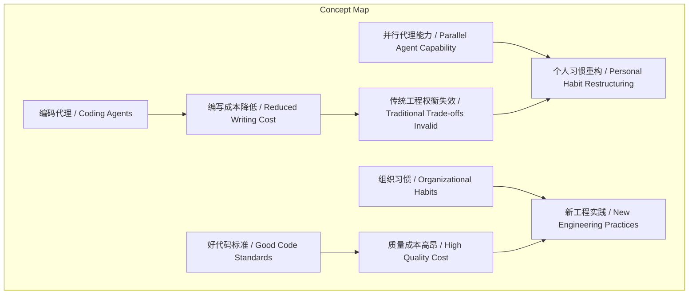
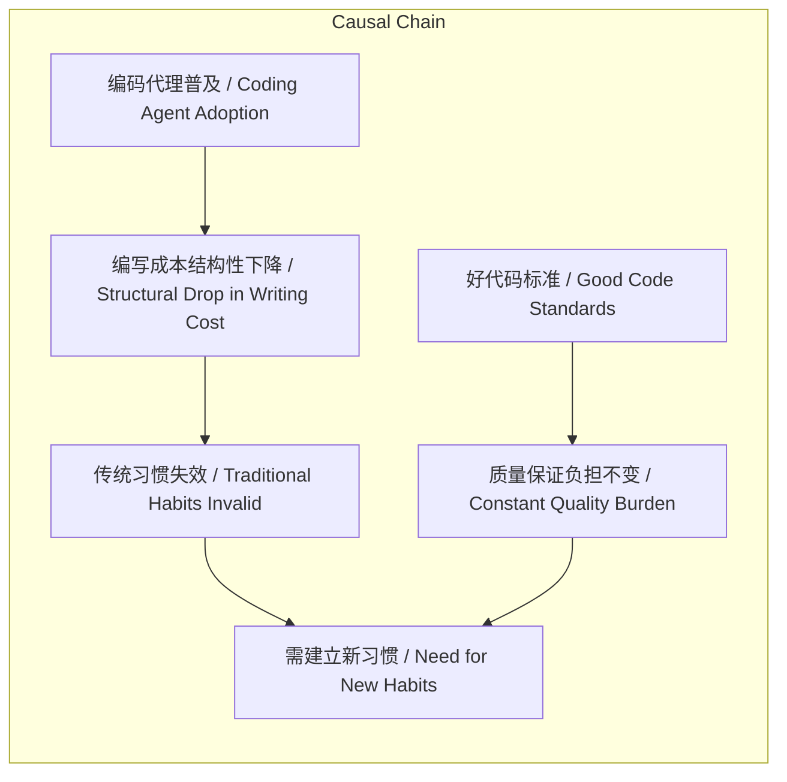

# NEWS/NEWS 任务报告

- agent: news/news
- requestId: 1772338786470-273las
- 生成时间(UTC): 2026-03-01T04:22:06.695Z

## 链接总结

- URL: https://simonwillison.net/guides/agentic-engineering-patterns/code-is-cheap/

# 编码成本降低与好代码标准

## 整体结构化文档表达
### 文档卡片
- 主题（中文/English）：编码成本变化 / The Changing Cost of Code
- 一句话摘要：编码代理工具使编写代码成本骤降，颠覆传统工程权衡，但确保“好代码”的多维度标准仍需大量工作，需建立新个人与组织习惯。
- 目标读者：软件工程师、技术管理者、工程流程设计者
- 核心结论（3条）：
  1. 编码代理使编写代码的成本结构性下降至接近免费。
  2. “好代码”的功能正确性、可维护性、文档化等标准未变，其成本依然高昂。
  3. 传统工程习惯基于高编码成本，需重构以适应低成本编码时代。

### 内容结构树
1. 背景与问题定义：传统软件工程基于“编写代码昂贵”的假设，形成设计、估算、规划等宏观习惯，以及日常微观权衡。
2. 核心观点与关键证据：观点1：编写代码成本因编码代理而剧降；证据：代理可并行工作，人类工程师可同时处理多项任务。观点2：“好代码”成本仍高；证据：列出好代码的9条标准（功能正确、已知正确、解决正确问题、优雅错误处理、简单最小、受测试保护、文档化、设计可扩展、其他非功能性质量）。
3. 方法/机制/路径：使用编码代理工具辅助生成代码，但开发者需驱动并确保产出符合“好代码”标准；建议新习惯：对任何“不值得做”的想法，都尝试用代理异步执行，十分钟后检查结果。
4. 风险与边界条件：风险：过度依赖代理导致代码质量下降；边界：代理工具不能完全保证好代码，开发者责任加重；好代码标准因项目而异。
5. 结论与行动建议：结论：编码成本变化要求习惯变革；行动：积极尝试代理，培养新评估标准，重视质量维度。

### 结构化元数据（JSON）
```json
{
  "title": "编码成本降低与好代码标准",
  "topic_zh": "编码成本变化",
  "topic_en": "The Changing Cost of Code",
  "audience": "软件工程师、技术管理者、工程流程设计者",
  "claims": [
    "编码代理使编写代码的成本结构性下降至接近免费。",
    "“好代码”的功能正确性、可维护性、文档化等标准未变，其成本依然高昂。",
    "传统工程习惯基于高编码成本，需重构以适应低成本编码时代。"
  ],
  "evidence": [
    "编码代理可并行工作，一个人类工程师可同时实现、重构、测试和文档化多个地方。",
    "好代码标准包括：功能正确、已知正确、解决正确问题、优雅错误处理、简单最小、受测试保护、文档化、设计可扩展、其他非功能性质量。",
    "建议：对任何“不值得做”的想法，都尝试用代理异步执行，十分钟后检查结果。",
    "文章标题为 'Code is cheap'",
    "创建日期：2026年2月23日",
    "最后修改日期：2026年2月24日",
    "更改次数：7次",
    "文章属于标签：generative-ai, ai, llms, agentic-engineering",
    "网站版权年份：2002年至2026年"
  ],
  "risks": [
    "过度依赖代理导致代码质量下降。",
    "开发者可能忽视对代理产出的质量审查。",
    "好代码标准因项目而异，可能被误解或简化。"
  ],
  "actions": [
    "积极尝试用编码代理实现曾被认为“不值得”的功能。",
    "建立新的评估框架，将代理生成代码的质量纳入考量。",
    "强化测试、文档和代码审查习惯，确保“好代码”标准。"
  ]
}
```

## 处理流程
1. 输入识别：识别输入为Simon Willison博客文章，主题为代理工程模式中编码成本变化，来源URL和发布时间已知。
2. 信息抽取：抽取实体（编码代理、好代码）、概念（成本、质量、习惯）、问题（传统权衡失效）、事实（成本下降、标准列表、元数据）、观点（需新习惯）。
3. 结构化归纳：将内容归纳为背景、观点、方法、风险、结论五部分，定义“好代码”标准，对比传统与代理时代。
4. 关系建模：建立“编码代理成本降低”与“传统权衡失效”的因果关系，“好代码标准”与“开发者负担”的恒定关系，“并行代理能力”与“习惯重构”的驱动关系。
5. 可视化表达：设计Mermaid概念结构图和逻辑因果图，使用文中真实概念。

## 概念清单（中英文）
- 编码代理 / Coding agents
- 好代码 / Good code
- 代理工程 / Agentic engineering
- YAGNI / YAGNI (You Aren't Gonna Need It)
- 并行代理 / Parallel agents
- 个人习惯 / Personal habits
- 组织习惯 / Organizational habits
- 工程权衡 / Engineering trade-offs
- 代码质量 / Code quality
- 非功能性质量 / Non-functional quality measures
- 测试 / Tests
- 文档 / Documentation
- 错误处理 / Error handling
- 简单最小 / Simplicity and minimalism
- 设计可扩展 / Design for future changes

## 概念定义（中英文）
- 编码代理：能自动生成、修改代码的AI工具 / AI tools that automatically generate or modify code.
- 好代码：满足功能正确性、可维护性、文档化等多维度标准的代码 / Code that meets multi-dimensional standards including functional correctness, maintainability, documentation, etc.
- 代理工程：利用AI代理辅助软件开发的工程模式 / Software engineering paradigm that utilizes AI agents to assist development.
- YAGNI：一种设计原则，避免为未来可能的需求添加不必要的复杂性 / A design principle that avoids adding unnecessary complexity for potential future requirements.
- 并行代理：多个编码代理同时工作，提高效率 / Multiple coding agents working simultaneously to increase efficiency.
- 个人习惯：开发者在编码代理时代需调整的日常实践 / Daily practices developers need to adjust in the era of coding agents.
- 组织习惯：团队或公司需改变的流程和决策方式 / Processes and decision-making methods teams or companies need to change.
- 工程权衡：在时间、质量、功能等之间的取舍 / Trade-offs between time, quality, features, etc.
- 代码质量：代码满足需求的程度，包括功能性和非功能性方面 / The degree to which code meets requirements, including functional and non-functional aspects.
- 非功能性质量：如可访问性、可测试性、可靠性、安全性、可维护性、可观测性、可扩展性、可用性等 / Non-functional qualities such as accessibility, testability, reliability, security, maintainability, observability, scalability, usability.
- 测试：验证代码正确性的代码或过程 / Code or processes that verify correctness.
- 文档：描述代码用途、用法和结构的文字 / Text that describes the purpose, usage, and structure of code.
- 错误处理：代码应对异常情况的机制 / Mechanisms for code to handle exceptional conditions.
- 简单最小：代码仅实现所需功能，避免冗余 / Code does only what is needed, avoiding redundancy.
- 设计可扩展：代码结构便于未来修改，不过度设计 / Code structure facilitates future changes without over-engineering.

## 概念关联与逻辑关系（中英文）
1. 编码代理成本降低 → 传统工程权衡失效：Coding Agent Cost ↓ → Traditional Trade-offs Invalid
2. 好代码标准 → 开发者负担不变：Good Code Standards → Developer Burden Constant
3. 并行代理能力 → 个人习惯重构需求：Parallel Agent Capability → Need for Personal Habit Restructuring

## COT逻辑梳理（定义/分类/比较/因果/科学方法论）
- Step 1 定义：定义“编码成本”为编写代码所需时间/资源，“好代码”为满足功能正确性、可维护性等多维度标准的代码。
- Step 2 分类：将代码成本分为“编写成本”和“质量保证成本”；将工程习惯分为宏观（项目规划）和微观（日常决策）。
- Step 3 比较：比较传统时代（编码昂贵）与代理时代（编码廉价）在成本结构和权衡上的差异，传统习惯基于高编写成本，代理时代编写成本骤降但质量成本未变。
- Step 4 因果：编码代理普及导致编写成本下降 → 传统基于高成本的权衡（如“不值得做”）不再合理 → 需建立新习惯以聚焦质量成本，如积极尝试代理并评估结果。
- Step 5 科学方法论：建议采用实验性方法——对每个直觉上“不值得”的想法，用代理异步执行并十分钟后检查结果，迭代优化个人习惯，形成数据驱动决策。

## 事实与看法（病毒）
### 事实
- 编写代码的成本因编码代理而大幅降低。
- 好代码需要满足功能正确、已知正确、解决正确问题、优雅错误处理、简单最小、受测试保护、文档化、设计可扩展、其他非功能性质量等标准。
- 编码代理可以并行工作，一个工程师可同时处理多个任务。
- 作者建议：对任何“不值得做”的想法，都尝试用代理异步执行，十分钟后检查结果。
- 文章标题为 "Code is cheap"
- 创建日期：2026年2月23日
- 最后修改日期：2026年2月24日
- 更改次数：7次
- 文章属于标签：generative-ai, ai, llms, agentic-engineering
- 网站版权年份：2002年至2026年
### 看法
- 最大的挑战是适应编码成本降低的后果。
- 我们需要建立新的个人和组织习惯。
- 好代码的成本仍然显著高于廉价编写。
- 开发者需对代理产出负责，确保其符合项目所需的“好代码”标准。

## FAQ（原文问题整理）
- Q: 编码代理如何改变软件工程？
  A: 使编写代码成本骤降，颠覆传统权衡，但质量成本未变，需新习惯。
- Q: 什么是“好代码”？
  A: 如文中列出的9条标准，包括功能正确、测试保护、文档化等。
- Q: 如何适应代理时代？
  A: 积极尝试代理，对“不值得”想法也执行并评估，重构个人与组织习惯。

## Visualization
### Mermaid 图 1（概念结构图）

### Mermaid 图 2（逻辑/因果图）


## 文章中的类比
未发现明确类比。

## 10个金句
1. Writing code is cheap now.
2. The biggest challenge in adopting agentic engineering practices is getting comfortable with the consequences of the fact that writing code is cheap now.
3. Code has always been expensive.
4. Coding agents dramatically drop the cost of typing code into the computer.
5. Good code still has a cost.
6. Delivering new code has dropped in price to almost free... but delivering good code remains significantly more expensive than that.
7. The challenge is to develop new personal and organizational habits.
8. Any time our instinct says "don't build that, it's not worth the time" fire off a prompt anyway.
9. Hoard things you know how to do.
10. 原文未提供
