# NEWS/NEWS 任务报告

- agent: news/news
- requestId: 1772339038582-gax13i
- 生成时间(UTC): 2026-03-01T04:26:08.712Z

## 链接总结

- URL: https://simonwillison.net/guides/agentic-engineering-patterns/interactive-explanations/#atom-everything

# 用交互式解释化解认知债务

## 整体结构化文档表达
### 文档卡片
- 主题（中文/English）：交互式解释 / Interactive Explanations
- 一句话摘要：本文提出交互式解释是偿还认知债务的有效方法，通过动画和线性代码演练帮助开发者直观理解AI代理生成的复杂算法。
- 目标读者：未提及
- 核心结论（3条）：
  1. 不理解代理代码会导致认知债务，使开发者无法推理应用核心，阻碍新功能规划并减慢进度。
  2. 交互式解释（如线性演练、动画解释）能显著提升对代码工作原理的直观理解。
  3. 编码代理可以按需生成交互式解释，辅助理解自身或他人代码。

### 内容结构树
1. 背景与问题定义：阐述认知债务概念，指出当应用核心成为黑箱时，开发者无法 confidently reason about it，类似技术债务积累会减慢进度。
2. 核心观点与关键证据：以词云生成算法为例，说明作者通过线性演练理解代码结构后，仍依赖动画解释才直观掌握“阿基米德螺旋放置”算法。
3. 方法/机制/路径：交互式解释的具体形式包括线性代码演练（逐步解释结构）和动画解释（可视化算法执行过程）。
4. 风险与边界条件：认知债务风险在于积累后影响规划；边界在于简单代码（如数据获取）可能无需深入理解。
5. 结论与行动建议：建议对复杂代码主动请求线性演练，对算法机制请求动画解释，利用代理生成交互式解释以偿还认知债务。

### 结构化元数据（JSON）
```json
{
  "title": "用交互式解释化解认知债务",
  "topic_zh": "交互式解释",
  "topic_en": "Interactive Explanations",
  "audience": "未提及",
  "claims": [
    "不理解代理代码会导致认知债务，影响新功能规划和进度。",
    "交互式解释（如动画、线性演练）能直观展示算法工作原理，提升理解。",
    "编码代理可以按需生成这些解释，辅助理解自身或他人代码。"
  ],
  "evidence": [
    "作者使用Claude Code生成Rust词云工具，但最初不理解'阿基米德螺旋放置'。",
    "请求线性代码演练后，理解了代码结构，但未直观掌握算法。",
    "请求动画解释后，通过观察单词螺旋放置和重叠检查过程，实现了直观理解。"
  ],
  "risks": [
    "认知债务积累会减慢开发进度，类似技术债务。",
    "应用核心成为黑箱时，无法 confidently reason about it，阻碍新功能规划。"
  ],
  "actions": [
    "对复杂代码，请求线性代码演练以理解结构。",
    "对算法机制，请求动画解释以获得直观理解。",
    "利用编码代理生成交互式解释，偿还认知债务。"
  ]
}
```

## 处理流程
1. 输入识别：来源为Simon Willison博客文章《Interactive explanations - Agentic Engineering Patterns》的正文与页脚。
2. 信息抽取：实体包括“认知债务”、“交互式解释”、“线性演练”、“动画解释”、“阿基米德螺旋放置”；问题包括如何理解代理代码、如何偿还认知债务；事实包括作者研究词云工具的过程及页脚导航链接；观点包括交互式解释的有效性。
3. 结构化归纳：定义认知债务；分类交互式解释为线性演练和动画解释；比较两者作用（结构理解 vs 直观理解）；因果链：不理解代码→认知债务→使用交互式解释→提升理解；方法论：通过实证经历验证解释方法。
4. 关系建模：概念关系如交互式解释包含线性演练和动画解释；动画解释直接导致对阿基米德螺旋放置的直观理解。
5. 可视化表达：生成概念结构图和因果链图。

## 概念清单（中英文）
- 认知债务 / Cognitive Debt
- 交互式解释 / Interactive Explanations
- 线性演练 / Linear Walkthroughs
- 动画解释 / Animated Explanations
- 阿基米德螺旋放置 / Archimedean Spiral Placement
- 词云 / Word Cloud
- 异步研究项目 / Asynchronous Research Project
- 黑箱 / Black Box
- 技术债务 / Technical Debt
- 编码代理 / Coding Agent

## 概念定义（中英文）
- 认知债务 / Cognitive Debt：当开发者不理解AI代理编写的代码时产生的债务，导致无法推理应用核心，阻碍新功能规划并减慢开发进度。
- 交互式解释 / Interactive Explanations：通过动画或交互界面帮助开发者理解代码工作原理的解释方法。
- 线性演练 / Linear Walkthroughs：逐步解释代码结构、流程和功能的文档或叙述，用于理解代码组织。
- 动画解释 / Animated Explanations：使用动画可视化算法执行过程（如单词放置）的解释方法，提供直观理解。
- 阿基米德螺旋放置 / Archimedean Spiral Placement：词云算法中放置单词的策略，沿阿基米德螺旋线移动，结合随机角度偏移以实现自然布局。
- 词云 / Word Cloud：一种数据可视化形式，通过单词大小和颜色表示文本中词汇频率。
- 异步研究项目 / Asynchronous Research Project：作者提及的研究方式，指非同步进行的代码探索和实验。
- 黑箱 / Black Box：指内部工作原理未知、无法推理的系统或代码模块。
- 技术债务 / Technical Debt：代码积累的设计缺陷或妥协导致维护困难，类比认知债务。
- 编码代理 / Coding Agent：能自动编写代码的AI系统，如Claude Code。

## 概念关联与逻辑关系（中英文）
1. 交互式解释 / Interactive Explanations 与 认知债务 / Cognitive Debt 存在因果关系：使用交互式解释可以降低/偿还认知债务。形式化：交互式解释 → 减少认知债务。
2. 线性演练 / Linear Walkthroughs 和 动画解释 / Animated Explanations 是 交互式解释 / Interactive Explanations 的两种具体形式。形式化：线性演练 ⊆ 交互式解释 ∧ 动画解释 ⊆ 交互式解释。
3. 动画解释 / Animated Explanations 与 阿基米德螺旋放置 / Archimedean Spiral Placement 共同影响 直观理解 / Intuitive Understanding。形式化：动画解释 → 直观理解 ∧ 阿基米德螺旋放置 → 直观理解。

## COT逻辑梳理（定义/分类/比较/因果/科学方法论）
Step 1: 定义认知债务为不理解代理代码导致的债务，类比技术债务，会减慢进度。
Step 2: 分类交互式解释为线性演练（侧重代码结构）和动画解释（侧重算法过程）。
Step 3: 比较两者：线性演练帮助理解代码组织，但可能不足于直观掌握算法；动画解释通过可视化提供直观感受，两者互补。
Step 4: 因果链：代理生成复杂代码 → 开发者不理解 → 认知债务积累 → 影响新功能规划；使用交互式解释 → 提升理解 → 偿还认知债务。
Step 5: 科学方法论：作者通过自身经历（实证）验证动画解释对理解阿基米德螺旋放置算法的有效性，体现观察-实验-结论的循环。

## 事实与看法（病毒）
### 事实
- 作者进行了异步研究项目，使用Claude Code构建Rust CLI工具生成词云图像。
- 该工具使用“阿基米德螺旋放置”算法，带有每词随机角度偏移。
- 作者请求并获得了线性代码演练文档（walkthrough.md）。
- 作者请求并获得了动画解释，提供了可交互链接和GIF演示。
- 动画显示算法从中心螺旋尝试放置单词，若与现有单词重叠则继续移动。
- 页脚包含Previous链接，指向"First run the tests"。
- 页脚包含Next链接，指向"Linear walkthroughs"。
- 页脚包含Disclosures链接。
- 页脚包含Colophon链接。
- 页脚包含2002年至2026年归档链接。
### 看法
- 认知债务类似技术债务，会减慢开发进度。
- 交互式解释是偿还认知债务的 favorite way。
- 动画解释使算法工作原理“click for me”（直观理解）。
- 好的编码代理可以按需生成交互式解释以辅助理解。

## FAQ（原文问题整理）
- 问题：如何偿还认知债务？  
  回答：通过改善对代码工作原理的理解，特别是构建交互式解释（如线性演练、动画解释）。
- 问题：阿基米德螺旋放置算法如何工作？  
  回答：通过动画展示，算法从中心开始，沿螺旋线尝试放置单词盒子，若与现有单词重叠则继续螺旋移动，直至找到不重叠位置。

## Visualization
### Mermaid 图 1（概念结构图）

### Mermaid 图 2（逻辑/因果图）

```mermaid
flowchart LR
  subgraph "Causal Chain"
    不理解代码["不理解代码 / Not Understanding Code"] --> 认知债务["认知债务 / Cognitive Debt"]
    认知债务 --> 进度减慢["进度减慢 / Slowed Progress"]
    交互式解释["交互式解释 / Interactive Explanations"] --> 提升理解["提升理解 / Improved Understanding"]
    提升理解 --> 偿还认知债务["偿还认知债务 / Paid Cognitive Debt"]
    线性演练["线性演练 / Linear Walkthroughs"] --> 理解结构["理解代码结构 / Understanding Code Structure"]
    动画解释["动画解释 / Animated Explanations"] --> 直观掌握["直观掌握算法 / Intuitive Algorithm Mastery"]
  end
```


## 文章中的类比
- 认知债务 / Cognitive Debt 类比 技术债务 / Technical Debt（原文："in the same way that accumulated technical debt does"）。
- 未发现其他明确类比。

## 10个金句
1. "When we lose track of how code written by our agents works we take on cognitive debt."
2. "If the core of our application becomes a black box that we don't fully understand we can no longer confidently reason about it..."
3. "How do we pay down cognitive debt? By improving our understanding of how the code works."
4. "One of my favorite ways to do that is by building interactive explanations."
5. "This did not help me much!"（指对“阿基米德螺旋放置”的文本描述）
6. "I found that this animation really helped make the way the algorithm worked click for me."
7. "A good coding agent can produce these on demand to help explain code - its own code or code written by others."
8. "We can try out the new feature and make a very solid guess at how it works, then glance over the code to be sure."（描述简单代码场景）
9. "If so it continues to try to find a good spot, moving outward in a spiral from the center."（动画中算法行为）
10. 原文未提供
