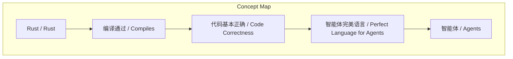
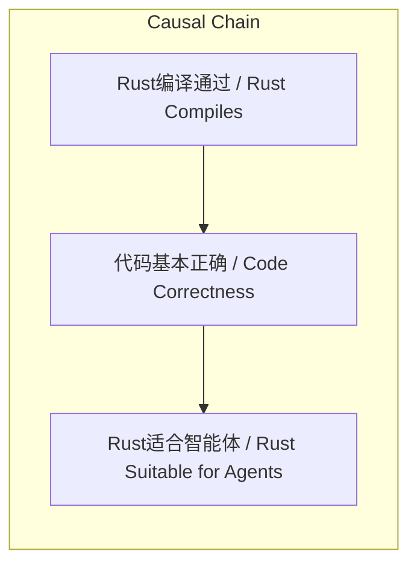

# NEWS/NEWS 任务报告

- agent: news/news
- requestId: 1772374678911-uk7f4q
- 生成时间(UTC): 2026-03-01T14:18:40.935Z

## 链接总结

- URL: https://x.com/gdb/status/2007228511363444905

# Rust语言被视为智能体开发的理想选择

## 整体结构化文档表达
### 文档卡片
- 主题（中文/English）：Rust语言与智能体开发 / Rust Language and Agent Development
- 一句话摘要：Greg Brockman基于Rust编译时特性，评价其为智能体开发的完美语言。
- 目标读者：对编程语言选择、人工智能/智能体开发感兴趣的技术人员与研究者。
- 核心结论（3条）：
  1. Greg Brockman明确评价Rust是智能体开发的完美语言。
  2. 该评价的核心依据是Rust的编译特性：代码编译通过即意味着基本正确。
  3. 该观点隐含了智能体开发对代码正确性的高要求。

### 内容结构树
1. 背景与问题定义：未提及
2. 核心观点与关键证据：核心观点为“Rust是智能体的完美语言”；关键证据为“if it compiles it's ~correct”。
3. 方法/机制/路径：未提及具体开发方法或技术路径。
4. 风险与边界条件：未提及。
5. 结论与行动建议：未提供具体行动建议。

### 结构化元数据（JSON）
```json
{
  "title": "Rust语言被视为智能体开发的理想选择",
  "topic_zh": "Rust语言与智能体开发",
  "topic_en": "Rust Language and Agent Development",
  "audience": "对编程语言选择、人工智能/智能体开发感兴趣的技术人员与研究者",
  "claims": [
    "Rust是智能体开发的完美语言",
    "Rust编译通过即意味着代码基本正确"
  ],
  "evidence": [
    "原文直接引述：'if it compiles it's ~correct'"
  ],
  "risks": [],
  "actions": []
}
```

## 处理流程
1. 输入识别：来源为X平台（原Twitter）单条帖子，作者Greg Brockman，内容为对Rust语言的评价。
2. 信息抽取：实体（Greg Brockman、Rust）、概念（agents、language、compiles、correct、perfect）、观点（Rust适合智能体因编译即正确）。
3. 结构化归纳：观点基于Rust编译时保证正确性的机制，推断其适用于智能体开发。
4. 关系建模：Rust编译成功 → 代码基本正确 → 语言适合智能体开发。
5. 可视化表达：见下文Mermaid图。

## 概念清单（中英文）
- Rust / Rust
- agents / 智能体
- language / 语言
- compiles / 编译
- correct / 正确
- perfect / 完美

## 概念定义（中英文）
- Rust / Rust：未提及明确技术定义（原文仅作为专有名词出现）。
- agents / 智能体：未提及明确技术定义（原文指代不明，可能指AI agents或自主软件实体）。
- language / 语言：未提及明确技术定义（在上下文中指编程语言）。
- compiles / 编译：代码通过编译器检查的过程（基于“if it compiles”推断）。
- correct / 正确：代码无错误、符合预期（基于“it's ~correct”推断，波浪线表示近似）。
- perfect / 完美：完全适合、无缺陷（基于“perfect language”推断）。

## 概念关联与逻辑关系（中英文）
1. Rust编译成功 / Rust Compilation Success 导致 代码基本正确 / Code Correctness（依据：if it compiles it's ~correct）
2. 代码基本正确 / Code Correctness 导致 Rust是智能体的完美语言 / Rust is a Perfect Language for Agents（依据：given that引导的因果关系）
3. Rust是智能体的完美语言 / Rust is a Perfect Language for Agents 基于 代码基本正确 / Code Correctness（依据：评价的支撑条件）

## COT逻辑梳理（定义/分类/比较/因果/科学方法论）
- Step 1（定义）：基于原文，定义核心概念：Rust（编程语言）、agents（智能体）、compiles（编译通过）、correct（代码正确）、perfect（完美适用）。
- Step 2（分类）：未提及对Rust或agents的具体分类。
- Step 3（比较）：未提及与其他编程语言的比较。
- Step 4（因果）：因Rust编译通过能保证代码基本正确（if it compiles it's ~correct），故Rust是智能体开发的完美语言（rust is a perfect language for agents）。
- Step 5（科学方法论）：未提及具体研究方法或实验证据，观点为主观评价。

## 事实与看法（病毒）
### 事实
- Greg Brockman于2026年1月2日23:12在X平台发布帖子。
- 帖子内容为：“rust is a perfect language for agents, given that if it compiles it's ~correct”。
- 该帖子获得150万次浏览。
### 看法
- Rust是智能体开发的完美语言。
- Rust代码编译通过即意味着其基本正确。

## FAQ（原文问题整理）
- 未发现明确提问。

## Visualization
### Mermaid 图 1（概念结构图）


### Mermaid 图 2（逻辑/因果图）


## 文章中的类比
- 未发现明确类比。

## 10个金句
1. "rust is a perfect language for agents, given that if it compiles it's ~correct"
2. 原文未提供
3. 原文未提供
4. 原文未提供
5. 原文未提供
6. 原文未提供
7. 原文未提供
8. 原文未提供
9. 原文未提供
10. 原文未提供
