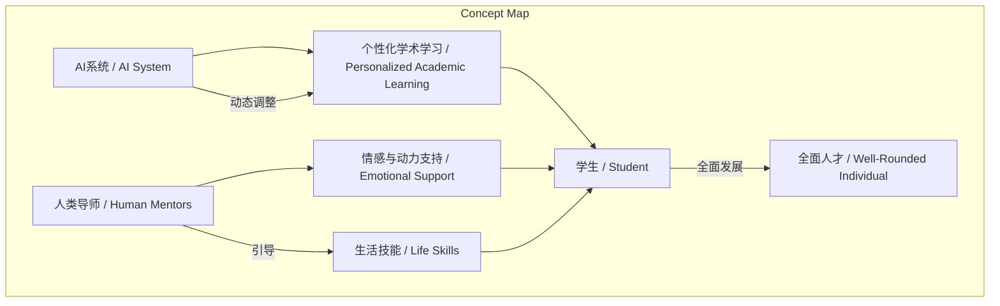
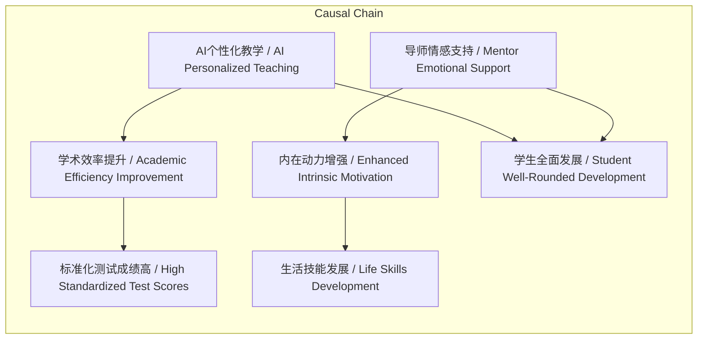

# NEWS/NEWS 任务报告

- agent: news/news
- requestId: 1772407108469-xckivc
- 生成时间(UTC): 2026-03-01T23:19:19.494Z

## 文本总结

# AI与导师协作：Alpha School的个性化教育实验

## 整体结构化文档表达
### 文档卡片
- 主题（中文/English）：AI驱动的个性化教育模式 / AI-Driven Personalized Education Model
- 一句话摘要：Alpha School通过AI系统进行个性化学术学习，人类导师转向情感与生活技能培养，实现人机协作的教育实验。
- 目标读者：教育工作者、家长、教育政策制定者、教育科技研究者
- 核心结论（3条）：
  1. AI系统能显著提升学术学习效率，实现掌握式学习。
  2. 人类导师角色转变为情感支持与生活技能引导者。
  3. 人机协作模式旨在培养学生全面发展的能力。

### 内容结构树
1. 背景与问题定义：传统“一刀切”课堂教学效率低下，无法满足每个学生的独特需求。
2. 核心观点与关键证据：AI担任个性化家教，学生每天2小时高效学习；导师专注人文关怀与生活技能；学校声称学习效率是传统两倍，标准化测试全国顶尖。
3. 方法/机制/路径：AI动态调整学习内容与难度，确保掌握式学习；导师提供情感支持、建立深层连接；下午时间用于生活技能项目。
4. 风险与边界条件：未提及（原文未讨论潜在风险或限制）。
5. 结论与行动建议：该模式重新定义学校意义，但未提供具体行动建议。

### 结构化元数据（JSON）
```json
{
  "title": "AI与导师协作：Alpha School的个性化教育实验",
  "topic_zh": "AI驱动的个性化教育模式",
  "topic_en": "AI-Driven Personalized Education Model",
  "audience": "教育工作者、家长、教育政策制定者、教育科技研究者",
  "claims": [
    "AI系统能显著提升学术学习效率，实现掌握式学习。",
    "人类导师角色转变为情感支持与生活技能引导者。",
    "人机协作模式旨在培养学生全面发展的能力。"
  ],
  "evidence": [
    "学生每天仅需约2小时通过AI系统进行核心学科学习。",
    "AI系统根据学生水平动态调整内容，确保掌握式学习。",
    "学校声称学习效率是传统学校的两倍，标准化测试成绩全国顶尖。",
    "导师不负责讲课，专注于情感支持、动力培养和建立深层连接。",
    "下午时间用于生活技能培养，如领导力、团队合作、创业等。"
  ],
  "risks": [],
  "actions": ["未提及"]
}
```

## 处理流程
1. 输入识别：识别出文本描述Alpha School的教育模式，核心是AI与人类导师协作。
2. 信息抽取：抽取实体（Alpha School、AI系统、导师、学生）、概念（个性化学习、掌握式学习、生活技能）、问题（传统课堂效率低）、观点（效率提升、角色转变）。
3. 结构化归纳：将内容归纳为背景、核心观点、方法、风险、结论五个部分。
4. 关系建模：建立AI系统与学术学习、导师与生活技能、人机协作与全面发展的逻辑关系。
5. 可视化表达：设计Mermaid图展示概念结构和因果链。

## 概念清单（中英文）
- Alpha School / Alpha School
- AI驱动的个性化学术学习 / AI-Driven Personalized Academic Learning
- 传统课堂 / Traditional Classroom
- 家教 / Tutor
- 掌握式学习 / Mastery Learning
- 人类导师 / Human Mentors
- 引导员 / Guides
- 情感与动力支持 / Emotional and Motivational Support
- 生活技能 / Life Skills
- Alpha X项目 / Alpha X Project
- 人机协作 / Human-AI Collaboration
- 标准化测试 / Standardized Tests
- 全国顶尖成绩 / National Top Scores

## 概念定义（中英文）
- Alpha School / Alpha School：一所总部位于美国得克萨斯州奥斯汀的创新型私立学校网络。
- AI驱动的个性化学术学习 / AI-Driven Personalized Academic Learning：利用人工智能系统根据学生当前水平、优势和薄弱点动态调整学习内容和难度，实现一对一辅导的教学方式。
- 传统课堂 / Traditional Classroom：采用“一刀切”教学模式的课堂教学，效率低下且无法满足个性化需求。
- 家教 / Tutor：指AI系统在Alpha School中扮演的角色，提供个性化学术辅导。
- 掌握式学习 / Mastery Learning：学生必须完全掌握一个知识点后才能进入下一阶段的学习方式，确保无知识断层。
- 人类导师 / Human Mentors：在Alpha School中，传统教师被重新定义为导师，不负责讲课，专注于情感支持和能力培养。
- 引导员 / Guides：与导师类似，指人类在AI无法替代的领域引导学生。
- 情感与动力支持 / Emotional and Motivational Support：导师的核心工作，包括激发内在动力、培养成长型思维、提供情感鼓励。
- 生活技能 / Life Skills：涵盖领导力、团队合作、公共演讲、创业、编程、艺术、户外探索等，旨在培养适应未来世界的能力。
- Alpha X项目 / Alpha X Project：学生进行奥林匹克级别项目追求的实践平台，用于探索深层兴趣和热情。
- 人机协作 / Human-AI Collaboration：AI负责传授知识，人类负责点燃火花，共同重塑教育。
- 标准化测试 / Standardized Tests：用于评估学生学术水平的统一考试。
- 全国顶尖成绩 / National Top Scores：学校声称学生在标准化测试中取得的优异成绩。

## 概念关联与逻辑关系（中英文）
1. AI系统动态调整学习内容 → 学生知识点掌握程度提升（AI个性化教学 / AI Personalized Teaching → 学术效率提升 / Academic Efficiency Improvement）
2. 导师提供情感与动力支持 → 学生内在动力增强（导师情感支持 / Mentor Emotional Support → 内在动力增强 / Enhanced Intrinsic Motivation）
3. AI学术学习 ∧ 生活技能培养 → 学生全面发展（人机协作 / Human-AI Collaboration → 全面人才 / Well-Rounded Individual）

## COT逻辑梳理（定义/分类/比较/因果/科学方法论）
- Step 1: 定义问题：传统课堂采用“一刀切”模式，效率低下，无法满足学生独特需求。
- Step 2: 分类解决方案：将教育过程分为学术学习和生活技能培养两部分，分别由AI和人类导师负责。
- Step 3: 比较人机优势：AI擅长基于数据的知识传授和动态调整，人类擅长情感关怀、动机激发和创造性引导。
- Step 4: 因果分析：AI的个性化教学导致学习效率提升（声称两倍）和扎实学术基础；导师的支持导致学生动力提升和深层连接；两者结合共同促进学术能力和生活技能全面发展。
- Step 5: 科学方法论：通过AI系统收集学生数据，实时调整学习路径；导师通过观察和互动提供非学术支持；整体模式依赖实证测试成绩验证效果。

## 事实与看法（病毒）
### 事实
- Alpha School总部位于美国得克萨斯州奥斯汀。
- 学生每天约2小时通过AI系统学习核心学科（数学、阅读等）。
- AI系统根据学生水平动态调整学习内容和难度。
- 学生必须完全掌握一个知识点后才能进入下一阶段。
- 导师不负责讲课或批改作业，专注于情感支持和建立关系。
- 下午时间用于生活技能培养，包括领导力、团队合作等项目。
- 学校声称学习效率是传统学校的两倍。
- 在标准化测试中能取得全国顶尖的成绩。

### 看法
- 传统“一刀切”课堂教学效率低下。
- AI担任“家教”实现真正的一对一个性化辅导。
- 导师能将精力集中在与学生建立有意义的关系上。
- 这种模式是“人机协作”的教育实验。
- 让AI做它最擅长的“传授知识”，让人做它最擅长的“点燃火花”。
- 重新定义学校的意义和学习的未来。

## FAQ（原文问题整理）
未发现明确提问（原文未以问题形式呈现）。

## Visualization
### Mermaid 图 1（概念结构图）


### Mermaid 图 2（逻辑/因果图）


## 文章中的类比
未发现明确类比。

## 10个金句
1. 利用AI实现极致的个性化学习
2. 将学生从传统课堂中解放出来
3. AI担任“家教”
4. 掌握式学习：学生必须完全掌握一个知识点后才能进入下一阶段
5. 人类导师的角色转变
6. 导师的核心工作是激发学生的内在动力
7. 专注于生活技能的培养
8. 让AI做它最擅长的“传授知识”，让人做它最擅长的“点燃火花”
9. 重新定义学校的意义和学习的未来
10. 学习效率是传统学校的两倍
