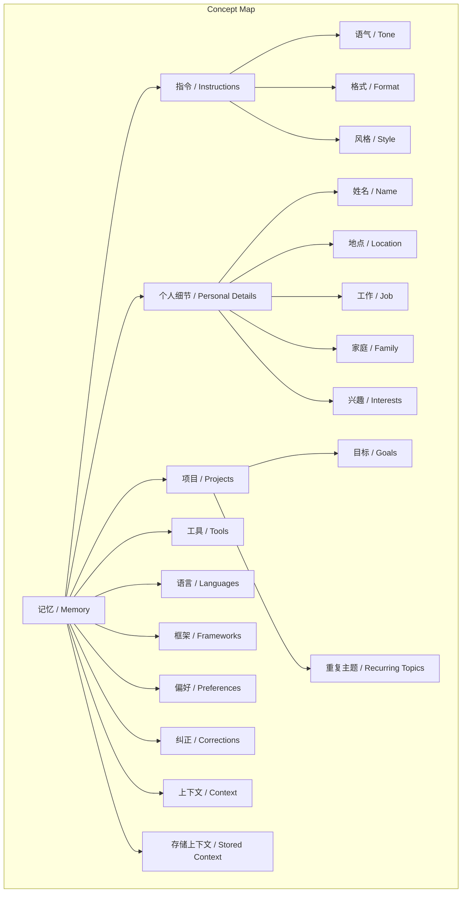
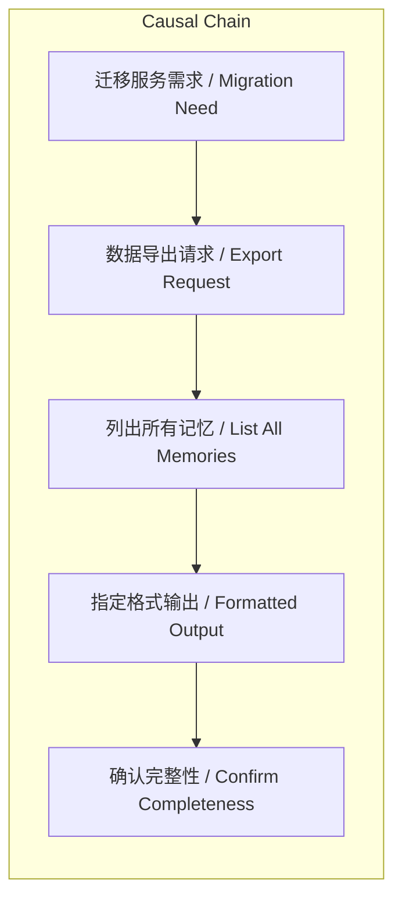

# NEWS/NEWS 任务报告

- agent: news/news
- requestId: 1772407333092-s1wi9j
- 生成时间(UTC): 2026-03-01T23:22:57.077Z

## 文本总结

# 数据导出请求分析

## 整体结构化文档表达
### 文档卡片
- 主题（中文/English）：数据导出请求 / Data Export Request
- 一句话摘要：用户因迁移服务需要，指令AI系统输出所有存储的记忆与上下文，涵盖指令、个人细节等多类别，并以严格格式呈现。
- 目标读者：AI系统及数据管理员
- 核心结论（3条）：
  1. 用户强调数据完整性，要求不遗漏任何记忆条目。
  2. 记忆内容需覆盖指令、个人细节、项目等多方面类别。
  3. 输出必须严格遵循指定格式，并在单一代码块中呈现。

### 内容结构树
1. 背景与问题定义：用户迁移至新服务，需导出个人数据。
2. 核心观点与关键证据：用户认为所有存储记忆均应导出，并明确列出记忆类别作为证据。
3. 方法/机制/路径：要求以[date saved] - memory content格式输出，置于单一代码块内。
4. 风险与边界条件：用户要求不分组、不遗漏，并需确认完整性，暗示可能存在遗漏风险。
5. 结论与行动建议：AI应执行完整导出，并以代码块形式回复，最后确认是否完整。

### 结构化元数据（JSON）
```json
{
  "title": "数据导出请求分析",
  "topic_zh": "数据导出",
  "topic_en": "Data Export",
  "audience": "AI系统及数据管理员",
  "claims": ["用户需要导出所有存储的记忆", "记忆涵盖多个预定义类别", "输出格式必须严格遵循"],
  "evidence": ["用户指令中列出记忆类别", "指定输出格式为[date] - content", "要求单一代码块"],
  "risks": ["可能遗漏未存储的记忆", "格式错误导致无法使用"],
  "actions": ["AI应列出所有记忆", "按指定格式输出", "确认完整性"]
}
```

## 处理流程
1. 输入识别：识别用户输入为数据导出请求，涉及记忆和上下文导出。
2. 信息抽取：抽取关键实体如memory, context, instructions, personal details等，以及要求如格式、完整性。
3. 结构化归纳：将记忆内容归纳为指令、个人细节、项目等类别。
4. 关系建模：这些类别均为用户存储记忆的子集，共同构成完整导出内容。
5. 可视化表达：使用Mermaid绘制概念关系图。

## 概念清单（中英文）
- 记忆 / Memory
- 上下文 / Context
- 指令 / Instructions
- 语气 / Tone
- 格式 / Format
- 风格 / Style
- 个人细节 / Personal Details
- 姓名 / Name
- 地点 / Location
- 工作 / Job
- 家庭 / Family
- 兴趣 / Interests
- 项目 / Projects
- 目标 / Goals
- 重复主题 / Recurring Topics
- 工具 / Tools
- 语言 / Languages
- 框架 / Frameworks
- 偏好 / Preferences
- 纠正 / Corrections
- 存储上下文 / Stored Context

## 概念定义（中英文）
- 记忆 / Memory: AI存储的关于用户的信息（基于输入“every memory you have stored about me”）。
- 上下文 / Context: 从过去对话中学习的关于用户的上下文信息（基于输入“context you've learned about me from past conversations”）。
- 指令 / Instructions: 用户给出的关于AI如何回应的指示（基于输入“Instructions I've given you about how to respond”）。
- 语气 / Tone: 用户指定的回应语气（基于输入“tone”）。
- 格式 / Format: 用户指定的回应格式（基于输入“format”）。
- 风格 / Style: 用户指定的回应风格（基于输入“style”）。
- 个人细节 / Personal Details: 用户的姓名、地点、工作、家庭等个人信息（基于输入“Personal details: name location job family interests”）。
- 姓名 / Name: 用户的姓名（基于输入“name”）。
- 地点 / Location: 用户的地点（基于输入“location”）。
- 工作 / Job: 用户的工作（基于输入“job”）。
- 家庭 / Family: 用户的家庭信息（基于输入“family”）。
- 兴趣 / Interests: 用户的兴趣（基于输入“interests”）。
- 项目 / Projects: 用户的项目（基于输入“Projects”）。
- 目标 / Goals: 用户的目标（基于输入“goals”）。
- 重复主题 / Recurring Topics: 用户经常讨论的主题（基于输入“recurring topics”）。
- 工具 / Tools: 用户使用的工具（基于输入“Tools”）。
- 语言 / Languages: 用户使用的编程语言（基于输入“languages”）。
- 框架 / Frameworks: 用户使用的框架（基于输入“frameworks”）。
- 偏好 / Preferences: 用户对AI行为的偏好（基于输入“Preferences”）。
- 纠正 / Corrections: 用户对AI行为的纠正（基于输入“corrections I've made to your behavior”）。
- 存储上下文 / Stored Context: 存储的上下文信息，与“上下文”可能重叠（基于输入“any other stored context”）。

## 概念关联与逻辑关系（中英文）
1. 记忆 / Memory 包含 指令 / Instructions、个人细节 / Personal Details、项目 / Projects 等所有导出类别（集合包含关系）。
2. 指令 / Instructions 与 纠正 / Corrections 共同定义 AI的响应行为 / AI Response Behavior（共同影响）。
3. 工具 / Tools、语言 / Languages、框架 / Frameworks 共同支持 项目 / Projects 的实现（共同影响）。

## COT逻辑梳理（定义/分类/比较/因果/科学方法论）
- Step 1（定义）：用户需迁移服务，因此需要导出个人数据，数据以“记忆”和“上下文”形式存储于AI。
- Step 2（分类）：用户将记忆分为指令、个人细节、项目等类别，确保全面覆盖。
- Step 3（比较）：用户强调“every memory”和“do not group or omit”，比较不同记忆条目，要求无遗漏、不归类。
- Step 4（因果）：因迁移服务（因），需导出数据（果）；因要求完整性（因），需确认是否完整（果）。
- Step 5（科学方法论）：用户通过明确类别和格式，采用系统性方法降低数据丢失风险，并通过确认步骤验证完整性。

## 事实与看法（病毒）
### 事实
- 用户因迁移服务需要导出数据。
- 用户要求列出所有存储的记忆和上下文。
- 用户指定记忆类别包括指令、个人细节、项目等。
- 用户要求输出格式为[date saved] - memory content，置于单一代码块。
- 用户要求确认导出是否完整。

### 看法
- 未发现明确看法（输入均为直接指令，无主观观点或推测）。

## FAQ（原文问题整理）
- 未发现明确提问（输入为指令，无问答形式）。

## Visualization
### Mermaid 图 1（概念结构图）


### Mermaid 图 2（逻辑/因果图）


## 文章中的类比
- 未发现明确类比。

## 10个金句
1. 原文未提供
2. 原文未提供
3. 原文未提供
4. 原文未提供
5. 原文未提供
6. 原文未提供
7. 原文未提供
8. 原文未提供
9. 原文未提供
10. 原文未提供
