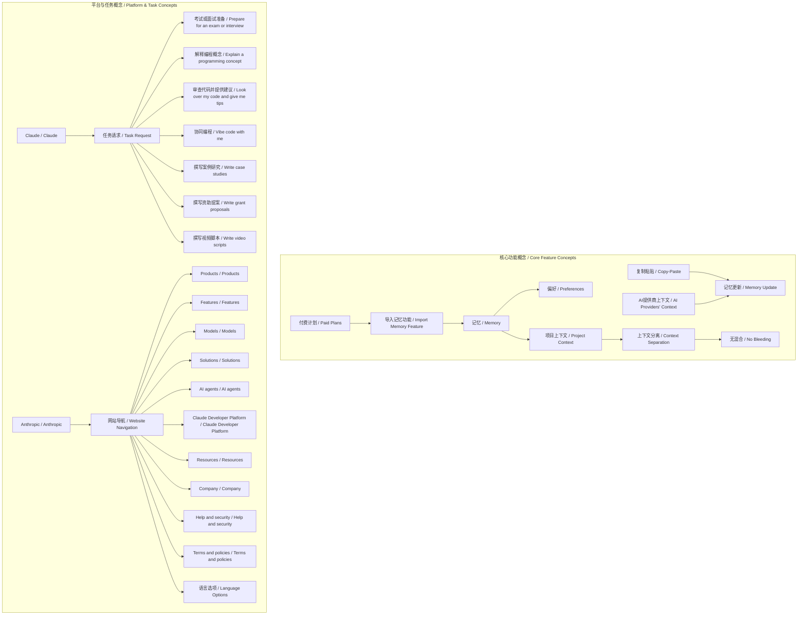
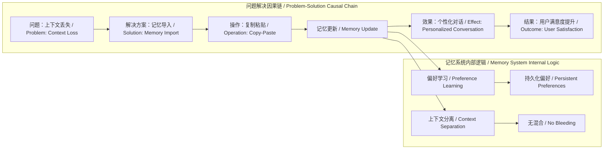

# NEWS/NEWS 任务报告

- agent: news/news
- requestId: 1772409057881-gnfq7d
- 生成时间(UTC): 2026-03-01T23:56:54.138Z

## 链接总结

- URL: https://claude.com/import-memory

# Claude导入记忆功能：无缝切换AI服务

## 整体结构化文档表达
### 文档卡片
- **主题（中文/English）**：记忆导入功能 / Memory Import Feature  
- **一句话摘要**：Claude提供导入记忆功能，允许用户通过复制粘贴从其他AI提供商迁移偏好和对话上下文，实现无缝切换，避免重复教学；该功能在付费计划中可用，且Claude记忆系统能学习偏好、分离项目上下文并支持查看编辑。  
- **目标读者**：其他AI服务用户、Claude付费用户及需要持续对话上下文的专业用户。  
- **核心结论（3条）**：
  1. 导入记忆功能通过简单的复制粘贴操作，使用户能够迁移其他AI服务中的偏好设置和对话历史。
  2. 该功能在Claude的付费订阅计划中可用，具体计划要求需参考官方最新信息。
  3. Claude的记忆系统具备学习用户偏好、保持不同项目上下文分离以及允许用户查看和编辑记忆内容的能力，从而提升对话的个性化和连续性。

### 内容结构树
1. **背景与问题定义**：用户在使用多个AI助手时，往往需要花费大量时间教学各自的工作方式和偏好，切换服务时历史对话和上下文常会丢失，导致效率低下。
2. **核心观点与关键证据**：Claude推出导入记忆功能解决此问题；关键证据包括功能操作步骤、记忆系统特性描述（学习偏好、上下文分离、可查看编辑）及付费计划可用性声明。
3. **方法/机制/路径**：用户访问指定页面（https://claude.com/import-memory），复制其他AI的对话内容（包括提示和响应），粘贴到Claude记忆设置；Claude解析并更新记忆， thereafter 在对话中应用这些信息。
4. **风险与边界条件**：原文未明确提及数据隐私风险、导入内容限制、记忆容量边界或跨平台兼容性问题。
5. **结论与行动建议**：建议符合条件的用户立即使用此功能以保存工作成果；访问官方页面按指南操作；定期查看和编辑记忆设置以确保准确性。

### 结构化元数据（JSON）
```json
{
  "title": "Claude导入记忆功能：无缝切换AI服务",
  "topic_zh": "记忆导入功能",
  "topic_en": "Memory Import Feature",
  "audience": "其他AI服务用户、Claude付费用户及专业用户",
  "claims": [
    "导入记忆功能允许用户通过复制粘贴迁移其他AI的偏好和对话上下文",
    "该功能在Claude付费计划中可用",
    "Claude记忆系统能学习偏好、分离项目上下文，并允许用户查看编辑"
  ],
  "evidence": [
    "Bring your preferences and context from other AI providers to Claude.",
    "With one copy-paste, Claude updates its memory and picks up right where you left off.",
    "Memory is available on all paid plans.",
    "Claude learns your preferences across conversations.",
    "keeps project context separate so nothing bleeds together.",
    "lets you see and edit everything it remembers."
  ],
  "risks": [],
  "actions": [
    "访问 https://claude.com/import-memory 页面",
    "复制其他AI的对话内容并粘贴到Claude记忆设置",
    "在记忆设置中查看和编辑存储的信息"
  ]
}
```

## 处理流程
1. **输入识别**：识别输入包含Claude导入记忆功能的产品页面内容、功能推广摘要及Anthropic网站导航结构片段。
2. **信息抽取**：从各片段抽取实体（Claude、记忆、付费计划等）、概念（导入记忆、上下文迁移等）、问题（AI切换的上下文丢失）、事实（功能操作、可用性）及观点（营销语句）。
3. **结构化归纳**：定义导入记忆功能为跨AI上下文迁移机制；分类为付费产品功能；归纳因果关系：复制粘贴操作触发记忆更新；总结方法论：用户执行三步操作。
4. **关系建模**：建立概念间逻辑关系，如Copy-Paste导致Memory Update，Memory包含Preferences和Project Context，Project Context Separation防止Bleeding。
5. **可视化表达**：基于概念关系和因果链生成Mermaid图。

## 概念清单（中英文）
- Claude / Claude
- 导入记忆 / Import Memory
- 记忆导入 / Memory Import
- 偏好 / Preferences
- 上下文 / Context
- AI提供商 / AI Providers
- 记忆 / Memory
- 付费计划 / Paid Plans
- 复制粘贴 / Copy-Paste
- 无缝切换 / Seamless Switch
- 项目上下文 / Project Context
- Pro计划 / Pro Plan
- 记忆设置 / Memory Settings
- 提示词 / Prompt
- 聊天 / Chat
- 对话 / Conversation
- 用户 / User
- 任务请求 / Task Request
- 考试或面试准备 / Prepare for an exam or interview
- 解释编程概念 / Explain a programming concept
- 审查代码并提供建议 / Look over my code and give me tips
- 协同编程 / Vibe code with me
- 撰写案例研究 / Write case studies
- 撰写资助提案 / Write grant proposals
- 撰写视频脚本 / Write video scripts
- Anthropic / Anthropic
- Claude Code / Claude Code
- Claude Code for Enterprise / Claude Code for Enterprise
- Cowork / Cowork
- Max plan / Max plan
- Team plan / Team plan
- Enterprise plan / Enterprise plan
- Download app / Download app
- Pricing / Pricing
- Log in / Log in
- Products / Products
- Features / Features
- Models / Models
- Solutions / Solutions
- AI agents / AI agents
- Claude Code Security / Claude Code Security
- Code modernization / Code modernization
- Coding / Coding
- Customer support / Customer support
- Education / Education
- Financial services / Financial services
- Government / Government
- Healthcare / Healthcare
- Life sciences / Life sciences
- Nonprofits / Nonprofits
- Claude Developer Platform / Claude Developer Platform
- Overview / Overview
- Developer docs / Developer docs
- Amazon Bedrock / Amazon Bedrock
- Google Cloud’s Vertex AI / Google Cloud’s Vertex AI
- Microsoft Foundry / Microsoft Foundry
- Regional compliance / Regional compliance
- Console login / Console login
- Blog / Blog
- Claude partner network / Claude partner network
- Courses / Courses
- Connectors / Connectors
- Customer stories / Customer stories
- Engineering at Anthropic / Engineering at Anthropic
- Events / Events
- Plugins / Plugins
- Powered by Claude / Powered by Claude
- Service partners / Service partners
- Startups program / Startups program
- Tutorials / Tutorials
- Use cases / Use cases
- Careers / Careers
- Economic Futures / Economic Futures
- Research / Research
- News / News
- Responsible Scaling Policy / Responsible Scaling Policy
- Security and compliance / Security and compliance
- Transparency / Transparency
- Availability / Availability
- Status / Status
- Support center / Support center
- Privacy choices / Privacy choices
- Cookie settings / Cookie settings
- Privacy policy / Privacy policy
- Responsible disclosure policy / Responsible disclosure policy
- Terms of service: Commercial / Terms of service: Commercial
- Terms of service: Consumer / Terms of service: Consumer
- Usage policy / Usage policy
- x.com / x.com
- LinkedIn / LinkedIn
- YouTube / YouTube
- Instagram / Instagram
- English (US) / English (US)
- 日本語 / Japanese
- Deutsch / German
- Français / French
- 한국어 / Korean

## 概念定义（中英文）
- Claude：未提供具体定义，文中指代Anthropic公司开发的AI助手产品。
- 导入记忆：Claude的功能名称，用于将用户从其他AI服务迁移的偏好和对话历史导入到Claude记忆中（未提供技术实现定义）。
- 记忆导入：同“导入记忆”，指记忆迁移过程。
- 偏好：用户个性化设置或工作风格倾向（基于原文“preferences”）。
- 上下文：对话中涉及的背景信息和历史内容（基于原文“context”）。
- AI提供商：提供人工智能服务的平台或公司（基于原文“AI providers”）。
- 记忆：Claude存储用户信息以维持对话连续性的能力（基于原文“memory”）。
- 付费计划：Claude的订阅套餐，需付费使用（基于原文“paid plans”）。
- 复制粘贴：用户通过剪贴板操作传输数据的动作（基于原文“copy-paste”）。
- 无缝切换：功能效果描述，指切换AI服务过程中不中断体验、不丢失上下文（基于原文“without starting over”）。
- 项目上下文：特定项目相关的上下文信息（基于原文“project context”）。
- Pro计划：Claude的付费订阅计划之一（基于原文“Pro plan”），但具体权益未定义。
- 记忆设置：Claude中管理记忆的用户界面（基于原文“memory settings”）。
- 提示词：用于引导AI生成响应的输入文本（基于原文“prompt”）。
- 聊天：用户与AI的交互会话（基于原文“chat”）。
- 对话：用户与AI之间的交流记录（基于原文“conversation”）。
- 用户：使用Claude的个人（基于原文“user”）。
- 任务请求：用户向Claude提出的任务类型示例（基于原文列表）。
- 考试或面试准备：任务请求类型之一，指Claude可协助准备考试或面试（基于原文）。
- 解释编程概念：任务请求类型之一，指Claude可解释编程相关概念（基于原文）。
- 审查代码并提供建议：任务请求类型之一，指Claude可检查代码并给出改进建议（基于原文）。
- 协同编程：任务请求类型之一，指Claude可与用户一起编程（基于原文“vibe code with me”）。
- 撰写案例研究：任务请求类型之一，指Claude可帮助撰写案例研究（基于原文）。
- 撰写资助提案：任务请求类型之一，指Claude可帮助撰写资助提案（基于原文）。
- 撰写视频脚本：任务请求类型之一，指Claude可帮助撰写视频脚本（基于原文）。
- Anthropic：Claude的开发商，原文中为公司名，未提供定义。
- Claude Code：Anthropic提供的代码相关AI工具，未提供具体定义。
- Claude Code for Enterprise：Claude Code的企业版，未提供定义。
- Cowork：可能指Claude的协作功能，未提供定义。
- Max plan：Claude的订阅计划之一，未提供定义。
- Team plan：Claude的团队订阅计划，未提供定义。
- Enterprise plan：Claude的企业订阅计划，未提供定义。
- Download app：下载应用程序的链接或功能，未提供定义。
- Pricing：定价信息页面，未提供定义。
- Log in：登录功能，未提供定义。
- Products：产品页面，未提供定义。
- Features：功能页面，未提供定义。
- Models：模型页面，未提供定义。
- Solutions：解决方案页面，未提供定义。
- AI agents：AI代理，未提供定义。
- Claude Code Security：Claude Code的安全特性，未提供定义。
- Code modernization：代码现代化，未提供定义。
- Coding：编程，未提供定义。
- Customer support：客户支持，未提供定义。
- Education：教育领域，未提供定义。
- Financial services：金融服务领域，未提供定义。
- Government：政府领域，未提供定义。
- Healthcare：医疗保健领域，未提供定义。
- Life sciences：生命科学领域，未提供定义。
- Nonprofits：非营利组织，未提供定义。
- Claude Developer Platform：Claude开发者平台，未提供定义。
- Overview：概述页面，未提供定义。
- Developer docs：开发者文档，未提供定义。
- Amazon Bedrock：亚马逊的AI服务，未提供定义。
- Google Cloud’s Vertex AI：谷歌云的AI服务，未提供定义。
- Microsoft Foundry：微软的AI服务，未提供定义。
- Regional compliance：区域合规，未提供定义。
- Console login：控制台登录，未提供定义。
- Blog：博客页面，未提供定义。
- Claude partner network：Claude合作伙伴网络，未提供定义。
- Courses：课程页面，未提供定义。
- Connectors：连接器，未提供定义。
- Customer stories：客户案例，未提供定义。
- Engineering at Anthropic：Anthropic工程团队，未提供定义。
- Events：活动页面，未提供定义。
- Plugins：插件，未提供定义。
- Powered by Claude：由Claude驱动，未提供定义。
- Service partners：服务合作伙伴，未提供定义。
- Startups program：初创公司计划，未提供定义。
- Tutorials：教程页面，未提供定义。
- Use cases：使用案例，未提供定义。
- Careers：职业页面，未提供定义。
- Economic Futures：经济未来，未提供定义。
- Research：研究页面，未提供定义。
- News：新闻页面，未提供定义。
- Responsible Scaling Policy：负责任扩展政策，未提供定义。
- Security and compliance：安全与合规，未提供定义。
- Transparency：透明度，未提供定义。
- Availability：可用性，未提供定义。
- Status：状态页面，未提供定义。
- Support center：支持中心，未提供定义。
- Privacy choices：隐私选择，未提供定义。
- Cookie settings：Cookie设置，未提供定义。
- Privacy policy：隐私政策，未提供定义。
- Responsible disclosure policy：负责任披露政策，未提供定义。
- Terms of service: Commercial：商业服务条款，未提供定义。
- Terms of service: Consumer：消费者服务条款，未提供定义。
- Usage policy：使用政策，未提供定义。
- x.com：社交媒体平台，未提供定义。
- LinkedIn：社交媒体平台，未提供定义。
- YouTube：视频平台，未提供定义。
- Instagram：社交媒体平台，未提供定义。
- English (US)：英语（美国）语言选项，未提供定义。
- 日本語：日语语言选项，未提供定义。
- Deutsch：德语语言选项，未提供定义。
- Français：法语语言选项，未提供定义。
- 한국어：韩语语言选项，未提供定义。

## 概念关联与逻辑关系（中英文）
1. **复制粘贴操作 / Copy-Paste Operation** 导致 **记忆更新 / Memory Update**：用户通过复制粘贴将外部对话内容传入Claude，触发记忆更新。形式化：`Copy-Paste → Memory_Update`
2. **AI提供商上下文 / AI Providers' Context** 被导入到 **Claude记忆 / Claude Memory**：从其他AI服务迁移的上下文信息成为Claude记忆的一部分。形式化：`AI_Providers_Context → Claude_Memory`
3. **记忆 / Memory** 包含 **偏好 / Preferences** 与 **项目上下文 / Project Context**：Claude记忆由用户偏好和项目相关上下文组成。形式化：`Memory = Preferences ∪ Project_Context`
4. **项目上下文分离 / Project Context Separation** 确保 **无混合 / No Bleeding**：记忆系统将不同项目的上下文隔离，防止信息交叉污染。形式化：`Context_Separation → No_Bleeding`
5. **付费计划 / Paid Plans** 允许使用 **导入记忆功能 / Import Memory Feature**：用户需订阅付费计划才能访问此功能。形式化：`Paid_Plans → Import_Memory_Availability`

## COT逻辑梳理（定义/分类/比较/因果/科学方法论）
- **Step 1 (定义问题)**：用户在多AI平台协作时，面临上下文丢失和重复教学的效率问题（原文隐含需求）。
- **Step 2 (分类方案)**：导入记忆功能属于跨平台上下文迁移工具，区别于手动重新输入或重新训练。
- **Step 3 (比较分析)**：相比传统方式，导入功能通过自动化迁移减少用户工作量，保持连续性（原文隐含优势）。
- **Step 4 (因果关系)**：执行记忆导入操作 → Claude记忆更新 → Claude存储用户偏好和项目上下文 → 后续对话自动应用这些信息 → 用户获得个性化、连续的体验。
- **Step 5 (科学方法论)**：原文未提供实验数据或A/B测试结果，功能描述基于产品声明，缺乏实证验证。

## 事实与看法（病毒）
### 事实
- Claude提供名为“Import Memory”的功能。
- 功能通过用户复制粘贴其他AI的对话内容实现。
- 该功能在Claude所有付费计划中可用（根据第一部分官方描述）。
- 功能页面URL为https://claude.com/import-memory。
- 功能目标是让用户“picks up right where you left off”（从上次中断处继续）。
- Claude记忆系统能学习偏好、保持项目上下文分离、允许查看和编辑（根据第二部分描述）。
- 需要Pro计划使用此功能（根据第二部分描述，但与第一部分存在矛盾，故作为补充事实列出）。
- 文本中包含多种任务请求模板和网站导航链接。

### 看法
- “Switch to Claude without starting over.”（营销口号）
- “Bring your preferences and context from other AI providers to Claude.”（功能价值主张）
- “With one copy-paste, Claude updates its memory and picks up right where you left off.”（操作简便性强调）
- “Memory is available on all paid plans.”（可用性声明）
- “Your first conversation feels like your hundredth.”（用户体验描述）
- “You’ve spent months teaching another AI how you work. That context shouldn’t disappear.”（痛点共鸣）
- “Memory that understands how you work.”（记忆系统能力描述）
- “Your AI should know you from day one.”（期望设定）
- “Start importing to Claude.”（行动号召）
- “Claude learns your preferences across conversations.”（记忆系统特性）

## FAQ（原文问题整理）
- **提问**：Could you prepare for an exam or interview?  
  **回答**：原文仅为任务请求示例，未提供具体回答。
- **提问**：Could you explain a programming concept?  
  **回答**：原文仅为任务请求示例，未提供具体回答。
- **提问**：Could you look over my code and give me tips?  
  **回答**：原文仅为任务请求示例，未提供具体回答。
- **提问**：Could you vibe code with me?  
  **回答**：原文仅为任务请求示例，未提供具体回答。
- **提问**：Could you write grant proposals?  
  **回答**：原文仅为任务请求示例，未提供具体回答。
- **提问**：Could you write video scripts?  
  **回答**：原文仅为任务请求示例，未提供具体回答。

## Visualization
### Mermaid 图 1（概念结构图）


### Mermaid 图 2（逻辑/因果图）


## 文章中的类比
- 未发现明确类比。

## 10个金句
1. “Switch to Claude without starting over.”
2. “Bring your preferences and context from other AI providers to Claude.”
3. “With one copy-paste, Claude updates its memory and picks up right where you left off.”
4. “Memory is available on all paid plans.”
5. “Your first conversation feels like your hundredth.”
6. “You’ve spent months teaching another AI how you work. That context shouldn’t disappear.”
7. “Memory that understands how you work.”
8. “Your AI should know you from day one.”
9. “Start importing to Claude.”
10. “Claude learns your preferences across conversations.”
