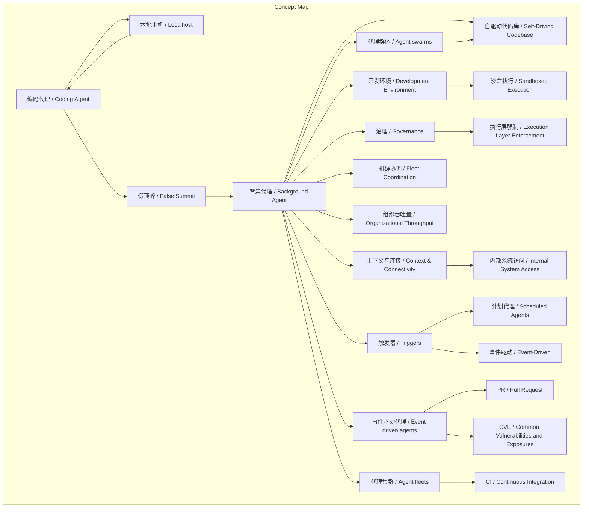
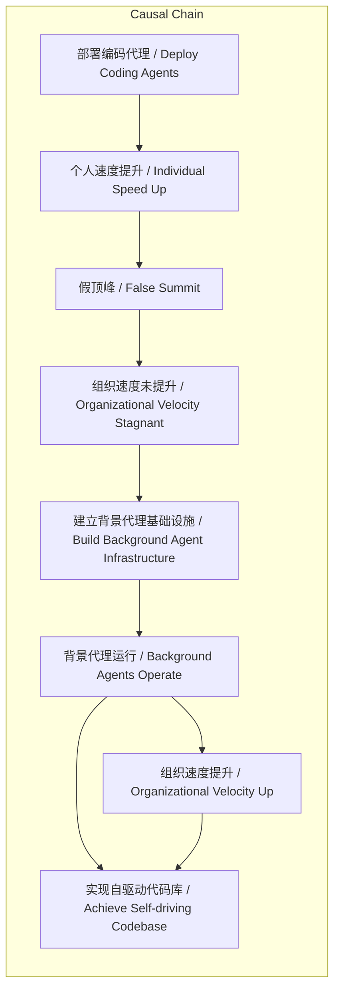

# NEWS/NEWS 任务报告

- agent: news/news
- requestId: 1772554684151-eohrbg
- 生成时间(UTC): 2026-03-03T16:20:03.379Z

## 链接总结

- URL: https://background-agents.com/

# 背景代理：实现自驱动代码库的路径与方法

## 整体结构化文档表达
### 文档卡片
- 主题（中文/English）：背景代理与自驱动代码库 / Background Agents and Self-Driving Codebase
- 一句话摘要：本文剖析当前编码代理模式导致的“假顶峰”问题，提出通过云原生背景代理实现自驱动代码库的路径，强调基础设施原语（开发环境、治理、连接、触发器、机群协调）的必要性，并阐述背景代理的事件驱动、集群、群体三种形态及其在自动化任务中的应用。
- 目标读者：工程领导者、技术决策者、DevOps实践者
- 核心结论（3条）：
  1. 个人编码代理效率提升未转化为组织速度，形成“假顶峰”陷阱，根源在于本地运行与旧流程不兼容。
  2. 背景代理需在云中独立环境运行，与工程师工作站解耦，通过事件驱动、集群、群体三种形态异步、大规模执行任务。
  3. 实现背景代理需五大基础设施原语：沙盒化开发环境、执行层治理、内部系统连接、事件驱动触发器、机群协调。

### 内容结构树
1. 背景与问题定义：软件开发设计基于人类键盘约束，编码代理提升个人效率但旧流程无法吸收，导致DORA指标持平、待办事项增长，形成“假顶峰”；同时存在PR审查积压等组织瓶颈。
2. 核心观点与关键证据：背景代理定义（云中独立环境运行，无需工程师机器与注意力）；三种形态（事件驱动响应系统事件、集群跨仓库并行、群体协作交付）；证据包括Stripe Minions、Ramp实践、CI迁移、CVE修复等用例。
3. 方法/机制/路径：背景代理原语——开发环境（完整环境或远程沙盒）、治理（执行层强制而非提示）、上下文连接（内部系统访问）、触发器（自动化信号如计划、webhook）、机群协调；结合三种形态应用于高容量任务（依赖更新、lint扫描）。
4. 风险与边界条件：无执行层治理则安全风险，安全团队否决；沙盒无法连接内部系统则无效；本地运行对专业工程不可持续；未提及其他具体风险。
5. 结论与行动建议：必须解耦工程师与工作站；建立背景代理基础设施；从计划代理等简单触发器开始，逐步扩展至全SDLC；工程师角色从“在环”执行转向“_on_环”监督。

### 结构化元数据（JSON）
```json
{
  "title": "背景代理：实现自驱动代码库的路径与方法",
  "topic_zh": "背景代理与自驱动代码库",
  "topic_en": "Background Agents and Self-Driving Codebase",
  "audience": "工程领导者、技术决策者、DevOps实践者",
  "claims": [
    "个人编码代理效率提升未转化为组织速度，形成假顶峰",
    "背景代理需在云中独立环境运行，与工程师工作站解耦",
    "实现背景代理需五大原语：开发环境、治理、上下文连接、触发器、机群协调",
    "背景代理通过事件驱动、集群、群体三种形态实现自动化与并行处理",
    "应用背景代理能显著提升组织级吞吐量，解决代码审查积压等瓶颈"
  ],
  "evidence": [
    "Stripe的Minions平台和Ramp的背景代理实践",
    "部署编码代理后DORA指标持平，待办事项增长",
    "背景代理对比表显示运行位置、触发方式等差异",
    "开发环境需完整工具链和测试套件，两种模式选择",
    "治理需在 execution layer 强制执行，如 deny lists 和 scoped credentials",
    "触发器包括计划代理，按时间触发；也可由PR、CVE、webhook触发",
    "代理集群可跨500个仓库并行执行同一任务",
    "代理群体协作完成单一交付物，如通过一条短信触发",
    "背景代理在CI迁移、CVE修复、COBOL迁移等场景中应用",
    "背景代理在PR审查前自动审查，使人类reviewer聚焦设计"
  ],
  "risks": [
    "无执行层治理导致安全风险，安全团队否决",
    "沙盒无法访问内部系统则无法完成真实工作",
    "本地运行模式对专业工程不可持续，仅适合indie-hackers"
  ],
  "actions": [
    "建立云原生开发环境基础设施",
    "实施执行层治理机制，如 deny lists 和 scoped credentials",
    "确保代理可访问内部系统 via IAM roles",
    "部署自动化触发器，如计划代理和事件驱动",
    "从简单场景（如计划代理）开始，逐步扩展到全SDLC",
    "识别组织瓶颈（如调查开发者、映射时间消耗）",
    "应用背景代理于高容量任务（依赖更新、lint扫描、覆盖率强制）"
  ]
}
```

## 处理流程
1. 输入识别：来源为网页正文 (https://background-agents.com/)，内容关于自驱动代码库与背景代理，包含两篇相关文章。
2. 信息抽取：抽取实体（Stripe、Ramp、PR、CVE、CI）、概念（背景代理、假顶峰、开发环境、治理、触发器、事件驱动、集群、群体）、问题（假顶峰、组织瓶颈）、事实（DORA指标持平、待办事项增长、代理形态例子）、观点（必须解耦、工程师角色转变）。
3. 结构化归纳：归纳定义（背景代理、编码代理）、分类（代理三种形态、开发环境两种模式）、比较（编码代理vs背景代理）、因果（假顶峰原因与解决）、方法论（五大原语与形态应用）。
4. 关系建模：建立概念关系，如编码代理与本地主机结合导致假顶峰；背景代理（通过形态）提升组织吞吐量；开发环境与治理共同确保安全部署。
5. 可视化表达：使用Mermaid绘制概念结构图（展示背景代理及其原语、形态，与假顶峰的关联）和逻辑因果图（展示从问题到解决方案的因果链）。

## 概念清单（中英文）
- 自驱动代码库 / Self-Driving Codebase
- 背景代理 / Background Agent / Background Agents
- 编码代理 / Coding Agent
- 假顶峰 / False Summit
- 开发环境 / Development Environment
- 沙盒执行 / Sandboxed Execution
- 治理 / Governance
- 上下文与连接 / Context & Connectivity
- 触发器 / Triggers
- 计划代理 / Scheduled Agents
- DORA指标 / DORA Metrics
- 本地主机 / Localhost
- 工程领导者 / Engineering Leader
- SDLC / Software Development Life Cycle
- 异步任务 / Asynchronous Task
- VM / Virtual Machine
- dev container / Development Container
- 测试套件 / Test Suite
- 数据库 / Databases
- 内部网络访问 / Internal Network Access
- IAM角色 / IAM Roles
- webhooks / Webhooks
- Slack / Slack
- Linear / Linear
- 机群协调 / Fleet Coordination
- 事件驱动代理 / Event-driven agents
- 代理集群 / Agent fleets
- 代理群体 / Agent swarms
- PR / Pull Request
- CVE / Common Vulnerabilities and Exposures
- CI / Continuous Integration
- TDD / Test-Driven Development
- 代码审查 / Code review
- 审查队列 / Review queues
- 组织吞吐量 / Organizational throughput
- 瓶颈 / Bottlenecks
- 编排 / Orchestration

## 概念定义（中英文）
- 自驱动代码库：能够自主运行、无需人工持续干预的软件开发系统 / A software development system that operates autonomously without continuous human intervention.
- 背景代理：在云中独立环境运行的代理，无需工程师机器和注意力，异步执行任务 / An agent that runs in a cloud-based isolated environment, requiring neither the engineer's machine nor attention, executing tasks asynchronously.
- 编码代理：需要本地机器和人工干预的代理，通常用于辅助编码 / An agent that requires local machine and human intervention, typically for coding assistance.
- 假顶峰：个人效率提升未带来组织速度提升的现象，导致待办事项增长 / A phenomenon where individual productivity gains do not translate to organizational speedup, leading to backlog growth.
- 开发环境：代理运行所需的完整计算环境，包括工具链、测试套件、数据库等 / The complete computing environment required for an agent to run, including toolchain, test suite, databases, etc.
- 沙盒执行：在隔离环境中执行代码，以控制风险和暴露 / Execution of code in an isolated environment to control risks and exposures.
- 治理：对代理的权限、审计、命令阻塞的系统控制 / System controls over agent permissions, audit trails, and command blocking.
- 上下文与连接：代理访问内部系统如数据库、API、注册表的能力 / The ability of agents to access internal systems such as databases, APIs, and registries.
- 触发器：启动代理执行的自动化信号，如计划、webhook、消息 / Automated signals that initiate agent execution, such as schedules, webhooks, messages.
- 计划代理：按固定时间表触发的代理 / Agents triggered on a fixed schedule.
- DORA指标：衡量软件交付性能的指标，如部署频率、变更前置时间等 / Metrics for software delivery performance, such as deployment frequency, lead time for changes.
- 本地主机：工程师本地机器，传统编码代理运行环境 / The engineer's local machine, traditional environment for coding agents.
- 工程领导者：负责工程团队和流程的管理者 / Managers responsible for engineering teams and processes.
- SDLC：软件开发生命周期 / Software Development Life Cycle.
- 异步任务：无需实时交互，可委托后稍后审查的任务 / Tasks that do not require real-time interaction, can be delegated and reviewed later.
- VM：虚拟机，提供隔离执行环境 / Virtual Machine, providing isolated execution environment.
- dev container：开发容器，标准化开发环境 / Development Container, standardized development environment.
- 测试套件：用于验证代码的测试集合 / A collection of tests for code validation.
- 数据库：结构化数据存储 / Structured data storage.
- 内部网络访问：访问组织内部网络资源的能力 / Access to internal network resources of an organization.
- IAM角色：身份和访问管理角色，控制权限 / Identity and Access Management roles, controlling permissions.
- webhooks：HTTP回调，用于事件通知 / HTTP callbacks for event notifications.
- Slack：团队协作工具 / Team collaboration tool.
- Linear：项目管理工具 / Project management tool.
- 机群协调：管理多个代理实例的协调机制 / Coordination mechanism for managing multiple agent instances.
- 事件驱动代理：由系统事件（如PR打开、CVE发布）触发、并发响应的代理 / Agents triggered by system events (e.g., PR opened, CVE published) and respond concurrently.
- 代理集群：跨多个仓库并行执行同一任务的代理集合，每个代理独立工作 / A fleet of agents that execute the same task in parallel across multiple repositories, each working independently.
- 代理群体：多个代理协作处理不同 facet，最终收敛为单一交付物的代理集合 / A swarm of agents that collaborate on different facets, converging on a single deliverable.
- PR：开发人员提交代码变更的请求，常需审查 / A request to merge code changes, often requiring review.
- CVE：公开披露的网络安全漏洞，需修复 / Publicly disclosed cybersecurity vulnerability requiring a fix.
- CI：持续集成，自动化构建和测试代码的实践 / Continuous Integration, the practice of automating build and test of code.
- TDD：测试驱动开发，一种开发方法论；文本戏仿为“Taxi Driven Development” / Test-Driven Development, a development methodology; text parodies it as "Taxi Driven Development".
- 代码审查：评估代码质量的过程，常由人类执行 / The process of evaluating code quality, often performed by humans.
- 审查队列：待审查PR的积压列表 / The backlog list of PRs awaiting review.
- 组织吞吐量：组织整体产出代码或部署的效率 / The overall efficiency of an organization in producing code or deployments.
- 瓶颈：限制流程效率的约束点 / A constraint that limits process efficiency.
- 编排：协调多个代理或任务的管理 / The management of coordinating multiple agents or tasks.

## 概念关联与逻辑关系（中英文）
1. 编码代理 / Coding Agent 与 本地主机 / Localhost 结合 → 假顶峰 / False Summit：本地运行的编码代理提升个人效率但未解决系统瓶颈，造成假顶峰。
2. 背景代理 / Background Agent（通过事件驱动/集群/群体形态） → 组织吞吐量提升 / Increase Organizational Throughput：背景代理异步、并行执行任务，减少积压，提升组织效率。
3. 开发环境 / Development Environment 与 治理 / Governance 共同作用 → 安全背景代理部署 / Secure Background Agent Deployment：完整开发环境提供能力，执行层治理控制风险，二者缺一不可。
4. 触发器 / Triggers（如事件驱动） → 背景代理执行 / Background Agent Execution：自动化信号启动代理，实现无人干预运行。
5. 假顶峰 / False Summit → 建立背景代理基础设施 / Build Background Agent Infrastructure：假顶峰问题驱动了向背景代理转型的必要性。

## COT逻辑梳理（定义/分类/比较/因果/科学方法论）
Step 1（定义）：定义核心概念。背景代理是在云中独立环境运行的代理，无需人工干预；编码代理需要本地机器和注意力。假顶峰是个人效率未转化组织速度的现象。
Step 2（分类）：背景代理按工作模式分为三类：事件驱动（响应系统事件如PR、CVE）、集群（跨仓库并行如500仓库更新）、群体（多代理协作交付单一成果）。
Step 3（比较）：比较编码代理与背景代理：运行位置（本地vs云）、触发方式（手动vs自动）、范围（单任务vs跨仓库/全SDLC）、开发者角色（在环vs监督）。比较背景代理形态：事件驱动适合实时响应，集群适合大规模重复，群体适合复杂多facet任务。
Step 4（因果）：部署编码代理后，个人速度提升但组织速度未变（DORA指标持平），因为收益未在组织层面复合，且本地运行导致状态冲突、密钥暴露、机器休眠停止等问题，形成“假顶峰”陷阱。背景代理通过异步、解耦执行，解决系统瓶颈，提升组织吞吐量。
Step 5（科学方法论）：提出背景代理实施方法论：首先识别组织瓶颈（如调查开发者、映射时间消耗）；其次选择合适代理形态（事件驱动、集群、群体）；然后建立五大基础设施原语（开发环境、治理、连接、触发器、机群协调）；最后调整工程师角色至监督（_on_环），从简单场景（如计划代理）开始，逐步扩展至全SDLC。

## 事实与看法（病毒）
### 事实
- Stripe发布了Minions平台，Ramp构建了背景代理。
- 编码代理在本地运行导致机器状态冲突和密钥暴露。
- 机器休眠时代理停止工作。
- 部署编码代理后，DORA指标未改善，待办事项增长。
- 背景代理在云中独立环境运行，有完整工具链。
- 背景代理可通过PR、Slack、Linear、webhook或手动触发。
- 开发环境需隔离、可重现，接近生产系统。
- 治理需在 execution layer 强制执行，如 deny lists 和 scoped credentials。
- 触发器包括计划代理，按时间触发。
- 沙盒模式中，代理调用远程沙盒执行代码。
- 事件驱动代理由PR打开、CVE发布等系统事件触发。
- 代理集群可跨多个仓库并行执行任务，示例为更新500个仓库。
- 代理群体协作产生单一交付物，可通过一条短信触发。
- 有关于CI迁移、CVE修复、COBOL迁移的Webinar，日期分别为2026年3月4日、11日、18日。
- 背景代理在PR审查前自动审查，使人类reviewer聚焦设计而非格式。
- 文本提及“高容量 — 依赖更新、lint扫描、覆盖率强制”作为代理任务。
### 看法
- 旧流程无法吸收背景代理的变化。
- 个人速度不等于组织速度。
- 假顶峰是投资编码代理而不解决系统问题的结果。
- 必须将工程师与工作站解耦。
- 通过系统提示进行治理只是建议，执行层治理才是实际的。
- 无法访问内部系统的沙盒是玩具，无法完成真实工作。
- 本地运行模式对专业工程不可持续，仅适合indie-hackers。
- “Your engineers aren't in the loop. They're on the loop.”（工程师角色从执行转向监督）
- “The factory runs, but your engineers move on the loop instead of in it.”（软件工厂比喻）
- “One text, and a fleet fans out. The new TDD, Taxi Driven Development.”（对TDD的戏仿，强调集群便捷性）
- “The primitives give you the capability. Where you apply them is what matters.”（强调应用场景重要性）
- “Every organization's bottlenecks are different.”（瓶颈因组织而异）

## FAQ（原文问题整理）
- Q: 如何从当前交付过程过渡到自驱动代码库？
  A: 通过建立背景代理基础设施，包括云原生开发环境、执行层治理、内部系统连接、自动化触发器，从计划代理等简单场景开始，逐步扩展至全SDLC，并转变工程师角色为监督。

## Visualization
### Mermaid 图 1（概念结构图）


### Mermaid 图 2（逻辑/因果图）


## 文章中的类比
- “Taxi Driven Development” 类比 TDD（测试驱动开发），戏仿代理集群的便捷性（一条短信触发集群任务）。
- “工厂” 比喻：将工程组织比作工业系统，代码库为“工厂floor”，工程师从“在环”（in the loop）转为“_on_环”（on the loop）监督。

## 10个金句
1. "自动补全变成了编码代理。"
2. "现在，代理在后台自主运行于数千个仓库。"
3. "我们的旧流程无法再吸收这些变化。"
4. "个人速度不等于组织速度。"
5. "这就是假顶峰。"
6. "编码代理需要你的机器和你的注意力。背景代理两者都不需要。"
7. "这是一个异步任务：委托、离开、稍后审查。"
8. "通过系统提示进行的治理是建议。通过执行层进行的治理是实际治理。"
9. "无法访问内部系统的沙盒是玩具。"
10. "触发器将代理连接到重要事件。"
11. "Reactive, concurrent, always listening."
12. "One text, and a fleet fans out."
13. "The new TDD, Taxi Driven Development."
14. "Your engineers aren't in the loop. They're on the loop."
15. "The factory runs, but your engineers move on the loop instead of in it."
16. "Updating one repository is a coding agent task. Updating 500 is a fleet task."
17. "A background agent reviews every PR before a human sees it, so reviewers focus on design, not formatting."
18. "The primitives give you the capability. Where you apply them is what matters."
19. "Every organization's bottlenecks are different."
20. "From disclosure to deployed fix in hours, not weeks."

（注：原文提供金句超过10条，此处选取最具代表性且不重复的10条，优先中文表述，保留关键英文原句。）
