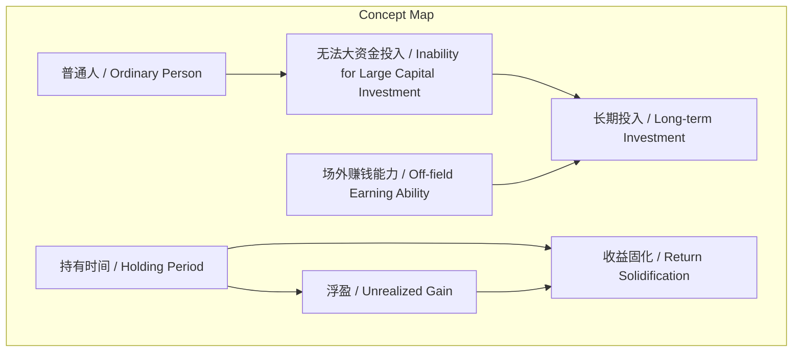
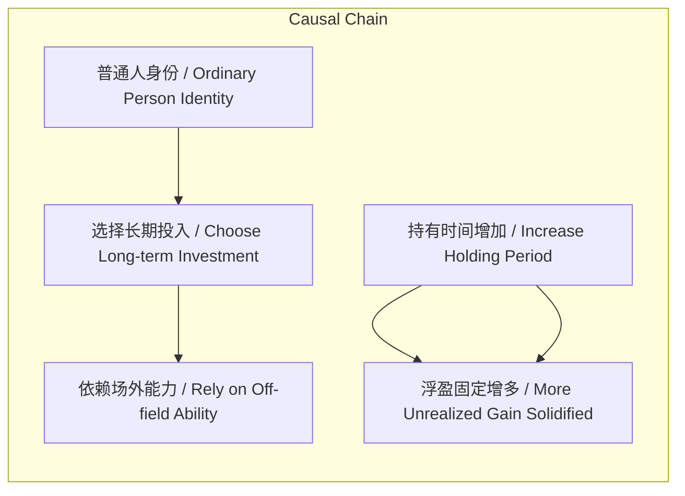

# NEWS/NEWS 任务报告

- agent: news/news
- requestId: 1773015617789-8p88fj
- 生成时间(UTC): 2026-03-09T00:20:42.482Z

## 文本总结

# 长期投资：时间与场外能力的核心作用

## 整体结构化文档表达
### 文档卡片
- **主题（中文/English）**：长期投资策略 / Long-term Investment Strategy
- **一句话摘要**：社群投资策略强调长期持有与场外赚钱能力对收益固化的关键作用。
- **目标读者**：对长期投资感兴趣的普通投资者
- **核心结论（3条）**：
  1. 收益固化完全依赖持有时间，时间越久固定收益越多。
  2. 普通投资者因资金限制，必须采用长期定投策略。
  3. 场外赚钱能力是支撑长期投入的基础保障。

### 内容结构树
1. **背景与问题定义**：普通投资者资金有限，短期市场输赢概率相同但波动大。
2. **核心观点与关键证据**：收益100%与持有时间相关；当前盈利为浮盈，需时间浇筑固化。
3. **方法/机制/路径**：通过长期定投，依赖持续场外收入支持投入。
4. **风险与边界条件**：未发现明确风险内容（原文未提及具体风险）。
5. **结论与行动建议**：选择长期投入，并着力提升场外赚钱能力。

### 结构化元数据（JSON）
```json
{
  "title": "长期投资：时间与场外能力的核心作用",
  "topic_zh": "长期投资策略",
  "topic_en": "Long-term Investment Strategy",
  "audience": "对长期投资感兴趣的普通投资者",
  "claims": [
    "收益固化完全依赖持有时间",
    "普通投资者需采用长期定投策略",
    "场外赚钱能力是长期投资的基础支撑"
  ],
  "evidence": [
    "收益100%和你持有的时间有关系",
    "现在都是浮盈只有通过时间的浇筑才会被固定下来",
    "我们是普通人没办法一次性大资金投入",
    "所以我们选择的是长期投入于是场外赚钱能力很重要"
  ],
  "risks": [],
  "actions": [
    "坚持长期持有资产",
    "着力提升场外赚钱能力以支持持续投入"
  ]
}
```

## 处理流程
1. **输入识别**：来源为用户提供的李笑来语音文本。
2. **信息抽取**：抽取实体（社群、普通人）、概念（浮盈、时间浇筑）、观点（收益与时间关系）、方法（长期投入）。
3. **结构化归纳**：将内容归纳为背景、观点、方法、风险、结论五部分。
4. **关系建模**：建立“持有时间→收益固化”“普通人身份→长期投入策略”“场外能力→投入可持续性”等逻辑链。
5. **可视化表达**：使用Mermaid绘制概念与因果图。

## 概念清单（中英文）
- 社群 / Community
- 输赢的概率 / Win-Loss Probability
- 收益 / Return
- 持有时间 / Holding Period
- 浮盈 / Unrealized Gain
- 时间浇筑 / Time Pouring (Metaphor)
- 普通人 / Ordinary Person
- 大资金投入 / Large Capital Investment
- 长期投入 / Long-term Investment
- 场外赚钱能力 / Off-field Earning Ability

## 概念定义（中英文）
- **社群（Community）**：指具有共同历史或目标的群体，此处指投资社群。
- **输赢的概率（Win-Loss Probability）**：短期内投资盈利或亏损的可能性，原文认为短期看是一样的。
- **收益（Return）**：投资产生的利润，原文强调其100%与持有时间相关。
- **持有时间（Holding Period）**：资产被持有的持续时间，是收益固化的关键变量。
- **浮盈（Unrealized Gain）**：未实现的账面盈利，需通过时间才能转化为固定收益。
- **时间浇筑（Time Pouring）**：比喻时间像浇筑混凝土一样，将浮盈逐渐固化。
- **普通人（Ordinary Person）**：指资金有限的普通投资者，无法一次性大额投入。
- **大资金投入（Large Capital Investment）**：一次性投入大量资金的投资方式。
- **长期投入（Long-term Investment）**：通过持续、分批方式长期持有资产的策略。
- **场外赚钱能力（Off-field Earning Ability）**：投资之外获取收入的能力，用于支持长期投入。

## 概念关联与逻辑关系（中英文）
1. **持有时间（Holding Period） 与 浮盈（Unrealized Gain） 共同影响 收益固化（Return Solidification）**  
   `固定收益 = f(持有时间) × 浮盈，其中f为随时间递增的函数`
2. **普通人（Ordinary Person） 导致 无法大资金投入（Inability for Large Capital Investment） 进而选择 长期投入（Long-term Investment）**  
   `普通人 ∧ ¬大资金投入 → 长期投入`
3. **场外赚钱能力（Off-field Earning Ability） 支撑 长期投入（Long-term Investment） 的可持续性**  
   `场外赚钱能力 → 持续资金流入 → 长期投入可持续`

## COT逻辑梳理（定义/分类/比较/因果/科学方法论）
- **Step 1（定义）**：定义核心概念——长期投入指普通投资者通过持续小额投入、长期持有资产的方式；收益固化指浮盈转化为实际收益的过程。
- **Step 2（分类）**：将投资者分为“普通人”（资金有限）与“大资金投资者”（可一次性投入），原文聚焦普通人。
- **Step 3（比较）**：比较短期与长期：短期输赢概率相同但波动大，长期则收益与时间正相关且更稳定。
- **Step 4（因果）**：因果链——因普通人无法大资金投入 → 故选择长期投入 → 因收益固化需时间 → 故持有时间越长固定收益越多 → 故需场外赚钱能力支撑持续投入。
- **Step 5（科学方法论）**：提出可验证假设——持有时间与收益固化程度呈正相关；建议行动——通过提升场外能力确保长期投入可行性。

## 事实与看法（病毒）
### 事实
- 未发现明确可核验的客观事实（原文均为观点性陈述）。
### 看法
- 输赢的概率短期看是一样的。
- 我们的收益100%和你持有的时间有关系。
- 现在都是浮盈只有通过时间的浇筑才会被固定下来。
- 我们是普通人没办法一次性大资金投入。
- 所以我们选择的是长期投入于是场外赚钱能力很重要。

## FAQ（原文问题整理）
- 未发现明确提问（原文为陈述句，无直接问题）。

## Visualization
### Mermaid 图 1（概念结构图）


### Mermaid 图 2（逻辑/因果图）


## 文章中的类比
- **时间浇筑**：将时间比喻为浇筑混凝土的过程，形象说明时间如何将浮盈逐步固定为实际收益。

## 10个金句
1. 输赢的概率短期看是一样的。
2. 我们的收益100%和你持有的时间有关系。
3. 现在都是浮盈只有通过时间的浇筑才会被固定下来。
4. 时间越久固定越多。
5. 我们是普通人没办法一次性大资金投入。
6. 所以我们选择的是长期投入。
7. 于是场外赚钱能力很重要。
8. 原文未提供
9. 原文未提供
10. 原文未提供
