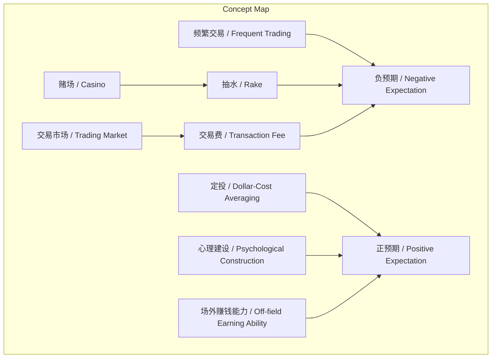
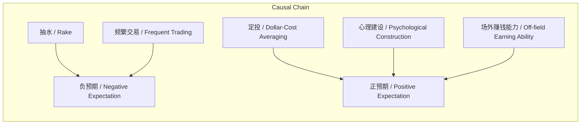

# NEWS/NEWS 任务报告

- agent: news/news
- requestId: 1773015647528-lcf1qj
- 生成时间(UTC): 2026-03-09T00:21:49.728Z

## 文本总结

# 避免负预期，选择正预期行为

## 整体结构化文档表达

### 文档卡片
- **主题（中文/English）**：投资行为预期管理 / Investment Behavior Expectation Management  
- **一句话摘要**：本文论述在金钱事务中应避免负预期行为（如赌场赌博、频繁交易），转而采取正预期行为（如定投、自我提升）。  
- **目标读者**：投资者及财富管理学习者  
- **核心结论（3条）**：  
  1. 赌场和频繁交易是典型的负预期行为，应避免。  
  2. 定投是正预期行为，值得长期坚持。  
  3. 通过自我心理建设和提升场外赚钱能力，可更好应对市场波动。  

### 内容结构树
1. **背景与问题定义**：指出赌博和交易市场中的负预期问题，引入“抽水”机制。  
2. **核心观点与关键证据**：赌场因抽水而负预期；频繁交易使交易市场正预期变负预期；定投为正预期。  
3. **方法/机制/路径**：选择定投、进行心理建设、提升场外能力。  
4. **风险与边界条件**：市场波动大；频繁交易是量化交易的大坑。  
5. **结论与行动建议**：不做负预期事，多做正预期事，如读书、健身等。  

### 结构化元数据（JSON）
```json
{
  "title": "避免负预期，选择正预期行为",
  "topic_zh": "投资行为预期管理",
  "topic_en": "Investment Behavior Expectation Management",
  "audience": "投资者及财富管理学习者",
  "claims": [
    "赌场赌博是负预期行为",
    "频繁交易将交易市场的正预期转化为负预期",
    "定投是正预期行为",
    "应进行自我心理建设",
    "提升场外赚钱能力以应对市场波动",
    "读书、健身等是正向预期的行为"
  ],
  "evidence": [
    "赌场有抽水以维持公平开销",
    "交易市场有交易费（抽水）",
    "量化交易的大坑是交易频繁",
    "《定投改变命运》被推荐",
    "BOX投资得益于心理建设"
  ],
  "risks": [
    "市场波动很大",
    "频繁交易导致确定亏损"
  ],
  "actions": [
    "多看《定投改变命运》至少10遍",
    "学会自我心理建设",
    "提升场外赚钱能力",
    "选择正预期行为如定投、读书、健身等"
  ]
}
```

## 处理流程
1. **输入识别**：识别到用户提供的文本为关于投资预期管理的论述，包含10点具体内容。  
2. **信息抽取**：抽取了实体（赌场、交易市场、定投等）、概念（负预期、正预期）、观点（避免频繁交易等）和事实（有抽水、交易费等）。  
3. **结构化归纳**：将内容归纳为背景、观点、方法、风险、结论五个部分，并提取核心结论。  
4. **关系建模**：建立了概念间因果和影响关系，如抽水导致负预期，频繁交易改变预期性质。  
5. **可视化表达**：生成Mermaid图展示概念结构和逻辑因果链。  

## 概念清单（中英文）
- 赌博 / Gambling  
- 赌场 / Casino  
- 抽水 / Rake  
- 交易市场 / Trading Market  
- 交易费 / Transaction Fee  
- 频繁交易 / Frequent Trading  
- 量化交易 / Quantitative Trading  
- 定投 / Dollar-Cost Averaging (DCA)  
- 《定投改变命运》 / "Dollar-Cost Averaging Changes Destiny"  
- BOX投资 / BOX Investment  
- 笑来老师 / Teacher Xiao Lai  
- 心理建设 / Psychological Construction  
- 场外赚钱能力 / Off-field Earning Ability  
- 读书 / Reading  
- 健身 / Fitness  
- 帮朋友 / Helping Friends  
- 陪家人 / Accompaning Family  
- 负预期 / Negative Expectation  
- 正预期 / Positive Expectation  

## 概念定义（中英文）
- **赌博 / Gambling**：原文未提供明确定义，但提及为一种在赌场环境下具有负预期的活动。  
- **赌场 / Casino**：原文未提供明确定义，但提及为收取抽水的赌博场所。  
- **抽水 / Rake**：赌场为维持公平开销而收取的费用。（依据第2点）  
- **交易市场 / Trading Market**：原文未提供明确定义，但提及为有交易费（抽水）的交易场所。  
- **交易费 / Transaction Fee**：交易市场中类似抽水的费用。（依据第3点）  
- **频繁交易 / Frequent Trading**：交易次数过多的交易行为，可能导致预期变负。（依据第4、5点）  
- **量化交易 / Quantitative Trading**：原文未提供明确定义，但提及其大坑是交易频繁。  
- **定投 / Dollar-Cost Averaging (DCA)**：原文未提供明确定义，但描述为正预期的投资行为。  
- **《定投改变命运》 / "Dollar-Cost Averaging Changes Destiny"**：一本被推荐阅读的书，原文未提供更多信息。  
- **BOX投资 / BOX Investment**：原文未提供明确定义，但提及其成功得益于心理建设。  
- **笑来老师 / Teacher Xiao Lai**：原文提及的人物，提供心理建设，具体身份未定义。  
- **心理建设 / Psychological Construction**：原文未提供明确定义，但提及为BOX投资成功的关键因素，应自我学会。  
- **场外赚钱能力 / Off-field Earning Ability**：原文未提供明确定义，但提及为应对市场波动需提升的能力。  
- **读书 / Reading**：原文未提供定义，但列为正向预期行为之一。  
- **健身 / Fitness**：原文未提供定义，但列为正向预期行为之一。  
- **帮朋友 / Helping Friends**：原文未提供定义，但列为正向预期行为之一。  
- **陪家人 / Accompaning Family**：原文未提供定义，但列为正向预期行为之一。  
- **负预期 / Negative Expectation**：预期收益为负的行为或决策。（基于上下文）  
- **正预期 / Positive Expectation**：预期收益为正的行为或决策。（基于上下文）  

## 概念关联与逻辑关系（中英文）
1. **抽水 / Rake** 导致 **赌场 / Casino** 中的 **负预期 / Negative Expectation**。  
2. **频繁交易 / Frequent Trading** 将 **交易市场 / Trading Market** 中的 **正预期 / Positive Expectation** 转化为 **负预期 / Negative Expectation**。  
3. **定投 / Dollar-Cost Averaging** 属于 **正预期 / Positive Expectation** 行为。  
4. **心理建设 / Psychological Construction** 有助于实现 **正预期 / Positive Expectation**（在BOX投资中）。  
5. **场外赚钱能力 / Off-field Earning Ability** 帮助应对 **市场波动 / Market Volatility**（原文未定义市场波动，但提及），从而支持 **正预期 / Positive Expectation** 行为。  

## COT逻辑梳理
**Step 1: 定义核心概念**  
基于文本，负预期指期望收益为负的行为或决策，正预期指期望收益为正的行为或决策。文本通过例子（如赌场、频繁交易）暗示，但未严格定义。  

**Step 2: 行为分类**  
将金钱相关行为分为负预期（如赌场赌博、频繁交易）和正预期（如定投、读书、健身）。分类依据是预期收益方向。  

**Step 3: 比较分析**  
比较赌场与交易市场：两者都有抽水机制，但赌场总是负预期，而交易市场在低频下可能正预期，频繁交易使其变负。关键区别在于交易频率和成本影响。  

**Step 4: 因果推理**  
- 直接因果：抽水是赌场负预期的直接原因（抽水 → 负预期）。  
- 转化因果：频繁交易通过增加交易费成本，将交易市场的正预期转化为负预期（频繁交易 + 交易费 → 负预期）。  
- 应对因果：心理建设和场外能力帮助维持正预期行为（心理建设 → 正预期；场外能力 → 正预期）。  

**Step 5: 科学方法论**  
原文未明确提及科学方法论，但内容隐含期望值分析：预期收益 = 概率加权收益 - 成本（如抽水、交易费）。当成本超过收益时，预期变负。这是一种简单的经济决策方法论。  

## 事实与看法
### 事实
- 赌场有抽水以维持公平开销。  
- 交易市场有交易费（抽水）。  
- 频繁交易会增加交易成本。  
- 《定投改变命运》是一本书。  
- BOX投资被提及。  
- 未来市场波动会很大。  
- 读书、健身、投资、帮朋友、陪家人被列为行为。  

### 看法
- 赌博本身不一定是负预期，但是在赌场肯定是负预期。  
- 频繁交易会把交易市场中可能的正预期变成确定的负预期。  
- 量化交易的大坑就是交易频繁。  
- 定投就是一个正预期的行为。  
- BOX投资不是你个人的功劳，更多的是来自于笑来老师的心理建设。  
- 你应该学会自我心理建设。  
- 要更好的心态，请提升自己的场外赚钱能力。  
- 读书、健身、投资、帮朋友、陪家人都是正向预期的行为。  

## FAQ
未发现明确提问。

## Visualization
### Mermaid 图 1（概念结构图）


### Mermaid 图 2（逻辑/因果图）


## 文章中的类比
未发现明确类比。

## 10个金句
1. 赌博本身不一定是负预期，但是在赌场肯定是负预期。  
2. 因为有赌场“抽水”要维持公平开销。  
3. 交易市场也是有一样的也有“抽水”交易费。  
4. 频繁交易会把交易市场中可能的正预期变成确定的负预期。  
5. 量化交易的大坑就是交易频繁。  
6. 《定投改变命运》要多看至少看10遍。  
7. 定投就是一个正预期的行为。  
8. BOX投资不是你个人的功劳，更多的是来自于笑来老师的心理建设。  
9. 所以，你应该学会自我心理建设。  
10. 未来市场的波动会很大，要更好的心态，请提升自己的场外赚钱能力。
