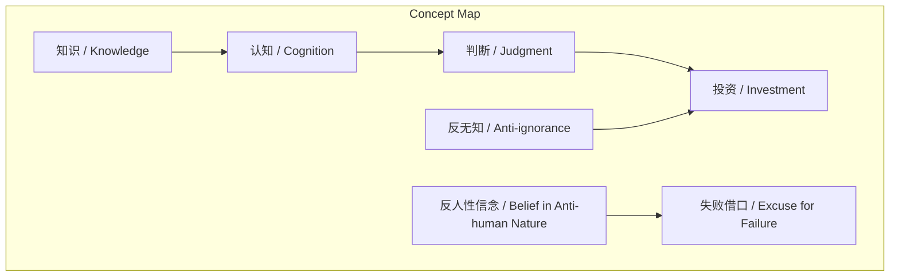
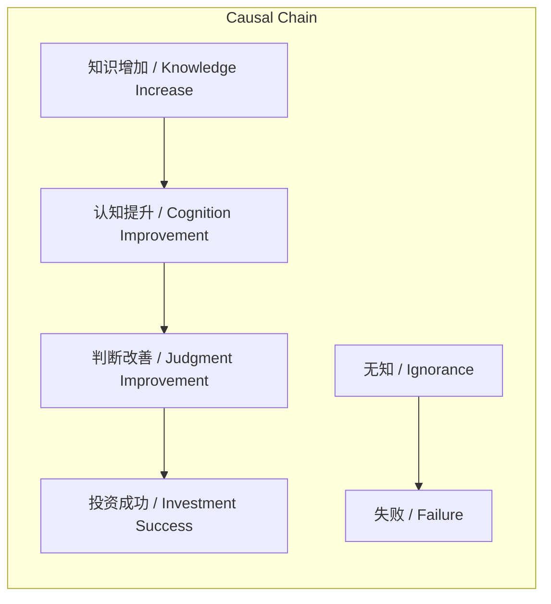

# NEWS/NEWS 任务报告

- agent: news/news
- requestId: 1773015712300-svhjbt
- 生成时间(UTC): 2026-03-09T00:22:26.438Z

## 文本总结

# 投资非反人性，实为反无知

## 整体结构化文档表达
### 文档卡片
- 主题（投资认知 / Investment Cognition）：
- 一句话摘要：知识不改变智商但提升认知，投资成功关键在于反无知而非反人性。
- 目标读者：未提及
- 核心结论（3条）：
  1. 智商固定不变，知识能让人以相同智商理解新事物并改变判断。
  2. “投资反人性”说法实为投资失败者寻找的借口。
  3. 投资本质是“反无知”，需通过知识与经验积累提升认知。

### 内容结构树
1. 背景与问题定义：社会普遍将投资困难归因于“反人性”，认为人天生无法正确投资。
2. 核心观点与关键证据：知识改变认知而非智商；例：学习概率后不买彩票；践行群成员通过知识经验获利。
3. 方法/机制/路径：通过学习知识、积累经验来提升认知，从而改善投资判断。
4. 风险与边界条件：未提及
5. 结论与行动建议：摒弃“反人性”叙事，专注“反无知”，持续学习。

### 结构化元数据（JSON）
```json
{
  "title": "投资非反人性，实为反无知",
  "topic_zh": "投资认知",
  "topic_en": "Investment Cognition",
  "audience": "未提及",
  "claims": [
    "智商在学习新知识前后没有改变",
    "知识不改变智商但能提升理解与判断",
    "投资不是反人性而是反无知",
    "认知是最值钱的"
  ],
  "evidence": [
    "学习概率后不会买彩票",
    "践行群成员赚到钱，因知识经验增加而非智商上涨",
    "彩票侮辱的是受过的教育而非智商"
  ],
  "risks": [],
  "actions": [
    "停止使用反人性说法",
    "通过学习和经验积累对抗无知"
  ]
}
```

## 处理流程
未提及

## 概念清单（中英文）
- 智商 / Intelligence Quotient (IQ)
- 知识 / Knowledge
- 理解 / Understanding
- 判断 / Judgment
- 投资 / Investment
- 反人性 / Anti-human Nature
- 反无知 / Anti-ignorance
- 认知 / Cognition
- 践行群 / Practice Group
- 教育 / Education
- 概率 / Probability
- 彩票 / Lottery

## 概念定义（中英文）
- 智商（Intelligence Quotient, IQ）：衡量智力水平的指标，文中认为其在新知识学习前后保持不变。
- 知识（Knowledge）：通过学习获得的信息与理解，能改变人对事物的认知和判断。
- 理解（Understanding）：对事物本质和规律的把握，知识可提升理解能力。
- 判断（Judgment）：基于认知做出的决策，知识能导致判断截然不同。
- 投资（Investment）：将资金投入资产以期望收益的活动，文中强调其非“反人性”而是“反无知”。
- 反人性（Anti-human Nature）：文中指将投资困难归咎于人类天生弱点的错误说法。
- 反无知（Anti-ignorance）：文中指通过知识学习克服无知以改善投资的核心路径。
- 认知（Cognition）：对事物的认识和理解过程，文中认为其比智商更值钱。
- 践行群（Practice Group）：文中指通过实践学习投资的群体，成员因知识经验增加而获利。
- 教育（Education）：系统性的学习过程，文中指其受尊重程度影响对彩票等行为的判断。
- 概率（Probability）：数学概念，指事件发生的可能性，学习后能避免彩票等低概率行为。
- 彩票（Lottery）：基于随机数的赌博形式，文中用作知识改变判断的例子。

## 概念关联与逻辑关系（中英文）
1. 知识（Knowledge） → 认知（Cognition）：知识增加直接提升认知水平。
2. 认知（Cognition） → 投资判断（Investment Judgment）：认知提升导致投资判断改善。
3. 反人性信念（Belief in Anti-human Nature） → 失败借口（Excuse for Failure）：相信投资反人性实为失败者寻找的理由。

## COT逻辑梳理（定义/分类/比较/因果/科学方法论）
Step 1: 定义核心概念。智商（IQ）是固定智力指标；知识是可变的信息集合；认知是理解与判断的能力。
Step 2: 分类与比较。对比智商（天生、不变）与知识（后天、可变），指出知识对认知的影响大于智商。
Step 3: 因果分析。知识增加 → 理解能力提升 → 投资判断优化；反之，无知导致错误判断。
Step 4: 科学方法论。通过实例验证：学习概率（知识）后行为改变（不买彩票）；践行群（实践社群）成员经验积累带来收益。
Step 5: 结论推导。投资成功不依赖改变人性，而依赖通过知识经验反无知，认知提升是核心。

## 事实与看法（病毒）
### 事实
- 智商在学习新的知识的前后是没有改变。
- 例子：学习概率后就不会去买彩票。
- 践行群的人赚到了钱，智商并没有上涨，但是多了知识、多了经验。
- 彩票侮辱的不是我们的智商，而是受过的教育。

### 看法
- 知识不改变人的智商，但可以让我们以相同的智商，理解原本不理解的事情，并做出截然不同的判断。
- 人们相信智商是天生的，因而就没有努力的必要了。
- 当人们说投资“反人性”时，是在说我们天生没办法正确投资，其实是为自己的投资失败找理由。
- 投资不是“反人性”而是“反无知”。
- 认知才是最值钱的。

## FAQ（原文问题整理）
未发现明确提问

## Visualization
### Mermaid 图 1（概念结构图）


### Mermaid 图 2（逻辑/因果图）


## 文章中的类比
未发现明确类比

## 10个金句
1. 智商在学习新的知识的前后是没有改变。
2. 彩票侮辱的不是我们的智商，而是受过的教育。
3. 知识不改变人的智商，但可以让我们以相同的智商，理解原本不理解的事情，并做出截然不同的判断。
4. 人们相信智商是天生的，因而就没有努力的必要了。
5. 当人们说投资“反人性”时，是在说我们天生没办法正确投资，其实是为自己的投资失败找理由。
6. 投资不是“反人性”而是“反无知”。
7. 践行群的人赚到了钱，智商并没有上涨，但是多了知识、多了经验。
8. 认知才是最值钱的。
9. 原文未提供
10. 原文未提供
