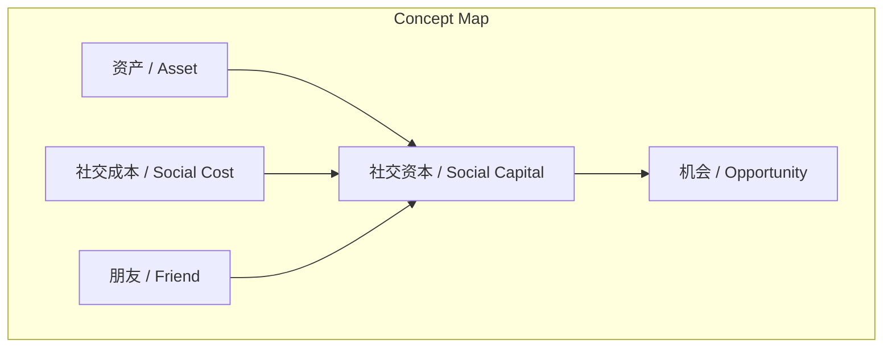
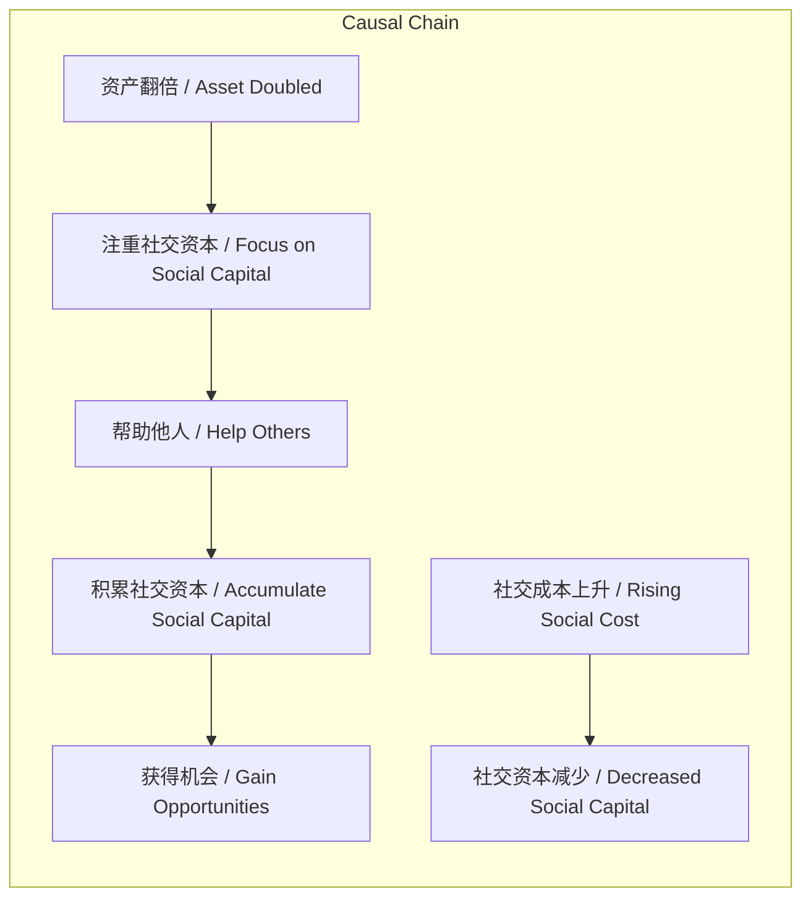

# NEWS/NEWS 任务报告

- agent: news/news
- requestId: 1773015784022-bcd94q
- 生成时间(UTC): 2026-03-09T00:24:01.432Z

## 文本总结

# 你都有钱了该注重社交资本了

## 整体结构化文档表达
### 文档卡片
- 主题（中文/English）：社交资本 / Social Capital
- 一句话摘要：本文论述财富积累至新阶段后，应通过帮助他人建设社交资本，因其是机会的来源。
- 目标读者：高净值人群/财富管理者
- 核心结论（3条）：
  1. 资产翻倍后需转向社交资本建设。
  2. 帮助他人是积累社交资本的方式，且仅富裕者能践行。
  3. 社交资本是机会的来源。

### 内容结构树
1. **背景与问题定义**：资产翻倍标志财富积累进入新阶段，此前为修炼期，此后应注重社交资本。
2. **核心观点与关键证据**：社交资本至关重要；证据包括帮朋友积累资本、社交成本上升的后果、好事发生时的排除现象。
3. **方法/机制/路径**：通过帮助他人（尤其是朋友）积累社交资本。
4. **风险与边界条件**：风险为爱占小便宜导致社交成本上升，好事时被排除；边界条件为帮助行为仅限富裕者。
5. **结论与行动建议**：有钱人应帮助他人以建设社交资本，践行群为实例。

### 结构化元数据（JSON）
```json
{
  "title": "你都有钱了该注重社交资本了",
  "topic_zh": "社交资本",
  "topic_en": "Social Capital",
  "audience": "高净值人群/财富管理者",
  "claims": [
    "资产翻倍后需转向社交资本建设",
    "帮助他人是积累社交资本的方式，且仅富裕者能践行",
    "社交资本是机会的来源"
  ],
  "evidence": [
    "帮朋友是在积累社会资本",
    "有些人在社交中爱占小便宜，社交成本一直在上升",
    "当好事发生时，肯定不会有他一份",
    "一切有钱人都应该帮助他人的，这是在建设自己的社交资本"
  ],
  "risks": [
    "社交成本上升",
    "好事发生时被排除"
  ],
  "actions": [
    "注重社交资本建设",
    "帮助他人"
  ]
}
```

## 处理流程
未提及

## 概念清单（中英文）
- 社交资本 / Social Capital
- 资产 / Asset
- 社交成本 / Social Cost
- 朋友 / Friend
- 机会 / Opportunity
- 践行群 / Practice Group
- 李笑来 / Li Xiaolai

## 概念定义（中英文）
- 社交资本 / Social Capital：原文指出“社交资本是机会的来源”和“帮朋友是在积累社会资本”，指通过社交互动（如帮助他人）积累的、能带来机会的资源。
- 资产 / Asset：原文“资产翻倍了”指个人财富或物质财产达到新水平。
- 社交成本 / Social Cost：原文“不要珍惜自己的社交成本”和“社交成本一直在上升”，指社交关系中投入或消耗的资源（如时间、 goodwill）。
- 朋友 / Friend：原文“帮朋友”的对象，指社交关系中的个体。
- 机会 / Opportunity：原文“社交资本是机会的来源”，指有利的时机或可能性。
- 践行群 / Practice Group：原文“践行群就是在帮李笑来积累社交资本”，指一个实践社群或团体。
- 李笑来 / Li Xiaolai：原文提及的人物，可能指作者或社群领导者。

## 概念关联与逻辑关系（中英文）
1. 社交资本 / Social Capital 与 机会 / Opportunity：社交资本是机会的来源。形式化：Opportunity ∝ SocialCapital（机会与社交资本正相关）。
2. 社交成本 / Social Cost 与 社交资本 / Social Capital：社交成本上升导致社交资本积累减少。形式化：ΔSocialCapital ∝ -ΔSocialCost（社交资本变化与社交成本变化负相关）。
3. 资产 / Asset 与 帮助行为 / Helping Behavior（隐含）：资产翻倍使得帮助他人成为可能。形式化：HelpingBehavior possible if Asset ≥ threshold（当资产超过阈值时，帮助行为可行）。

## COT逻辑梳理
- **Step 1 定义**：社交资本是通过帮助他人等社交行为积累的、能带来机会的资源。
- **Step 2 分类**：原文未对社交资本进行分类，未提及。
- **Step 3 比较**：原文未比较社交资本与其他资本形式，未提及。
- **Step 4 因果**：资产翻倍 → 注重社交资本 → 帮助他人 → 积累社交资本 → 获得机会；社交成本上升 → 社交资本减少。
- **Step 5 科学方法论**：原文未提出科学方法论，未提及。

## 事实与看法（病毒）
### 事实
- 未发现明确客观事实（内容均为观点陈述）
### 看法
- 资产翻倍了 一切才刚刚开始 再此之前都是修炼
- 不要珍惜自己的社交成本 人家不会喜欢你 甚至会讨厌你
- 有些人在社交中爱占小便宜 事实上他的社交成本一直在上升
- 当好事发生时 肯定不会有他一份
- 帮朋友是在积累社会资本
- 一切有钱人都应该帮助他人的 这是在建设自己的社交资本
- 社交资本是机会的来源————复习下《创造自己的好运》
- 践行群就是在帮李笑来积累社交资本

## FAQ（原文问题整理）
未发现明确提问

## Visualization
### Mermaid 图 1（概念结构图）


### Mermaid 图 2（逻辑/因果图）


## 文章中的类比
未发现明确类比

## 10个金句
1. 资产翻倍了 一切才刚刚开始 再此之前都是修炼
2. 不要珍惜自己的社交成本 人家不会喜欢你 甚至会讨厌你
3. 有些人在社交中爱占小便宜 事实上他的社交成本一直在上升
4. 当好事发生时 肯定不会有他一份
5. 帮朋友是在积累社会资本
6. 一切有钱人都应该帮助他人的 这是在建设自己的社交资本
7. 社交资本是机会的来源————复习下《创造自己的好运》
8. 践行群就是在帮李笑来积累社交资本
9. 原文未提供
10. 原文未提供
