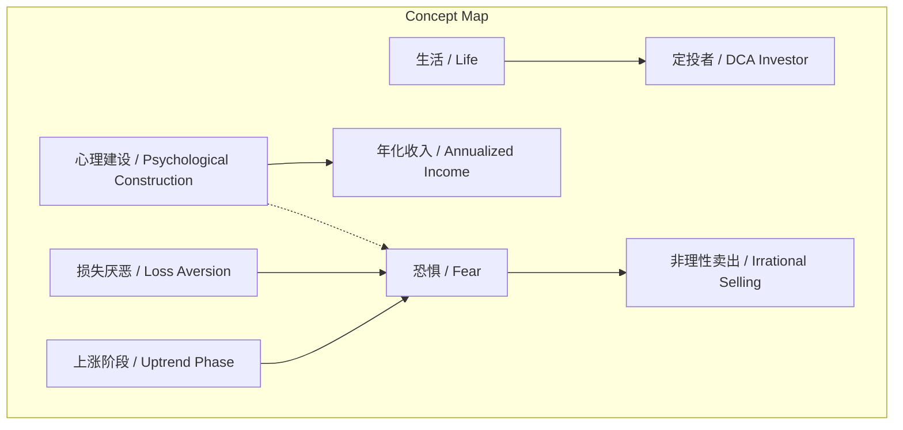
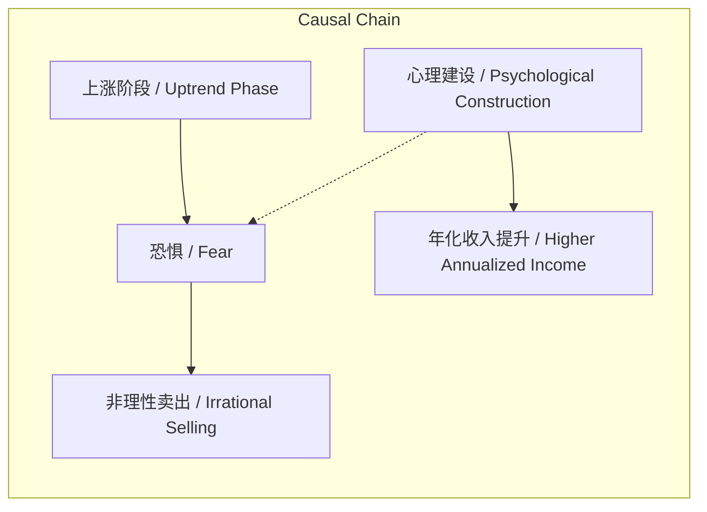

# NEWS/NEWS 任务报告

- agent: news/news
- requestId: 1773015979321-c7we67
- 生成时间(UTC): 2026-03-09T00:26:46.299Z

## 文本总结

# 上涨阶段恐惧心理与投资行为分析

## 整体结构化文档表达
### 文档卡片
- **主题（中文/English）**：投资心理与行为偏差 / Investment Psychology and Behavioral Bias
- **一句话摘要**：在投资上涨阶段，投资者因恐惧利润回吐而产生非理性行为，心理建设能显著提升收益，定投者应优先关注生活。
- **目标读者**：个人投资者、理财顾问、行为金融学研究者
- **核心结论（3条）**：
  1.  上涨阶段引发的恐惧（如筹码成本、利润损失厌恶）大于下跌阶段。
  2.  具备心理建设的投资者年化收入比无心理建设者高2-4%。
  3.  对于定投者，生活的优先级高于投资价格波动。

### 内容结构树
1.  **背景与问题定义**：投资进入上涨阶段后，投资者面临的心理挑战与非理性行为。
2.  **核心观点与关键证据**：
    -   观点：上涨恐惧大于下跌恐惧。证据：恐惧源于“便宜筹码消失”和“利润损失厌恶”。
    -   观点：性别影响投资忍耐度。证据：女性投资收入越高，天然更易忍受痛苦。
    -   观点：心理建设直接提升收益。证据：有心理建设者年化收入高2-4%。
    -   观点：生活重要性超越投资波动。证据：价格上涨不提升个人智商、效率或家庭时间。
3.  **方法/机制/路径**：通过心理建设（认知调整）来应对上涨恐惧，避免非理性操作。
4.  **风险与边界条件**：风险在于“道理理解但心理仍波动”，可能导致过早卖出；边界条件针对“定投者”策略。
5.  **结论与行动建议**：投资者需主动调整心理，将生活置于投资决策之上。

### 结构化元数据（JSON）
```json
{
  "title": "上涨阶段恐惧心理与投资行为分析",
  "topic_zh": "投资心理与行为偏差",
  "topic_en": "Investment Psychology and Behavioral Bias",
  "audience": "个人投资者、理财顾问、行为金融学研究者",
  "claims": [
    "上涨阶段的恐惧大于下跌阶段",
    "有心理建设的投资者年化收入更高",
    "生活比投资价格波动更重要"
  ],
  "evidence": [
    "恐惧源于便宜筹码消失和利润损失厌恶",
    "女性投资收入越高，天然更易忍受痛苦",
    "有心理建设者年化收入比无建设者高2-4%",
    "价格上涨不提升智商、工作效率或陪伴家人时间"
  ],
  "risks": [
    "道理理解但心理仍波动，导致非理性决策"
  ],
  "actions": [
    "加强心理建设，调整认知",
    "定投者应优先关注生活"
  ]
}
```

## 处理流程
1.  **输入识别**：来源为用户提供的关于投资心理的文本片段。
2.  **信息抽取**：
    -   **实体/概念**：上涨阶段、恐惧、损失厌恶、心理建设、定投者、生活。
    -   **问题**：上涨阶段投资者面临何种心理问题？如何应对？
    -   **事实**：女性收入高更忍痛；心理建设提升2-4%年化收益；价格上涨不提升个人非投资能力。
    -   **观点**：上涨恐惧大于下跌；生活最重要。
3.  **结构化归纳**：对“恐惧”进行来源分类（筹码、利润）；对“心理建设”进行效果比较（有/无）；建立“上涨阶段->恐惧->行为”的因果链。
4.  **关系建模**：
    -   上涨阶段 / Uptrend Phase → 触发 → 恐惧 / Fear
    -   恐惧 / Fear → 导致 → 非理性卖出 / Irrational Selling
    -   心理建设 / Psychological Construction → 缓解 → 恐惧 / Fear
    -   心理建设 / Psychological Construction → 提升 → 年化收入 / Annualized Income
5.  **可视化表达**：见下方 Mermaid 图。

## 概念清单（中英文）
-   上涨阶段 / Uptrend Phase
-   恐惧 / Fear
-   便宜的筹码 / Cheap Chips
-   损失厌恶 / Loss Aversion
-   回调 / Pullback
-   女性 / Female
-   男性 / Male
-   心理建设 / Psychological Construction
-   年化收入 / Annualized Income
-   定投者 / Dollar-Cost Averaging Investor
-   生活 / Life
-   智商 / IQ
-   工作效率 / Work Efficiency
-   陪伴家人的时间 / Time with Family

## 概念定义（中英文）
-   **上涨阶段 / Uptrend Phase**：投资资产价格持续上升的时期。
-   **恐惧 / Fear**：在上涨阶段因担心利润回吐或错过低位买入机会而产生的多方面负面情绪。
-   **便宜的筹码 / Cheap Chips**：指在价格低位时买入的、成本较低的资产份额。
-   **损失厌恶 / Loss Aversion**：行为经济学概念，指人们面对同样数量的收益和损失时，认为损失更加令人难以忍受。本文特指对已实现利润失去的厌恶。
-   **回调 / Pullback**：价格上涨过程中的暂时性下跌。
-   **女性 / Female**：文本中与男性对比的性别群体。
-   **男性 / Male**：文本中与女性对比的性别群体。
-   **心理建设 / Psychological Construction**：指投资者为应对市场波动而主动进行的认知调整、情绪管理和纪律培养。
-   **年化收入 / Annualized Income**：投资回报按年计算的收益率。
-   **定投者 / Dollar-Cost Averaging Investor**：采用定期定额投资策略的投资者。
-   **生活 / Life**：指投资以外的个人日常活动、家庭时间和整体福祉。
-   **智商 / IQ**：智力商数，衡量认知能力的指标。
-   **工作效率 / Work Efficiency**：单位时间内完成工作的效能。
-   **陪伴家人的时间 / Time with Family**：与家人共处的时长。

## 概念关联与逻辑关系（中英文）
1.  **上涨阶段 / Uptrend Phase** 与 **损失厌恶 / Loss Aversion** 共同触发 **恐惧 / Fear**。
    -   形式化：`Fear = f(Uptrend Phase, Loss Aversion)`
2.  **恐惧 / Fear** 直接导致 **非理性卖出 / Irrational Selling**（文中“可以先卖出”）。
    -   形式化：`Irrational Selling → Fear`
3.  **心理建设 / Psychological Construction** 负向影响 **恐惧 / Fear**，并正向影响 **年化收入 / Annualized Income**。
    -   形式化：`ΔFear ∝ -Psychological Construction`；`ΔAnnualized Income ∝ +Psychological Construction`

## COT逻辑梳理（定义/分类/比较/因果/科学方法论）
-   **Step 1 (定义)**：界定核心问题。本文核心是“上涨阶段投资者的心理反应及其对行为的影响”。
-   **Step 2 (分类)**：对“恐惧”进行分类。原文明确分为：(1) 便宜筹码消失的恐惧；(2) 利润损失厌恶的恐惧；(3) 对回调的确定性预期导致的恐惧。
-   **Step 3 (比较)**：比较不同群体。比较了“有/无心理建设”的投资者收益差异（2-4%）；比较了“女/男”在投资收入高时对痛苦的忍耐度。
-   **Step 4 (因果)**：建立因果链。上涨阶段（因）→ 触发多方面恐惧（果）→ 可能导致过早卖出（行为果）。心理建设（因）→ 缓解恐惧/提升收益（果）。
-   **Step 5 (科学方法论)**：文中体现了“观察-假设-证据”的朴素科学方法。观察上涨阶段行为异常，提出“恐惧是主因”的假设，并用“心理建设提升收益”的数据作为支持证据，最后提出“生活更重要”的规范性建议。

## 事实与看法（病毒）
### 事实
-   第一次来到上涨阶段时，上涨的恐惧比下跌的大。
-   恐惧是多方面的：便宜的筹码没有了；价格上涨触发利润损失厌恶；肯定会回调。
-   女性比男性投资收入越高，女性天然更容易忍受痛苦。
-   有心理建设的投资者比没有的要年化收入高2-4%。
-   价格上涨10%，智商、工作效率、陪伴家人的时间并没有上涨10%。
-   对于定投者而言，生活更重要。
### 看法
-   现在可以先卖出（基于恐惧的决策建议）。
-   更加要注意调整（基于心理波动普遍性的判断）。
-   生活最重要（价值判断与优先级声明）。

## FAQ（原文问题整理）
-   **Q：上涨阶段和下跌阶段，哪种恐惧更大？**
    -   A：上涨阶段的恐惧更大。
-   **Q：上涨阶段恐惧的具体来源是什么？**
    -   A：1. 便宜的筹码没有了；2. 害怕利润失去（损失厌恶）；3. 担心回调。
-   **Q：性别与投资忍耐度有何关系？**
    -   A：女性投资收入越高，天然更容易忍受痛苦（相比男性）。
-   **Q：心理建设对投资有何实际影响？**
    -   A：有心理建设的投资者年化收入比没有的高2-4%。
-   **Q：价格上涨是否同步提升个人其他能力？**
    -   A：没有。智商、工作效率、陪伴家人的时间均未随价格上涨而提升。
-   **Q：对于定投者，什么最重要？**
    -   A：生活最重要。

## Visualization
### Mermaid 图 1（概念结构图）


### Mermaid 图 2（逻辑/因果图）


## 文章中的类比
-   未发现明确类比。

## 10个金句
1.  上涨的恐惧比下跌的大。
2.  便宜的筹码没有了。
3.  当价格上涨时，将从另外一个方向触发损失厌恶，即好不容易赚到的钱，会失去。
4.  肯定会回调，所以现在可以先卖出。
5.  女性比男性投资收入越高，女性天然更容易忍受痛苦。
6.  有心理建设的投资者比没有的要年化收入高2-4%。
7.  道理大家理解，但是依然会有心理波动，更加要注意调整。
8.  价格上涨10%，我们的智商并没有上涨10%。
9.  工作效率也没有上涨10%。
10. 陪伴家人的时间也没有上涨10%。
11. 生活最重要。
12. （原文未提供）
