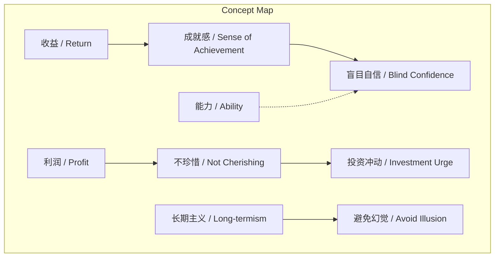
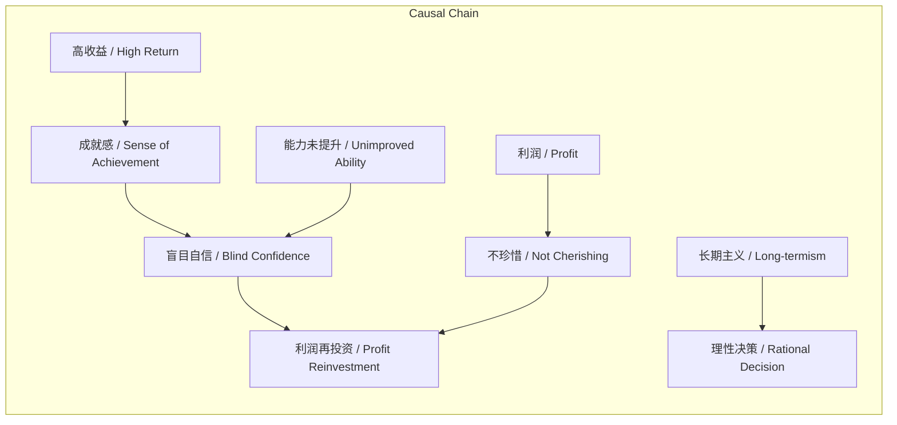

# NEWS/NEWS 任务报告

- agent: news/news
- requestId: 1773068133092-8o374a
- 生成时间(UTC): 2026-03-09T14:56:10.988Z

## 文本总结

# 警惕投资幻觉：收益与能力的错位

## 整体结构化文档表达
### 文档卡片
- 主题（中文/English）：投资幻觉 / Investment Illusion
- 一句话摘要：文章揭示投资者在获得高收益后产生的盲目自信与不珍惜心理，并倡导长期主义。
- 目标读者：普通投资者、金融学习者
- 核心结论（3条）：
  1. 高收益易引发盲目自信，但能力未同步提升。
  2. 利润被视作“凭空而来”，导致不珍惜和再投资冲动。
  3. 需通过长期主义避免幻觉，保持理性。

### 内容结构树
1. 背景与问题定义：投资中收益达100%时的心理现象
2. 核心观点与关键证据：成就感源于稀缺性，能力未同步提升
3. 方法/机制/路径：未明确提及具体方法，但建议长期主义
4. 风险与边界条件：盲目自信可能引发错误决策
5. 结论与行动建议：做长期主义者

### 结构化元数据（JSON）
```json
{
  "title": "警惕投资幻觉：收益与能力的错位",
  "topic_zh": "投资幻觉",
  "topic_en": "Investment Illusion",
  "audience": "普通投资者、金融学习者",
  "claims": ["高收益导致盲目自信", "收益未伴随能力提升", "利润被视作凭空来导致不珍惜"],
  "evidence": ["获得100%收益的人很少", "收益到100%时忍不住投资"],
  "risks": ["盲目自信可能引发错误决策"],
  "actions": ["做长期主义者"]
}
```

## 处理流程
1. 输入识别（来源：用户输入文本）
2. 信息抽取（实体、概念、问题、事实、观点）
3. 结构化归纳（定义/分类/比较/因果/方法论）
4. 关系建模（概念关系、等式/方程/逻辑链）
5. 可视化表达（Mermaid）

## 概念清单（中英文）
- 投资幻觉 / Investment Illusion
- 收益 / Return
- 100% / 100% Return
- 利润 / Profit
- 投资 / Investment
- 成就感 / Sense of Achievement
- 能力 / Ability
- 标的 / Target Asset
- 盲目自信 / Blind Confidence
- 社交资本 / Social Capital
- 长期主义 / Long-termism

## 概念定义（中英文）
- 投资幻觉：投资者因短期高收益产生的心理错觉，导致错误决策。 / Investment Illusion: A psychological illusion caused by short-term high returns, leading to poor decisions.
- 收益：投资回报，文中特指达到100%的回报。 / Return: Investment profit, specifically referring to 100% return in the text.
- 利润：收益中超出本金的部分。 / Profit: The portion of return exceeding the principal.
- 投资：将资金投入资产的行为。 / Investment: The act of allocating funds into assets.
- 成就感：因获得高收益而产生的满足感。 / Sense of Achievement: Satisfaction derived from high returns.
- 能力：投资者选择标的的能力。 / Ability: Investor's capability in selecting target assets.
- 标的：投资的目标资产。 / Target Asset: The asset targeted for investment.
- 盲目自信：对自身投资能力的不切实际自信。 / Blind Confidence: Unwarranted confidence in one's investment ability.
- 社交资本：社会关系网络，文中暗示未随收益上涨。 / Social Capital: Social network resources, implied not to increase with returns.
- 长期主义：注重长期价值的投资理念。 / Long-termism: An investment philosophy focusing on long-term value.

## 概念关联与逻辑关系（中英文）
1. 高收益（收益 / Return） → 成就感（成就感 / Sense of Achievement）
2. 成就感（成就感 / Sense of Achievement） ∧ 能力未提升（能力 / Ability） → 盲目自信（盲目自信 / Blind Confidence）
3. 利润（利润 / Profit）被视作凭空来（幻觉 / Illusion） → 不珍惜（行为 / Behavior） → 再投资（投资 / Investment）

## COT逻辑梳理（定义/分类/比较/因果/科学方法论）
- Step 1: 定义投资幻觉为高收益引发的心理错觉，导致非理性行为。
- Step 2: 分类幻觉类型：利润再投资冲动、不珍惜心理。
- Step 3: 比较收益增长与能力/社交资本未增长，突出错位。
- Step 4: 因果链：高收益→成就感→盲目自信→利润再投资/不珍惜。
- Step 5: 科学方法论：通过长期主义实践，同步提升能力与收益，避免幻觉。

## 事实与看法（病毒）
### 事实
- 当收益达到100%时，投资者可能忍不住用利润再投资。
- 获得100%收益的投资者相对较少。
### 看法
- 这种成就感是盲目自信的表现。
- 投资者的能力并未随收益上涨。
- 社交资本也未上涨。
- 辛苦赚的钱看起来像凭空来的，导致不珍惜。
- 应做长期主义者。

## FAQ（原文问题整理）
- 未发现明确提问

## Visualization
### Mermaid 图 1（概念结构图）

### Mermaid 图 2（逻辑/因果图）


## 文章中的类比
- 未发现明确类比

## 10个金句
1. 当收益到100%时忍不住拿着利润去投资。
2. 获得100%收益的人很少所以会有成就感。
3. 认为自己有能力选标的但这是事实上是一种盲目自信。
4. 原因就如同之前所说我们的能力并没有随着价格上涨社交资本也没有上涨。
5. 还有一个幻觉是刚刚辛苦赚到的钱看起来像是凭空来的钱于是并不珍惜。
6. 做一个长期主义者。
7. 原文未提供
8. 原文未提供
9. 原文未提供
10. 原文未提供
